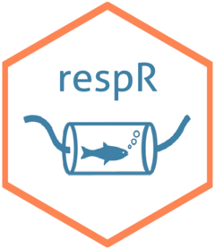

# <font style="font-family:'Courier New'">respR : A package for processing and analysing respirometry data</font> <a href='http://januarharianto.github.io/respR'></a>

<!-- badges: start -->
[](https://github.com/januarharianto/respR)
[](https://github.com/januarharianto/respR/actions)
[](https://ci.appveyor.com/project/nicholascarey/respr-0ltva)
[](https://app.codecov.io/gh/januarharianto/respR)
[](https://www.gnu.org/licenses/gpl-3.0.en.html)
[](https://zenodo.org/badge/latestdoi/66126363)
[](https://GitHub.com/januarharianto/respR/stargazers/)
[](https://img.shields.io/github/watchers/januarharianto/respR?style=social)
[](https://twitter.com/respR_pkg?ref_src=twsrc%5Etfw)
<!-- badges: end -->


`respR` is a package for `R` that provides a structural, reproducible workflow for the processing and analysis of respirometry data. 
While the focus of the package is on aquatic respirometry, `respR` is largely unitless and so can process, explore, and determine rates from any respirometry data, and indeed linear relationships in any time-series data.

Use `respR` to:

- Automatically **import** raw data from various oxygen sensing equipment
- Rapidly **inspect** data for common issues before analysis
- **Explore** and **visualise** timeseries data
- Perform **multiple regression analysis** on linear segments of data manually or automatically to calculate rates
- **Adjust** rates for background oxygen consumption or production
- **Convert** rates to any common unit of oxygen consumption or production
- **Export** results quickly for reporting

A particular highlight of the package is the `auto_rate()` function. This uses machine learning (kernel density estimation) to *automatically* identify linear regions of data, that is regions where oxygen uptake or production rates are stable and consistent. This allows rates to be extracted in a statistically objective manner. See `vignette("auto_rate")` for more details.

The package has also been [**peer reviewed and published**](https://besjournals.onlinelibrary.wiley.com/doi/10.1111/2041-210X.13162) in *Methods in Ecology and Evolution*. Please cite this publication if you use `respR` in your published work. If you don't have the space, or feel you haven't used it enough to justify a citation, not a problem, but please do [**let us know**](mailto:nicholascarey@gmail.com) anyway. We would like to keep track of studies which have found `respR` useful, and we can help publicise your research, and add to the list [**here**]() of papers which have used it. 

We also have a [**Twitter account**](https://twitter.com/respR_pkg). Please follow for latest news and regular updates from the world of respirometry!

## Installation
`respR` will be submitted soon to CRAN. For now, use the `devtools` package to install the latest stable version:

```r
install.packages("devtools")
devtools::install_github("januarharianto/respR")
```

## Getting started

See [**here**](https://nicholascarey.github.io/respRsite/articles/respR.html) to get started. This site has a range of vignettes detailing the functionality, and a variety of example analyses. 

We are also happy to help directly. If you have problems using the package or getting started with your analysis, [**get in touch**](mailto:nicholascarey@gmail.com) with a sample of your data and we will write you a script to get you started. 

## Usage

For a quick evaluation of the package, try out the following code:

```r
library(respR) # load the package

# 1. check data for errors, select cols 1 and 15:
urch <- inspect(urchins.rd, time = 1, oxygen = 15) 
# 2. automatically determine most linear segment:
rate <- auto_rate(urch)
# 3. convert
out <- convert_rate(rate, 
                    o2.unit = "mg/L", 
                    time.unit = "min", 
                    output.unit = "mg/h/kg", 
                    volume = 0.6, 
                    mass = 0.4)
print(out)

## Alternatively, use pipes:
urchins.rd %>%        # using the urchins dataset,
  select(1, 15) %>%   # select columns 1 and 15
  inspect()     %>%   # inspect the data, then
  auto_rate()   %>%   # automatically determine most linear segment
  print()       %>%   # a quick preview
  convert_rate("mg/L", "min", "mg/h/kg", 0.6, 0.4) # convert to units
```

## Feedback and contributions

`respR` is under continuous development. If you have any bugs or feedback, you can contact us by [**opening an issue**](https://github.com/januarharianto/respr/issues). Alternatively, you can fork the project and create a pull request.

Please also feel free to [**email**](mailto:nicholascarey@gmail.com) with any feedback or problems you may encounter.

## Developers

- [**Januar Harianto**](https://github.com/januarharianto), University of Sydney
- [**Nicholas Carey**](https://github.com/nicholascarey), Scottish Association of Marine Science


## See also

These packages may also help you analyse respirometry data:

- [respirometry](https://cran.r-project.org/package=respirometry) - Matthew A. Birk
- [rMR](https://cran.r-project.org/package=rMR) - Tyler L. Moulton
- [FishResp](https://fishresp.org) - Sergey Morozov
- [LoLinR](https://github.com/colin-olito/LoLinR) - Colin Olito and Diego Barneche
- [segmented](https://cran.r-project.org/package=segmented) - Vito M. R. Muggeo

