# adjust_rate: Adjusting rates for background

## Introduction

New in `respR` v2.0 is the ability for
[`adjust_rate()`](https://januarharianto.github.io/respR/reference/adjust_rate.md)
to perform dynamic and other types of adjustments to calculated rates.

After calculating background rates from a control or “blank” experiment,
the function can adjust rates from `calc_rate`, `calc_rate.int`,
`auto_rate`, `auto_rate.int`, or numeric values in the following ways:

- By a single value

- By a mean of multiple values

- By a rate determined from an equivalent window in a concurrently-run
  control

- By a dynamic rate which changes over the course of an experiment

In addition, there are several variations on these adjustment methods.

We use the interlinked `respR` functions of `inspect`, `calc_rate`,
`calc_rate.bg` etc. in the following examples, but for most data frames
or numeric values can also be used. We’ll show some examples of these
below.

### Measurement units and running controls

`respR` analyses are largely unitless; units are only required when the
rates come to be converted in
[`convert_rate()`](https://januarharianto.github.io/respR/reference/convert_rate.md).
However, note that the raw background data should be in the *same units*
of time and oxygen as the raw data used to calculate the rate being
adjusted. The background recording should also be conducted using the
same equipment and under the same conditions as the experiment to be
adjusted, or as close as is practically possible. This includes using
the same or identical respirometry chambers; in our experience the vast
majority of background oxygen use comes from bacterial growth on the
internal surfaces of the respirometer, not from organisms in the water.

Note that in general the background recording does not have to be
conducted at the same time as experiments, or even over the same
duration as the experimental chambers to be adjusted. While this is
ideal practice, it’s not always practical. Their purpose is to establish
the general relationship of background oxygen change per unit time which
can then be applied to specimen experiments of any length.

### When should adjustments be applied?

In the `respR` workflow, `adjust_rate` should be used on rates which
have been determined in `calc_rate`, `calc_rate.int`, `auto_rate`, or
`auto_rate.int` or rate values (change in oxygen units per unit time)
otherwise determined from the raw data, but before they are converted in
`convert_rate`.

However, adjustment of rates is an optional step. While it is extremely
important to determine and quantify background oxygen use or production,
many respirometry experiments find it to be negligible in comparison to
specimen rates because equipment is kept clean and filtered or
sterilised water is used, and adjustments are unnecessary (e.g. [Burford
et
al. 2019](https://januarharianto.github.io/respR/articles/refs.html#references)).

### Sign of the rates

If entering specimen or background rates as values, care should be taken
to enter them with the correct *sign*. In `respR` oxygen uptake rates
are negative, as they represent a negative slope of oxygen against time.
Background rates will normally also be a negative value (though not
always). For oxygen production rates, which are positive, the background
rates may be negative or positive. And there are other cases where
background rates may be positive, such as in open-tank or open-arena
respirometry where oxygen may be added at the water surface.

### Using `calc_rate.bg` vs. `calc_rate` for background rates

For the most part we use `calc_rate.bg` to determine background rates in
the following examples, which are then passed to `adjust_rate` as the
`by` input. However,
[`calc_rate()`](https://januarharianto.github.io/respR/reference/calc_rate.md)
can also be used to determine background rates for use as the `by`
input.

These two functions are similar in functionality but have a couple of
key differences.

`calc_rate.bg` does not have the region selection inputs that
`calc_rate` does. It calculates the rate across the whole oxygen~time
dataset as entered. However it allows background rates to be calculated
from multiple columns, which is required for several adjustment methods,
and is the default behaviour if a multiple column dataset is entered.
For this reason it also has `oxygen` and `time` column identifiers to
specify particular columns, which `calc_rate` does not. If the
background data needs to be subset from a larger dataset to a particular
region, this is easy to do using
[`subset_data()`](https://januarharianto.github.io/respR/reference/subset_data.md)
before passing it on to `calc_rate.bg`.

`calc_rate` does have region selection inputs, and also allows you to
extract rates from multiple regions of a single oxygen~time dataset.
This is not particularly useful in the context of background rates,
unless you want to average rates from different regions of the same data
for some reason. However, to extract a single background rate from a
particular region of a larger dataset it is an option and does not
require you to subset the data first. It also does not have `oxygen` and
`time` column identifiers. Data should already have been put into the
structure of time in column 1 and oxygen in column 2 via processing in
[`inspect()`](https://januarharianto.github.io/respR/reference/inspect.md),
or if a `data.frame` is used already be in this structure. Any other
columns are ignored.

Overall, we find it easier to mentally partition specimen and background
rates by using `calc_rate` for one and `calc_rate.bg` for the other, but
it comes down to personal preference and the specifics of an experiment
and what you want to achieve.

To summarise the differences:

`calc_rate.bg` - calculate rates from the *same* region of *single or
multiple* oxygen columns.

`calc_rate` - calculate rates from *single or multiple* regions of a
*single* oxygen column.

### Pipes

We use the new native `|>` pipes introduced in [R
v4.1](https://www.r-bloggers.com/2021/05/new-features-in-r-4-1-0/)
extensively in this vignette to save space and streamline the code.
These can be replaced with `dplyr` pipes (`%>%`) if you have not yet
updated. Alternatively, save the output objects and enter them as the
first input of the next function.

### Flowthrough respirometry

See
[`vignette("flowthrough")`](https://januarharianto.github.io/respR/articles/flowthrough.md)
for how to adjust flowthrough respirometry rates.

## Case studies

In this vignette we will run through several hypothetical case studies
which should cover most use cases. If there are any we have not, please
[**get in
touch**](https://januarharianto.github.io/respR/articles/contact.html)
and we’ll try to cover them here or build in support in a future update.

## Case 1: Single specimen chamber and a single control

*“We have a single experiment chamber and have extracted a single rate
from it, and we want to adjust it by a background rate from a single
blank chamber”*

This is the most straightforward adjustment operation. This is for cases
where a single blank experiment has been run to determine the background
rate of oxygen use or production, and you want to use this rate to
adjust one or more specimen rates.

The `urchins.rd` dataset has recordings of oxygen consumption from 16
sea urchins, plus two background recordings in columns 18 and 19. We
will adjust a single rate from one urchin determined via `calc_rate`
using one of these background chambers.

### Calculate background rate

``` r
## inspect and calculate background rate using calc_rate.bg
bg <- inspect(urchins.rd, time = 1, oxygen = 18) |>
  calc_rate.bg() 
```

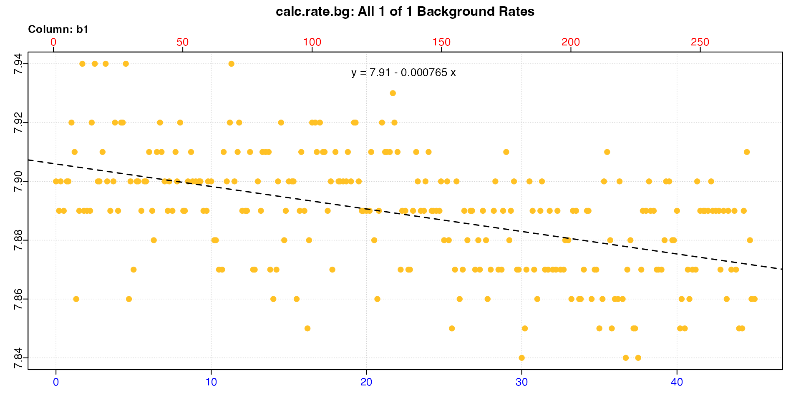

    #> 
    #> # print.inspect # -----------------------
    #>                 time.min   b1
    #> numeric             pass pass
    #> Inf/-Inf            pass pass
    #> NA/NaN              pass pass
    #> sequential          pass    -
    #> duplicated          pass    -
    #> evenly-spaced       WARN    -
    #> 
    #> Uneven Time data locations (first 20 shown) in column: time.min 
    #>  [1]  1  2  3  4  5  6  7  8  9 10 11 12 13 14 15 16 17 18 19 20
    #> Minimum and Maximum intervals in uneven Time data: 
    #> [1] 0.1 0.2
    #> -----------------------------------------
    #> 
    #> # plot.calc_rate.bg # -------------------
    #> plot.calc_rate.bg: Plotting all 1 background rates ...
    #> -----------------------------------------
    #> 
    #> # print.calc_rate.bg # ------------------
    #> Background rate(s):
    #> [1] -0.000765
    #> Mean background rate:
    #> [1] -0.000765
    #> -----------------------------------------

Note that using
[`inspect()`](https://januarharianto.github.io/respR/reference/inspect.md)
to prepare data, while we strongly recommend it (see
[`vignette("inspecting")`](https://januarharianto.github.io/respR/articles/inspecting.md)),
is optional. `calc_rate.bg` will also accept a `data.frame` directly,
and has its own column identifier inputs. This code will perform exactly
the same rate calculation.

``` r
## inspect and calculate background rate using calc_rate.bg
calc_rate.bg(urchins.rd, time = 1, oxygen = 18) 
#> 
#> # plot.calc_rate.bg # -------------------
#> plot.calc_rate.bg: Plotting all 1 background rates ...
#> -----------------------------------------
#> 
#> # print.calc_rate.bg # ------------------
#> Background rate(s):
#> [1] -0.000765
#> Mean background rate:
#> [1] -0.000765
#> -----------------------------------------
```

### Calculate specimen rate

Now we calculate the rate of one of the specimens.

``` r
## inspect and calculate urchin rate using calc_rate
urch <- inspect(urchins.rd, time = 1, oxygen = 2) |>
  calc_rate(from = 10, to = 30, by = "time")
```

    #> 
    #> # plot.calc_rate # ----------------------
    #> plot.calc_rate: Plotting rate from position 1 of 1 ...

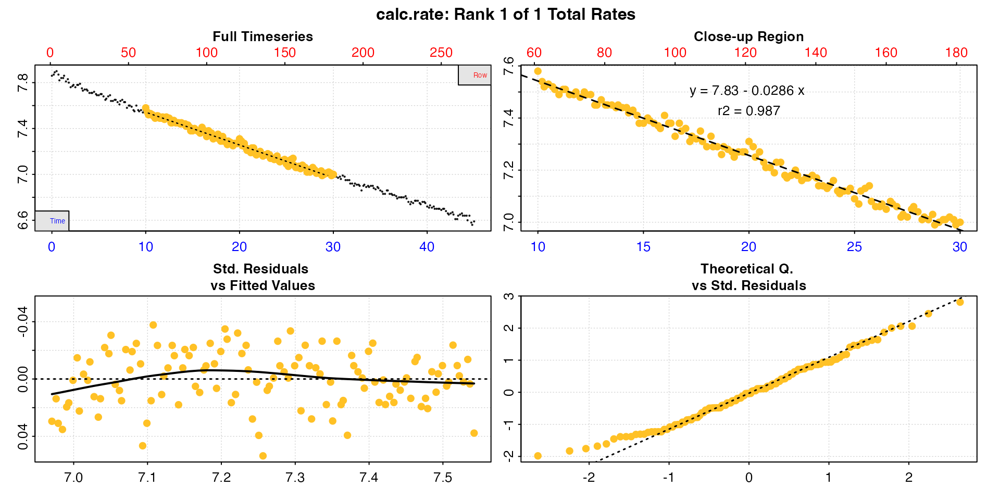

    #> -----------------------------------------
    #> 
    #> # print.calc_rate # ---------------------
    #> Rank 1 of 1 rates:
    #> Rate: -0.0286 
    #> 
    #> To see full results use summary().
    #> -----------------------------------------

### Adjust rate

Now we have saved both the background rate and the specimen rate we can
go ahead and adjust. The `adjust_rate` function has a `method` input
which determines how the `by` input is applied. The default for this is
`"mean"`, and in this case with a single value will have the same
result. However, there is a specific `"value"` method to specify single
background values.

``` r
## adjust rate
urch_adj <- adjust_rate(urch, by = bg, method = "value")
print(urch_adj)
#> 
#> # print.adjust_rate # -------------------
#> NOTE: Consider the sign of the adjustment value when adjusting the rate.
#> 
#> Adjustment was applied using the 'value' method.
#> 
#> Rank 1 of 1 adjusted rate(s):
#> Rate          : -0.0286
#> Adjustment    : -0.000765
#> Adjusted Rate : -0.0278 
#> 
#> To see full results use summary().
#> -----------------------------------------
```

This same adjustment operation can be conducted by entering numeric
inputs, or a mix of objects and numeric inputs. Care should be taken
when entering values manually to use the correct *sign* with the rate.
See note [above](#sign).

``` r
## adjust rate
urch_adj <- adjust_rate(-0.0286, by = -0.000765, method = "value")
print(urch_adj)
#> 
#> # print.adjust_rate # -------------------
#> NOTE: Consider the sign of the adjustment value when adjusting the rate.
#> 
#> Adjustment was applied using the 'value' method.
#> 
#> Rank 1 of 1 adjusted rate(s):
#> Rate          : -0.0286
#> Adjustment    : -0.000765
#> Adjusted Rate : -0.0278 
#> 
#> To see full results use summary().
#> -----------------------------------------
```

The saved `urch_adj` object has a `$rate.adjusted` element which is the
rate that will be converted when it is passed to
[`convert_rate()`](https://januarharianto.github.io/respR/reference/convert_rate.md)
for final conversion to units.

## Case 2: Single specimen chamber, multiple rates and a single control

*“We have a single experiment chamber and have extracted multiple rates
from it, and we want to adjust them by a background rate from a single
blank chamber”*

The same operation as [Case 1](#case1) can be performed on objects
containing multiple rates, such as from `auto_rate` or where `calc_rate`
has been used to extract multiple rates. Here we’ll use `auto_rate`
which typically returns several results. We won’t show the plots this
time

### Calculate background and specimen rates

``` r
## inspect and calculate background rate using calc_rate.bg
bg <- inspect(urchins.rd, time = 1, oxygen = 18) |>
  calc_rate.bg()

## inspect and calculate urchin rate using auto_rate and default inputs
urch <- inspect(urchins.rd, time = 1, oxygen = 2) |>
  auto_rate() 
```

### Adjust rates

``` r
## adjust rate
urch_adj <- adjust_rate(urch, by = bg, method = "value")
summary(urch_adj)
#> 
#> # summary.adjust_rate # -----------------
#> 
#> Adjustment was applied using 'value' method.
#> Summary of all rate results:
#> 
#>    rep rank intercept_b0 slope_b1   rsq density row endrow time endtime  oxy endoxy    rate adjustment rate.adjusted
#> 1:  NA    1         7.84  -0.0293 0.992   240.4  25    165  4.0    27.3 7.71   7.03 -0.0293  -0.000765       -0.0285
#> 2:  NA    2         7.74  -0.0253 0.990   184.4 135    268 22.3    44.5 7.18   6.64 -0.0253  -0.000765       -0.0246
#> 3:  NA    3         7.86  -0.0324 0.952    15.6   6     54  0.8     8.8 7.82   7.55 -0.0324  -0.000765       -0.0316
#> 4:  NA    4         7.86  -0.0319 0.958    14.5   8     60  1.2     9.8 7.84   7.56 -0.0319  -0.000765       -0.0312
#> -----------------------------------------
```

Note how the single `$adjustment` value has been applied to each `$rate`
to give a `$rate.adjusted`. This is the rate that will be converted when
the object is passed to `convert_rate`.

Again, this same operation can be performed using values, if a vector of
rates is passed.

``` r
## adjust rate
urch_adj <- adjust_rate(c(-0.02927, -0.02534, -0.03239, -0.03195), 
                        by = -0.000765, 
                        method = "value")
summary(urch_adj)
#> 
#> # summary.adjust_rate # -----------------
#> 
#> Adjustment was applied using 'value' method.
#> Summary of all rate results:
#> 
#>    rank    rate adjustment rate.adjusted
#> 1:    1 -0.0293  -0.000765       -0.0285
#> 2:    2 -0.0253  -0.000765       -0.0246
#> 3:    3 -0.0324  -0.000765       -0.0316
#> 4:    4 -0.0319  -0.000765       -0.0312
#> -----------------------------------------
```

Obviously in this case there are no regression coefficients or other
data to report.

## Case 3: Multiple specimen chambers and a single control

*“We have multiple specimen chambers and a single control chamber”*

The same background rate can be used to adjust multiple experimental
chambers. All that needs to be done is save the background rate object
and use it to adjust as many experimental rates as we want.

Here we save the background rate as above, and also calculate rates from
two of the urchins in the `urchins.rd` dataset.

### Calculate background and specimen rates

``` r
## inspect and calculate background rate
bg <- inspect(urchins.rd, time = 1, oxygen = 18) |>
  calc_rate.bg()

## inspect and calculate FIRST urchin rate
urch1 <- inspect(urchins.rd, time = 1, oxygen = 2) |>
  calc_rate()

## inspect and calculate SECOND urchin rate
urch2 <- inspect(urchins.rd, time = 1, oxygen = 3) |>
  calc_rate()
```

### Adjust rates

Now we can use the `bg` object to adjust both specimen rates. As
separate objects we have to do this in two operations.

``` r
## adjust rate
urch1_adj <- adjust_rate(urch1, by = bg)
urch2_adj <- adjust_rate(urch2, by = bg)
```

    #> 
    #> # print.adjust_rate # -------------------
    #> NOTE: Consider the sign of the adjustment value when adjusting the rate.
    #> 
    #> Adjustment was applied using the 'mean' method.
    #> 
    #> Rank 1 of 1 adjusted rate(s):
    #> Rate          : -0.0278
    #> Adjustment    : -0.000765
    #> Adjusted Rate : -0.0271 
    #> 
    #> To see full results use summary().
    #> -----------------------------------------
    #> 
    #> # print.adjust_rate # -------------------
    #> NOTE: Consider the sign of the adjustment value when adjusting the rate.
    #> 
    #> Adjustment was applied using the 'mean' method.
    #> 
    #> Rank 1 of 1 adjusted rate(s):
    #> Rate          : -0.0206
    #> Adjustment    : -0.000765
    #> Adjusted Rate : -0.0198 
    #> 
    #> To see full results use summary().
    #> -----------------------------------------

Of course, it is possible to perform this same adjustment for both
specimens in one operation by using a vector of values for the two
specimen rates.

``` r
urch_adj <- adjust_rate(c(-0.0278, -0.0206), by = bg)
summary(urch_adj)
#> 
#> # summary.adjust_rate # -----------------
#> 
#> Adjustment was applied using 'mean' method.
#> Summary of all rate results:
#> 
#>    rank    rate adjustment rate.adjusted
#> 1:    1 -0.0278  -0.000765       -0.0270
#> 2:    2 -0.0206  -0.000765       -0.0198
#> -----------------------------------------
```

Note, we haven’t specified a `method` in this example. The default
method is `"mean"` which averages all the background rates in `by` (see
next example). With only one background rate, this will obviously have
the same result.

## Case 4: Multiple controls

*“We run many experiments in parallel and use empty chambers as controls
when available. We want to use a mean background adjustment value based
on multiple control chambers”*

Sometimes multiple background controls are run alongside specimen
experiments, or as a block of control experiments in the downtime
between specimen experiments. It is also quite common to have multiple
chambers set up to run in parallel, and when some are not being used for
specimens, rather than have them switched off they are run empty as
controls. In these cases we may want to apply the average background
rate from several chambers as the adjustment value. This can increase
the robustness of background estimations, by averaging out any
variations between chambers, although it is always a good idea to
examine the control data carefully for consistency.

In the `urchins.rd` data, there are two control chambers in columns 18
and 19. We will calculate a mean background rate from these and use this
to adjust a specimen rate. We use the `oxygen` column identifier input
to select multiple background columns via regular R syntax.

### Calculate background rates

``` r
## inspect and calculate background rate from two chambers
bg <- inspect(urchins.rd, time = 1, oxygen = 18:19) |>
  calc_rate.bg()
```


By default, `calc_rate.bg` will plot all the calculated background
columns (though you can use the `pos` input to select which). If we
print the result we can see both calculated background rates, and the
mean value.

``` r
print(bg)
#> 
#> # print.calc_rate.bg # ------------------
#> Background rate(s):
#> [1] -0.000765 -0.000902
#> Mean background rate:
#> [1] -0.000833
#> -----------------------------------------
```

### Data frame input

Again, note that using
[`inspect()`](https://januarharianto.github.io/respR/reference/inspect.md)
to prepare data, while we strongly recommend it (see
[`vignette("inspecting")`](https://januarharianto.github.io/respR/articles/inspecting.md)),
is optional. `calc_rate.bg` will also accept a `data.frame` directly,
and has its own column identifier inputs. This code will perform exactly
the same rate calculation.

``` r
## inspect and calculate background rate from two chambers
calc_rate.bg(urchins.rd, time = 1, oxygen = 18:19, plot = FALSE)
#> 
#> # print.calc_rate.bg # ------------------
#> Background rate(s):
#> [1] -0.000765 -0.000902
#> Mean background rate:
#> [1] -0.000833
#> -----------------------------------------
```

### Background data structure

In the above example the background data are in the same data frame and
share a `time` column. What if they are not? What if the controls are
separate datasets of different lengths?

These data are from a separate briefer background experiment - note the
times on the x-axis; these are ~30 minutes as opposed to ~40 for the two
above. We want to use them with the two above to apply a mean adjustment
value based on all five controls.

``` r
bg2 <- calc_rate.bg(bg_exp)
```

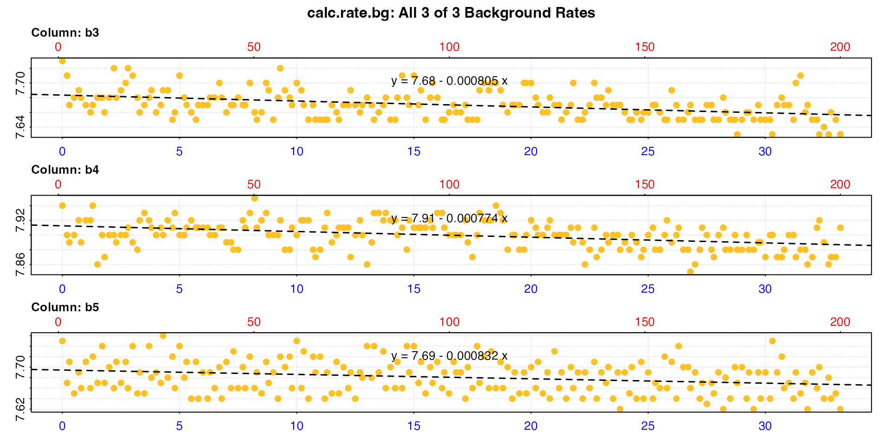

    #> 
    #> # print.calc_rate.bg # ------------------
    #> Background rate(s):
    #> [1] -0.000805 -0.000774 -0.000832
    #> Mean background rate:
    #> [1] -0.000804
    #> -----------------------------------------

Note the default behaviour of `calc_rate.bg` when no other inputs are
provided is to use all columns, assuming column 1 is `time` and all
other columns are `oxygen` data.

### Adjust using multiple background rates

To calculate a mean background rate across different datasets in one
`calc_rate.bg` command they would have to be in the same data frame and
share the same time column. It is of course possible in R to put them
into this form. Even if they are different lengths, you could fill empty
rows with `NA`, and this would not affect calculated rates, as they are
derived from linear models which simply ignore `NA` values.

However, there are easier approaches to accomplish the same thing. We
have saved two background objects (`bg`, `bg2`), one with two rates, one
with three. We could calculate the mean rate ourselves and enter it as a
single adjustment value. We’ll adjust one of the specimen rates we
calculated above.

``` r
adj <- mean(
  c(-0.000765, -0.000902, -0.000805, -0.000774, -0.000832)
)
adjust_rate(urch1, by = adj, method = "value")
#> 
#> # print.adjust_rate # -------------------
#> NOTE: Consider the sign of the adjustment value when adjusting the rate.
#> 
#> Adjustment was applied using the 'value' method.
#> 
#> Rank 1 of 1 adjusted rate(s):
#> Rate          : -0.0278
#> Adjustment    : -0.000816
#> Adjusted Rate : -0.027 
#> 
#> To see full results use summary().
#> -----------------------------------------
```

Or alternatively, enter the five background rates directly as a numeric
vector and let the default `method = "mean"` be applied.

``` r
adjust_rate(urch1, by = c(-0.000765, -0.000902, -0.000805, -0.000774, -0.000832))
#> 
#> # print.adjust_rate # -------------------
#> NOTE: Consider the sign of the adjustment value when adjusting the rate.
#> 
#> Adjustment was applied using the 'mean' method.
#> 
#> Rank 1 of 1 adjusted rate(s):
#> Rate          : -0.0278
#> Adjustment    : -0.000816
#> Adjusted Rate : -0.027 
#> 
#> To see full results use summary().
#> -----------------------------------------
```

Or we could use the object names and extract the `$rate.bg` element
directly while combining to a vector.

``` r
adjust_rate(urch1, by = c(bg$rate.bg,
                          bg2$rate.bg))
#> 
#> # print.adjust_rate # -------------------
#> NOTE: Consider the sign of the adjustment value when adjusting the rate.
#> 
#> Adjustment was applied using the 'mean' method.
#> 
#> Rank 1 of 1 adjusted rate(s):
#> Rate          : -0.0278
#> Adjustment    : -0.000816
#> Adjusted Rate : -0.027 
#> 
#> To see full results use summary().
#> -----------------------------------------
```

The fact that `adjust_rate` (as well as most `respR` functions) accepts
numeric values, vectors and other data structures means there can be
many approaches to accomplish the same result.

## Case 5: Paired controls

*“We are running multiple chambers, each with its own paired control
chamber.”*

Some multiple chamber experiments are set up like this, with each
specimen chamber having its own specific control. As seen in the
examples above (such as [Case 1](#case1)), these are relatively easy to
handle on an individual basis.

However, if you have extracted rates from the chambers and their
controls, these can be used in `adjust_rate` using `method = "paired"`
so that each specimen rate is adjusted by the background rate in the
same position.

### Calculate specimen and background rates

Again, we’ll use the `urchins.rd` dataset, and we will assume that the
two background columns (18 & 19) are paired with the first two specimen
columns (2 & 3), that is 2 will be adjusted by 18, and 3 adjusted by 19.

``` r
## Calculate both background rates
bg1 <- inspect(urchins.rd, time = 1, oxygen = 18) |>
  calc_rate.bg()
bg2 <- inspect(urchins.rd, time = 1, oxygen = 19) |>
  calc_rate.bg()

## Calculate both urchin rates
urch1 <- inspect(urchins.rd, time = 1, oxygen = 2) |>
  calc_rate(from = 10, to = 40)
urch2 <- inspect(urchins.rd, time = 1, oxygen = 3) |>
  calc_rate(from = 10, to = 40)
```

We’ll print the values for a quick look.

``` r
urch1$rate
#> [1] -0.0271
urch2$rate
#> [1] -0.0195
bg1$rate.bg
#> [1] -0.000765
bg2$rate.bg
#> [1] -0.000902
```

### Adjust rates - numeric inputs

For the `"paired"` method, it is generally easiest to enter the rates as
numerics. Here we can extract them directly from the objects using `$`
and combine them to a vector using
[`c()`](https://rdrr.io/r/base/c.html).

``` r
urch_adj <- adjust_rate(c(urch1$rate, urch2$rate),
                        by = c(bg1$rate.bg, bg2$rate.bg),
                        method = "paired")
summary(urch_adj)
#> 
#> # summary.adjust_rate # -----------------
#> 
#> Adjustment was applied using 'paired' method.
#> Summary of all rate results:
#> 
#>    rank    rate adjustment rate.adjusted
#> 1:    1 -0.0271  -0.000765       -0.0264
#> 2:    2 -0.0195  -0.000902       -0.0186
#> -----------------------------------------
```

We can see each specimen rate has been adjusted by the background rate
at the same position in `by`.

### Adjust rates - `calc_rate.bg` object input

The `"paired"` method will however also work with a `calc_rate.bg`
object, as long as it contains the correct number of rates. We can
repeat the above example but use `calc_rate.bg` to extract the rates
from both background columns.

``` r
## Calculate both background rates
bg <- inspect(urchins.rd, time = 1, oxygen = 18:19) |>
  calc_rate.bg()

## Adjust specimen rates (as calculated above)
urch_adj <- adjust_rate(c(urch1$rate, urch2$rate),
                        by = bg, # bg object instead of values
                        method = "paired")
```

``` r
summary(urch_adj)
#> 
#> # summary.adjust_rate # -----------------
#> 
#> Adjustment was applied using 'paired' method.
#> Summary of all rate results:
#> 
#>    rank    rate adjustment rate.adjusted
#> 1:    1 -0.0271  -0.000765       -0.0264
#> 2:    2 -0.0195  -0.000902       -0.0186
#> -----------------------------------------
```

We can see this is the same result as above.

Note, this works for `calc_rate.bg` because it was designed to extract
single rates from multiple oxygen columns. It won’t for `calc_rate`
because it was designed to extract multiple (i.e. 1 or more) rates from
a single oxygen column. See next example however.

### Adjust rates - `calc_rate` object input

The `"paired"` method will work with a single `calc_rate` (or
`auto_rate`) output object containing multiple rates, as long as the
`by` input contains the same number of rates. Use cases for this are
quite narrow, but it could be used to extract rates from the same
regions of specimen and background experiments, so that rates are
adjusted using a background from the same time in the experiment. This
particular use case is covered under the `"concurrent"` method in the
[next section](#concurrent), but this example shows it does work as
expected.

We’ll use `urchins.rd` column 2 and its paired background column 18 to
extract three rates from different, though overlapping, twenty minute
regions.

``` r
## Set from and to times
from <- c(0, 10, 20) 
to <- c(20, 30, 40) 

## Extract three background rates
bg1 <- subset_data(urchins.rd, from = from[1], to = to[1]) |>
  inspect(time = 1, oxygen = 18) |>
  calc_rate.bg()
bg2 <- subset_data(urchins.rd, from = from[2], to = to[2]) |>
  inspect(time = 1, oxygen = 18) |>
  calc_rate.bg()
bg3 <- subset_data(urchins.rd, from = from[3], to = to[3]) |>
  inspect(time = 1, oxygen = 18) |>
  calc_rate.bg()

# Calculate specimen rates 
urch <- inspect(urchins.rd, time = 1, oxygen = 2) |>
  calc_rate(from = from, to = to)
```

Now we have three background rates, and three specimen rates all from
the same respective regions. We’ll print for a quick look.

``` r
bg1$summary
#>       rep  rank intercept_b0 slope_b1    rsq   row endrow  time endtime   oxy endoxy  rate.bg
#>    <lgcl> <int>        <num>    <num>  <num> <num>  <int> <num>   <num> <num>  <num>    <num>
#> 1:     NA     1          7.9 -0.00031 0.0108     1    121     0      20   7.9   7.89 -0.00031
bg2$summary
#>       rep  rank intercept_b0  slope_b1    rsq   row endrow  time endtime   oxy endoxy   rate.bg
#>    <lgcl> <int>        <num>     <num>  <num> <num>  <int> <num>   <num> <num>  <num>     <num>
#> 1:     NA     1         7.91 -0.000912 0.0817     1    121    10      30   7.9   7.84 -0.000912
bg3$summary
#>       rep  rank intercept_b0 slope_b1   rsq   row endrow  time endtime   oxy endoxy  rate.bg
#>    <lgcl> <int>        <num>    <num> <num> <num>  <int> <num>   <num> <num>  <num>    <num>
#> 1:     NA     1         7.92 -0.00117 0.139     1    121    20      40  7.89   7.89 -0.00117
summary(urch)
#> 
#> # summary.calc_rate # -------------------
#> Summary of all rate results:
#> 
#>    rep rank intercept_b0 slope_b1   rsq row endrow time endtime  oxy endoxy rate.2pt    rate
#> 1:  NA    1         7.85  -0.0303 0.988   1    121    0      20 7.86   7.31  -0.0275 -0.0303
#> 2:  NA    2         7.83  -0.0286 0.987  61    181   10      30 7.58   7.00  -0.0290 -0.0286
#> 3:  NA    3         7.76  -0.0257 0.984 121    241   20      40 7.31   6.72  -0.0295 -0.0257
#> -----------------------------------------
```

Note how the background rates vary quite a lot. This is because they
have been determined over short timescales, and is a good example of why
background experiments should be conducted over durations long enough to
provide good estimations of the rate of oxygen decline or increase. This
is because the signal to noise ratio of shallow background oxygen use or
production is often low, so slopes fit over short timescales will have a
lot of residual variation, and be inherently less accurate. However, for
the purposes of this example we’ll proceed and use them to adjust the
specimen rates.

Here, we adjust the `calc_rate` object which contains three rates with a
vector of the background rates.

``` r
urch_adj <- adjust_rate(urch,
                        by = c(bg1$rate.bg, bg2$rate.bg, bg3$rate.bg),
                        method = "paired")
```

``` r
summary(urch_adj)
#> 
#> # summary.adjust_rate # -----------------
#> 
#> Adjustment was applied using 'paired' method.
#> Summary of all rate results:
#> 
#>    rep rank intercept_b0 slope_b1   rsq row endrow time endtime  oxy endoxy rate.2pt    rate adjustment rate.adjusted
#> 1:  NA    1         7.85  -0.0303 0.988   1    121    0      20 7.86   7.31  -0.0275 -0.0303  -0.000310       -0.0300
#> 2:  NA    2         7.83  -0.0286 0.987  61    181   10      30 7.58   7.00  -0.0290 -0.0286  -0.000912       -0.0277
#> 3:  NA    3         7.76  -0.0257 0.984 121    241   20      40 7.31   6.72  -0.0295 -0.0257  -0.001168       -0.0246
#> -----------------------------------------
```

Again each specimen rate has been adjusted by the background rate at the
same position.

## Case 6: Concurrent controls

*“Our background rate may increase, decrease or fluctuate. We want to
adjust the specimen rate by the background rate determined over the
exact same time period in a concurrently run blank chamber.”*

This is very similar to the last example in the previous section. In
fact, this is exactly the same concept, but the `"concurrent"` method
allows the appropriate background rate to be automatically extracted
from the same time window in the background data as the rate to be
adjusted.

This is for experiments where one or more controls have been run
concurrently alongside specimen chambers. Therefore the data must either
be contained in the same dataset (e.g. as in `urchins.rd`), or if in a
separate dataset must share broadly the same time data, or at least have
an equivalent starting time, as well as the same units of time and
oxygen.

If background and specimen datasets are separate they do not need to be
exactly the same length. There is some leeway to this built in; if they
differ in length by more than 5% or some time values are not shared
between the two datasets, a warning is given, but the adjustment is
nevertheless performed using the available data, by using the closest
matching time window in the background data.

To repeat the note from the example above, estimating background rates
over the short durations specimen rates are often determined over may
not always be appropriate or accurate. This is because the signal to
noise ratio of shallow background oxygen use or production is often low,
so slopes fit over short timescales will have a lot of residual
variation, and be inherently less accurate. Background rates should be
calculated over durations long enough to provide good estimations of the
true rate of oxygen decline or increase. If background data are noisy or
trends are unclear, [dynamic adjustments](#dynlinear) may be a more
appropriate way to get background rate estimations and will work with
any two reliable sections of data of any length. See later sections.

### Explanation

This method will not accept numeric inputs. The `"concurrent"` method is
fairly straightforward. Given a `calc_rate`, `calc_rate.int`,
`auto_rate`, or `auto_rate.int` object as input, for each rate contained
in it, `adjust_rate` uses the regression parameters from the `$summary`
table to fit a regression over the same region in the background data
entered as the `by` input, the slope of which is the background rate.
The `by` input can be a `data.frame`, `inspect`, `calc_rate.bg`, or
`calc_rate` object. If one of the latter three, the function uses only
the `$dataframe` element. If there is more than one column of oxygen in
the background data, the function calculates the background rate across
the same region in *all* columns, and the mean of these are applied as
the adjustment. Therefore, concurrent rates from single or multiple
controls can be used to adjust specimen rates.

### Example 1 - Closed chamber respirometry

This example (using the initial part of the `squid.rd` data) is a closed
chamber respirometry experiment on a squid.

``` r
sqd_insp <- inspect(sqd)
```

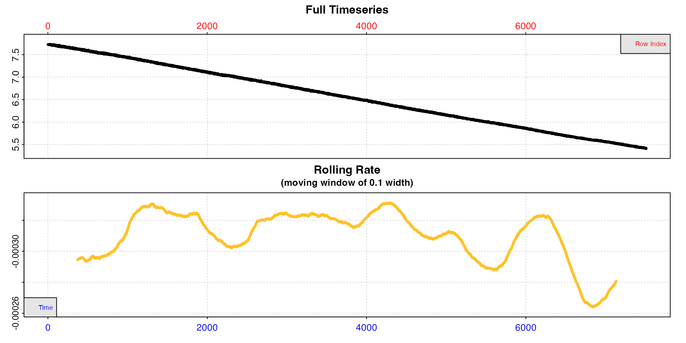

#### Prepare background data

The background data is in a separate data frame, `sqd_bg`. There is no
need to calculate a rate; `adjust_rate` will do this when it identifies
the relevant data regions (although it will accept `calc_rate.bg`
objects). We could also use a data frame as the `by` input. The only
requirement is that the time is in column 1 and all other columns are
the oxygen columns you want to use to calculate the concurrent
background rate. However it’s always a good idea to inspect the data for
issues and visualise it using `inspect`, and this function also allows
us to extract the columns we are interested in.

``` r
sqd_bg_insp <- inspect(sqd_bg, time = 1, oxygen = 2)
```

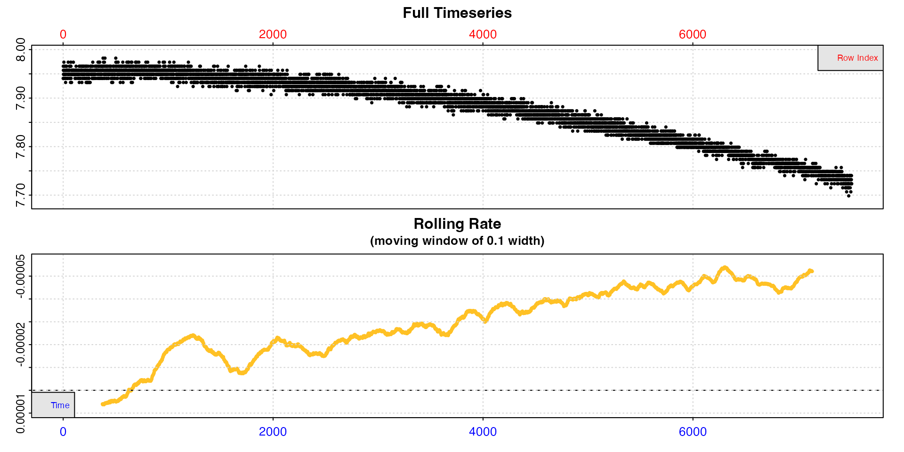

The rolling rate plot makes clear that the background rate increases
over the duration of the experiment. Estimating the background rate
using the whole dataset would therefore likely lead to a wrong
estimation, depending on the time the specimen rate is extracted from.
More localised estimations would therefore be more representative.

#### Calculate specimen rate

We’ll use `auto_rate` on the squid data.

``` r
sqd_ar <- auto_rate(sqd_insp)
```

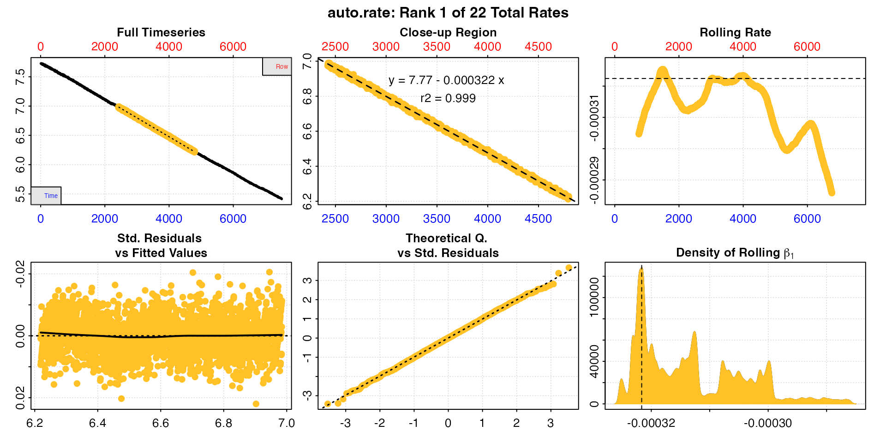

There are 22 linear regions found in these data, so we have 22 rates to
be adjusted.

#### Adjust rates

All we need to do is enter the background `inspect` object as the `by`
input and specify the method.

``` r
sqd_ar_adj <- adjust_rate(sqd_ar, by = sqd_bg_insp, method = "concurrent")
```

We’ll look at the top 5 rows of the summary table.

``` r
summary(sqd_ar_adj, pos = 1:5)
#> 
#> # summary.adjust_rate # -----------------
#> 
#> Adjustment was applied using 'concurrent' method.
#> Summary of rate results from entered 'pos' rank(s):
#> 
#>    rep rank intercept_b0  slope_b1   rsq density  row endrow time endtime  oxy endoxy      rate adjustment rate.adjusted
#> 1:  NA    1         7.77 -0.000322 0.999  128042 2425   4800 2424    4799 6.97   6.23 -0.000322 -0.0000296     -0.000293
#> 2:  NA    2         7.75 -0.000316 0.999   68047  274   3058  273    3057 7.67   6.80 -0.000316 -0.0000156     -0.000300
#> 3:  NA    3         7.76 -0.000322 0.998   64297 3111   4466 3110    4465 6.76   6.33 -0.000322 -0.0000310     -0.000291
#> 4:  NA    4         7.77 -0.000322 0.999   56331 2424   4810 2423    4809 6.97   6.21 -0.000322 -0.0000296     -0.000293
#> 5:  NA    5         7.74 -0.000312 0.998   43240 1556   3060 1555    3059 7.26   6.78 -0.000312 -0.0000189     -0.000293
#> -----------------------------------------
```

Note how the adjustment value differs. The top two adjustments are a
good example of what we would expect concurrently calculated background
rates to be, given what we saw when we inspected the background data,
and that the background rate increases with time. The second row
adjustment, which comes from the start of the dataset, is much lower
than the first row adjustment, which comes from around the middle of the
dataset.

We can use `calc_rate.bg` and the row numbers from the summary to show
that the adjustments for these have been calculated correctly.

``` r
subset_data(sqd_bg, from = 2425, to = 4800, by = "row") |>
  calc_rate.bg()
```

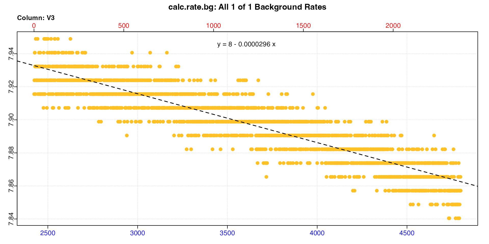

``` r

subset_data(sqd_bg, from = 273, to = 3057, by = "row") |>
  calc_rate.bg()
```

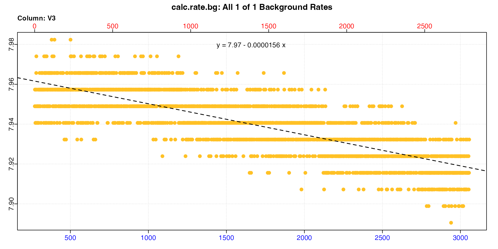

We can see the slopes in the equations are identical to the adjustment
values in the summary.

The `"concurrent"` method is ideal for this type of dynamic adjustment,
however requires a complete concurrent recording of a control
experiment. See [linear](#linear) and [exponential](#dynexpon) dynamic
adjustment sections for examples of applying dynamic adjustments when a
complete control recording is not available.

### Example 2 - Intermittent-flow respirometry

In this example, a concurrent control has been run alongside an
intermittent-flow experiment, and been flushed at the same time as the
specimen chamber. In this plot the specimen data is in black, the
control in orange.

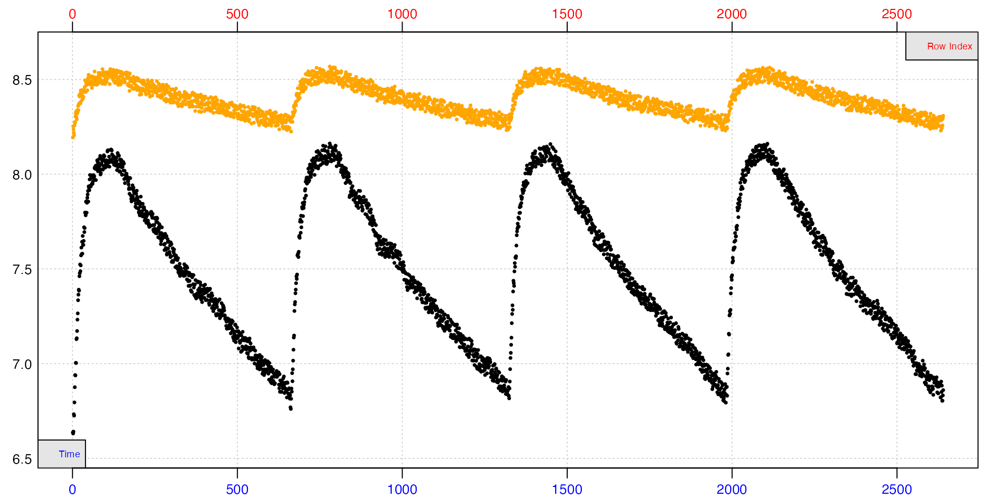

Clearly, fitting slopes to any part of the background data other than
within each replicate will lead to questionable results. Since we will
be calculating a specimen rate within each replicate, the concurrent
method can also use these locations to calculate a background rate.

#### Extract rates

The replicates follow a specific cycle of 9 minutes closed, two minutes
flushing. Knowing this, we can use `calc_rate.int` to extract a rate
from the same time window within each using the `wait` and `measure`
inputs. We use a `wait` of five minutes (300 rows) at the start of each,
which excludes the flush and start of the replicate data. We then use a
`measure` phase of six minutes (360 rows) to extract a rate from the
rest of the replicate.

``` r
# replicate start times - seq(from, to, by)
# starts <- seq(120, 2100, 660) 
# # three minute buffer of data to exclude at the start of each replicate
# buffer <- 180 
# # period to measure after buffer
# measure <- 360

rates <- calc_rate.int(interm_insp,
                       starts = 660,
                       wait = 180,
                       measure = 420,
                       by = "row")
```

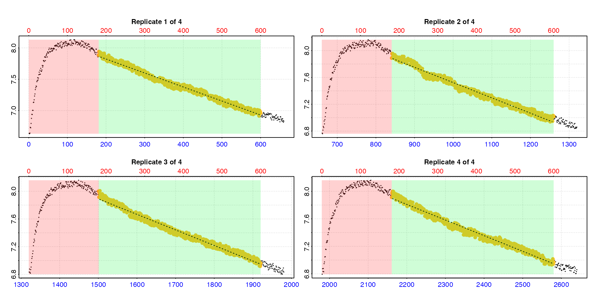

``` r
summary(rates)
#> 
#> # summary.calc_rate.int # ---------------
#> Summary of all replicate results:
#> 
#>    rep rank intercept_b0 slope_b1   rsq  row endrow time endtime  oxy endoxy rate.2pt     rate
#> 1:   1    1         8.27 -0.00223 0.983  181    600  181     600 7.88   6.96 -0.00221 -0.00223
#> 2:   2    1         9.80 -0.00228 0.979  841   1260  841    1260 7.89   7.02 -0.00208 -0.00228
#> 3:   3    1        11.25 -0.00224 0.981 1501   1920 1501    1920 8.00   6.96 -0.00248 -0.00224
#> 4:   4    1        12.81 -0.00227 0.979 2161   2580 2161    2580 7.91   6.97 -0.00225 -0.00227
#> -----------------------------------------
```

#### Adjust rates

Now we have a rate from each replicate, we can adjust them using the
`"concurrent"` method, and the background dataset.

``` r
adj <- adjust_rate(rates,
                   interm_bg,
                   "concurrent")
summary(adj)
#> 
#> # summary.adjust_rate # -----------------
#> 
#> Adjustment was applied using 'concurrent' method.
#> Summary of all rate results:
#> 
#>    rep rank intercept_b0 slope_b1   rsq  row endrow time endtime  oxy endoxy rate.2pt     rate adjustment rate.adjusted
#> 1:   1    1         8.27 -0.00223 0.983  181    600  181     600 7.88   6.96 -0.00221 -0.00223  -0.000452      -0.00178
#> 2:   2    1         9.80 -0.00228 0.979  841   1260  841    1260 7.89   7.02 -0.00208 -0.00228  -0.000456      -0.00182
#> 3:   3    1        11.25 -0.00224 0.981 1501   1920 1501    1920 8.00   6.96 -0.00248 -0.00224  -0.000444      -0.00180
#> 4:   4    1        12.81 -0.00227 0.979 2161   2580 2161    2580 7.91   6.97 -0.00225 -0.00227  -0.000453      -0.00182
#> -----------------------------------------
```

A background adjustment has been calculated from the same time window in
the background data for each replicate. We can see they are very
consistent, as are the adjusted specimen rates, so all looks good.

If you want to check the adjustment is correct, and that the times used
match those of each rate, these are found in the `$adjustment_model`
element of the output object.

### Example 3 - Multiple concurrent controls

Much as in how a mean background rate from multiple controls can be used
to adjust one or more specimen rates (see [here](#multicontrols)), rates
can be extracted from the same time window of multiple concurrent
controls to determine a mean background rate.

The `urchins.rd` data contains two columns of background data in columns
18 and 19. We’ll calculate a specimen rate from a specific time window,
and use the two background columns to get a mean background rate from
the same window.

#### Calculate specimen rate

``` r
# Calculate specimen rate between 10 and 30 mins
rate <- inspect(urchins.rd, 1, 2) |>
  calc_rate(from = 10, 
            to = 30,
            by = "time")
```


#### Inspect background data

``` r
## Inspect background columns
bg_data <- inspect(urchins.rd, 
                   time = 1, 
                   oxygen = 18:19)
```

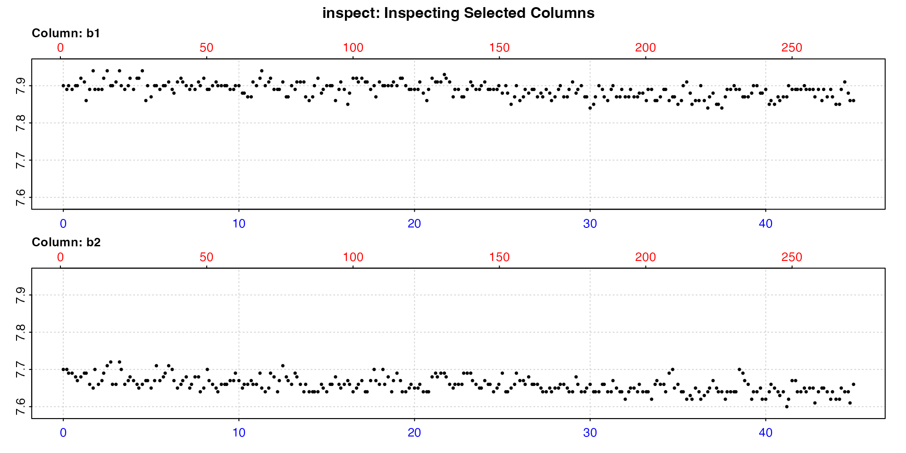

#### Adjust rate

``` r
rate_adj <- adjust_rate(rate,
                        by = bg_data,
                        method = "concurrent")
print(rate_adj)
#> 
#> # print.adjust_rate # -------------------
#> NOTE: Consider the sign of the adjustment value when adjusting the rate.
#> 
#> Adjustment was applied using the 'concurrent' method.
#> 
#> Rank 1 of 1 adjusted rate(s):
#> Rate          : -0.0286
#> Adjustment    : -0.00065
#> Adjusted Rate : -0.0279 
#> 
#> To see full results use summary().
#> -----------------------------------------
```

The adjustment value here is the mean of the two background rates from
the same time window of the background columns that the specimen rate
was determined from. We show this is the case in the next section.

#### Use mean method instead

This performs the same adjustment using a different approach, and again
demonstrates that the `"concurrent"` method results are as expected.

``` r
# Subset background data between same timepoints
bg_rate <- inspect(urchins.rd, 1, 18:19) |>
  subset_data(from = 10, to = 30, by = "time") |>
  calc_rate.bg() 
```

    #> 
    #> # print.calc_rate.bg # ------------------
    #> Background rate(s):
    #> [1] -0.000912 -0.000388
    #> Mean background rate:
    #> [1] -0.00065
    #> -----------------------------------------

``` r
rate_adj <- adjust_rate(rate,
                        by = bg_rate,
                        method = "mean")
print(rate_adj)
#> 
#> # print.adjust_rate # -------------------
#> NOTE: Consider the sign of the adjustment value when adjusting the rate.
#> 
#> Adjustment was applied using the 'mean' method.
#> 
#> Rank 1 of 1 adjusted rate(s):
#> Rate          : -0.0286
#> Adjustment    : -0.00065
#> Adjusted Rate : -0.0279 
#> 
#> To see full results use summary().
#> -----------------------------------------
```

We can see this is the same result as the example above using the
`"concurrent"` method. This is a good example of how the functions in
`respR` are designed to be flexible and adaptable, and how the same
result can be achieved using different approaches.

## Case 7: Dynamic linear adjustment

*“We have background recordings from directly before and after the
experiment and want to apply adjustments assuming the change in
background rate over the experiment was linear”*

This is common in intermittent-flow respirometry where experiments are
run for long durations, often in relatively high temperatures, and so
the background rate may increase over the course of the experiment. It
is not always practical to run a concurrent empty control in these
experiments, so often the equipment is run empty for a period before the
specimen is inserted, and again afterwards after it has been removed to
provide pre- and post-experiment controls. The typical practice is to
assume any change in background rate between these two timepoints is
linear, that is any increase in background rate over time is monotonic.
Therefore, each specimen rate is adjusted by a different value
calculated using its timepoint within the experiment. We would always
however recommend at least one completely empty control be run to
validate that a linear relationship in background rate is indeed the
case (and see next section - [exponential adjustments](#dynexpon)).

This method can also however be used in experiments in which a
concurrent blank experiment is conducted alongside specimen experiments
(as described in the [`concurrent`](#concurrent) section above), but in
which the background data is deemed too noisy to fit reliable
regressions over the short timescales that specimen rates are
determined. In this case, *any* two reliable segments of the background
data of any duration can be used to determine how the background rate
changes over the course of the experiment, and then this used to adjust
specimen rates using the `"linear"` or `"exponential"` methods.

### Notes

`adjust_rate` has additional inputs that we have not yet used that only
apply to the `"linear"` and `"exponential"` methods. The one we’ll use
in the [first example](#lineareg1) is `by2`. The additional inputs
`time_x`, `time_by`, and `time_by2` are used for numeric inputs, as
shown in the [next example](#lineareg2).

In the `"linear"` and `"exponential"` methods, the `by` input is the
earlier background rate, `by2` is the later background rate. These
should share the same numeric time units and scale, that is the numeric
time values should represent the time difference between them; see the
plots below in [Example 1](#lineareg1) of the two background rates and
note the blue time x-axes (note that because the data are subsets of a
larger dataset, the red row axes do not correspond).

The rate to be adjusted should also be on the same time scale. Ideally,
as in this example, within the same dataset, but they do not have to be.
As long as the numeric time values represent the same relative time
scale, they can be separate datasets. In fact, if after several
experiments you find the background rate relationship to be highly
consistent, the same values could be used to adjust future experiments.
Care just needs to be taken to have the experimental data time scale be
consistent with the controls. Typically that would mean having a
consistent start time, that of the end time value of the first control
dataset.

Note that the rates to be adjusted using the `"linear"` and
`"exponential"` methods do not necessarily have to be at intermediate
times to the background data. Once `adjust_rate` has calculated the
formula describing the change in background rate against time, it can
apply this to calculate an adjustment for rates at *any* time on the
same scale, including before and after the times of the background
rates. This is probably not ideal practice, but the function does make
it possible.

### Explanation

`adjust_rate` takes the two background rate values in `by` and `by2` and
the midpoint of the time windows over which they were determined and
calculates a linear relationship of rate against time:
`lm(c(rate1, rate2)) ~ c(time1, time2))`. For each rate in `x` to be
adjusted, it extracts the midpoint of the time window it was calculated
over and uses the slope and intercept from the linear model to calculate
an adjustment value.

This explanation also applies to the `"exponential"` method, except the
adjustment is calculated as an exponential relationship of the form -
`lm(log(c(rate1, rate2)) ~ c(time1, time2))`.

### Experiment overview

The `zeb_intermittent.rd` dataset is from an experiment on a zebrafish.
It is comprised of over 100 replicates. See
[`help(zeb_intermittent.rd)`](https://januarharianto.github.io/respR/reference/zeb_intermittent.rd.md)
for more details. See
[`vignette("intermittent_long")`](https://januarharianto.github.io/respR/articles/intermittent_long.md)
for a more detailed example of analysing this experiment, but we will
briefly repeat part of it here. We will extract rates from one replicate
in the middle of the experiment, and using the pre- and post-experiment
control sections adjust it using the `"linear"` method in `adjust_rate`.

### Example 1: Object inputs

In this example the rate and background inputs to adjust_rate will be
`respR` objects, that is outputs from `calc_rate.bg` and `auto_rate`. In
the [next example](#eg2numeric) we’ll do the same adjustment using
numeric inputs.

#### Extract and calculate background rates

The first replicate up to timepoint 4999 is the pre-experiment
background data, and from timepoints 75140 to 79251 the post-experiment
background data. We’ll subset both of these and calculate the pre- and
post-experiment background rates.

``` r
# pre
bg_pre <- subset_data(zeb_intermittent.rd, 1, 4999, "time") |>
  inspect() |> 
  calc_rate.bg()
```

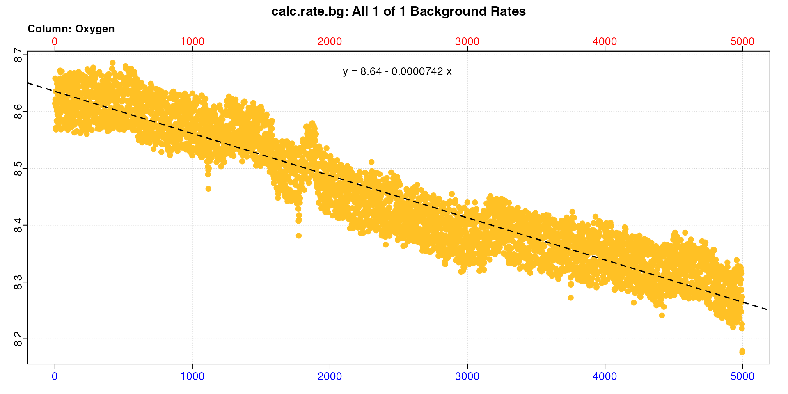

``` r

# post
bg_post <- subset_data(zeb_intermittent.rd, 75140, 79251, "time") |>
  inspect() |> 
  calc_rate.bg()
```

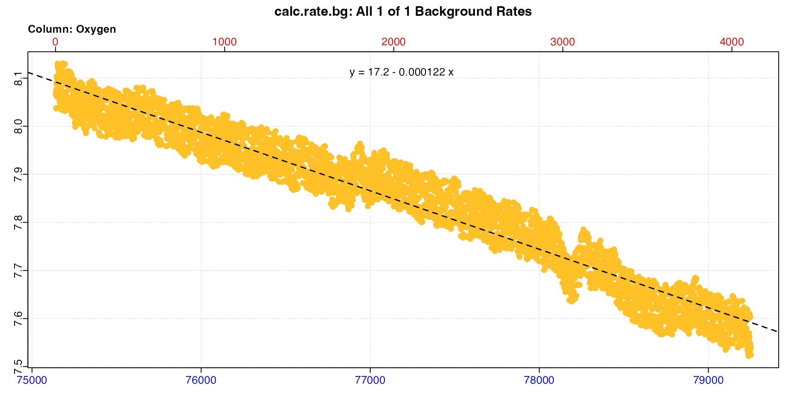

``` r
bg_pre
#> 
#> # print.calc_rate.bg # ------------------
#> Background rate(s):
#> [1] -0.0000742
#> Mean background rate:
#> [1] -0.0000742
#> -----------------------------------------
```

``` r
bg_post
#> 
#> # print.calc_rate.bg # ------------------
#> Background rate(s):
#> [1] -0.0001217
#> Mean background rate:
#> [1] -0.0001217
#> -----------------------------------------
```

We can see the background rate increases by around 70% over the course
of the experiment. These objects are saved, so now we’ll calculate the
rate from a replicate in the middle of the dataset.

#### Calculate specimen rate

This replicate occurs roughly half way through the experiment. Like
above, we’ll subset out the replicate. We’ll also apply a ‘wait’ phase
of 2 minutes (120s) from the start that we don’t want to use in the
analysis, and a ‘measure’ phase of 7 minutes (420s) to exclude the 2
minutes of flushing at the end.

``` r
# define rep start time, buffer and measure periods
start <- 38180 # start time of replicate
wait <- 120   # 2 mins buffer
measure <- 420  # 7 mins measure

rate <- subset_data(zeb_intermittent.rd, 
                    from = start + wait, 
                    to = start + wait + measure, 
                    by = "time") |>
  inspect() |>
  auto_rate()
```

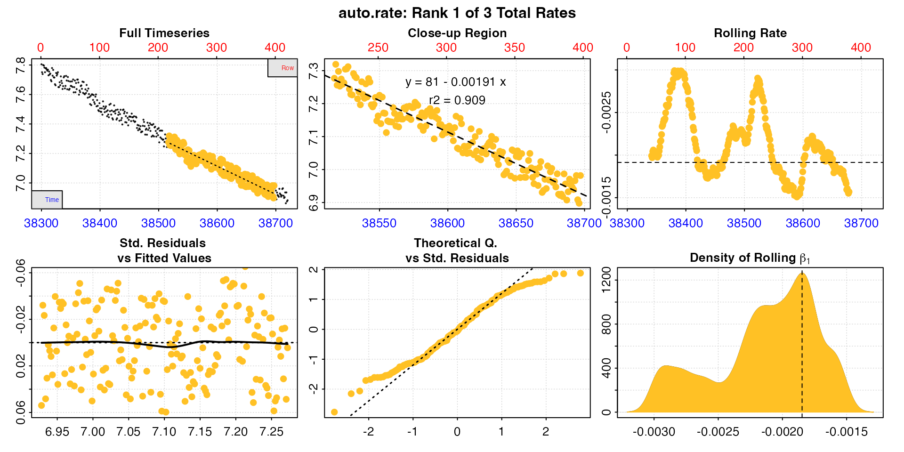

`auto_rate` has identified three linear regions.

#### Adjust rates

Now we’ll adjust the specimen rates using the two background rates and
the `"linear"` method.

``` r
rate_adj <- adjust_rate(rate,
                        by = bg_pre,
                        by2 = bg_post,
                        method = "linear")
summary(rate_adj)
#> 
#> # summary.adjust_rate # -----------------
#> 
#> Adjustment was applied using 'linear' method.
#> Summary of all rate results:
#> 
#>    rep rank intercept_b0 slope_b1   rsq density row endrow  time endtime  oxy endoxy     rate adjustment rate.adjusted
#> 1:  NA    1         81.0 -0.00191 0.909    1263 218    398 38517   38697 7.28   6.98 -0.00191 -0.0000971      -0.00182
#> 2:  NA    2         90.8 -0.00217 0.978     966   4    375 38303   38674 7.80   6.97 -0.00217 -0.0000971      -0.00207
#> 3:  NA    3        119.6 -0.00292 0.823     420  47    132 38346   38431 7.69   7.46 -0.00292 -0.0000970      -0.00282
#> -----------------------------------------
```

Note the adjustment values are very close though not identical in value,
and they are roughly numerically midway between the pre- and
post-experiment background rates of `-0.0000742` and `-0.0001217`. This
is what we would expect for a replicate in the middle of the dataset if
the background rate was increasing linearly between these two values.

We can show this using the background times and rates by creating our
own linear model, and using the coefficients to calculate the rate for a
given time, that of the first result in the summary table above.

``` r
## background rates and midpoint times
bg1_rt <- bg_pre$rate.bg
bg2_rt <- bg_post$rate.bg
bg1_tm <- (1 + 4999)/2
bg2_tm <- (75140 + 79251)/2

## extract slope and intercept
bg_lm_int <- lm(c(bg1_rt, bg2_rt) ~ c(bg1_tm, bg2_tm))$coefficients[[1]]
bg_lm_slp <- lm(c(bg1_rt, bg2_rt) ~ c(bg1_tm, bg2_tm))$coefficients[[2]]

## midpoint time of the first rate in summary
rate_time <- (rate$summary$time[1] + rate$summary$endtime[1])/2

## Background rate 
rate_time * bg_lm_slp + bg_lm_int
#> [1] -0.0000971
```

This is the same as the adjustment value in the summary above.

### Example 2: Numeric inputs

The exact same adjustment as the above example can be performed by
entering numeric values. Because the `x`, `by`, and `by2` are not
objects, and therefore do not contain associated timestamps, these must
be entered as `time_x`, `time_by`, and `time_by2`.

We won’t repeat the whole analysis, only enter the appropriate values as
numerics in `adjust_rate` to show they output the same result. Here we
enter the rates, and the *midpoints* of the time ranges over which they
were determined.

``` r
rate_adj <- adjust_rate(c(-0.00191, -0.00217, -0.00292),
                        by = -0.0000742,
                        by2 = -0.0001217,
                        time_x = (c(38517, 38303, 38346) + c(38697, 38674, 38431))/2,
                        time_by = (1 + 4999)/2,
                        time_by2 = (75140 + 79251)/2,
                        method = "linear")
summary(rate_adj)
#> 
#> # summary.adjust_rate # -----------------
#> 
#> Adjustment was applied using 'linear' method.
#> Summary of all rate results:
#> 
#>    rank     rate adjustment rate.adjusted
#> 1:    1 -0.00191 -0.0000972      -0.00181
#> 2:    2 -0.00217 -0.0000971      -0.00207
#> 3:    3 -0.00292 -0.0000970      -0.00282
#> -----------------------------------------
```

We get the same result as above (the small mismatch in the first is
simply due to the lower precision of entered values compared to internal
ones).

## Case 8: Dynamic exponential adjustment

*“We have background recordings from directly before and after the
experiment and want to apply adjustments assuming the change in
background rate over the experiment was **exponential**”*

This is exactly the same as the [dynamic linear](#dynlinear) adjustment
above, except the background rate is assumed to increase exponentially.
The explanation and background to this is covered [above](#linnotes), so
please read that first.

An exponential increase in background rate is quite common in
experiments done at high temperatures, where the microbial population in
a respirometer shows exponential growth and therefore exponential oxygen
use. Typically this method would be applied only after this exponential
relationship had been established using pilot experiments of empty
control experiments of sufficient duration, which is a practice we would
strongly recommend.

The `background_exp.rd` example dataset shows background data with a
rate that increases exponentially.

``` r
inspect(background_exp.rd)
```

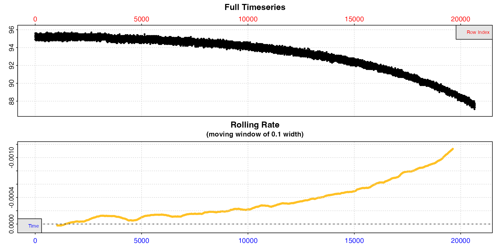

We can see this is exponential from the rolling rate plot: the rate is
not constant, because that would be indicated by a horizontal level
line. It increases, however this is not a linear increase because it is
not increasing monotonically. Instead the increase accelerates with
time, that is increases exponentially.

### Adjust rate

We will use the same example as [above](#lineareg1), but this time
assume an exponential increase in background rate.

``` r
rate_adj <- adjust_rate(rate,
                        by = bg_pre,
                        by2 = bg_post,
                        method = "exponential")
summary(rate_adj)
#> 
#> # summary.adjust_rate # -----------------
#> 
#> Adjustment was applied using 'exponential' method.
#> Summary of all rate results:
#> 
#>    rep rank intercept_b0 slope_b1   rsq density row endrow  time endtime  oxy endoxy     rate adjustment rate.adjusted
#> 1:  NA    1         81.0 -0.00191 0.909    1263 218    398 38517   38697 7.28   6.98 -0.00191 -0.0000942      -0.00182
#> 2:  NA    2         90.8 -0.00217 0.978     966   4    375 38303   38674 7.80   6.97 -0.00217 -0.0000941      -0.00207
#> 3:  NA    3        119.6 -0.00292 0.823     420  47    132 38346   38431 7.69   7.46 -0.00292 -0.0000941      -0.00282
#> -----------------------------------------
```

Under an exponential vs. a linear background relationship we would
expect the background rate to be lower at all stages of an experiment
except the very end. Here, as expected we see slightly lower adjustment
values than in the linear example [above](#lineareg2).

### Exponential vs linear background

In most experiments, the differences to final adjusted rates between
applying these two adjustment methods will be minor. The important
factor is to run trials to establish what kind of relationship the
background rate has over time, and try to minimise background as much as
possible.

## Case 9: Adjusting oxygen production rates

*“We have oxygen production data from a seaweed and want to adjust rates
for oxygen consumption by microbial organisms in the respirometer”*

All of the above methods of adjustment will also work on oxygen
production data. The only thing to be wary of, as noted many times in
this vignette, is to be careful regarding the *signs* of the rates
involved. Oxygen consumption or removal rates are negative, oxygen
production or input rates positive.

### Example

The `algae.rd` dataset contains a recording from a respirometry
experiment on algae exposed to light, and so producing oxygen via
photosynthesis. We’ll calculate a production rate from these data.

``` r
alg_rt <- calc_rate(algae.rd)
```

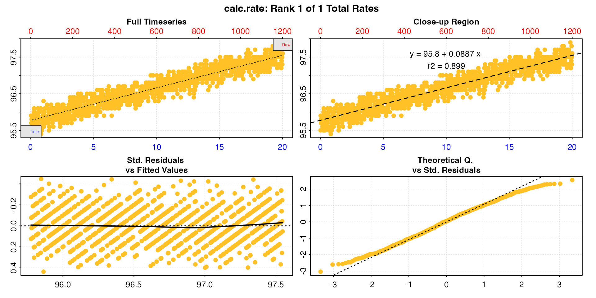

``` r
print(alg_rt)
#> 
#> # print.calc_rate # ---------------------
#> Rank 1 of 1 rates:
#> Rate: 0.0887 
#> 
#> To see full results use summary().
#> -----------------------------------------
```

Note how the rate is positive, unlike all the other examples before now.

A blank control experiment has also been conducted over the same time
period, so we’ll calculate a background rate.

``` r
bg_rt <- calc_rate.bg(alg_bg)
```

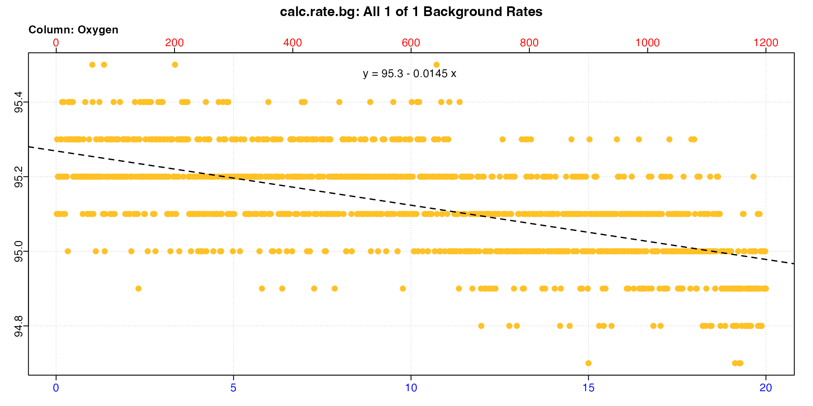

``` r
print(bg_rt)
#> 
#> # print.calc_rate.bg # ------------------
#> Background rate(s):
#> [1] -0.0145
#> Mean background rate:
#> [1] -0.0145
#> -----------------------------------------
```

Note, this rate is negative. This suggests the production rate of the
specimen is being underestimated, because the microbial community in the
respirometer is consuming some of the produced oxygen. We can adjust the
rate to see.

``` r
rt_adj <- adjust_rate(alg_rt, bg_rt)
```

``` r
print(rt_adj)
#> 
#> # print.adjust_rate # -------------------
#> NOTE: Consider the sign of the adjustment value when adjusting the rate.
#> 
#> Adjustment was applied using the 'mean' method.
#> 
#> Rank 1 of 1 adjusted rate(s):
#> Rate          : 0.0887
#> Adjustment    : -0.0145
#> Adjusted Rate : 0.103 
#> 
#> To see full results use summary().
#> -----------------------------------------
```

We see this is indeed the case, and the adjusted rate is higher. We can
do this same adjustment using numeric values, but we must be careful to
use the correct signs.

``` r
adjust_rate(0.0887, -0.0145)
#> 
#> # print.adjust_rate # -------------------
#> NOTE: Consider the sign of the adjustment value when adjusting the rate.
#> 
#> Adjustment was applied using the 'mean' method.
#> 
#> Rank 1 of 1 adjusted rate(s):
#> Rate          : 0.0887
#> Adjustment    : -0.0145
#> Adjusted Rate : 0.103 
#> 
#> To see full results use summary().
#> -----------------------------------------
```

## Case 10: Oxygen input adjustments

*“Our respirometer is open to the air. We want to correct oxygen uptake
rates for oxygen **input** at the surface”*

It is not just the rate to be adjusted that might be positive. There are
scenarios and experiments where the background change in oxygen is an
input, for example in open tank respirometry where the surface is open
to the atmosphere and the input of new oxygen has been quantified or can
be reliably estimated, such as by using Fick’s Law (e.g. [Leclercq et
al. 1999](https://januarharianto.github.io/respR/articles/refs.html#references)).

`adjust_rate` can therefore accept positive background rate values.

``` r
adjust_rate(-0.0176, 0.0042)
#> 
#> # print.adjust_rate # -------------------
#> NOTE: Consider the sign of the adjustment value when adjusting the rate.
#> 
#> Adjustment was applied using the 'mean' method.
#> 
#> Rank 1 of 1 adjusted rate(s):
#> Rate          : -0.0176
#> Adjustment    : 0.0042
#> Adjusted Rate : -0.0218 
#> 
#> To see full results use summary().
#> -----------------------------------------
```

## Case 11: Manual subtraction of background differences

*“We want to manually adjust recorded oxygen values from the specimen by
the decrease observed in the control chamber”*

There is one other way of using background data to adjust specimen data,
but it is a relatively simple arithmetic operation, and does not require
`adjust_rate`.

With a specimen chamber and a concurrent blank control, an investigator
may opt to calculate the difference in oxygen in the control recordings
from a set value, such as the initial oxygen concentration, and then
subtract this from the recorded values in the specimen chamber. The
rationale behind this is that any difference in oxygen in the control
from the initial conditions due to background use is also occurring in
the specimen chamber, so it is a simple arithmetic operation to subtract
this.

Here we’ll demonstrate this returns an equivalent result as the more
typical adjustment methods we show above. We’ll use the `urchins.rd`
data, specifically the first specimen column (`2`) and first background
column (`18`).

### Example data

We’ll inspect both to see the structure.

``` r
inspect(urchins.rd, 1, 2)
```

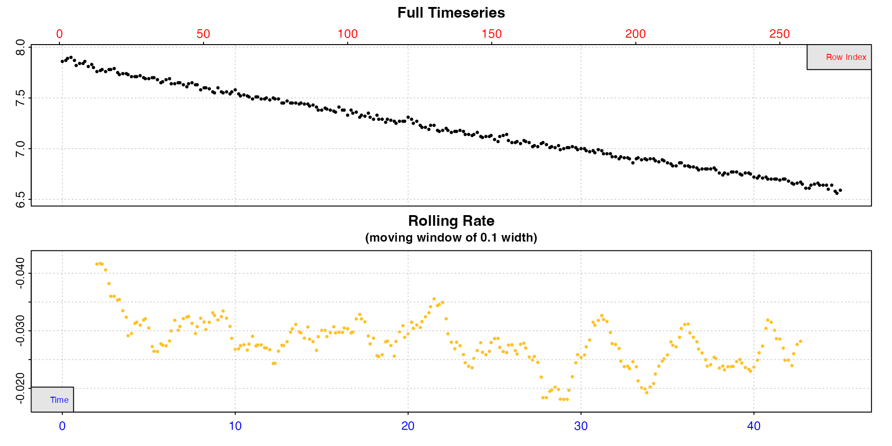

``` r
inspect(urchins.rd, 1, 18)
```

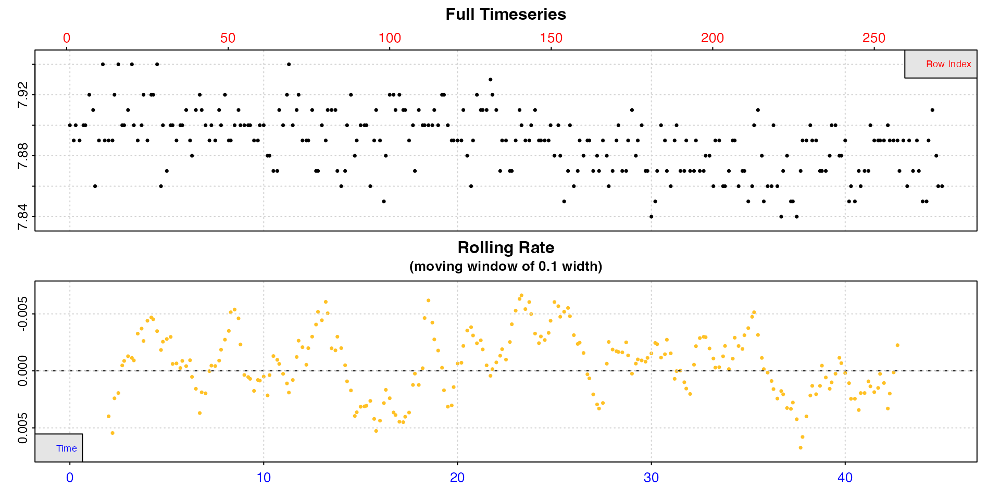

### Subtraction method

First we’ll calculate the difference for every value in the background
oxygen data from the initial value. Then we subtract this from the
oxygen values in the specimen data. Finally we’ll calculate a rate from
the new data between 10 minutes and 30 minutes.

``` r
## background difference in oxygen from initial value
bg_diff <- urchins.rd[[18]] - urchins.rd[[18]][1]

## make new dataframe of specimen data
urch <- urchins.rd[,c(1,2)]

## subtract background difference from specimen oxygen
urch[[2]] <- urch[[2]] - bg_diff

## calculate rate
urch_rt <- calc_rate(urch, 10, 30)
```

    #> 
    #> # print.calc_rate # ---------------------
    #> Rank 1 of 1 rates:
    #> Rate: -0.0277 
    #> 
    #> To see full results use summary().
    #> -----------------------------------------

### adjust_rate method

Now we do the adjustment from the same data region using `respR`
functions.

``` r
## calculate urchin rate
urch_rt <- urchins.rd |>
  inspect(1, 2) |>
  calc_rate(10, 30) 

## calculate background rate from same region
bg_rt <- urchins.rd |>
  subset_data(10, 30) |>
  inspect(1, 18) |>
  calc_rate.bg() 

## adjust rate
urch_rt_adj <- adjust_rate(urch_rt, bg_rt)
```

    #> 
    #> # print.adjust_rate # -------------------
    #> NOTE: Consider the sign of the adjustment value when adjusting the rate.
    #> 
    #> Adjustment was applied using the 'mean' method.
    #> 
    #> Rank 1 of 1 adjusted rate(s):
    #> Rate          : -0.0286
    #> Adjustment    : -0.000912
    #> Adjusted Rate : -0.0277 
    #> 
    #> To see full results use summary().
    #> -----------------------------------------

We can see the final adjusted rate result is identical. Either of these
methods works, and is a valid way of adjusting specimen data for
background.

## Notes and tips

These are general notes and tips about using `adjust_rate`.

### Using only part of a background recording

*“We want to only use a part of a background recording to adjust our
specimen rate”*

You may notice `calc_rate.bg` does not have region selection inputs in
the way `calc_rate` does. It calculates the rate across the whole
oxygen~time dataset as entered. This might cause problems when you don’t
want to use all of the background data, there is a data anomaly at the
start or end, or it is only part of a larger dataset, such as when it
has been conducted in the same chamber as the specimen prior to it being
inserted, and so is part of the same data recording. In general, R makes
it easy to subset datasets to separate objects, however `respR` has a
dedicated function to do this for respirometry data:
[`subset_data()`](https://januarharianto.github.io/respR/reference/subset_data.md).

Here, we have a background recording, but the chamber was left open
until the researcher was ready to start the experiment proper at around
timepoint 5000, so the initial stages are not useful.

``` r
inspect(bg_data)
```

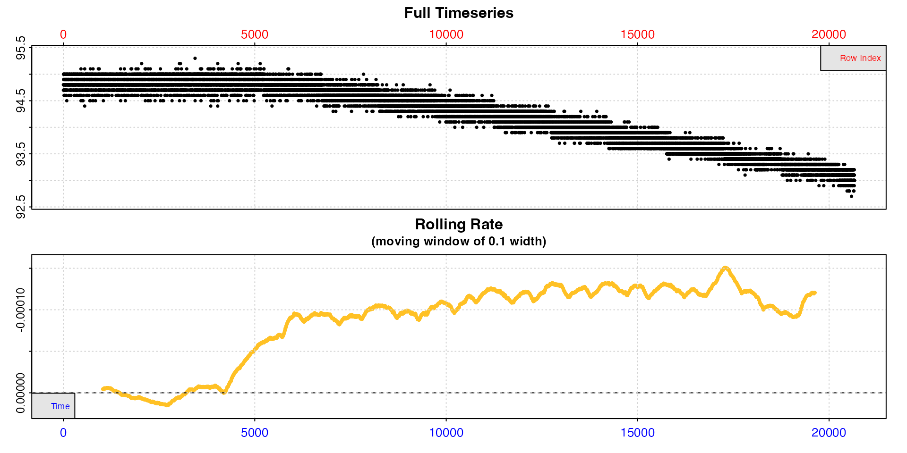

Using this complete dataset would give an incorrect background rate
estimation. Instead we use `subset_data` to subset only the data region
we are interested in and pass it to `calc_rate.bg`. This subsetting can
be performed using `"time"`, `"row"`, or `"oxygen"` ranges.

``` r
bg <- subset_data(bg_data, from = 5000) |>
  calc_rate.bg()
```

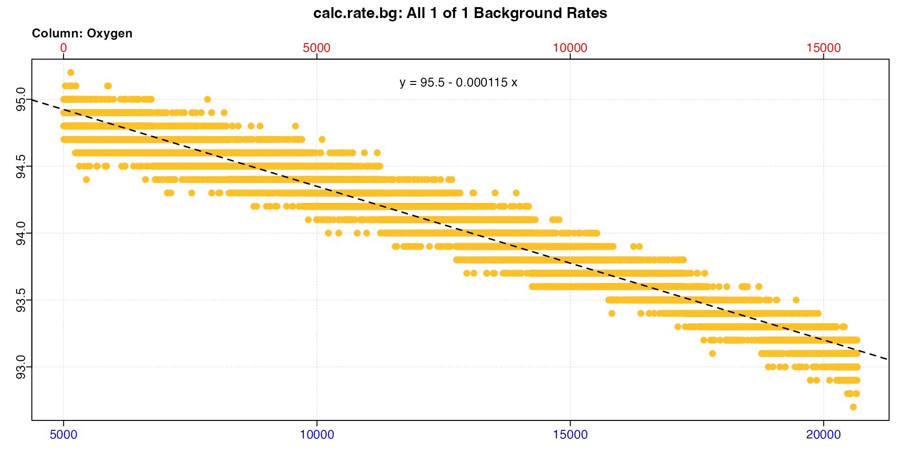

We can use the fact that the default is `method = "time"` to subset from
timepoint 5000. If we don’t specify a `to` input the default behaviour
is to subset to the end of the dataset.

Now we can use this background rate to adjust a specimen rate.

``` r
sard <- inspect(sardine.rd) |>
  calc_rate(from = 2000, to = 4000) |>
  adjust_rate(by = bg) 
```

``` r
print(sard)
#> 
#> # print.adjust_rate # -------------------
#> NOTE: Consider the sign of the adjustment value when adjusting the rate.
#> 
#> Adjustment was applied using the 'mean' method.
#> 
#> Rank 1 of 1 adjusted rate(s):
#> Rate          : -0.000705
#> Adjustment    : -0.000115
#> Adjusted Rate : -0.000591 
#> 
#> To see full results use summary().
#> -----------------------------------------
```

If you just want to extract a single rate, using `calc_rate` and its
region selection inputs to calculate a background rate from a specific
region is also an option. See [here](#crbgvcr) for discussion about the
main differences between `calc_rate.bg` and `calc_rate`.

### Inform how long experiments should be

`adjust_rate` allows you to estimate an appropriate or maximum length an
experiment should be. The higher the background rate, the more
uncertainty is introduced into estimations of the specimen rate. After
quantifying background and its increase over time, we can estimate how
long it will take until it reaches a certain percentage of the specimen
rates.

For example, let’s take the [example from above](#lineareg2) of the
linearly increasing background rate of our zebrafish, and decide
background rates above 10% of specimen rates are unacceptably high. We
can estimate how long it will take for this to occur.

``` r
duration <- 70000 # starting duration
under10 <- TRUE # This will hold our logical test result

# Is the background rate under 10% of the specimen rate?
# while it is, repeat, adding 1 hour to duration each time 
while (under10) {
  
  rate_adj <- 
    suppressWarnings(
      suppressMessages(
        adjust_rate(-0.00191, # typical specimen rate
                    by = -0.0000742, # initial background rate
                    by2 = -0.0001217, # end background rate
                    time_x = duration, # this is what we vary
                    time_by = (1 + 4999)/2, # initial background time
                    time_by2 = (75140 + 79251)/2, # end background time
                    method = "linear")
      ))
  
  # Is background rate under 10% of specimen rate?
  under10 <- rate_adj$adjustment/rate_adj$rate * 100 < 10
  # Increase duration by 1 hour
  duration <- duration + 3600
  # if bg NOT under 10% of specimen rate print the duration in hours
  # The while loop will also stop here
  if(!under10) print(duration/60/60) 
}
#> [1] 53.4
```

Now we can see this level of background rate will be reached in around
53 hours, so our current experiments of 24h are well within this. If we
wanted to run them even longer however, this gives us a good idea of the
maximum duration before the background rate might interfere with good
estimates of specimen rate.

### S3 generics

As with most outputs in `respR`, `adjust_rate` objects support the
generic S3 functions `print`, `summary`, and `mean`. These have the
additional inputs `pos` and `export`. See help files for additional
information. In the case of `mean`, if there are multiple rates they
return the mean value of the primary output `$rate.adjusted`. This can
be output as a value by passing `export = TRUE`.
