# auto_rate: Comparisons with LoLinR

## **Note**

*This page has been archived and will not be updated. This is because it
was submitted as part of the
[publication](https://doi.org/10.1111/2041-210X.13162) of `respR` in
Methods in Ecology and Evolution, and has been retained unchanged for
reference. Any results and code outputs shown are from `respR v1.1`
code. Subsequent updates to `respR` should produce the same or very
similar results.*

## Introduction

To our current knowledge, one other R package,
[`LoLinR`](https://colin-olito.github.io/LoLinR/vignettes/LoLinR.html)
(Olito et al. 2017), performs ranking techniques on time series data.
The `respR` and `LoLinR` packages use fundamentally different techniques
to estimate linear regions of data. We detail
[`auto_rate()`](https://januarharianto.github.io/respR/reference/auto_rate.md)’s
methods
[here](https://januarharianto.github.io/respR/articles/auto_rate.html).
`LoLinR`’s methods can be found in their online vignette
[here](https://colin-olito.github.io/LoLinR/vignettes/LoLinR.html), and
Olito et al. (JEB, 2017).

To summarise the main differences between the two methods:

1.  [`auto_rate()`](https://januarharianto.github.io/respR/reference/auto_rate.md)
    uses machine learning techniques to detect linear segments first
    before running linear regressions on these data regions. `LoLinR`,
    by contrast, performs all possible linear regressions on the data
    first, and then implements a ranking algorithm such that the most
    linear regions are top-ranked.

2.  `LoLinR`’s algorithms use three different metrics to select linear
    data, in which at least one performs very well to detect linear
    segments – even if a small amount data is provided (\<100 samples).
    In comparison,
    [`auto_rate()`](https://januarharianto.github.io/respR/reference/auto_rate.md)
    uses only one method (kernel density estimation), which performs
    less accurately at smaller sample sizes, but that accuracy increases
    greatly with more data available.

&nbsp;

3.  Because
    [`auto_rate()`](https://januarharianto.github.io/respR/reference/auto_rate.md)
    detects linear data first before it performs linear regressions, it
    is several orders of magnitude faster than `LoLinR`. Thus
    [`auto_rate()`](https://januarharianto.github.io/respR/reference/auto_rate.md)
    is ideal for large data. On the other hand, `LoLinR` is restricted
    to small datasets (see below).

Thus, even though both packages can perform linear metric analysis and
determine the “most linear” section of a plot, the user will observe
varying differences between the two methods used (see Comparisons
section below).

## Processing times

The main function in `LoLinR` is called `rankLocReg()`. The time it
takes this function to process data follows an exponential relationship
with its length, illustrated below:

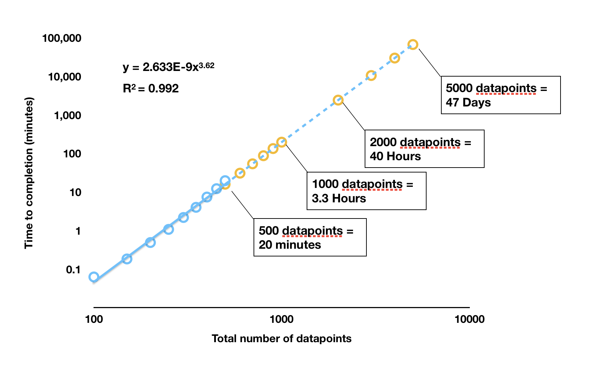

LoLinR processing times

`rankLocReg()` was run on different sized datasets (blue dots) and the
time to completion recorded. These analyses were run in RStudio on the
same dataset subset to the appropriate length, on a 2017 Macbook Pro
with 3.1 GHz Intel Core i5 processor, 16GB RAM, and no other
applications running. The orange dots are estimated completion times for
larger datasets extrapolated from the results. **Note the log scale.**

As we can see, any dataset larger than around 400 to 500 in length takes
a prohibitively long time to be processed by `rankLocReg()`. In a test
under the same conditions,
[`auto_rate()`](https://januarharianto.github.io/respR/reference/auto_rate.md)
processed a dataset of 5000 datapoints in size in 1.25 seconds;
`rankLocReg()` would take 47 days. One dataset included in `respR`
(`squid.rd`) is over 34,000 datapoints in length.
[`auto_rate()`](https://januarharianto.github.io/respR/reference/auto_rate.md)
completed analysis of this dataset in 18.5 seconds; under the
exponential relationship of `rankLocReg()` this would take approximately
*163 years* to be processed. In reality, it is likely (as we have
experienced) RAM limits will cause the `rankLocReg()` process to crash
well before these durations are reached.

The developers of `LoLinR` are aware of the processing limitations of
`rankLocReg()`, and in the documentaton for the package recommend
thinning (i.e. subsampling) datasets longer than 500 in length using
another function that they provided, `thinData()`. However, thinning
datasets of thousands to tens of thousands of datapoints to only a few
hundred would inevitably cause loss of information, which may not be
desirable in certain use cases.

## Comparisons

We provide below comparisons of the outputs of
[`auto_rate()`](https://januarharianto.github.io/respR/reference/auto_rate.md)
and `rankLocReg()` on simulated data generated by the
[`sim_data()`](https://januarharianto.github.io/respR/reference/sim_data.md)
function and on real experimental data included in both packages.
Because of `rankLocReg()`’s limitations for large data, the analysis of
all data in these comparisons is restricted to 150 data points. There
are no such restrictions in
[`auto_rate()`](https://januarharianto.github.io/respR/reference/auto_rate.md),
so for experimental data it was used without modifications to its
length. However for `rankLocReg()` they were, as recommended in the
`LoLinR` documentation, subsampled beforehand to 150 datapoints in
length using the `thinData()` function. Because `rankLocReg()` has three
different methods (`z`, `eq`, and `pc`) to rank the data, for the
comparisons below we selected the most accurate method that best ranked
the data in each case.

We show the output diagnostic plots for each function on six sample data
analyses, plus a summary of the top ranked linear section identified
showing the rate, and start and end times of the estimated linear
region.

### Simulated data: default

``` r

set.seed(769)
sim1 <- sim_data(150)
```

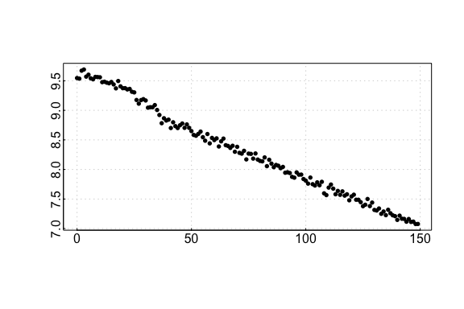

auto_rate comparison: simulated data

``` r

## respR:
rspr1 <- auto_rate(sim1$df)
```

    #> 
    #> 7 kernel density peaks detected and ranked.

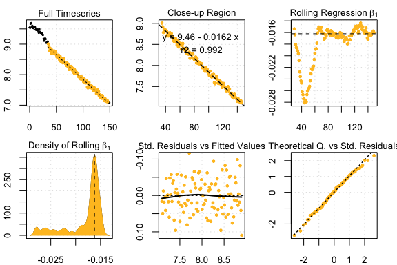

auto_rate results

``` r

## LoLinR:
lir1 <- rankLocReg(xall = sim1$df$x, yall = sim1$df$y, 0.2, method = 'pc')
plot(lir1)
```

    #> rankLocReg fitted 7260 local regressions.

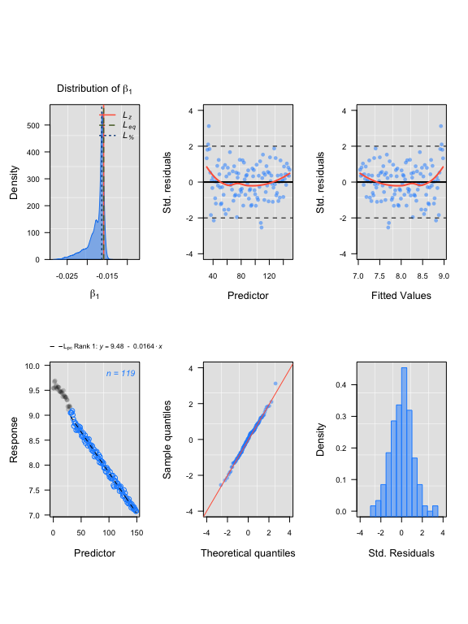

LoLinR results

    #> Compare top ranked outputs

    #> respR
    #> Rate: -0.0162
    #> Start Time: 35
    #> End Time: 146

    #> LoLinR
    #> Rate: -0.0164
    #> Start Time: 32
    #> End Time: 150

### Simulated data: corrupted

``` r

set.seed(112)
sim2 <- sim_data(150, type = "corrupted")
```

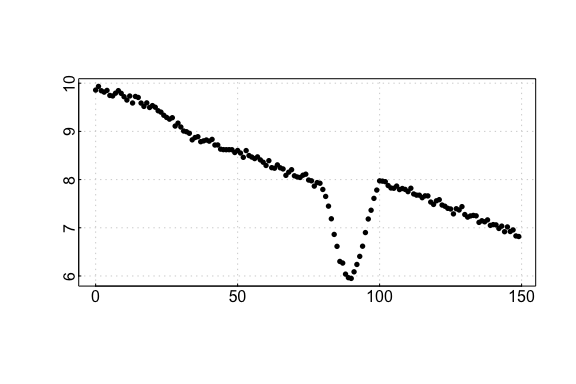

auto_rate comparison: sardine data

``` r

## respR:
rspr2 <- auto_rate(sim2$df)
```

    #> 
    #> 31 kernel density peaks detected and ranked.

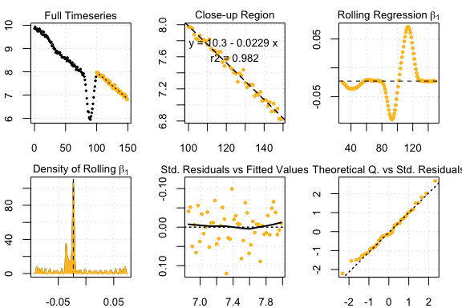

auto_rate sardine results

``` r

## LoLinR:
lir2 <- rankLocReg(xall = sim2$df$x, yall = sim2$df$y, 0.2, "pc")
plot(lir2)
```

    #> rankLocReg fitted 7260 local regressions.

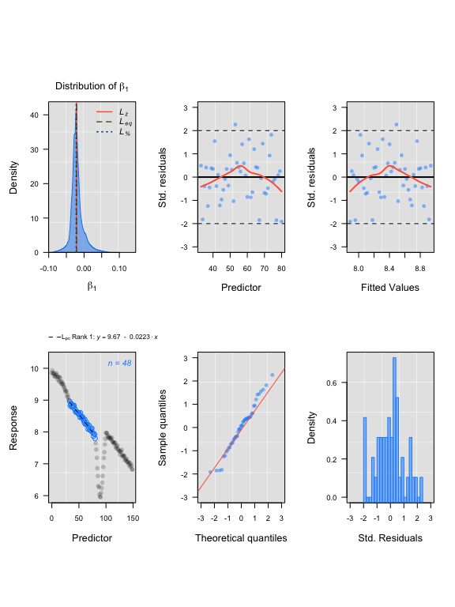

LoLinR sardine results

    #> Compare top ranked outputs

    #> respR
    #> Rate: -0.0227
    #> Start Time: 79
    #> End Time: 149

    #> LoLinR
    #> Rate: -0.0228
    #> Start Time: 87
    #> End Time: 130

### Simulated data: segmented

``` r

set.seed(546)
sim3 <- sim_data(150, type = "segmented")
```

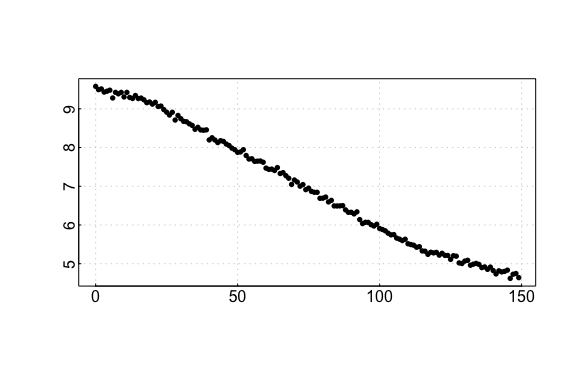

auto_rate comparison: urchin data

``` r

## respR:
rspr3 <- auto_rate(sim3$df)
```

    #> 
    #> 6 kernel density peaks detected and ranked.

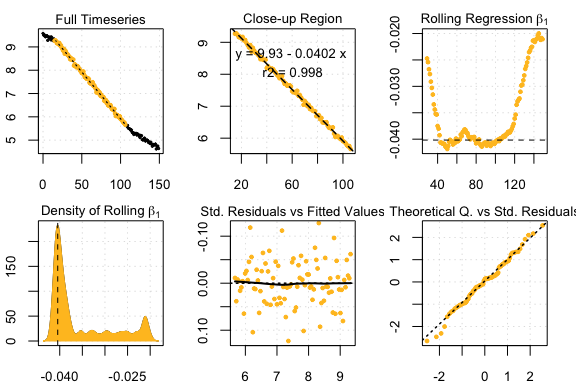

auto_rate urchin results

``` r

## LoLinR:
lir3 <- rankLocReg(xall = sim3$df$x, yall = sim3$df$y, 0.2, "pc")
plot(lir3)
```

    #> rankLocReg fitted 7260 local regressions.

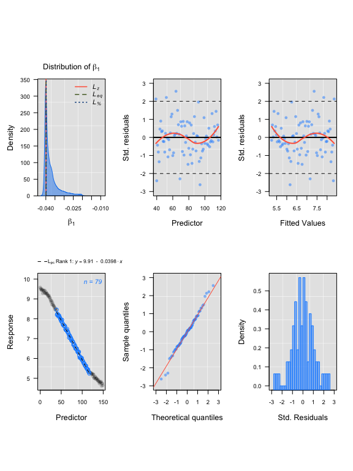

LoLinR urchin results

    #> Compare top ranked outputs

    #> respR
    #> Rate: -0.0402
    #> Start Time: 15
    #> End Time: 106

    #> LoLinR
    #> Rate: -0.0398
    #> Start Time: 40
    #> End Time: 118

### Experimental data: UrchinData from LoLinR

``` r

## respR:
Urch1 <- select(UrchinData, 1, 4)

respr_urchindata <- auto_rate(Urch1)
```

    #> 
    #> 4 kernel density peaks detected and ranked.

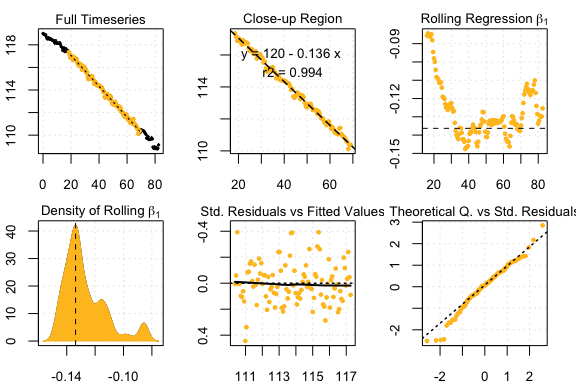

auto_rate comparison: squid data

``` r

## LoLinR:
lolinr_urchindata  <-  rankLocReg(xall=UrchinData$time, yall=UrchinData$C, alpha=0.2, method="z")
plot(lolinr_urchindata)
```

    #> rankLocReg fitted 8911 local regressions.

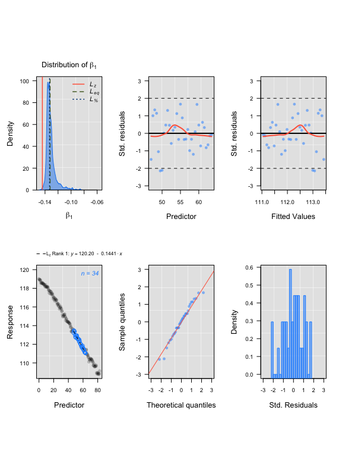

auto_rate squid results

    #> Compare top ranked outputs

    #> respR
    #> Rate: -0.1363
    #> Start Time: 18.5
    #> End Time: 69

    #> LoLinR
    #> Rate: -0.1441
    #> Start Time: 47
    #> End Time: 63.5

### Experimental data: CormorantData from LoLinR

``` r

## respR:
rcor <- auto_rate(CormorantData)
```

    #> 
    #> 43 kernel density peaks detected and ranked.


auto_rate comparison: intermittent data

``` r

## LoLinR:
lcor  <-  thinData(CormorantData, by = nrow(CormorantData)/150)$newData1 # thin data
lcoregs <- rankLocReg(xall=lcor$Time, yall=lcor$VO2.ml.min, alpha=0.2, 
  method="eq", verbose=FALSE)
lcoregs  <-  reRank(lcoregs, newMethod='pc')
plot(lcoregs)
```

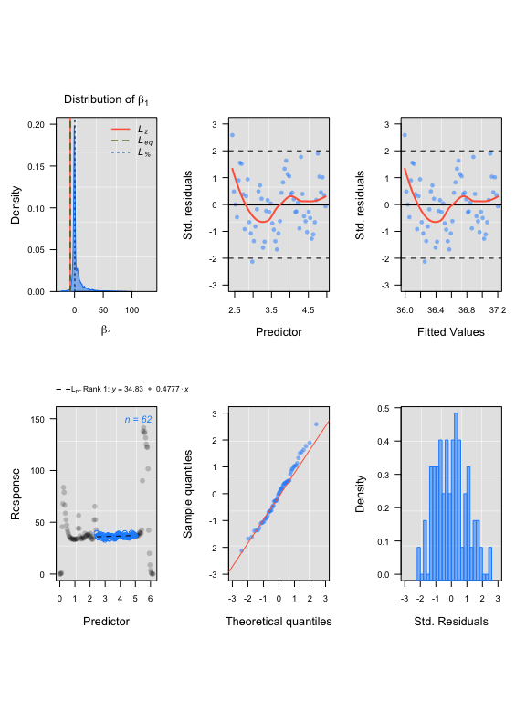

auto_rate intermittent results

    #> Compare top ranked outputs

    #> respR
    #> Rate: 1.16313
    #> Start Time: 2.83
    #> End Time: 5.41

    #> LoLinR
    #> Rate: 0.47775
    #> Start Time: 2.44
    #> End Time: 4.97

### Experimental data: squid.rd from respR

``` r

## respR:
rsquid <- auto_rate(squid.rd)
```

    #> 
    #> 32 kernel density peaks detected and ranked.

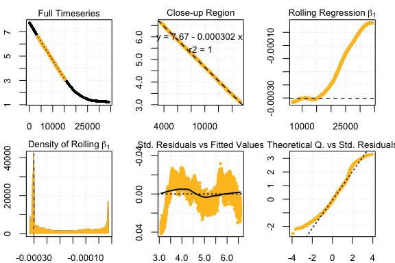

LoLinR intermittent results

``` r

## LoLinR:
lsquid <- thinData(squid.rd, by = nrow(squid.rd)/150)$newData1
lsquidregs <- rankLocReg(xall=lsquid$Time, yall=lsquid$o2, alpha=0.2, 
  method="eq")
plot(lsquidregs)
```

    #> rankLocReg fitted 7260 local regressions.

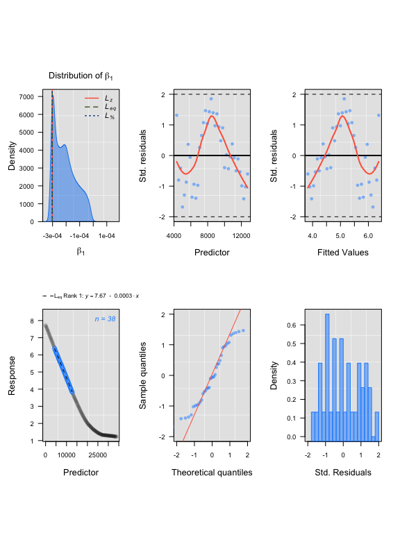

LoLinR intermittent rate extraction

    #> Compare top ranked outputs

    #> respR
    #> Rate: -0.00030151
    #> Start Time: 3589
    #> End Time: 15219

    #> LoLinR
    #> Rate: -0.00030188
    #> Start Time: 4321
    #> End Time: 12738

## Summary

We can see from the above comparisons that in these examples on small
datasets, `auto_rate` and `rankLocReg` output similar results in
identifying linear regions. Rates identified are often (within the
magnitudes of the data ranges used) only marginally different, and
typically the start and end times of the linear region identified are
similar, or at least the regions widely overlap.

Again, we must stress that comparisons between these functions are
limited because of the need in `rankLocReg` to subsample long data to a
manageable length. It is likely that some of the minor differences in
results comes from reducing the number of datapoints `rankLocReg` has to
work with, though some is also presumably attributable to the different
analytical methodologies. These results do suggest that this thinning
does not radically alter the data, and so the results from `rankLocReg`
would be valid in these cases. However, this is a very limited
comparison: in these examples we only had to thin two of the datasets.
There may be cases where such thinning alters the characteristics of the
data such that `rankLocReg` identifies incorrect linear segments, or
identifies different linear sections depending on the degree of thinning
performed. This could particularly be the case where the rates fluctuate
rapidly, or data is of very high resolution. The same is of course true
of `auto_rate`; the algorithms are complex but fallible, so it may on
occasion identify spurious or incorrect linear regions. So we again
remind users that they should always examine the results output by
`auto_rate` to ensure they are relevant to the question of interest.

In the case of which of these methods to use with your respirometry
data, caution would suggest that all possible datapoints be used in
analyses if possible, and as we have shown here and in the [performance
vignette](https://januarharianto.github.io/respR/articles/performance.html)
`auto_rate` handles large data easily, while `LoLinR` clearly does not.

Users are very much encouraged to explore both functions and compare the
outputs with their own data. However, given that `auto_rate` and
`rankLocReg` appear to perform similarly in identifying linear regions
of data, but in `auto_rate` a reduction in data resolution is
unnecessary, we would advocate the use of `auto_rate` for your
respirometry data unless you have a particular reason to believe
`LoLinR` package will output more relevant results.

## References

Olito, C., White, C. R., Marshall, D. J., & Barneche, D. R. (2017).
Estimating monotonic rates from biological data using local linear
regression. The Journal of Experimental Biology, jeb.148775-jeb.148775.
<doi:10.1242/jeb.148775>
