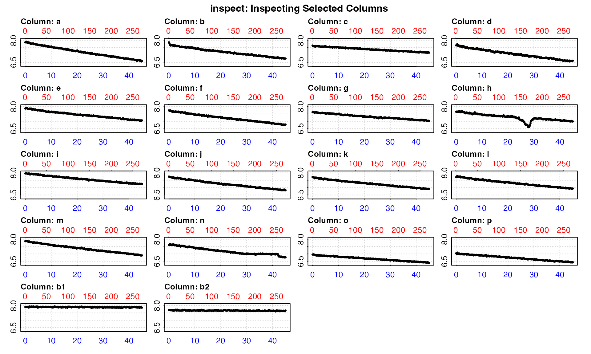
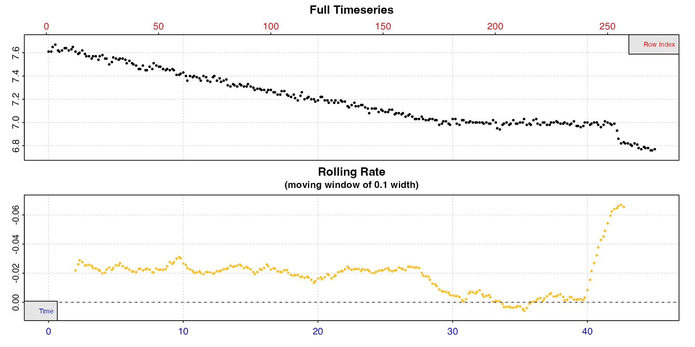
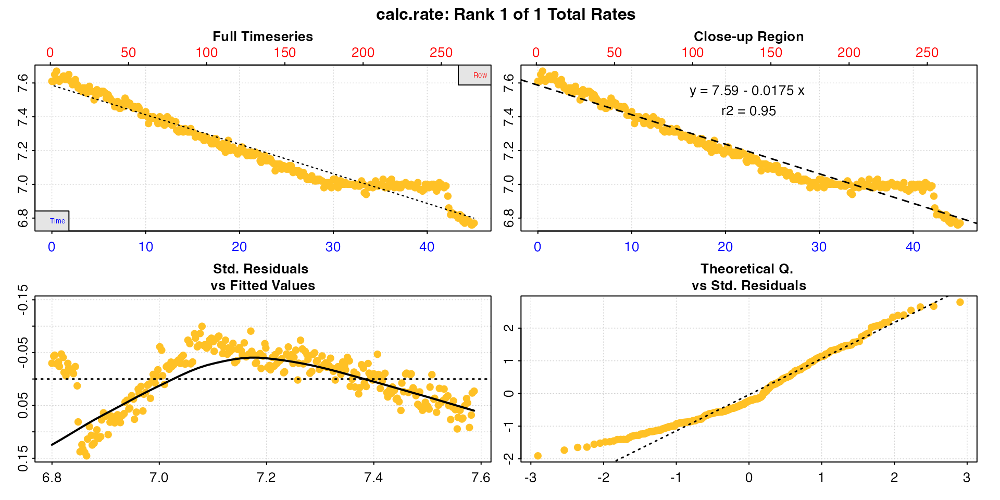
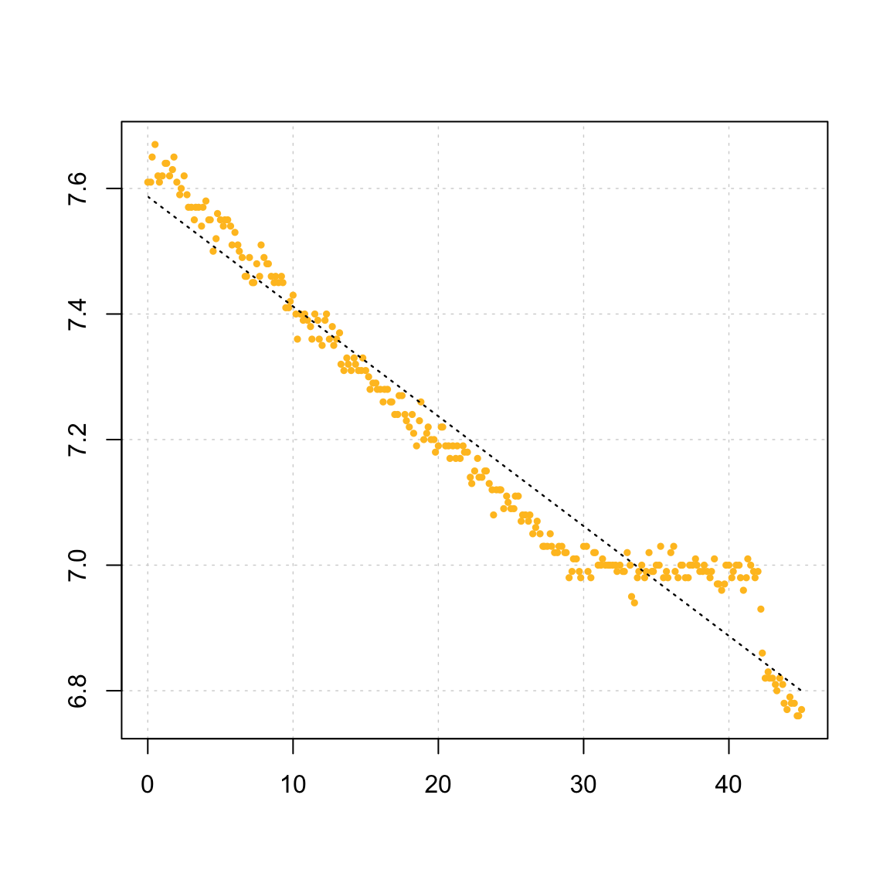
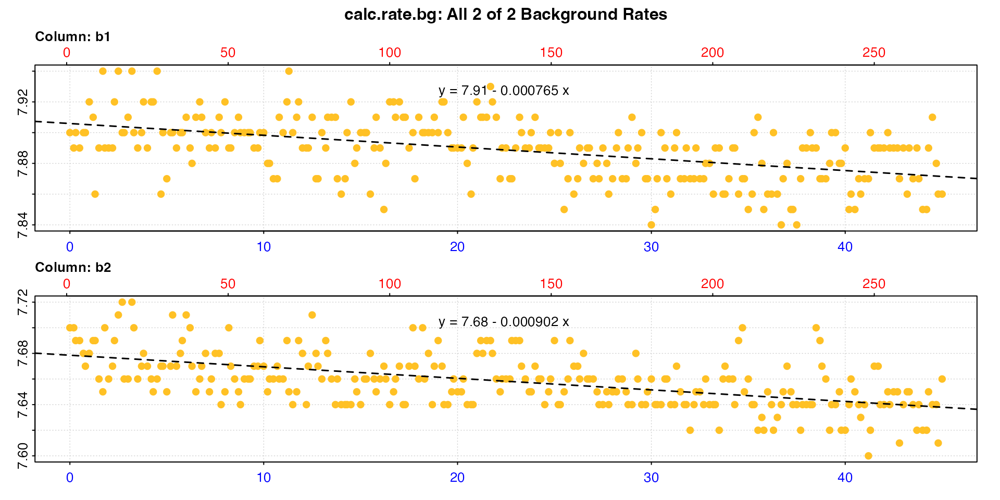

# Closed-chamber respirometry

## Introduction

Here we describe a typical workflow for a closed-chamber respirometry
experiment. Whether or not this is the type of experiment you are
conducting, this is a good starting point to understand the general
`respR` workflow, functions and how they work together.

The example data used here is `urchins.rd`, where the first column of
the data frame is time data in *minutes*, while the remaining 18 columns
are dissolved oxygen data in *mg/L*. Columns 18 and 19 (`b1` and `b2`)
contain background recordings (i.e. from empty or “blank” control
chambers).

``` r
head(urchins.rd)
#>    time.min     a     b     c     d     e     f     g     h     i     j     k     l     m     n     o     p    b1    b2
#>       <num> <num> <num> <num> <num> <num> <num> <num> <num> <num> <num> <num> <num> <num> <num> <num> <num> <num> <num>
#> 1:      0.0  7.86  7.86  7.64  7.65  7.87  7.74  7.62  7.65  7.96  7.75  7.72  7.71  7.87  7.61  6.96  7.04  7.90  7.70
#> 2:      0.2  7.87  7.79  7.60  7.71  7.87  7.72  7.61  7.66  7.97  7.72  7.71  7.71  7.89  7.61  6.96  7.01  7.89  7.70
#> 3:      0.3  7.89  7.70  7.60  7.70  7.90  7.72  7.61  7.63  7.98  7.72  7.69  7.77  7.89  7.65  6.97  7.05  7.90  7.69
#> 4:      0.5  7.90  7.68  7.60  7.72  7.92  7.74  7.62  7.66  7.97  7.72  7.70  7.77  7.89  7.67  6.96  7.09  7.89  7.69
#> 5:      0.7  7.87  7.64  7.60  7.67  7.90  7.73  7.59  7.65  7.95  7.71  7.66  7.76  7.86  7.62  6.95  7.00  7.90  7.68
#> 6:      0.8  7.82  7.69  7.61  7.61  7.88  7.70  7.60  7.65  7.94  7.70  7.63  7.72  7.86  7.61  6.94  6.99  7.90  7.67
```

## A typical respR workflow

The typical workflow in `respR` is to process a data frame containing
paired values of numeric time and oxygen through several functions,
saving the output object each time and inputting it into the next
function. Much of this is optional; most `respR` functions also accept
numeric values, vectors and `data.frame` objects, depending on the input
or function. However, the
*[object-oriented](https://en.wikipedia.org/wiki/Object-oriented_programming)*
approach allows for several benefits, such as data integrity checks and
reducing the need for additional inputs, and we would strongly recommend
using it whenever possible.

A typical workflow involves some or all of the following functions:

|  |  |
|----|----|
| [`inspect()`](https://januarharianto.github.io/respR/reference/inspect.md) | Visualise the data and check it for common issues |
| [`calc_rate()`](https://januarharianto.github.io/respR/reference/calc_rate.md) or [`auto_rate()`](https://januarharianto.github.io/respR/reference/auto_rate.md) | Extract rates from the entire dataset or regions of it, manually or automatically |
| [`adjust_rate()`](https://januarharianto.github.io/respR/reference/adjust_rate.md) | Adjust the rate values for background oxygen consumption or production |
| [`convert_rate()`](https://januarharianto.github.io/respR/reference/convert_rate.md) | Convert the adjusted rate(s) to any common units of oxygen consumption or production |
| [`select_rate()`](https://januarharianto.github.io/respR/reference/select_rate.md) | If there are multiple rates, select according to various criteria which to report or how to arrive at a final rate |

### Importing and preparing data

`respR` has a very simple structural data requirement: data must be in
the form of paired values of numeric time and oxygen amount in a
`data.frame`. To our knowledge, all oxygen sensing equipment or probe
systems output to formats (e.g. `.csv`, `.txt`) that can be imported
into this structure in `R` using generic functions such as
[`read.csv()`](https://rdrr.io/r/utils/read.table.html).

See
[`vignette("importing")`](https://januarharianto.github.io/respR/articles/importing.md)
for a guide to importing and preparing data to this form.

### `inspect` - visualise and check for errors

Once data is in the form of a `data.frame` of paired time and oxygen
values, we use
[`inspect()`](https://januarharianto.github.io/respR/reference/inspect.md)
to visualise the data and to check for common issues:

- Time and oxygen columns are *numeric*

- Time and oxygen data contain *infinite* (`Inf`) values

- Time and oxygen have *missing* (`NA`/`NaN`) values

- Time data are *sequential*

- Time data contains *duplicates*

- Time data are numerically *evenly-spaced*

See
[`vignette("inspecting")`](https://januarharianto.github.io/respR/articles/inspecting.md)
for a full description and examples of what these checks entail, the
implications of them failing or producing warnings, and other inputs in
the function.

#### Inspect entire dataset

By default, `inspect` assumes the first column of the data frame is
`time`, while the second column is `oxygen`. However, we can use the
`time` and `oxygen` inputs to select different columns, including
multiple columns. You can use either numbers or the names of the
columns. Here, we inspect all columns without `<-` assigning
(i.e. saving) the result.

``` r
inspect(urchins.rd, time = 1, oxygen = 2:19)
#> inspect: Multiple 'oxygen' columns selected. Note that subsequent functions in respR will by default use first oxygen column only.
#> Warning: inspect: Time values are not evenly-spaced (numerically).
#> inspect: Data issues detected. For more information use print().
```



    #> 
    #> # print.inspect # -----------------------
    #>                 time.min    a    b    c    d    e    f    g    h    i    j    k    l    m    n    o    p   b1   b2
    #> numeric             pass pass pass pass pass pass pass pass pass pass pass pass pass pass pass pass pass pass pass
    #> Inf/-Inf            pass pass pass pass pass pass pass pass pass pass pass pass pass pass pass pass pass pass pass
    #> NA/NaN              pass pass pass pass pass pass pass pass pass pass pass pass pass pass pass pass pass pass pass
    #> sequential          pass    -    -    -    -    -    -    -    -    -    -    -    -    -    -    -    -    -    -
    #> duplicated          pass    -    -    -    -    -    -    -    -    -    -    -    -    -    -    -    -    -    -
    #> evenly-spaced       WARN    -    -    -    -    -    -    -    -    -    -    -    -    -    -    -    -    -    -
    #> 
    #> Uneven Time data locations (first 20 shown) in column: time.min 
    #>  [1]  1  2  3  4  5  6  7  8  9 10 11 12 13 14 15 16 17 18 19 20
    #> Minimum and Maximum intervals in uneven Time data: 
    #> [1] 0.1 0.2
    #> -----------------------------------------

This is chiefly exploratory functionality to allow for a quick overview
of a dataset. Here the plot lets us see which are the specimen columns,
which might have data anomalies, and which are controls.

The data checks tell us all the columns pass the various checks, except
one. There is a warning that the time data are not evenly spaced. This
is a common warning, and in this case can be safely ignored. It results
from using decimalised minutes as the time metric, which happen to be
numerically unevenly spaced, but are perfectly usable as the time metric
in `respR`.

Rather than make assumptions that rows represent evenly spaced
datapoints, the functions in `respR` use actual time values for analyses
and rate calculations, and so even irregularly spaced data are analysed
correctly. Such warnings are for informative purposes: to make the user
aware of unusual data gaps, and also to remind users that if they use
row numbers for manual operations such as subsetting, the same row width
in different parts of the data may not necessarily represent the same
time period.

#### Inspect individual columns

To extract rates, it is best to assign each time-oxygen column pair
individually as a separate `inspect` object. Using the `time` and
`oxygen` inputs we can select particular columns either by the column
number or, as shown here, by name.

``` r
urchin <- inspect(urchins.rd, time =  "time.min", oxygen = "n")
```



    #> 
    #> # print.inspect # -----------------------
    #>                 time.min    n
    #> numeric             pass pass
    #> Inf/-Inf            pass pass
    #> NA/NaN              pass pass
    #> sequential          pass    -
    #> duplicated          pass    -
    #> evenly-spaced       WARN    -
    #> 
    #> Uneven Time data locations (first 20 shown) in column: time.min 
    #>  [1]  1  2  3  4  5  6  7  8  9 10 11 12 13 14 15 16 17 18 19 20
    #> Minimum and Maximum intervals in uneven Time data: 
    #> [1] 0.1 0.2
    #> -----------------------------------------

Note how the data is plotted against both time (bottom blue axis) and
row index (top red axis). From this plot, we can see irregularities in
these data near the end of the timeseries (in this case the specimen had
interfered with the oxygen sensor). A linear regression across the
entire data series would therefore not be a representative estimate of
the true routine respiration rate. However, the bottom plot, a rolling
rate across a moving window of 10% of the data, shows that over the
initial stages of the experiment oxygen uptake rate is consistent at
around -0.02. In this experiment this region would be therefore be
suitable for extracting rates, and we would not want to use any data
after approximately the 29 minutes timepoint.

For now, the data is saved as an object, `urchin` which contains the
original data columns we selected coerced into a new data frame, and
various other metadata.

Again, note that using
[`inspect()`](https://januarharianto.github.io/respR/reference/inspect.md)
is optional. Functions in `respR` will generally accept regular `R` data
structures (e.g. data frames, tibbles, vectors, etc.).
[`inspect()`](https://januarharianto.github.io/respR/reference/inspect.md)
is a quality control and exploratory step that helps highlight potential
issues about the data before analysis. We use this particular example
with an obvious anomaly to illustrate the point that you should *always
visualise and explore your data before analysis*. `respR` has been
designed to make this straightforward.

### `calc_rate` - calculate oxygen uptake rate

#### Defaults

Using the `inspect` object `urchin` that we just created in
[`calc_rate()`](https://januarharianto.github.io/respR/reference/calc_rate.md)
with no additional inputs, will prompt the function to perform a linear
regression on the entire data series.

``` r
calc_rate(urchin) 
#> 
#> # print.calc_rate # ---------------------
#> Rank 1 of 1 rates:
#> Rate: -0.0175 
#> 
#> To see full results use summary().
#> -----------------------------------------
```



Note how the function recognises the
[`inspect()`](https://januarharianto.github.io/respR/reference/inspect.md)
object, with no other inputs necessary. Alternatively, you can input a
`data.frame` object containing raw data, in which case the function will
automatically consider the first column as time data, and the second
column as oxygen data (if they are not in the first two columns, they
should be processed via
[`inspect()`](https://januarharianto.github.io/respR/reference/inspect.md)
or otherwise put into this structure).

#### Other options

In many cases, we want to select the region over which the rate is
determined. For example, we may want to exclude initial stages of
instability at the start of an experiment, determine the rate over an
exact time duration, or within a threshold of oxygen concentrations.
Equipment interference or other factors may cause irregularities in the
data we want to exclude. `calc_rate` allows us to specify exact data
regions and allow us to work around such issues.

Using the `from`, `to`, and `by` inputs, a user may use
[`calc_rate()`](https://januarharianto.github.io/respR/reference/calc_rate.md)
to specify data ranges in several ways:

- **Time:**
  - *“What is the rate over a specific 25 minute period?”*
  - `from = 4, to = 29, by = "time"`
- **Oxygen:**
  - *“What is the rate between oxygen concentrations of 7.5 to 7.0
    mg/L?”*
  - `from = 7.5, to = 7.0, by = "oxygen"`
- **Row:**
  - *“What is the rate between rows 11 and 273.”*
  - `from = 11, to = 273, by = "row"`

These inputs do not need to be overly precise; for `oxygen` and `time`
if input values do not match exactly to a value in the data, the
function will identify the closest matching values and use these for
calculations. Similarly, if `from` or `to` values are beyond the maximum
or minimum values in the data, the function will use the maximum or
minimum value instead. For example, the above experiment is 45 minutes
long. If we used `to = 60` as the upper time range, the function would
simply apply a `to` value of 45 instead.

#### Calculate urchin rate

Here, to calculate our rate we’ll select a 25 minute period before the
interference occurred.

``` r
urch_rate <- calc_rate(urchin, from = 4, to = 29, by = "time")
```

Plotting the output provides a series of diagnostic plots of the data
subset that was analysed.

``` r
plot(urch_rate)
#> 
#> # plot.calc_rate # ----------------------
#> plot.calc_rate: Plotting rate from position 1 of 1 ...
#> -----------------------------------------
```



The saved object can also be explored using generic `S3` R methods.

``` r
print(urch_rate)
#> 
#> # print.calc_rate # ---------------------
#> Rank 1 of 1 rates:
#> Rate: -0.0218 
#> 
#> To see full results use summary().
#> -----------------------------------------

summary(urch_rate)
#> 
#> # summary.calc_rate # -------------------
#> Summary of all rate results:
#> 
#>    rep rank intercept_b0 slope_b1   rsq row endrow time endtime  oxy endoxy rate.2pt    rate
#> 1:  NA    1         7.64  -0.0218 0.987  25    175    4      29 7.58   6.98   -0.024 -0.0218
#> -----------------------------------------
```

The rate, which at this stage is unitless, can be seen as the final
column, and other summary data and model coefficients are saved in the
object. In this case the `rsq` is 0.99, so this appears to be a very
good estimate of this urchin’s routine respiration rate.

Note how the rate value is *negative*. In `respR` oxygen uptake rates
are represented by negative values because they represent a negative
slope of oxygen against time. By contrast, oxygen production rates would
be *positive*. These uptake rates will typically be reported as positive
values when you come to write-up the results.

#### Two-point rate

The output also includes a `rate.2pt`. This is the rate determined by
simple two-point calculation of difference in oxygen divided by
difference in time. For almost all analyses, the `$rate` should be used.
See
[`vignette("twopoint")`](https://januarharianto.github.io/respR/articles/twopoint.md)
for an explanation of this output and when it might be useful.

### `calc_rate.bg` - calculate background oxygen

The presence of micro-organisms and their oxygen use may be a potential
source of experimental bias, and we usually want to account for
background respiration rates during experiments by conducting empty or
“blank” control experiments with no specimens to quantify it.

These control experiments are routinely conducted alongside, or before
and after specimen experiments, or at an entirely different time.
Whenever they are conducted, it is always important they are done under
the exact same conditions using the same or equivalent equipment.
Essentially these should be identical to regular experiments, except for
the absence of the specimen you are interested in.

Since the oxygen signal from blank experiments can be noisy and trends
easily influenced by outliers, often the background rates from several
controls are averaged to obtain a more accurate estimate of the
background rate. Once a background rate is determined, specimen rates
are then adjusted by it. See
[`vignette("adjust_rate")`](https://januarharianto.github.io/respR/articles/adjust_rate.md)
for detailed examples of the many types of adjustments that can be
performed using `respR`.

The function
[`calc_rate.bg()`](https://januarharianto.github.io/respR/reference/calc_rate.bg.md)
is used to extract background rates from control recordings. These must
share the **same units of time and oxygen** as the experimental rates
they will be used to adjust. It can also process multiple background
oxygen recordings, so that an average background rate will be applied in
the `adjust_rate` function, or other adjustments requiring multiple
recordings can be performed. In the `urchins.rd` data, background
respiration was recorded and saved in columns 18 and 19.

We will determine background rates using
[`calc_rate.bg()`](https://januarharianto.github.io/respR/reference/calc_rate.bg.md).
Unlike `calc_rate`, which can calculate rates from *multiple* regions of
a *single* oxygen column, this function can calculate rates across
*single* region of *multiple* columns.

Here, we `inspect` the two data columns, and because they have no
anomalies use the entire data to calculate a background rate (if we
wanted to only use part of it we could pass it through
[`subset_data()`](https://januarharianto.github.io/respR/reference/subset_data.md)
first). We save the output as a separate object.

``` r
bg_insp <- inspect(urchins.rd, time = 1, oxygen = 18:19)
bg_rate <- calc_rate.bg(bg_insp)
```



    #> 
    #> # print.calc_rate.bg # ------------------
    #> Background rate(s):
    #> [1] -0.000765 -0.000902
    #> Mean background rate:
    #> [1] -0.000833
    #> -----------------------------------------

The `bg_rate` object contains both individual background rates for each
data column (`$rate.bg`), and an averaged rate (`$rate.bg.mean`). We
will determine how these are applied as an adjustment to the specimen
rate in
[`adjust_rate()`](https://januarharianto.github.io/respR/reference/adjust_rate.md).

### `adjust_rate` - adjust for background respiration

See
[`vignette("adjust_rate")`](https://januarharianto.github.io/respR/articles/adjust_rate.md)
for detailed examples of the types of adjustments that can be performed
using `adjust_rate`. Here the adjustment is relatively straightforward.
We will adjust the `urch_rate` using the `bg_rate` object we saved in
the previous section.

The rate input to be adjusted can be an object of class `calc_rate` or
`auto_rate`, or any numeric value (or multiple values). The `by`
adjustment value can be a `calc_rate.bg` object, `calc_rate` object, or
numeric value or vector. `adjust_rate` has several methods determining
how the `by` is applied, but the default one is `"mean"`, which is the
one we want here, since we want to apply the average of the two
background rates we just calculated.

``` r
urch_rate_adj <- adjust_rate(urch_rate, by = bg_rate, method = "mean")
```

    #> 
    #> # print.adjust_rate # -------------------
    #> NOTE: Consider the sign of the adjustment value when adjusting the rate.
    #> 
    #> Adjustment was applied using the 'mean' method.
    #> 
    #> Rank 1 of 1 adjusted rate(s):
    #> Rate          : -0.0218
    #> Adjustment    : -0.000833
    #> Adjusted Rate : -0.0209 
    #> 
    #> To see full results use summary().
    #> -----------------------------------------

The urchin rate has been adjusted to a slightly lower uptake rate
because, as we found by looking at the controls, some of this uptake was
due to respiration by micro-organisms.

Background adjustments can also be entered manually. Care should be
taken to include the correct *sign*. In `respR` oxygen uptake rates are
negative since they represent a negative slope of oxygen against time.
Background rates are usually (though not always) also negative. In this
case, the default `"mean"` method will not alter the `by` value.

``` r
urch_rate_adj_num <- adjust_rate(-0.0218, by = -0.000833)
```

    #> 
    #> # print.adjust_rate # -------------------
    #> NOTE: Consider the sign of the adjustment value when adjusting the rate.
    #> 
    #> Adjustment was applied using the 'mean' method.
    #> 
    #> Rank 1 of 1 adjusted rate(s):
    #> Rate          : -0.0218
    #> Adjustment    : -0.000833
    #> Adjusted Rate : -0.021 
    #> 
    #> To see full results use summary().
    #> -----------------------------------------

We can see this is essentially the same result as above. The small
mismatch in values is simply due to the lower precision of entered
values compared to internal ones (the number of decimal places printed
in the console depends on your own R options setting).

### `convert_rate` - convert the results

Note, that until this point `respR` has *not required units of time or
oxygen to be specified*. Now we convert calculated, unitless rates to
specified output units.

[`convert_rate()`](https://januarharianto.github.io/respR/reference/convert_rate.md)
can be used to convert the unitless rate values we have dealt with up to
now to these reportable metrics:

- **Absolute metabolic rate**
  - Oxygen consumption or production per unit time. This is the whole
    specimen, whole chamber or whole group metabolic rate
- **Mass-specific metabolic rate**
  - Oxygen consumption or production per unit time per unit *mass* of
    the specimen
- **Area-specific metabolic rate**
  - Oxygen consumption or production per unit time per unit *area* of
    the specimen

Conversion requires the units of the original raw data (`time.unit`,
`oxy.unit`), and the `volume` of fluid in the respirometer in Litres
($`L`$). Mass-specific rates require the `mass` of the specimen in
kilograms ($`kg`$), and area-specific rates require the `area` of the
specimen in metres squared ($`m^2`$). Lastly, an `output.unit`
appropriate to the inputs should be specified. This should be in the
correct order: “oxygen/time” or “oxygen/time/mass” or
“oxygen/time/area”.

*Note*: the `volume` is volume of fluid in the respirometer or
respirometer loop, **not the volume of the respirometer**. That is, it
represents the *effective volume*. A specimen occupies space in the
respirometer, and so displaces some proportion of the water volume,
which depending on its size might be significant. Therefore the volume
of water entered here should equal the total volume of the respirometer
*minus the volume of the specimen*. There are several approaches to
determine the effective volume; calculating the specimen volume
geometrically or via water displacement in a separate vessel, or
calculated from the mass and density (e.g. for fish it is often assumed
they have an equal density as water, that is ~1000 kg/m^3). Water volume
could also be determined directly by pouring out the water at the end of
the experiment, or by weighing the respirometer after the specimen has
been removed. See the
**[`respfun`](https://github.com/nicholascarey/respfun)** respirometry
utilities package for several functions to assist with determining the
effective volume.

### Convert adjusted urchin rate

For an example of absolute oxygen uptake rate, we can convert the output
of
[`adjust_rate()`](https://januarharianto.github.io/respR/reference/adjust_rate.md)
to oxygen consumed by the whole urchin in *mg per hour*:

``` r
convert_rate(urch_rate_adj,         # urchin rate adjusted for background
             oxy.unit = "mg/L",     # oxygen units of the original raw data
             time.unit = "min",     # time units of the original raw data
             output.unit = "mg/h",  # output unit
             volume = 1.09)         # effective volume of the respirometer
```

    #> convert_rate: Object of class 'adjust_rate' detected. Converting all adjusted rates in '$rate.adjusted'.
    #> 
    #> # print.convert_rate # ------------------
    #> Rank 1 of 1 rates:
    #> 
    #> Input:
    #> [1] -0.0209
    #> [1] "mg/L" "min" 
    #> Converted:
    #> [1] -1.37
    #> [1] "mgO2/hr"
    #> 
    #> To see full results use summary().
    #> -----------------------------------------

We can also convert to a mass-specific rate by adding a specimen `mass`
and specifying a mass-specific `output.unit`:

``` r
convert_rate(urch_rate_adj, 
             oxy.unit = "mg l-1", 
             time.unit = "m", 
             output.unit = "mg/s/kg",
             volume = 1.09, 
             mass = 0.19)
```

    #> convert_rate: Object of class 'adjust_rate' detected. Converting all adjusted rates in '$rate.adjusted'.
    #> 
    #> # print.convert_rate # ------------------
    #> Rank 1 of 1 rates:
    #> 
    #> Input:
    #> [1] -0.0209
    #> [1] "mg/L" "min" 
    #> Converted:
    #> [1] -0.002
    #> [1] "mgO2/sec/kg"
    #> 
    #> To see full results use summary().
    #> -----------------------------------------

Note how we have changed the format of the time and oxygen units. A
“fuzzy” string matching algorithm automatically recognises such
variations, allowing natural, intuitive input. For example, `"ml/l"`,
`"mL/L"`, “`ml L-1`”, `"milliliter/liter"`, and `"millilitre/litre"` are
all recognised as `ml/L`. Unit delimiters can be any combination of a
space, dot (`.`), forward-slash (`/`), or the “per” unit (`-1`). Thus,
`"ml/kg"`, `"mL / kg"`, `"mL /kilogram"`, `"ml kg-1"` or `"ml.kg-1"` are
equally recognised as `mL/kg`. To see what units are available to use in
various functions, see
[`unit_args()`](https://januarharianto.github.io/respR/reference/unit_args.md).

``` r
unit_args()
#> Note: A string-matching algorithm is used to identify units. 
#> Example 1: These are recognised as the same: 'mg/L', 'mg/l', 'mg L-1', 'mg per litre', 'mg.L-1'
#> Example 2: These are recognised as the same: 'Hour', 'hr', 'h'
#> 
#> # Input Units # --------------------------------------
#> Oxygen concentration units should use SI units (`L` or `kg`) for the denominator.
#> 
#> Oxygen Concentration or Pressure Units - Do not require t, S and P
#> [1] "mg/L"   "ug/L"   "mol/L"  "mmol/L" "umol/L" "nmol/L" "pmol/L"
#> Oxygen Concentration or Pressure Units - Require t, S and P
#>  [1] "uL/L"    "mL/L"    "mm3/L"   "cm3/L"   "cc/L"    "mg/kg"   "ug/kg"   "ppm"     "mol/kg"  "mmol/kg" "umol/kg" "nmol/kg" "pmol/kg" "uL/kg"   "mL/kg"   "%Air"    "%Oxy"    "Torr"    "hPa"     "kPa"     "mmHg"    "inHg"   
#> 
#> Volume units for use in flow rates in calc_rate.ft and convert_rate.ft
#> (e.g. as in 'ml/min', 'L/s', etc.)
#> [1] "uL" "mL" "L" 
#> 
#> Time units (for 'time.unit' or as part of 'flowrate.unit')
#> [1] "sec"  "min"  "hour" "day" 
#> 
#> Mass units
#> [1] "ug" "mg" "g"  "kg"
#> 
#> Area units
#> [1] "mm2" "cm2" "m2"  "km2"
#> 
#> # Metabolic Rate Units # -----------------------------
#> For use in 'convert_rate', 'convert_rate.ft', 'convert_MR'
#> 
#> Must be in correct order:
#> Absolute rates:        Oxygen/Time       e.g. 'mg/sec',     'umol/min',     'mL/h'
#> Mass-specific rates:   Oxygen/Time/Mass  e.g. 'mg/sec/ug',  'umol/min/g',   'mL/h/kg'
#> Area-specific rates:   Oxygen/Time/Area  e.g. 'mg/sec/mm2', 'umol/min/cm2', 'mL/h/m2'
#> 
#> Output Oxygen amount units
#>  [1] "ug"   "mg"   "pmol" "nmol" "umol" "mmol" "mol"  "uL"   "mL"   "mm3"  "cm3" 
#> 
#> Output Time units
#> [1] "sec"  "min"  "hour" "day" 
#> 
#> Output Mass units for mass-specific rates
#> [1] "ug" "mg" "g"  "kg"
#> 
#> Output Area units for surface area-specific rates
#> [1] "mm2" "cm2" "m2"  "km2"
```

Note that some units of oxygen require temperature, salinity and
atmospheric pressure to perform the conversion. One handy tip: you may
want to enter these even if they are not required for conversions
because they are saved in the `$summary` table, and this can help in
keeping track of results across different experiments.

This time we will save (i.e. assign) the result to an object.

``` r
urch_rate_final <- convert_rate(urch_rate_adj, 
                                oxy.unit = "mg/L", 
                                time.unit = "mins", 
                                output.unit = "ml/h/kg",
                                volume = 1.09, 
                                mass = 0.19,
                                t = 20,
                                S = 30,
                                P = 1.01)
#> convert_rate: Object of class 'adjust_rate' detected. Converting all adjusted rates in '$rate.adjusted'.
```

``` r
print(urch_rate_final)
#> 
#> # print.convert_rate # ------------------
#> Rank 1 of 1 rates:
#> 
#> Input:
#> [1] -0.0209
#> [1] "mg/L" "min" 
#> Converted:
#> [1] -5.43
#> [1] "mLO2/hr/kg"
#> 
#> To see full results use summary().
#> -----------------------------------------

summary(urch_rate_final)
#> 
#> # summary.convert_rate # ----------------
#> Summary of all converted rates:
#> 
#>    rep rank intercept_b0 slope_b1   rsq density row endrow time endtime  oxy endoxy    rate adjustment rate.adjusted rate.input oxy.unit time.unit volume mass area  S  t    P rate.abs rate.m.spec rate.a.spec output.unit rate.output
#> 1:  NA    1         7.64  -0.0218 0.987      NA  25    175    4      29 7.58   6.98 -0.0218  -0.000833       -0.0209    -0.0209     mg/L       min   1.09 0.19   NA 30 20 1.01    -1.03       -5.43          NA  mLO2/hr/kg       -5.43
#> -----------------------------------------
```

### Final rate

The final rate can be seen above in these console outputs. It can be
extracted for further use from the saved object where it is
`$rate.output`:

``` r
urch_rate_final$rate.output
#> [1] -5.43
```

Alternatively, use the `summary` function with `export = TRUE` to save
the summary table as a separate data frame which contains all rate
regression parameters and data locations, adjustments (if applied),
units, and more. This is a great way of exporting all the relevant data
for your final results.

``` r
urch_rate_final_df <- summary(urch_rate_final, export = TRUE)
```

### Check the result

A final and important step in respirometry analyses, particularly after
the first rate from a new set of experiments or specimens has been
calculated, is to check the result against rates from the same or
similar species of the same size in as close as possible to the same
conditions. This could be from previous analyses by the same user or
group, or rates from one or more published studies.

Dealing with so many different units and conversions it is very easy to
introduce a small conversion or transcription error that will have a
huge effect on the final calculated rate. These types of error
occasionally make it into published papers. This is why we would also
recommend you check the result against more than one independent
publication.

In the present example, at the time the experiments were done there were
no published respirometry studies on this particular species of sea
urchin. However, a quick Google Scholar search led to other papers from
which rates of other species of sea urchin at around the same size and
temperature could be found. In Moulin et
al. ([2015](https://januarharianto.github.io/respR/articles/refs.html#references)).
*E. mathaei* has a respiration rate of around *0.2 to 0.5 umol/h/g* at
25°C, and in Kurihara et
al. ([2013](https://januarharianto.github.io/respR/articles/refs.html#references))
*H. pulcherrimus* it is around *0.6 umol/h/g* at 22°C.

New in [`respR v2.3`](https://januarharianto.github.io/respR/articles/)
is the
[`convert_MR()`](https://januarharianto.github.io/respR/reference/convert_MR.md)
function which converts between different units of oxygen uptake. This
works on numeric values but also `convert_rate` objects, in which case
we simply need to specify a different output unit via `to`.

``` r
convert_MR(urch_rate_final, 
           to = "umol/h/g",
           t = 20,
           S = 30,
           P = 1.01)
```

    #> 
    #> # print.convert_MR # --------------------
    #> 
    #> Converting rates from 'convert_rate' input...
    #> 
    #> Input: "mLO2/hr/kg"
    #> [1] -5.43
    #> 
    #> Converted: "umolO2/hr/g"
    #> [1] -0.225
    #> 
    #> -----------------------------------------

Generally speaking, if there is a order of magnitude difference or more
it is a good indication that there may be a problem. Here, we can see
our rate value of `-0.225 umol/hr/g` is broadly consistent with these
reported rates from the literature of *0.2 to 0.5* at 25°C, and *0.6* at
22°C. The difference is within what might be expected given natural
variation between species and difference in temperatures. Therefore, we
can be fairly confident that our urchin rate is in the right ballpark
and we have not made a conversion error.

## Summary

This is an example of a fairly straightforward analysis of a
closed-chamber respirometry experiment. This entire analysis can be
documented and shared in only a few lines of code, making it easily
reproducible if the original data file is included:

``` r
# import and inspect
urchin <- inspect(urchins.rd, time = 1, oxygen = 15)

# Background
bg_insp <- inspect(urchins.rd, time = 1, oxygen = 18:19)
bg_rate <- calc_rate.bg(bg_insp)

# Specimen rate
urch_rate <- calc_rate(urchin, from = 4, to = 29, by = "time")

# Adjust rate
urch_rate_adj <- adjust_rate(urch_rate, bg_rate)

# Convert to final rate units
urch_rate_final <- convert_rate(urch_rate_adj,
                                oxy.unit = "mgl-1", 
                                time.unit = "m", 
                                output.unit = "mg/s/kg", 
                                volume = 1.09, 
                                mass = 0.19)

# Extract full results for archiving or further analysis
urch_rate_final_summary <- summary(urch_rate_final, export = TRUE)
```

Using pipes, either the new native `|>` pipes introduced in [R
v4.1](https://www.r-bloggers.com/2021/05/new-features-in-r-4-1-0/) or
`%>%` [`dplyr`](https://dplyr.tidyverse.org) pipes, can condense this
even further:

``` r
urch_rate <- urchins.rd |>                                   # Using the urchins data,
  inspect(1, 15) |>                                          # inspect, then
  calc_rate(from = 4, to = 29, by = "time") |>               # calculate rate, then
  print() |>                                                 # print for quick look,
  adjust_rate(  
    calc_rate.bg(urchins.rd, time = 1,                       # calculate the background,
                 oxygen = 18:19)) |>                         # adjust the rate, then
  print() |>                                                 # print for another check,
  convert_rate(oxy.unit = "mgl-1", time.unit = "m",     
               output.unit = "mg/s/kg", volume = 1.09, 
               mass = 0.19) |>                               # then convert,
  summary(export = TRUE)                                     # and finally save
```
