# inspect: Inspecting data

## Introduction

The first step in any data analysis should be to visualise the data and
check it for errors.

[`inspect()`](https://januarharianto.github.io/respR/reference/inspect.md)
is a data exploration and preparation function that visualises
respirometry data and inspects it for common issues that may affect the
use of further functions in `respR`. Columns of a dataframe are
designated as `time` and `oxygen`, and these are subset into a new
object that can be passed to subsequent functions, reducing the need for
additional inputs.

Note, use of `inspect` to prepare data for the subsequent functions is
optional. Most functions in `respR` can accept regular `R` data objects
including data frames, data tables, tibbles, vectors, etc. It is a
quality control and exploration step to help users explore and prepare
their data prior to analysis.

Depending on the data type, the function will perform a series of
checks. These were informed by experiences working with real
respirometry data from a variety of systems, and the data issues that
were most frequently encountered.

### Flowthrough respirometry data

Most of the following is also relevant to
[`inspect.ft()`](https://januarharianto.github.io/respR/reference/inspect.ft.md)
which is a special function for inspecting flowthrough respirometry
data. See
[`vignette("flowthrough")`](https://januarharianto.github.io/respR/articles/flowthrough.md)
for specific examples.

## Successful check

This is what a successful `inspect` check looks like; all columns are
numeric and without missing values, and the time data are sequential,
unique values and with even spacing. See [plot](#plot) section below for
details about the plot.

``` r
inspect(sardine.rd)
#> inspect: Applying column default of 'time = 1'
#> inspect: Applying column default of 'oxygen = 2'
#> inspect: No issues detected while inspecting data frame.
#> 
#> # print.inspect # -----------------------
#>                 Time Oxygen
#> numeric         pass   pass
#> Inf/-Inf        pass   pass
#> NA/NaN          pass   pass
#> sequential      pass      -
#> duplicated      pass      -
#> evenly-spaced   pass      -
#> 
#> -----------------------------------------
```


This dataset is therefore ready to be passed to further `respR`
functions. While we have in general designed `respR` to be robust to
data which might contain these issues, we have not been able to test
every eventuality. Therefore, to be fully confident in results and avoid
obscure errors we strongly recommend data be amended to pass the
following tests wherever possible.

## Numeric

Many datasets on being imported to `R` can have column data types
misclassified. A stray character or even space may cause an entire
column of numeric data to be classed as a non-numeric format such as
`character`. For example, some versions of the Pyro and Firesting
systems software replace missing data with `"---"`, which causes the
entire column to be classed as `character` when imported to R. Often
this is a single entry in a random location where a data recording has
been missed, or at the very end of a column, so not obvious when the
data is given a quick look.

The first and most important check `inspect` performs is that the
specified `time` and `oxygen` columns are numeric. If this check fails,
the rest of the checks for that column are skipped, and the function
exits returning a `NULL` value. No plot is produced. `respR` functions
cannot process non-numeric data, so only when all inspected columns pass
this check will the function output an `inspect` object that can be
passed to subsequent functions.

### Example

This dataset has a single time value missing and replaced with `"---"`,
which causes the entire column to be classed as `character`. This is not
at all obvious if you view a portion of the data not containing the
missing value.

``` r
head(df)
#>   time  oxy
#> 1    1 7.86
#> 2    2 7.87
#> 3    3 7.89
#> 4    4 7.90
#> 5    5 7.87
#> 6    6 7.82
```

Only by checking the structure is this obvious.

``` r
str(df)
#> 'data.frame':    100 obs. of  2 variables:
#>  $ time: chr  "1" "2" "3" "4" ...
#>  $ oxy : num  7.86 7.87 7.89 7.9 7.87 7.82 7.84 7.84 7.86 7.81 ...
```

These data cannot be used in `respR` until this is remedied. This shows
the output when this dataset is checked using `inspect`.

``` r
inspect(df)
```

    #> Warning: inspect: Time column not numeric. Other column checks skipped. 
    #> Data cannot be analysed by respR functions if not numeric. 
    #> No output returned.
    #> 
    #> # print.inspect # -----------------------
    #>                 time  oxy
    #> numeric         WARN pass
    #> Inf/-Inf        skip pass
    #> NA/NaN          skip pass
    #> sequential      skip    -
    #> duplicated      skip    -
    #> evenly-spaced   skip    -
    #> 
    #> -----------------------------------------

### Remedies

There are many ways to fix an issue such as this, from editing the
original file, to numerous potential solutions within `R`. The easiest
in this case is probably using
[`as.numeric()`](https://rdrr.io/r/base/numeric.html). On data such as
this it will parse the obviously numeric values to numeric, and where it
cannot, replace them with an `NA`.

The problem value is in position 50.

``` r
df[48:52,]
#>    time  oxy
#> 48   48 7.63
#> 49   49 7.58
#> 50  --- 7.60
#> 51   51 7.60
#> 52   52 7.59
```

We can try fixing the column with `as.numeric`, view the same rows, and
check the structure.

``` r
df[,1] <- as.numeric(df[,1])
#> Warning: NAs introduced by coercion

df[48:52,]
#>    time  oxy
#> 48   48 7.63
#> 49   49 7.58
#> 50   NA 7.60
#> 51   51 7.60
#> 52   52 7.59

str(df)
#> 'data.frame':    100 obs. of  2 variables:
#>  $ time: num  1 2 3 4 5 6 7 8 9 10 ...
#>  $ oxy : num  7.86 7.87 7.89 7.9 7.87 7.82 7.84 7.84 7.86 7.81 ...
```

Now the column is numeric, but contains an `NA` value. `respR` has been
designed to work with `NA` values in datasets, so analysing this one
should not lead to any major issues. `respR` relies on linear
regressions on exact data values to calculate rates, and `NA` values are
simply ignored, so do not affect slopes and therefore calculated rates,
unless they occur over large regions of the data.

However, we would strongly recommend that to be completely confident in
any results, and avoid obscure errors, `NA` values be removed or
replaced where possible before proceeding. Later checks in `inspect`
will identify locations of `NA` values (see [here](#nacheck)). In this
case it is easy to fix, as it is obvious what the missing value is.

``` r
df[50,1] <- 50
```

Now we can inspect again, and this time save the result.

``` r
insp <- inspect(df)
```

    #> 
    #> # print.inspect # -----------------------
    #>                 time  oxy
    #> numeric         pass pass
    #> Inf/-Inf        pass pass
    #> NA/NaN          pass pass
    #> sequential      pass    -
    #> duplicated      pass    -
    #> evenly-spaced   pass    -
    #> 
    #> -----------------------------------------

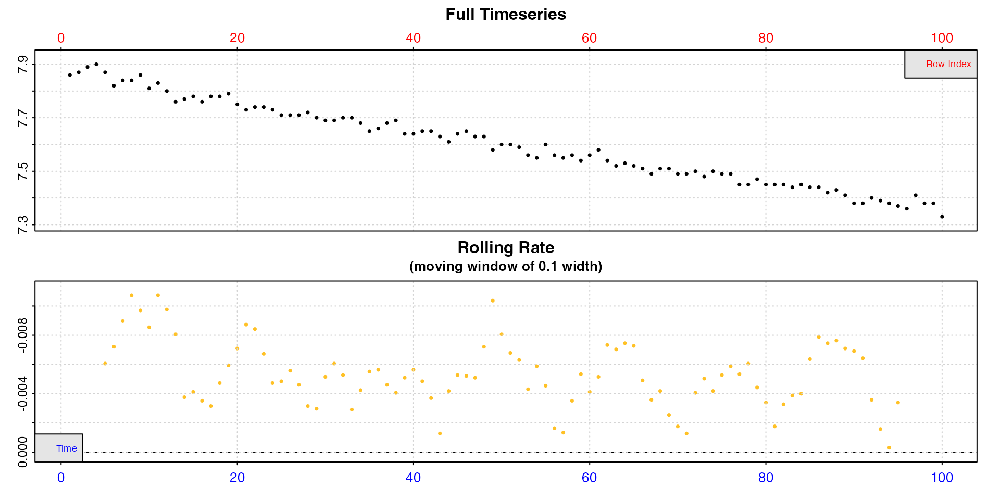

Now the saved object `insp` can be passed to functions such as
[`calc_rate()`](https://januarharianto.github.io/respR/reference/calc_rate.md).

## Inf/-Inf

The next most important check is for infinite (or minus infinite)
values. Some oxygen sensing systems add these in error when interference
or data dropouts occur. Infinite values will cause problems when it
comes to calculating rates, so need to be removed.

### Example

This datasets contains an infinite oxygen value.

``` r
inspect(data)
#> inspect: Applying column default of 'time = 1'
#> inspect: Applying column default of 'oxygen = 2'
#> Warning: inspect: Inf/-Inf values detected in Oxygen column(s). Remove or replace before proceeding.
#> inspect: Data issues detected. For more information use print().
#> 
#> # print.inspect # -----------------------
#>                 Time Oxygen
#> numeric         pass   pass
#> Inf/-Inf        pass   WARN
#> NA/NaN          pass   pass
#> sequential      pass      -
#> duplicated      pass      -
#> evenly-spaced   pass      -
#> 
#> Inf/-Inf locations in Oxygen column: Oxygen 
#> [1] 22
#> -----------------------------------------
```

We can see a warning, and the output also lists the locations (row
numbers) of the `Inf` values (up to the first 20), and we can use this
to view it and check.

``` r
data[20:25,]
#>     Time Oxygen Temperature
#>    <int>  <num>       <num>
#> 1:   520   95.3        15.1
#> 2:   521   95.0        15.0
#> 3:   522    Inf        15.1
#> 4:   523   95.2        15.1
#> 5:   524   95.2        15.1
#> 6:   525   95.3        15.1
```

### Remedies

Infinite values **must** be removed or replaced, or it will severely
affect rate calculations, and may have other unknown effects in
subsequent functions. Depending on how many, where they occur, etc., the
appropriate way to do this will vary. Here, we could remove the row
entirely, but since it is a single value we can just replace it with an
intermediate value which won’t affect rate calculations.

``` r
data[22,2] <- (data[21,2] + data[23,2])/2

data[20:25,]
#>     Time Oxygen Temperature
#>    <int>  <num>       <num>
#> 1:   520   95.3        15.1
#> 2:   521   95.0        15.0
#> 3:   522   95.1        15.1
#> 4:   523   95.2        15.1
#> 5:   524   95.2        15.1
#> 6:   525   95.3        15.1

insp <- inspect(data)
#> inspect: Applying column default of 'time = 1'
#> inspect: Applying column default of 'oxygen = 2'
#> inspect: No issues detected while inspecting data frame.
#> 
#> # print.inspect # -----------------------
#>                 Time Oxygen
#> numeric         pass   pass
#> Inf/-Inf        pass   pass
#> NA/NaN          pass   pass
#> sequential      pass      -
#> duplicated      pass      -
#> evenly-spaced   pass      -
#> 
#> -----------------------------------------
```

Now the saved object `insp` can be passed to functions such as
[`calc_rate()`](https://januarharianto.github.io/respR/reference/calc_rate.md).

## NA/NaN

The third check is to look for missing data, that is `NA` or `NaN`
values. This is perhaps the most common issue encountered when importing
raw respirometry data files into `R`. Many oxygen probe systems or
computers struggle with high recording frequencies, experience probe
dropouts, suffer interference, or other issues, and the typical practice
is to fill the resulting data gaps with `NA` or `NaN`.

`respR` has been designed to work with `NA` values in datasets, so
analysing data with `NA/NaN` values should not lead to any major issues,
unless they occur over large regions of the data. `respR` relies on
linear regressions on exact data values to calculate rates, and `NA/NaN`
values are simply ignored, so do not affect slopes and therefore
calculated rates. However, we would strongly recommend that to be
completely confident in any results, and avoid obscure errors, `NA/NaN`
values be removed or replaced where possible before proceeding.

If `inspect` finds `NA/NaN` data, it outputs the locations (row numbers)
to assist with removing or filling them.

### Example

This dataset has two columns of oxygen, one with a single `NA` and one
with a larger chunk of values missing.

``` r
insp <- inspect(df, time = 1, oxygen = 2:3, plot = FALSE)
```

    #> 
    #> # print.inspect # -----------------------
    #>                 time oxy1 oxy2
    #> numeric         pass pass pass
    #> Inf/-Inf        pass pass pass
    #> NA/NaN          pass WARN WARN
    #> sequential      pass    -    -
    #> duplicated      pass    -    -
    #> evenly-spaced   pass    -    -
    #> 
    #> NA/NaN locations in Oxygen column: oxy1 
    #> [1] 23
    #> NA/NaN locations in Oxygen column: oxy2 
    #> [1] 57 58 59 60 61
    #> -----------------------------------------

The output console message gives a warning and prints the locations (up
to the first 20) of the missing values in the respective column.

### Remedies

The locations can also be found in the output object in the `$locs`
element with the name of the column.

``` r
insp$locs$oxy1$`NA/NaN`
#> [1] 23

insp$locs$oxy2$`NA/NaN`
#> [1] 57 58 59 60 61
```

These can be used to extract or fill the missing values, or simply
remove these rows. See above [example](#inffix).

## Sequential Time

This check is performed on the `time` column only.

Numeric time values are expected to be sequential, that is increasing in
value. A failure of this check could be an indication of problems
importing the file or of converting date-time values to numeric time
using
[`format_time()`](https://januarharianto.github.io/respR/reference/format_time.md)
or other methods. This check helps flag up that *something* might have
occurred to make this happen on import or processing, and might point to
a larger problem that needs investigating.

Non-sequential time values could cause unknown issues, so to be fully
confident in results and avoid obscure errors, we would strongly
recommend the data be amended to be sequential.

### Example

This imported dataset contains time~oxygen data values, but no numeric
time.

``` r
print(data)
```

    #> Warning in import_file("zebrafish.csv"): NOTE: 'import_file' function has been deprecated, will not be updated, and will be removed in a future version of 'respR'.
    #> 
    #> # import_file # -------------------------
    #> Firesting-Pyro file detected
    #> -----------------------------------------
    #>          Time Comment Temperature Oxygen_Data_Ch_1
    #>        <char>  <lgcl>       <num>            <num>
    #>   1: 23:50:02      NA        13.5             9.79
    #>   2: 23:50:04      NA        13.5             9.79
    #>   3: 23:50:06      NA        13.5             9.79
    #>   4: 23:50:08      NA        13.5             9.78
    #>   5: 23:50:10      NA        13.5             9.79
    #>  ---                                              
    #> 490: 00:06:20      NA        13.5             9.56
    #> 491: 00:06:22      NA        13.5             9.55
    #> 492: 00:06:24      NA        13.5             9.55
    #> 493: 00:06:26      NA        13.5             9.55
    #> 494: 00:06:28      NA        13.5             9.54

This is a small section of a real experiment where oxygen was recorded
every 2 seconds. Note how the Firesting-Pyro system has exported times,
*but not dates*, and that they cross over midnight.

We will use the `lubridate()` package to convert the times to numeric.
The details are not that important, but briefly the times are converted
to a date-time format R understands, then an elapsed time from the first
entry is calculated.

``` r
# parse to posix
data$parsed_time <- lubridate::parse_date_time(data[[1]], "HMS")
# convert to numeric difference in seconds from start
data$num_time <- as.numeric(difftime(data[[5]], data[[1,5]], units = "secs"))

# check
head(data)
#>        Time Comment Temperature Oxygen_Data_Ch_1         parsed_time num_time
#>      <char>  <lgcl>       <num>            <num>              <POSc>    <num>
#> 1: 23:50:02      NA        13.5             9.79 0000-01-01 23:50:02        0
#> 2: 23:50:04      NA        13.5             9.79 0000-01-01 23:50:04        2
#> 3: 23:50:06      NA        13.5             9.79 0000-01-01 23:50:06        4
#> 4: 23:50:08      NA        13.5             9.78 0000-01-01 23:50:08        6
#> 5: 23:50:10      NA        13.5             9.79 0000-01-01 23:50:10        8
#> 6: 23:50:12      NA        13.5             9.78 0000-01-01 23:50:12       10
```

Now we inspect the data using the new numeric time

``` r
inspect(data, time = 6, oxygen = 4)
#> Warning: inspect: Non-sequential Time values found.
#> Warning: inspect: Time values are not evenly-spaced (numerically).
#> inspect: Data issues detected. For more information use print().
#> 
#> # print.inspect # -----------------------
#>                 num_time Oxygen_Data_Ch_1
#> numeric             pass             pass
#> Inf/-Inf            pass             pass
#> NA/NaN              pass             pass
#> sequential          WARN                -
#> duplicated          pass                -
#> evenly-spaced       WARN                -
#> 
#> Non-sequential Time data locations in column: num_time 
#> [1] 299
#> Uneven Time data locations in column: num_time 
#> [1] 299
#> Minimum and Maximum intervals in uneven Time data: 
#> [1] -86398      2
#> -----------------------------------------
```

Clearly there is something wrong, and the location where non-sequential
time data has been found is row 299. The issue has also caused the
evenly-spaced time check (see [here](#evencheck)) to fail, which we will
cover later. Often the same issue will cause more than one check to
fail.

If we look at this region, it is clear what the problem is.

``` r
data[297:302,]
#>        Time Comment Temperature Oxygen_Data_Ch_1         parsed_time num_time
#>      <char>  <lgcl>       <num>            <num>              <POSc>    <num>
#> 1: 23:59:54      NA        13.6             9.99 0000-01-01 23:59:54      592
#> 2: 23:59:56      NA        13.6             9.98 0000-01-01 23:59:56      594
#> 3: 23:59:58      NA        13.5             9.99 0000-01-01 23:59:58      596
#> 4: 00:00:00      NA        13.6             9.99 0000-01-01 00:00:00   -85802
#> 5: 00:00:02      NA        13.6             9.99 0000-01-01 00:00:02   -85800
#> 6: 00:00:04      NA        13.6            10.00 0000-01-01 00:00:04   -85798
```

Where times have crossed midnight, our code has failed to parse it
correctly. The lack of dates along with times means we have incorrectly
calculated the elapsed time.

### Remedies

If this particular issue is detected, it is usually an indication of a
deeper problem, so the actual remedy will depend on the situation, from
editing the original data file, to various solutions within R, such as
reordering rows.

Here, we can simply use the `respR` function
[`format_time()`](https://januarharianto.github.io/respR/reference/format_time.md)
(see also
[`vignette("format_time")`](https://januarharianto.github.io/respR/articles/format_time.md)),
which has been designed to detect and fix this specific problem of times
which cross midnight but have no date attached. `format_time` parses and
converts the times to numeric and adds them as a new column.

    #> Warning in import_file("zebrafish.csv"): NOTE: 'import_file' function has been deprecated, will not be updated, and will be removed in a future version of 'respR'.

``` r
data <- format_time(data, time = 1, format = "HMS")
#> Times cross midnight, attempting to parse correctly...

data[297:302,]
#>        Time Comment Temperature Oxygen_Data_Ch_1 time_num
#>      <char>  <lgcl>       <num>            <num>    <num>
#> 1: 23:59:54      NA        13.6             9.99      593
#> 2: 23:59:56      NA        13.6             9.98      595
#> 3: 23:59:58      NA        13.5             9.99      597
#> 4: 00:00:00      NA        13.6             9.99      599
#> 5: 00:00:02      NA        13.6             9.99      601
#> 6: 00:00:04      NA        13.6            10.00      603
```

If we `inspect` again, the problem is fixed.

``` r
inspect(data, time = 5, oxygen = 4)
#> inspect: No issues detected while inspecting data frame.
#> 
#> # print.inspect # -----------------------
#>                 time_num Oxygen_Data_Ch_1
#> numeric             pass             pass
#> Inf/-Inf            pass             pass
#> NA/NaN              pass             pass
#> sequential          pass                -
#> duplicated          pass                -
#> evenly-spaced       pass                -
#> 
#> -----------------------------------------
```

## Duplicate Time

This check is performed on the `time` column only.

Duplicate time values can result from rounding time values, or the
system accidentally recording two values close together, or some other
issues causing values to be repeated or duplicated.

This warning is not necessarily a major issue. `respR` relies on linear
regressions on time~oxygen paired data values to calculate rates. When
fitting linear regressions, duplicates will not affect results so as
long as the data are genuine values. However, the check flags up that
*something* might have occurred to make this happen on import or
processing, and might point to a larger problem.

### Example 1

This dataset has been recorded at approximately 1 second intervals, but
at 0.1s precision, and when rounded to the nearest second this leads to
lots of duplicated values.

``` r
## original data
head(data_orig, 5)
#>   times  oxy
#> 1   1.1 7.20
#> 2   2.5 7.21
#> 3   4.0 7.15
#> 4   5.0 7.13
#> 5   5.8 7.18

## Before rounding
head(data_orig$times, 10)
#>  [1]  1.1  2.5  4.0  5.0  5.8  6.7  7.8  8.0  9.9 11.0
## After rounding to nearest second
head(data_round$times, 10)
#>  [1]  1  2  4  5  6  7  8  8 10 11
```

``` r
inspect(data_round)
```

    #> 
    #> # print.inspect # -----------------------
    #>                 times  oxy
    #> numeric          pass pass
    #> Inf/-Inf         pass pass
    #> NA/NaN           pass pass
    #> sequential       pass    -
    #> duplicated       WARN    -
    #> evenly-spaced    WARN    -
    #> 
    #> Duplicate Time data locations (first 20 shown) in column: times 
    #>  [1]  7  8 10 11 13 14 21 22 30 31 33 34 36 37 40 41 44 45 48 49
    #> Uneven Time data locations (first 20 shown) in column: times 
    #>  [1]  2  7  8 10 11 13 18 21 29 30 31 33 34 36 37 40 43 44 46 48
    #> Minimum and Maximum intervals in uneven Time data: 
    #> [1] 0 2
    #> -----------------------------------------

### Remedies

In this case, `inspect` produces a duplicate times warning, however it
can be safely ignored. These values are perfectly valid at this
precision, and when it comes to fitting linear regressions and
calculating rates will not realistically affect rate calculations.
However, an alternative option would be to not round the times at all;
`respR` will happily accept any form of numeric decimalised time value.

### Example 2

This dataset by contrast contains several duplicated rows. The `inspect`
call detects and identifies these, allowing them to be checked or
amended.

``` r
insp <- inspect(data)
```

    #> 
    #> # print.inspect # -----------------------
    #>                 Time Oxygen
    #> numeric         pass   pass
    #> Inf/-Inf        pass   pass
    #> NA/NaN          pass   pass
    #> sequential      pass      -
    #> duplicated      WARN      -
    #> evenly-spaced   WARN      -
    #> 
    #> Duplicate Time data locations in column: Time 
    #>  [1] 101 102 103 104 105 106 107 108 109 110
    #> Uneven Time data locations in column: Time 
    #> [1] 101 102 103 104 105 106 107 108 109
    #> Minimum and Maximum intervals in uneven Time data: 
    #> [1] 0 1
    #> -----------------------------------------

We can check these rows by extracting the relevant locations from the
`$locs` element of the saved output, and we see that for some reason the
row has been duplicated.

``` r
dupes <- insp$locs$Time$duplicated

data[dupes,]
#>      Time Oxygen Temperature
#>     <int>  <num>       <num>
#>  1:  2100   93.7        14.5
#>  2:  2100   93.7        14.5
#>  3:  2100   93.7        14.5
#>  4:  2100   93.7        14.5
#>  5:  2100   93.7        14.5
#>  6:  2100   93.7        14.5
#>  7:  2100   93.7        14.5
#>  8:  2100   93.7        14.5
#>  9:  2100   93.7        14.5
#> 10:  2100   93.7        14.5
```

### Remedies

Like other checks, if or how to amend this issue will depend on the
situation. Here, these duplicate rows could affect rate calculations, if
for instance we are determining rates over a specific row width across
the dataset (by contrast a rate using a `time` width would be
unaffected). They could also affect other reported outputs such as the
r-squared. It’s probably easiest to just remove them, and `inspect` the
data again.

``` r
## Remove all but the first duplicate row
data <- data[-dupes[-1],]

## inspect again
inspect(data)
#> inspect: Applying column default of 'time = 1'
#> inspect: Applying column default of 'oxygen = 2'
#> inspect: No issues detected while inspecting data frame.
#> 
#> # print.inspect # -----------------------
#>                 Time Oxygen
#> numeric         pass   pass
#> Inf/-Inf        pass   pass
#> NA/NaN          pass   pass
#> sequential      pass      -
#> duplicated      pass      -
#> evenly-spaced   pass      -
#> 
#> -----------------------------------------
```

## Evenly Spaced Time

Depending on the time metric, this is perhaps the most frequently seen
warning. Generally, respirometry data are recorded at regular intervals.
Any irregular intervals between time values are an indication that
something might have gone wrong: the system stopped recording for a
period, some data were lost when imported, rows were removed
accidentally, or some other reason. The purpose of this check is to find
and report any such gaps in the data. If these are found, the locations
are returned, and in addition the maximum and minimum intervals in the
time data.

### Example 1

One reason this check might produce warnings is through use of a metric
such as decimalised minutes. For example, data recorded once per second,
but converted to minutes is used in the `flowthrough_mult.rd` example
data.

``` r
# seconds in decimal minutes
head(flowthrough_mult.rd[[1]])
#> [1] 0.02 0.03 0.05 0.07 0.08 0.10

# difference between each value
diff(head(flowthrough_mult.rd[[1]]))
#> [1] 0.01 0.02 0.02 0.01 0.02
```

These have been converted to minutes and rounded, and we can see the
intervals are not numerically consistent. This will cause this check to
produce a warning in `inspect`.

``` r
inspect(flowthrough_mult.rd)
#> inspect: Applying column default of 'time = 1'
#> inspect: Applying column default of 'oxygen = 2'
#> Warning: inspect: Time values are not evenly-spaced (numerically).
#> inspect: Data issues detected. For more information use print().
#> 
#> # print.inspect # -----------------------
#>                 num.time oxy.out.1
#> numeric             pass      pass
#> Inf/-Inf            pass      pass
#> NA/NaN              pass      pass
#> sequential          pass         -
#> duplicated          pass         -
#> evenly-spaced       WARN         -
#> 
#> Uneven Time data locations (first 20 shown) in column: num.time 
#>  [1]  1  2  3  4  5  6  7  8  9 10 11 12 13 14 15 16 17 18 19 20
#> Minimum and Maximum intervals in uneven Time data: 
#> [1] 0.01 0.02
#> -----------------------------------------
```

### Remedies

While there are too many locations printed here to get a handle on if
there are *actual* gaps in the data, the additional print out of the
minimum and maximum time intervals tells us the intervals are what we
would expect with these time values, so in the case of these data they
are fine to pass to subsequent functions.

### Example 2

If there were a larger time gap in the data, this check would flag it
up. This dataset is missing a large number of rows.

``` r
insp <- inspect(data)
```

    #> 
    #> # print.inspect # -----------------------
    #>                 Time   O2
    #> numeric         pass pass
    #> Inf/-Inf        pass pass
    #> NA/NaN          pass pass
    #> sequential      pass    -
    #> duplicated      pass    -
    #> evenly-spaced   WARN    -
    #> 
    #> Uneven Time data locations in column: Time 
    #> [1] 341
    #> Minimum and Maximum intervals in uneven Time data: 
    #> [1]  1 47
    #> -----------------------------------------

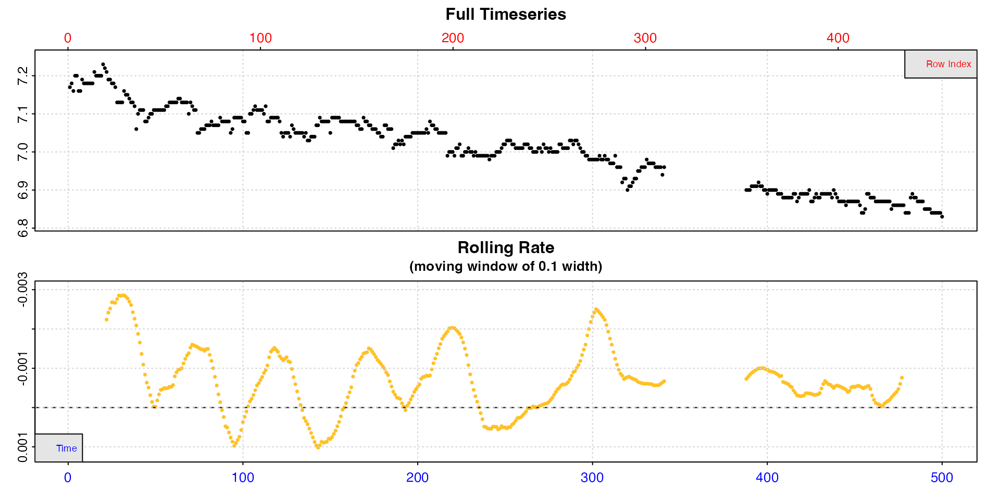

While there is only one time gap location at row 341, we can see this is
a large gap of 47 seconds.

``` r
data[340:344, ]
#>     Time    O2
#>    <int> <num>
#> 1:   340  6.94
#> 2:   341  6.96
#> 3:   388  6.90
#> 4:   389  6.90
#> 5:   390  6.90
```

### Remedies

Like many of the issues, if or how to fix this depends on the context.
In this case it may have been an accidental deletion or importing
problem. However, you can still calculate rates across these gaps, which
will be perfectly reportable, as long as care is taken to understand the
implications of doing this.

### Calculating rates across gaps

[`calc_rate()`](https://januarharianto.github.io/respR/reference/calc_rate.md)
allows you to calculate a rate using a `"row"` or `"time"` interval. In
this dataset, because the time is in seconds and recording interval once
per second, they are therefore equivalent to the row numbers. Any rates
calculated in a complete region of the data before the gap will be
identical for either method.

``` r
cr_row <- calc_rate(data, 100, 300, "row")
cr_time <- calc_rate(data, 100, 300, "time")
```

``` r
summary(cr_row)
#> 
#> # summary.calc_rate # -------------------
#> Summary of all rate results:
#> 
#>    rep rank intercept_b0  slope_b1   rsq row endrow time endtime  oxy endoxy rate.2pt      rate
#> 1:  NA    1         7.14 -0.000489 0.645 100    300  100     300 7.08   6.98  -0.0005 -0.000489
#> -----------------------------------------
summary(cr_time)
#> 
#> # summary.calc_rate # -------------------
#> Summary of all rate results:
#> 
#>    rep rank intercept_b0  slope_b1   rsq row endrow time endtime  oxy endoxy rate.2pt      rate
#> 1:  NA    1         7.14 -0.000489 0.645 100    300  100     300 7.08   6.98  -0.0005 -0.000489
#> -----------------------------------------
```

This will not be the case across the gap, or *after* it where row
numbers will now *not* be equivalent to the time values.

``` r
cr_row <- calc_rate(data, 200, 400, "row")
```

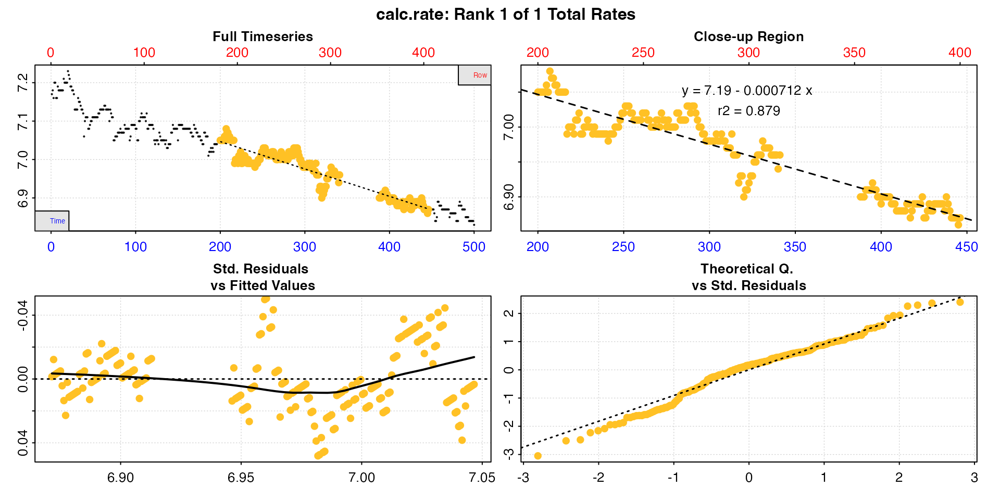

``` r
cr_time <- calc_rate(data, 200, 400, "time")
```

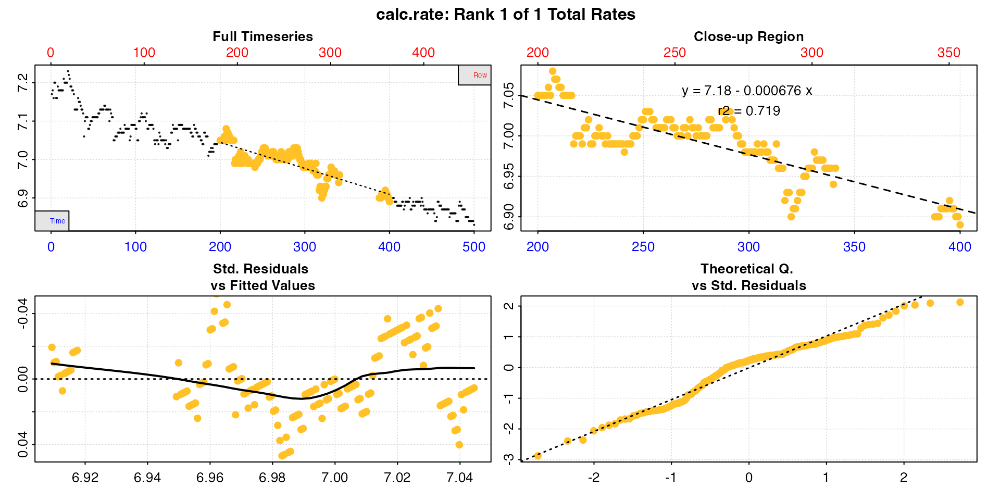

``` r
summary(cr_row)
#> 
#> # summary.calc_rate # -------------------
#> Summary of all rate results:
#> 
#>    rep rank intercept_b0  slope_b1   rsq row endrow time endtime  oxy endoxy  rate.2pt      rate
#> 1:  NA    1         7.19 -0.000712 0.879 200    400  200     446 7.05   6.87 -0.000732 -0.000712
#> -----------------------------------------
summary(cr_time)
#> 
#> # summary.calc_rate # -------------------
#> Summary of all rate results:
#> 
#>    rep rank intercept_b0  slope_b1   rsq row endrow time endtime  oxy endoxy rate.2pt      rate
#> 1:  NA    1         7.18 -0.000676 0.719 200    354  200     400 7.05   6.89  -0.0008 -0.000676
#> -----------------------------------------
```

Note how the interval is correct in the respective metric, but now
differs in the other.

Either of these is reportable depending on the research question or rate
determination criteria, and a ‘correct’ rate in their own right. If
however, for example, you want to report a rate across a consistent time
window, the `by = "row"` result, while an accurate rate for that row
interval, does not conform to the expected time window.

Such gaps may also affect rolling rate determinations, such as in the
[`auto_rate()`](https://januarharianto.github.io/respR/reference/auto_rate.md)
function, if done using `by = "row"`.

Note also, because of the missing rows, all rows *after* the gap will
not conform to the same time values, although as long as they don’t
include the gap will represent an equivalent time *window*.

## Plot

When using `inspect`, a plot of the inspected data is produced (unless
`plot = FALSE`), against both time (bottom blue axis) and row index (top
red axis).

The top plot is the complete timeseries of oxygen against time. The
bottom plot is a rolling regression plot. This shows the rate of change
in oxygen across a rolling window specified using the `width` operator
(default is `width = 0.1`, or 10% of the entire dataset). Each rate
value is plotted against the centre of the time window used to calculate
it. This plot provides a quick visual inspection of how the rate varies
over the course of the experiment. Regions of stable and consistent
rates can be identified on this plot as flat or level areas. This plot
is for exploratory purposes only; later functions allow rate to be
calculated over specific regions.

Note, that because `respR` is primarily used to examine oxygen
consumption, the rolling rate plot is plotted on a reverse y-axis. In
`respR` oxygen uptake rates are negative since they represent a negative
slope of oxygen against time. In rolling rate plots, by default the axis
is reversed so that higher uptake rates (e.g. maximum or active rates)
will be higher on these plots. If you are interested instead in oxygen
production rates, which are positive, the `rate.rev = FALSE` input can
be passed in either the `inspect` call, or when using
[`plot()`](https://rdrr.io/r/graphics/plot.default.html) on the output
object. In this case, the rate values will be plotted not reversed, with
higher oxygen *production* rates higher on the plot.

### Rolling rate plot

Some datasets may benefit from changing the `width` to get a better idea
of how the rate fluctuates across the data. This is helpful to inform
the regions from which to extract rates in later functions, as well as
an appropriate time or row window to use when extracting rates.

``` r
## default width of 10%
inspect(sardine.rd)
```

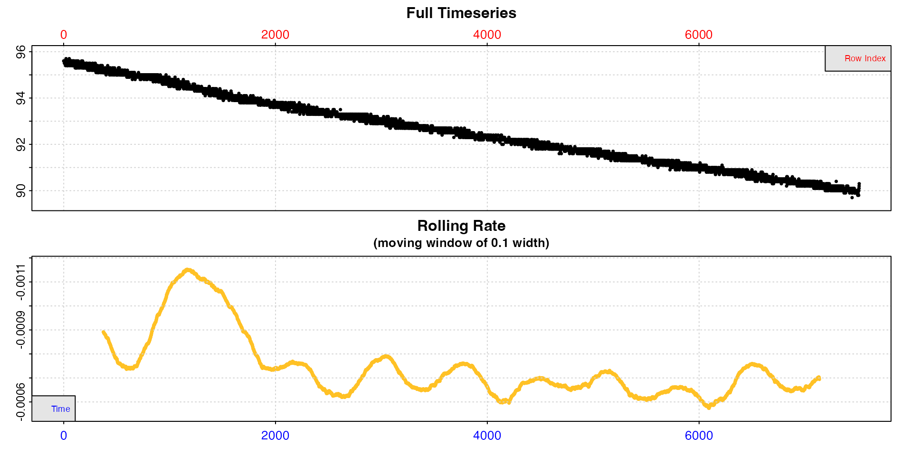

In these data, after an initial unstable period rates seem to stabilise,
but there is still a lot of variability, with rates fluctuating between
around -0.0006 and -0.0008.

``` r
## width of 20%
inspect(sardine.rd, width = 0.2)
```

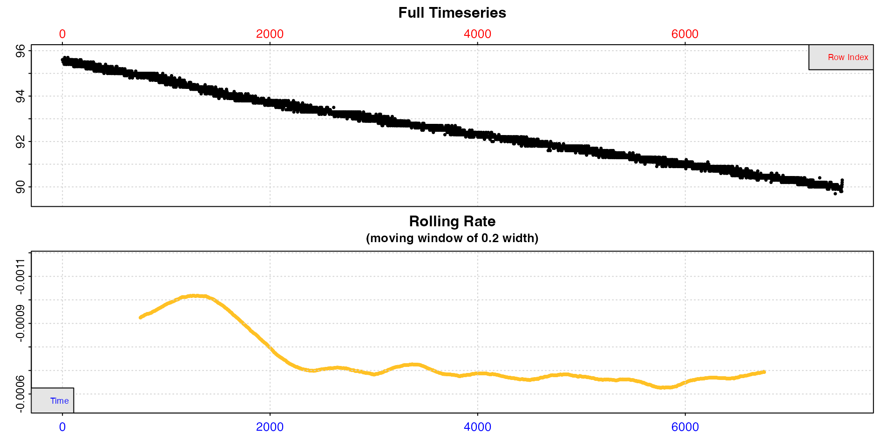

With a higher `width` rates after the initial period are much more
stable. This tells us (presuming we are interested in routine rates)
that we probably want to extract rates from after timepoint 2000, should
not use a time window shorter than around 20% of the total data length,
and that our extracted rate should be around -0.0007.

If we are interested in the very lowest rate, it seems to occur just
before timepoint 6000 (although see
[`auto_rate()`](https://januarharianto.github.io/respR/reference/auto_rate.md)
for extracting the lowest rates).

### Intermittent-flow data

Note, intermittent-flow data will include rates across flush periods,
which can skew results, and possibly make the output difficult to
interpret.

``` r
inspect(intermittent.rd)
```

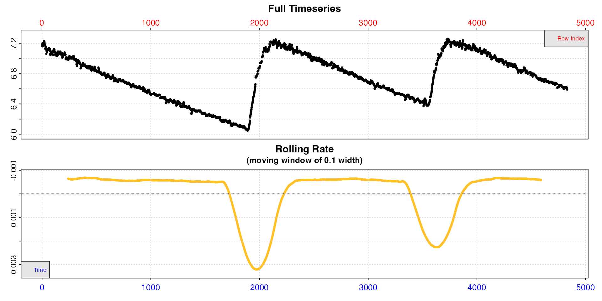

Here the flushes skew the rolling rates, but within each replicate rates
seem to be a consistent value of around -0.0005.

However, you can always use `inspect` without saving the result for a
closer look at regions of the data, though note the `width` input will
apply to the subset, not the original data length.

``` r
inspect(intermittent.rd[1:1800,])
```

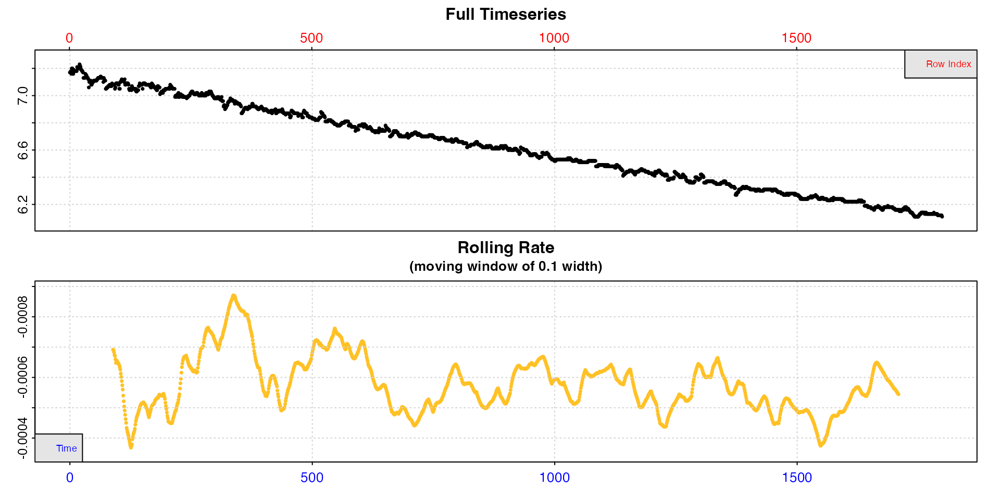

### Inspect portions of long experiments

For really long experiments, both the timeseries and rolling rate plot
may be difficult to interpret. This experiment on a zebra fish is 22h
long and nearly 80000 rows.

``` r
inspect(zeb_intermittent.rd)
```

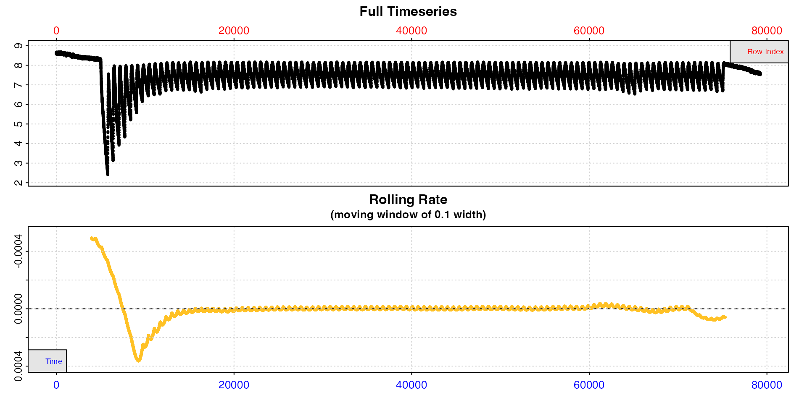

`inspect` can be used without saving the result for a closer look at
smaller regions of the data, to better see what is going on.

``` r
inspect(zeb_intermittent.rd[20000:24000,])
```

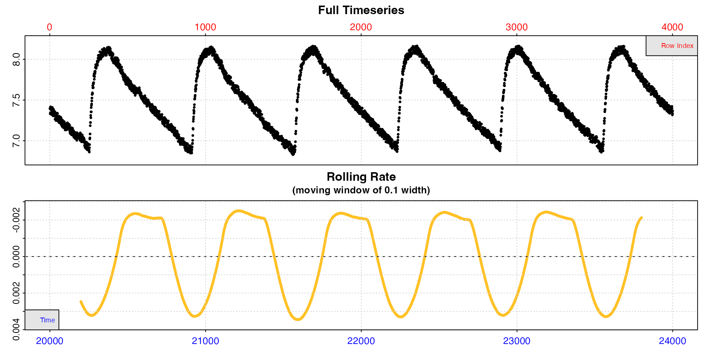

This better shows us the structure of this intermittent-flow experiment.
Within these replicates specimen rates appear to be consistent at around
-0.002, but note this may not be accurate because the rolling rate
window might include the flush which will skew rate values. When subset
like this, the `width` operator refers to the length of the subset not
the original data.

### Multiple columns of oxygen data

For a quick overview of larger datasets, multiple oxygen columns can be
inspected by using the `oxygen` input to select multiple columns. These
must share the same `time` column. In this case, data checks are
performed, with a plot of each oxygen time series, but no rolling rate
plot is produced. All data are plotted on the same axis range of both
time and oxygen (total range of data).

This is chiefly exploratory functionality to allow for a quick overview
of a dataset. Note, that if it is saved the output `inspect` object will
contain all columns in its `$dataframe` element, but subsequent
functions in `respR` (`calc_rate`, `auto_rate`, etc.) will by default
only use the *first two* columns (`time`, and the first specified
`oxygen` column). To analyse and determine rates from different columns,
best practice is to inspect and assign each time-oxygen column pair as
separate `inspect` objects.

``` r
inspect(urchins.rd, time = 1, oxygen = 8:19)
```

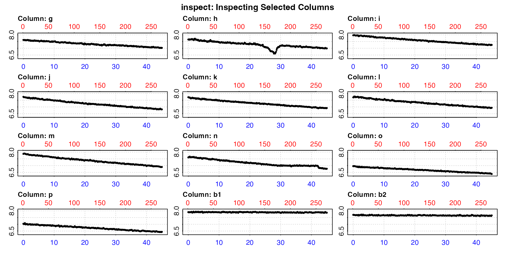

This gives us a quick visual overview of the dataset, allowing us to,
for example, see the experiments which have some sort of issues, and
which are controls (the last two here).

### Plot an additional data type

By using the `add.data` input an additional data source (for example
temperature) can be plotted in alongside the oxygen timeseries to help
with understanding where rates may or may not have fluctuated. This
input indicates a column number in the same input data frame sharing the
same time data. This column is not passed through the above checks. It
is a visual aid only to help with selection of regions from which to
extract rates.

``` r
## Plot column 4 (temperature) alongside oxygen timeseries
inspect(sardine.rd, time = 1, oxygen = 2, add.data = 3)
```

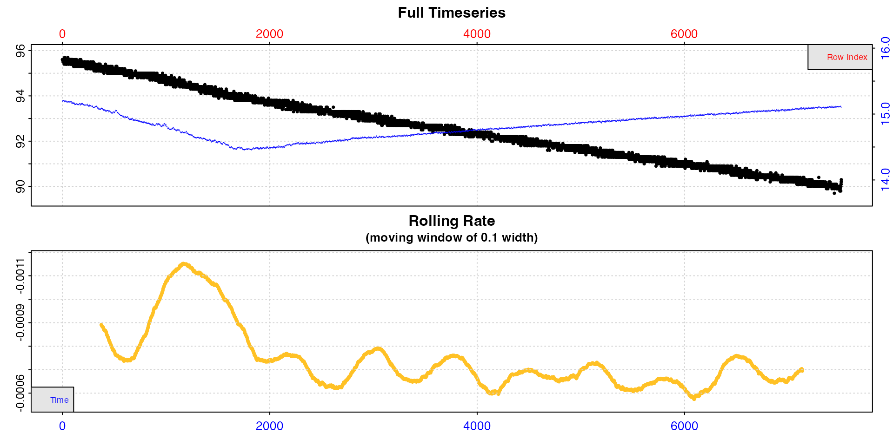

### Additional plotting options

Additional plotting controls can be passed in either the main `inspect`
call or when using
[`plot()`](https://rdrr.io/r/graphics/plot.default.html) on the output
object.

Most notable is `rate.rev = FALSE`. This means rates in the rolling rate
plot will be plotted on a normal y-axis, that is not reversed. This
allows oxygen production rates to be plotted correctly, with higher
rates appearing higher on the plot.

If axis labels obscure parts of the plot they can be suppressed using
`legend = FALSE`. Console output messages can be suppressed with
`quiet = TRUE` (in
[`plot()`](https://rdrr.io/r/graphics/plot.default.html) only). Lastly,
a different `width` value can be passed to see how it affects the
rolling rate plot.

In addition, the generic [`par()`](https://rdrr.io/r/graphics/par.html)
inputs `oma`, `mai`, `tck`, `mgp`, `las`, and `pch` are accepted via
`...` to allow default parameters to be changed. Particularly useful are
`las = 1` to make axis labels horizontal and adjusting the second (left
side) of the four `mai` (inner margins) input to make y-axis labels more
readable.

This example examining oxygen production in algae uses some of these
options.

``` r
inspect(algae.rd, time = 1, oxygen = 2, width = 0.4,
        legend = FALSE, rate.rev = FALSE, 
        las = 1, mai = c(0.3, 0.35, 0.35, 0.15))
```

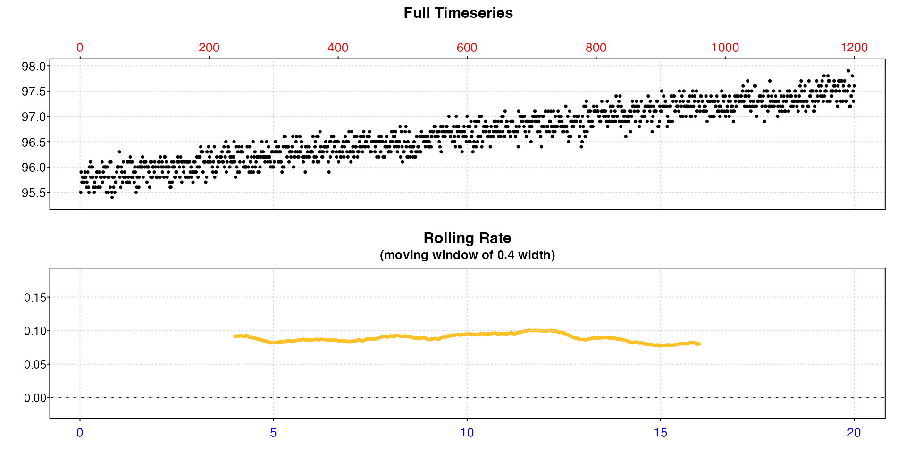
