# Intermittent-flow respirometry: Long experiment

This vignette shows a intermittent-flow analysis from a lengthy
experiment, with over 100 replicates and a background rate that changes
over the course of the experiment. This type of experiment is one many
fish physiologists in particular will be familiar with.

The example data (`zeb_intermittent.rd`) was kindly provided by
[Dr. Davide Thambithurai](https://twitter.com/thambithuraid), and is
from an experiment on a zebrafish. It is comprised of one replicate of
14 minutes duration (12 minutes recording, 2 minutes flushing), followed
by 105 replicates of 11 minutes duration (9 minutes recording, 2 minutes
flushing). In addition there are pre- and post-experiment background
recordings. See
[`help(zeb_intermittent.rd)`](https://januarharianto.github.io/respR/reference/zeb_intermittent.rd.md)
for row locations of all stages.

See
[`vignette("intermittent_short")`](https://januarharianto.github.io/respR/articles/intermittent_short.md)
for an example with a smaller dataset, which covers in more detail the
basics of analysing intermittent-flow data and is a better starting
point if you are new to `respR` or analysing these types of experiment.
Even if not, we would recommend reading both before starting your
analysis.

## Experiment overview

From this experiment dataset we want to extract several metrics:

1.  *Pre- and post-experiment background rates*. Background rates were
    recorded at the start and end of the experiment (initial and end
    sections with shallow slopes). This was a lengthy experiment in high
    temperatures, and so the microbial background rate increases
    substantially over the course of the experiment. We will assume this
    increase is constant (i.e. linear), and each replicate rate will be
    adjusted with a background rate calculated according its time within
    the experiment. That is, later replicates will be adjusted by a
    greater amount.

2.  *Maximum metabolic rate (MMR)*. Before this experiment the fish had
    been exercised to exhaustion, then immediately placed in the
    respirometer. The first replicate during which it is recovering from
    the accrued oxygen debt will represent MMR.

3.  *Routine metabolic rate (RMR)*. This will be calculated using the
    later replicates once the animal has recovered from the exercise.
    This is generally defined as the routine use of oxygen to fuel basal
    metabolism and minor spontaneous movements for maintaining station
    or posture.

4.  *Standard metabolic rate (SMR)*. Sometimes also known as basal or
    minimum metabolic rate. This is also calculated using the later
    replicates once the animal has recovered. This is generally defined
    as the lowest oxygen use rates observed, which are representative of
    the requirements of basal metabolism only.

Which of these last two metrics is valid or appropriate to report
depends on the organism and the circumstances and aims of the
experiments. Their definitions are widely debated, and there is a huge
literature on the differences between these physiological metrics. See
[here](https://januarharianto.github.io/respR/articles/refs.html#references)
for some papers discussing these. Here, we will show how to extract what
may be regarded as both RMR and SMR from this dataset.

## Analysis methods

Extracting the [background](#background) rates and [MMR](#mmr) are
relatively straightforward and will be covered in their own sections.

After this, we will show two different approaches to extract RMR and SMR
using `respR` functions. The [first](#crint) uses the dedicated
[`calc_rate.int()`](https://januarharianto.github.io/respR/reference/calc_rate.int.md)
function to run `calc_rate` on each replicate to extract a rate from the
same data region of each, before filtering these to get the RMR. The
[second](#arint) uses the dedicated
[`auto_rate.int()`](https://januarharianto.github.io/respR/reference/auto_rate.int.md)
function to run `auto_rate` on each replicate to extract the lowest rate
from each of a specified width, before filtering these to get the SMR.

***Please note***: You should not simply copy and repeat the following
code on your own data. They are examples to show how the `respR`
functions are adaptable and flexible and how rates can be extracted,
filtered and selected to arrive at a final reportable rate in a variety
of ways. They are not recommendations that you should use these specific
approaches for particular outputs. There is a [massive
literature](https://januarharianto.github.io/respR/articles/refs.html#references)
around respirometry, the different physiological metrics, and how to
quantify them. Before analysis of your own data you should familiarise
yourself with it, with similar experiments in the literature, and the
current state of best practices in the field. Many factors such as
appropriate regions or widths to extract rates from, method used to
extract rates, and final selection criteria differ between experiments
for very good reasons, in that every study is different. It is important
to select appropriate analysis factors objectively and report them in
your methods. See especially [Killen et
al. (2021)](https://journals.biologists.com/jeb/article/224/18/jeb242522/272132/Guidelines-for-reporting-methods-to-estimate)
and [Prinzing et
al. (2021)](https://januarharianto.github.io/respR/articles/refs.html#references).

Note we use the native pipe operator (`|>`) introduced in [R
v4.1](https://www.r-bloggers.com/2021/05/new-features-in-r-4-1-0/) for
much of the following. These can be substituted for `dpylr` pipes
(`%>%`) if you have not yet updated, or alternatively save output
objects and enter them into the next function.

## Inspecting the data

[`inspect()`](https://januarharianto.github.io/respR/reference/inspect.md)
is the general `respR` function for visualising and inspecting data
prior to analysis, and saving it to an object that can be used in
subsequent functions. This is a very large dataset (nearly 80,000 rows),
so if running the code in this vignette note that operations may take
some time.

Before progressing, we’ll inspect a portion of the data at the start
without saving the result to show the structure.

``` r
zeb_intermittent.rd |>
  subset_data(from = 1, to = 18000, by = "row") |>
  inspect()
```

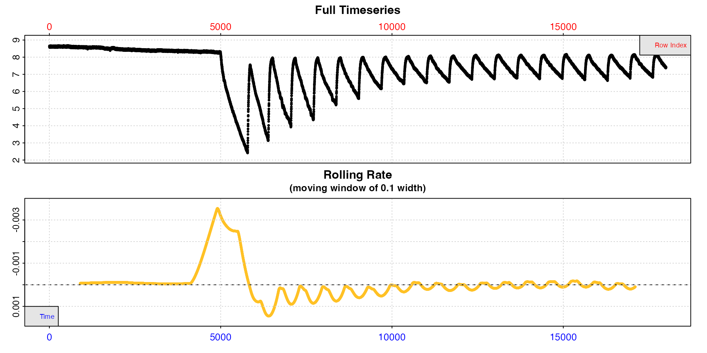

The top plot shows the initial background recording up to row 5000, the
first replicate of 14 minutes duration to determine MMR, followed by
replicates of 11 minutes duration. We can see in these oxygen
decreasing, separated by regular flushes where it increases back to
ambient levels. The bottom plot, a rolling rate across a window of 10%
of the data, is not particularly useful as this window will include
multiple replicates.

We can similarly have a quick look at the end of the dataset.

``` r
zeb_intermittent.rd |>
  subset_data(from = 65000, by = "row") |>
  inspect(width = 0.01)
```

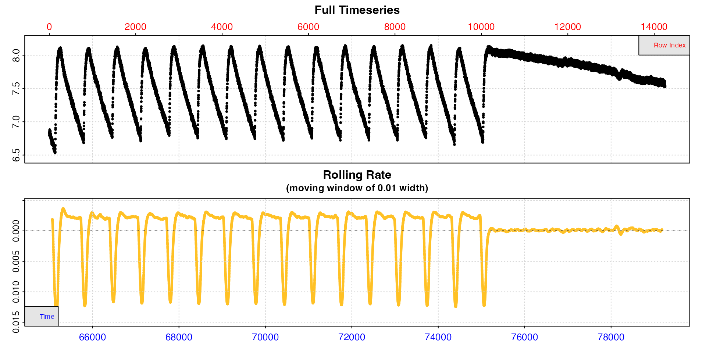

We can see that by the end of the experiment the replicates are much
more regular, suggesting rates have stabilised, and we can also see the
end background recording. This time we passed a different `width` to
`inspect`, so the rolling rate plot is across a 1% window. This makes it
slightly more useful, and we can see within each replicate rates seem to
be consistent at around -0.0025, while the background rate is much lower
and closer to zero (dashed line).

Now that we are fairly satisfied the experiment looks as expected we can
inspect the entire dataset and this time save the result to an object we
will use for the rest of the analysis.

``` r
zeb <- inspect(zeb_intermittent.rd)
```


Here because the dataset is so large the plots are of limited use, but
we can at least see that much more oxygen was used in the early
replicates, as would be expected because the specimen was exercised
prior to the experiment, after which they stabilise and are more
regular.

## Background rates

The initial and end sections of the data will be used to calculate
background rates and how they change over the course of the experiment.
Timepoints of these will typically have been recorded as part of the
experiment, so can be used to subset the relevant sections (see
[`?zeb_intermittent.rd`](https://januarharianto.github.io/respR/reference/zeb_intermittent.rd.md)
for row locations of all stages).

We subset these regions from the `inspect` object we just saved above,
and save them as separate `calc_rate.bg` objects.

``` r
bg_pre <- zeb |>
  subset_data(from = 1, to = 4999, by = "row") |>
  calc_rate.bg()

bg_post <- zeb |>
  subset_data(from = 75140, to = 79251, by = "row") |>
  calc_rate.bg()
```


The two different background rates (only the post-experiment plot is
shown above) have been saved to these two objects. We can see the actual
values by printing them:

``` r
bg_pre
#> 
#> # print.calc_rate.bg # ------------------
#> Background rate(s):
#> [1] -0.0000742
#> Mean background rate:
#> [1] -0.0000742
#> -----------------------------------------
```

``` r
bg_post
#> 
#> # print.calc_rate.bg # ------------------
#> Background rate(s):
#> [1] -0.0001217
#> Mean background rate:
#> [1] -0.0001217
#> -----------------------------------------
```

We can see the background rate increases by around 70% over the course
of the experiment. We will use these later to apply a dynamic background
adjustment to specimen rates based on their time during the experiment.

## MMR

Here we calculate maximum metabolic rate (MMR) from the first replicate.
This replicate is longer than the others; 14 mins (840 rows) vs. 11 mins
(660 rows) for all others.

### Subset

Here, we subset the first replicate which starts at row 5000 and is 14
minutes long (840 rows) to a separate `inspect` object, excluding the
two minutes of flush (120 rows) at the end, and plot it to see how the
rate changes over the replicate.

``` r
# subset rep 1
zeb_rep_1 <- subset_data(zeb, 
                         from = 5000, 
                         to = 5000 + 840 - 120, 
                         by = "row") |>
  plot(width = 0.2)
```

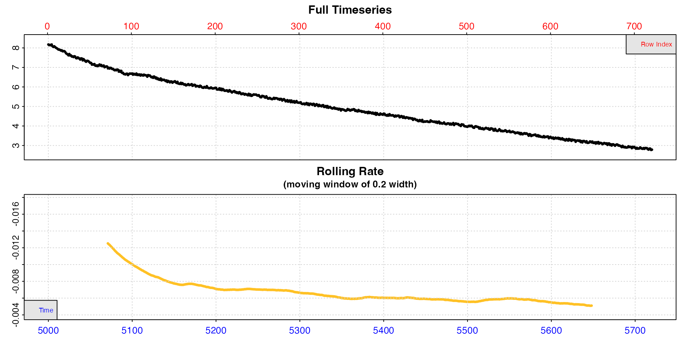

In this replicate, the rolling rate plot shows that calculated at this
particular `width`, the rate declines rapidly from around -0.012 to
around -0.008, then declines more slowly over the course of the
replicate (note we pass a higher `width` than the default 0.1 to smooth
the rolling rate a little more). This is as we would expect from an
animal recovering from exercise. However the very initial stages of
replicates are often unstable and excluded from rate analysis (usually
known as the “wait” phase). Therefore we will probably want to extract
our MMR rate after this initial stage but before it declines too much.

### Extract rates

We will show three different ways of extracting what could be defined as
an MMR. First, we will use
[`calc_rate()`](https://januarharianto.github.io/respR/reference/calc_rate.md)
to extract a rate from a single specific region. Secondly, we will use
the `auto_rate` `"highest"` method to automatically extract the highest
rate of a specific width. Lastly, we will use the `auto_rate` `"linear"`
method with the default inputs to identify linear regions of the data
and choose the highest from amongst these. In this last example we will
also show how to adjust and convert rates, then filter them using
[`select_rate()`](https://januarharianto.github.io/respR/reference/select_rate.md)
to arrive at a final reportable result.

### 1. `calc_rate`

This function (see
[`vignette("calc_rate")`](https://januarharianto.github.io/respR/articles/calc_rate.md))
simply allows you to extract a rate (or multiple rates) from a specified
row, time, or oxygen region. In the [later example](#crint) for
extracting rates from the other replicates using
[`calc_rate.int()`](https://januarharianto.github.io/respR/reference/calc_rate.int.md)
we use the same three minute `wait` phase and five minute `measure`
phase in each replicate. We will use the same here to allow for
comparison with those rates. This is fairly common practice in
respirometry studies and perfectly acceptable, in that it is objective
and consistent.

``` r
zeb_mmr <- calc_rate(zeb_rep_1,
                     from = 180, # three minutes 'wait' after start
                     to = 480,   # five minutes later = 'measure' phase
                     by = "row") |>
  summary()
```

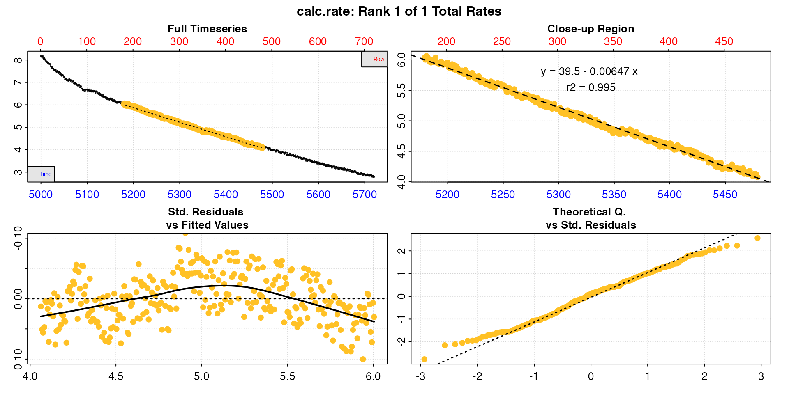

    #> 
    #> # summary.calc_rate # -------------------
    #> Summary of all rate results:
    #> 
    #>    rep rank intercept_b0 slope_b1   rsq row endrow time endtime  oxy endoxy rate.2pt     rate
    #> 1:  NA    1         39.5 -0.00647 0.995 180    480 5179    5479 6.03   4.08 -0.00653 -0.00647
    #> -----------------------------------------

We can see the rate as the final column in summary, and this would be
perfectly acceptable to report as the MMR as long as the analysis
criteria were also included. See [option 3](#opt3) for how to adjust and
convert the rate.

### 2. `auto_rate` `method = "highest"`

`auto_rate` also allows you to also extract rates of a specific time or
row width, but in contrast to `calc_rate` it calculates *every* rate of
this width across the dataset and then orders them in various ways. One
method is to order by highest absolute value to get the highest uptake
rate.

Here we run this method and choose a `width` of two minutes (120 rows),
that is the function will calculate every rate of this width and order
them from highest to lowest. We use the same three minute `wait` phase
to exclude the initial part of the replicate, and for that we use
[`subset_data()`](https://januarharianto.github.io/respR/reference/subset_data.md)
to remove the first 180 rows, then pipe the output to `auto_rate` (we
could also have done this when we first subset and inspected the data
[above](#mmrsubset)).

``` r
zeb_mmr <- zeb_rep_1 |>
  subset_data(from = 180, by = "row") |>
  auto_rate(method = "highest",
            width = 120,
            by = "row") |>
  summary()
```

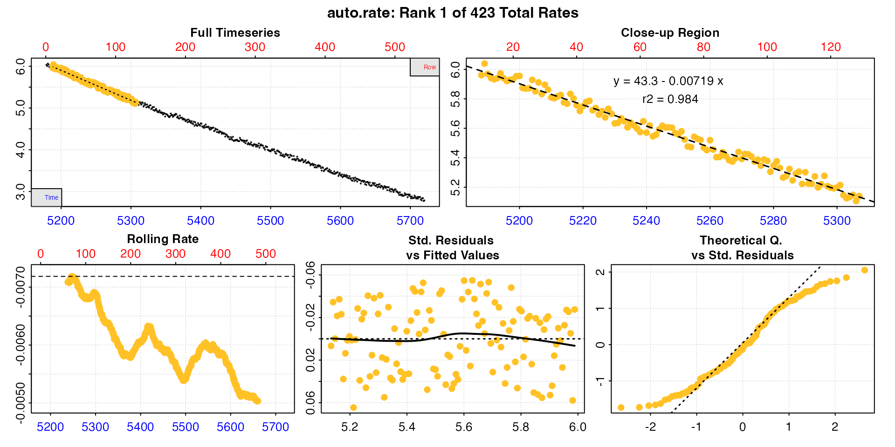

    #> 
    #> # summary.auto_rate # -------------------
    #> 
    #> === Summary of Results by Highest Rate ===
    #>      rep rank intercept_b0 slope_b1   rsq density row endrow time endtime  oxy endoxy     rate
    #>   1:  NA    1         43.3 -0.00719 0.984      NA  10    129 5188    5307 5.96   5.14 -0.00719
    #>   2:  NA    2         43.2 -0.00718 0.984      NA   9    128 5187    5306 5.98   5.11 -0.00718
    #>   3:  NA    3         43.2 -0.00718 0.984      NA  11    130 5189    5308 6.04   5.17 -0.00718
    #>   4:  NA    4         43.2 -0.00717 0.984      NA  14    133 5192    5311 5.93   5.07 -0.00717
    #>   5:  NA    5         43.2 -0.00717 0.984      NA  15    134 5193    5312 5.94   5.14 -0.00717
    #>  ---                                                                                          
    #> 419:  NA  419         31.7 -0.00505 0.971      NA 420    539 5598    5717 3.41   2.84 -0.00505
    #> 420:  NA  420         31.7 -0.00505 0.971      NA 419    538 5597    5716 3.37   2.79 -0.00505
    #> 421:  NA  421         31.6 -0.00503 0.971      NA 423    542 5601    5720 3.37   2.79 -0.00503
    #> 422:  NA  422         31.6 -0.00503 0.971      NA 421    540 5599    5718 3.44   2.84 -0.00503
    #> 423:  NA  423         31.6 -0.00503 0.971      NA 422    541 5600    5719 3.39   2.77 -0.00503
    #> 
    #> Regressions : 423 | Results : 423 | Method : highest | Roll width : 120 | Roll type : row 
    #> -----------------------------------------

We have already seen that rates are high at the start and then decline
across the replicate, so it’s not a surprise that the highest rates are
from early in the replicate. We can see our MMR under these criteria
would be the first row of this summary table. See next section for how
these multiple rates can be adjusted, converted, and filtered to get a
final output rate.

### 3. `auto_rate` `method = "linear"`

Here we simply run `auto_rate` and let the default inputs be applied to
find the linear regions of the data. Be sure to read
[`help("auto_rate")`](https://januarharianto.github.io/respR/reference/auto_rate.md)
and
[`vignette("auto_rate")`](https://januarharianto.github.io/respR/articles/auto_rate.md)
to understand what this method does, appropriate inputs and how to
modify the defaults. We again subset the data to remove the initial 3
minutes.

``` r
zeb_mmr <- zeb_rep_1 |>
  subset_data(from = 180, by = "row") |>
  auto_rate() |>
  summary()
#> 
#> # summary.auto_rate # -------------------
#> 
#> === Summary of Results by Kernel Density Rank ===
#>    rep rank intercept_b0 slope_b1   rsq density row endrow time endtime  oxy endoxy     rate
#> 1:  NA    1         36.3 -0.00588 0.996    1199 122    450 5300    5628 5.20   3.27 -0.00588
#> 2:  NA    2         32.0 -0.00511 0.981     644 394    541 5572    5719 3.56   2.77 -0.00511
#> 3:  NA    3         37.6 -0.00612 0.991     425 102    304 5280    5482 5.35   4.10 -0.00612
#> 4:  NA    4         37.6 -0.00612 0.991     420 101    304 5279    5482 5.31   4.10 -0.00612
#> 5:  NA    5         42.9 -0.00711 0.979     417   4    111 5182    5289 6.04   5.22 -0.00711
#> 6:  NA    6         41.1 -0.00678 0.985     412  52    184 5230    5362 5.63   4.84 -0.00678
#> 7:  NA    7         36.7 -0.00595 0.986     405 305    451 5483    5629 4.15   3.19 -0.00595
#> 
#> Regressions : 435 | Results : 7 | Method : linear | Roll width : 108 | Roll type : row 
#> -----------------------------------------
```

The function has found seven linear regions. All of these rates are
valid results depending on the question being asked, in that they have
been found to be linear regions, and so of consistently sustained rates.
In this case, since we are interested in the maximum rate, the fifth
ranked result has the highest `rate` value, and comes from early in the
replicate, so is probably the result we are most interested in. We can
plot it using `pos`.

``` r
plot(zeb_mmr, pos = 5)
```

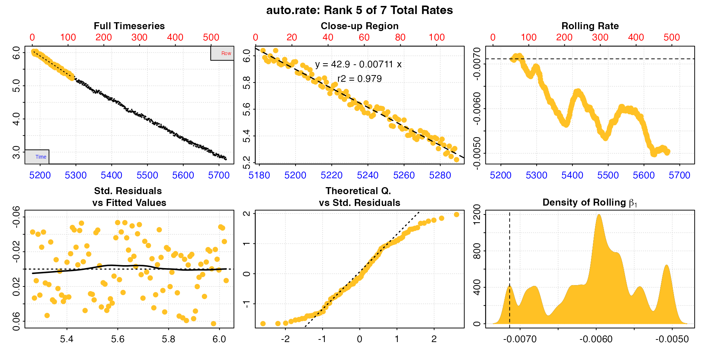

Many aspects will feed into rate selection criteria for a specific
experiment or study, and it depends on these whether this in an
acceptable, reportable result. Maybe at less than 2 minutes this is not
a long enough duration for us to be comfortable that this was a
sustained MMR. In which case perhaps one of the other results is better
reported. Or maybe we could report an average of some of the rates, such
as the top three. The important thing is to apply these selection
criteria consistently and report them alongside results.

#### Changing the `width`

These are all valid options, as long as they are reported. However, we
can also change the analysis parameters. The `width` input in
`auto_rate` determines the width of the rolling regressions used to find
linear regions. See
[`auto_rate()`](https://januarharianto.github.io/respR/reference/auto_rate.md)
and other vignettes for full details, but briefly in the case of the
`"linear"` method this is the starting point for the analysis. Resulting
regressions will vary in width, but in general the minimum width will be
increased by increasing the `width`. The default value is 0.2,
representing 20% of the data length. Here, with 10 minutes of data this
would represent 2 minutes, which is quite a brief time window. So
instead we will increase this to 0.5 (it can also be specified in the
units of the `"by"` input).

See [Prinzing et
al. (2021)](https://januarharianto.github.io/respR/articles/refs.html#references)
for an excellent discussion of appropriate widths in rolling regressions
to determine MMR.

``` r
zeb_mmr <- zeb_rep_1 |>
  subset_data(from = 180, by = "row") |>
  auto_rate(width = 0.5) |>
  summary()
#> 
#> # summary.auto_rate # -------------------
#> 
#> === Summary of Results by Kernel Density Rank ===
#>    rep rank intercept_b0 slope_b1   rsq density row endrow time endtime  oxy endoxy     rate
#> 1:  NA    1         36.2 -0.00586 0.996    4258 146    447 5324    5625 5.03   3.30 -0.00586
#> 2:  NA    2         34.6 -0.00556 0.993    1231 260    517 5438    5695 4.33   2.93 -0.00556
#> 3:  NA    3         36.6 -0.00592 0.993     963 119    363 5297    5541 5.21   3.75 -0.00592
#> 4:  NA    4         34.6 -0.00557 0.993     900 259    514 5437    5692 4.36   2.96 -0.00557
#> 5:  NA    5         39.3 -0.00642 0.994     738  31    277 5209    5455 5.86   4.21 -0.00642
#> 6:  NA    6         38.5 -0.00629 0.993     731  55    296 5233    5474 5.65   4.10 -0.00629
#> 
#> Regressions : 272 | Results : 6 | Method : linear | Roll width : 271 | Roll type : row 
#> -----------------------------------------
```

Now we have six results varying between 4 and 5 minutes duration, and
they are much more consistent in rate value. In this case the fifth
result has the highest rate, is early in the replicate, and so is likely
a good estimation of MMR. Note how the rolling rate plot is smoother
with this higher width.

``` r
plot(zeb_mmr, pos = 5)
```

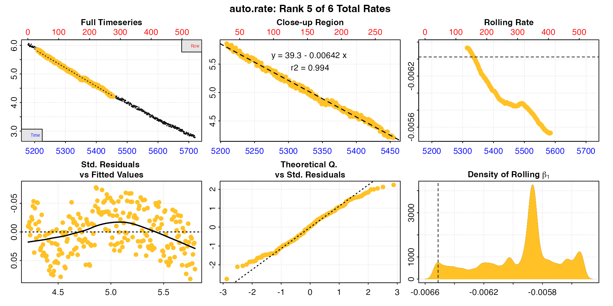

With non-linear data like this, such as from an animal recovering from
exercise, increasing the width over which a rate is determined will
necessarily decrease the rate values. The researcher needs to keep this
in mind, and find a balance between a width that provides a good
estimation of the specimen’s physiological state, but also is not
affected by other factors such as data noise or anomalies. Most
importantly, these decisions and criteria should be reported.

High width values can lead to overfitting and mis-estimation of rates,
and low widths underfitting and rate values which are too sensitive to
data noise. See
[here](https://januarharianto.github.io/respR/articles/auto_rate.html#width)
for discussion of this in the context of `auto_rate`, and how to choose
an appropriate `width`. We recommend reading [Prinzing et
al. (2021)](https://januarharianto.github.io/respR/articles/refs.html#references)
to understand the nuances of determining MMR and regression widths. See
also [Killen et
al. (2021)](https://januarharianto.github.io/respR/articles/refs.html#references).

### Adjust

The
[`adjust_rate()`](https://januarharianto.github.io/respR/reference/adjust_rate.md)
function allows rates to be background adjusted in a number of ways. See
[`vignette("adjust_rate")`](https://januarharianto.github.io/respR/articles/adjust_rate.md)
for examples. Here we will use it to apply a dynamic linear correction
using the start and end background rates we determined
[earlier](#background). Essentially this calculates the appropriate
background adjustment for a rate using the time at which it was
determined, assuming the background rate increases linearly from the
pre- to post-experiment values.

For MMR, we will adjust the results from option 3 above, but this will
work with the other options also. We have our saved `auto_rate` object,
so it’s relatively easy to adjust. We just need to enter the two
background rate objects we saved earlier and specify the method.

``` r
zeb_mmr_adj <- adjust_rate(zeb_mmr, 
                           by = bg_pre,     # first background rate
                           by2 = bg_post,   # second background rate
                           method = "linear")
#> adjust_rate: Rate adjustments applied using "linear" method.
```

``` r
summary(zeb_mmr_adj)
#> 
#> # summary.adjust_rate # -----------------
#> 
#> Adjustment was applied using 'linear' method.
#> Summary of all rate results:
#> 
#>    rep rank intercept_b0 slope_b1   rsq density row endrow time endtime  oxy endoxy     rate adjustment rate.adjusted
#> 1:  NA    1         36.2 -0.00586 0.996    4258 146    447 5324    5625 5.03   3.30 -0.00586 -0.0000761      -0.00578
#> 2:  NA    2         34.6 -0.00556 0.993    1231 260    517 5438    5695 4.33   2.93 -0.00556 -0.0000761      -0.00549
#> 3:  NA    3         36.6 -0.00592 0.993     963 119    363 5297    5541 5.21   3.75 -0.00592 -0.0000760      -0.00585
#> 4:  NA    4         34.6 -0.00557 0.993     900 259    514 5437    5692 4.36   2.96 -0.00557 -0.0000761      -0.00550
#> 5:  NA    5         39.3 -0.00642 0.994     738  31    277 5209    5455 5.86   4.21 -0.00642 -0.0000760      -0.00635
#> 6:  NA    6         38.5 -0.00629 0.993     731  55    296 5233    5474 5.65   4.10 -0.00629 -0.0000760      -0.00622
#> -----------------------------------------
```

There are several things to note here. We can see the ultimate
`adjustment` value is small in comparison to the rate of the specimen,
as it should be in most experiments. Also, the adjustment values differ
slightly; they are lower for rates that come from the start of the
replicate. This is what we would expect because we are assuming the
background rate is increasing over time. `adjust_rate` uses the midpoint
time of each rate regression to calculate the appropriate adjustment
value, so earlier rates will have a lower background adjustment. Lastly,
the adjustments are very close in value to the pre-experiment background
rate of `-0.0000742` we established [earlier](#background). Again, this
is what we would expect because this is the first replicate and
conducted just after the first background recording. If we are assuming
there is a linear increase in background rate over time this would mean
they should be very close in value.

See later [section](#crintadj) for how adjustment values differ in other
replicates.

### Convert

Now that the rates have been adjusted we can convert them to units. This
will convert every rate in the object.

The `convert_rate` function can output rates as *absolute*, that is of
the whole animal or chamber, *mass-specific* if a `mass` is entered, or
*area-specific* if an `area` is entered. The `output.unit` should be
correctly formatted for whichever of these are chosen, that is in the
order Oxygen/Time, Oxygen/Time/Mass, or Oxygen/Time/Area.

Note the `volume` input is volume of water in the respirometer, *not the
volume of the respirometer*. That is, it represents the *effective
volume*. A specimen will displace some of the water, therefore this is
the volume of the respirometer minus the volume of the specimen. There
are several approaches to calculate the effective volume or specimen
volume: geometrically; through displacement in a separate vessel; or
calculated from the mass and density. For example, fish are often
assumed to have an equal density as water (~1000 kg/m^3), so their mass
is measured, converted to volume and subtracted from the respirometer
volume. Volume could also be determined directly by pouring out and
measuring the water at the end of the experiment, or by weighing the
respirometer. See the
[`respfun`](https://github.com/nicholascarey/respfun) respirometry
utilities package for functions to calculate the effective volume and
convert water mass to volume.

Here we use the `adjust_rate` object saved in the previous step, and
we’ll convert to a mass-specific rate.

``` r
zeb_mmr_adj_conv <- convert_rate(zeb_mmr_adj,
                                 oxy.unit = "mg/L",       # oxygen units of the original raw data
                                 time.unit = "secs",      # time units of the original raw data
                                 output.unit = "mg/h/g",  # desired output unit
                                 volume = 0.12,           # effective volume of the respirometer in L
                                 mass = 0.0009)           # mass of the specimen in kg

summary(zeb_mmr_adj_conv)
#> 
#> # summary.convert_rate # ----------------
#> Summary of all converted rates:
#> 
#>    rep rank intercept_b0 slope_b1   rsq density row endrow time endtime  oxy endoxy     rate adjustment rate.adjusted rate.input oxy.unit time.unit volume   mass area  S  t  P rate.abs rate.m.spec rate.a.spec output.unit rate.output
#> 1:  NA    1         36.2 -0.00586 0.996    4258 146    447 5324    5625 5.03   3.30 -0.00586 -0.0000761      -0.00578   -0.00578     mg/L       sec   0.12 0.0009   NA NA NA NA    -2.50       -2.78          NA   mgO2/hr/g       -2.78
#> 2:  NA    2         34.6 -0.00556 0.993    1231 260    517 5438    5695 4.33   2.93 -0.00556 -0.0000761      -0.00549   -0.00549     mg/L       sec   0.12 0.0009   NA NA NA NA    -2.37       -2.63          NA   mgO2/hr/g       -2.63
#> 3:  NA    3         36.6 -0.00592 0.993     963 119    363 5297    5541 5.21   3.75 -0.00592 -0.0000760      -0.00585   -0.00585     mg/L       sec   0.12 0.0009   NA NA NA NA    -2.53       -2.81          NA   mgO2/hr/g       -2.81
#> 4:  NA    4         34.6 -0.00557 0.993     900 259    514 5437    5692 4.36   2.96 -0.00557 -0.0000761      -0.00550   -0.00550     mg/L       sec   0.12 0.0009   NA NA NA NA    -2.37       -2.64          NA   mgO2/hr/g       -2.64
#> 5:  NA    5         39.3 -0.00642 0.994     738  31    277 5209    5455 5.86   4.21 -0.00642 -0.0000760      -0.00635   -0.00635     mg/L       sec   0.12 0.0009   NA NA NA NA    -2.74       -3.05          NA   mgO2/hr/g       -3.05
#> 6:  NA    6         38.5 -0.00629 0.993     731  55    296 5233    5474 5.65   4.10 -0.00629 -0.0000760      -0.00622   -0.00622     mg/L       sec   0.12 0.0009   NA NA NA NA    -2.69       -2.98          NA   mgO2/hr/g       -2.98
#> -----------------------------------------
```

The `$summary` table contains all rate regression parameters and data
locations, adjustments (if applied), units, and more. In fact it
contains *all* relevant information about the analysis and is a great
way of saving the results, especially using the `export = TRUE` input to
save it as a data frame. One handy tip: you may want to enter `S`, `t`,
and `P` even if they are not required for conversions to the output rate
unit because they are saved in the `$summary` table, and this can help
in keeping track of results across different experiments. Note the `row`
and `endrow` columns will refer to rows of the most recent subset of the
data, however the `time` and `endtime` will always refer back to the
time values of original raw data.

### Select

The last analysis step is to select our final reportable MMR from the
multiple rates we determined using the `linear` method. We saw
[earlier](#width) that after changing some analysis parameters one of
the MMR rates, the 5th in the summary table, was higher than the others.

``` r
summary(zeb_mmr_adj_conv)
#> 
#> # summary.convert_rate # ----------------
#> Summary of all converted rates:
#> 
#>    rep rank intercept_b0 slope_b1   rsq density row endrow time endtime  oxy endoxy     rate adjustment rate.adjusted rate.input oxy.unit time.unit volume   mass area  S  t  P rate.abs rate.m.spec rate.a.spec output.unit rate.output
#> 1:  NA    1         36.2 -0.00586 0.996    4258 146    447 5324    5625 5.03   3.30 -0.00586 -0.0000761      -0.00578   -0.00578     mg/L       sec   0.12 0.0009   NA NA NA NA    -2.50       -2.78          NA   mgO2/hr/g       -2.78
#> 2:  NA    2         34.6 -0.00556 0.993    1231 260    517 5438    5695 4.33   2.93 -0.00556 -0.0000761      -0.00549   -0.00549     mg/L       sec   0.12 0.0009   NA NA NA NA    -2.37       -2.63          NA   mgO2/hr/g       -2.63
#> 3:  NA    3         36.6 -0.00592 0.993     963 119    363 5297    5541 5.21   3.75 -0.00592 -0.0000760      -0.00585   -0.00585     mg/L       sec   0.12 0.0009   NA NA NA NA    -2.53       -2.81          NA   mgO2/hr/g       -2.81
#> 4:  NA    4         34.6 -0.00557 0.993     900 259    514 5437    5692 4.36   2.96 -0.00557 -0.0000761      -0.00550   -0.00550     mg/L       sec   0.12 0.0009   NA NA NA NA    -2.37       -2.64          NA   mgO2/hr/g       -2.64
#> 5:  NA    5         39.3 -0.00642 0.994     738  31    277 5209    5455 5.86   4.21 -0.00642 -0.0000760      -0.00635   -0.00635     mg/L       sec   0.12 0.0009   NA NA NA NA    -2.74       -3.05          NA   mgO2/hr/g       -3.05
#> 6:  NA    6         38.5 -0.00629 0.993     731  55    296 5233    5474 5.65   4.10 -0.00629 -0.0000760      -0.00622   -0.00622     mg/L       sec   0.12 0.0009   NA NA NA NA    -2.69       -2.98          NA   mgO2/hr/g       -2.98
#> -----------------------------------------
```

In this case, we could fairly confidently report this as our MMR of
-3.05 mg/h/g. However, the
[`select_rate()`](https://januarharianto.github.io/respR/reference/select_rate.md)
function allows you to filter rates by applying selection criteria. This
example will select and extract the highest `n` rates to a new object,
in this case the highest single rate. This is quite a simplistic
example, but see later and
[`vignette("select_rate")`](https://januarharianto.github.io/respR/articles/select_rate.md)
for more advanced examples including how to apply multiple criteria.

``` r
MMR <- select_rate(zeb_mmr_adj_conv,
                   method = "highest",
                   n = 1)
#> select_rate: Selecting highest 1 *absolute* rate values...
#> ----- Selection complete. 5 rate(s) removed, 1 rate(s) remaining -----
```

If we need to save any of the other regression data for this rate,
`summary` has additional inputs that are useful: `pos` allows specific
rows of summary tables to be extracted, and `export` allows it to be
saved as a separate data frame. Here, we’ll use this on the final object
to export the coefficients and other data for this rate.

``` r
mmr_results <- summary(MMR, export = TRUE)
```

``` r
mmr_results
#>      rep  rank intercept_b0 slope_b1   rsq density   row endrow  time endtime   oxy endoxy     rate adjustment rate.adjusted rate.input oxy.unit time.unit volume   mass   area      S      t      P rate.abs rate.m.spec rate.a.spec output.unit rate.output
#>    <num> <int>        <num>    <num> <num>   <num> <int>  <int> <num>   <num> <num>  <num>    <num>      <num>         <num>      <num>   <char>    <char>  <num>  <num> <lgcl> <lgcl> <lgcl> <lgcl>    <num>       <num>      <lgcl>      <char>       <num>
#> 1:    NA     5         39.3 -0.00642 0.994     738    31    277  5209    5455  5.86   4.21 -0.00642  -0.000076      -0.00635   -0.00635     mg/L       sec   0.12 0.0009     NA     NA     NA     NA    -2.74       -3.05          NA   mgO2/hr/g       -3.05
```

### Complete MMR analysis

This is the complete analysis we have just conducted to get MMR.

``` r
mmr_results <- 
  zeb_rep_1 |>                              # using the inspected replicate 1 data...
  subset_data(from = 180, 
              by = "row") |>                # subset to apply a 'wait' period
  auto_rate(width = 0.5) |>                 # use auto_rate to get most linear regions
  adjust_rate(by = bg_pre, 
              by2 = bg_post, 
              method = "linear") |>         # adjust
  convert_rate(oxy.unit = "mg/L", 
               time.unit = "secs", 
               output.unit = "mg/h/g", 
               volume = 0.12, 
               mass = 0.0009) |>            # convert
  select_rate(method = "highest", 
              n = 1) |>                     # select highest rate 
  summary(export = TRUE)                    # final reportable result
```

    #>      rep  rank intercept_b0 slope_b1   rsq density   row endrow  time endtime   oxy endoxy     rate adjustment rate.adjusted rate.input oxy.unit time.unit volume   mass   area      S      t      P rate.abs rate.m.spec rate.a.spec output.unit rate.output
    #>    <num> <int>        <num>    <num> <num>   <num> <int>  <int> <num>   <num> <num>  <num>    <num>      <num>         <num>      <num>   <char>    <char>  <num>  <num> <lgcl> <lgcl> <lgcl> <lgcl>    <num>       <num>      <lgcl>      <char>       <num>
    #> 1:    NA     5         39.3 -0.00642 0.994     738    31    277  5209    5455  5.86   4.21 -0.00642  -0.000076      -0.00635   -0.00635     mg/L       sec   0.12 0.0009     NA     NA     NA     NA    -2.74       -3.05          NA   mgO2/hr/g       -3.05

This allows you to document all analysis parameters and rate selection
criteria so that they can be consistently applied and reported alongside
the results. See [Reporting](#report) section for how analyses might be
reported concisely in text.

## RMR

### `calc_rate.int`

To extract a rate from every replicate and calculate a routine metabolic
rate (RMR) from amongst the results we will use
[`calc_rate.int()`](https://januarharianto.github.io/respR/reference/calc_rate.int.md).
To repeat the note from [above](#analysis), this is not a recommendation
that this is how you should extract an RMR from your own data; it is
simply an example of one approach and how the `respR` functions are
flexible and adaptable. `calc_rate.int` was introduced in
[`respR v2.1`](https://januarharianto.github.io/respR/articles/release_notes.html#version-2-1-2022-12-06)
and allows you to specify a replicate structure and run `calc_rate` on
each replicate to extract a rate from the same time or row region in
each. See
[`vignette("calc_rate.int")`](https://januarharianto.github.io/respR/articles/calc_rate.int.md)
for details of the functionality.

The difference between this and the approach [below](#arint) using
[`auto_rate.int()`](https://januarharianto.github.io/respR/reference/auto_rate.int.md)
is that you specify a region over which to calculate a rate, and this
will be the same in each replicate. This takes away some of the
objectivity in determining rates that `auto_rate` allows for, but as
long as selection criteria are reported and applied consistently is a
perfectly valid way of processing intermittent-flow data.

We’ve shown above how to get background rates and MMR, so we will use
`calc_rate.int` to extract a rate from the same region of each replicate
and filter these rates to report an RMR. In these data, after the first
replicate of 14 minutes duration for [MMR](#mmr) there is a regular
structure of 105 replicates of 11 minutes duration including the flush.

### Subset data

In the examples
[here](https://januarharianto.github.io/respR/articles/intermittent_short.html)
we had to specify the start and end location of every replicate in
`calc_rate.int`. However, if replicates cycle at a regular interval we
can simply enter this as `starts`. This tells the function that starting
from row 1 replicates cycle at this regular interval, and it can be
entered as a row interval or a duration in time, as specified using the
`by` input. We only need to subset the data so that the first replicate
starts at row 1 before passing it to `calc_rate.int`.

We start by subsetting the data so that the 105 regularly-spaced
replicates start at row 1, that is we exclude the starting background
recording, the first replicate for MMR, and the end background
recording. We then `inspect` it.

``` r
zeb_insp <- zeb_intermittent.rd |>
  subset_data(from = 5840, 
              to = 75139,
              by = "row") |>
  inspect() 
#> inspect: Applying column default of 'time = 1'
#> inspect: Applying column default of 'oxygen = 2'
#> inspect: No issues detected while inspecting data frame.
```

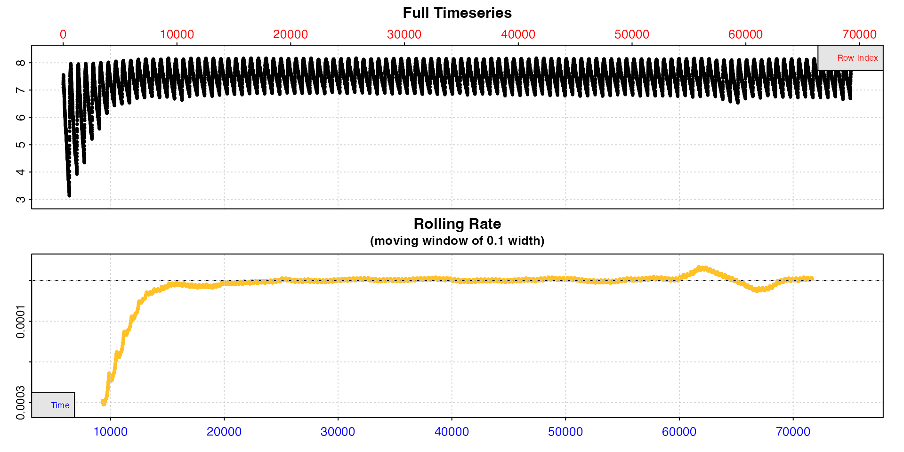

### Extract rates

Now we run `calc_rate.int` and specify a 660 row interval between
replicates using `starts`. We’ll calculate a rate across the same five
minute time period in each replicate, from three minutes to eight
minutes. To do this we specify a 180 row `wait` phase and 300 row
`measure` phase.

``` r
zeb_cr.int <- calc_rate.int(zeb_insp,
                            starts = 660,
                            wait = 180,
                            measure = 300,
                            by = "row")
#> plot.calc_rate.int: Plotting first 20 selected reps only. To plot others modify 'pos' input.
```

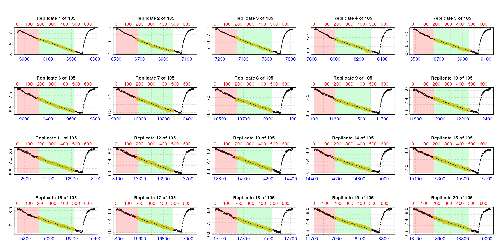 By
default the function plots the first 20 replicates (`pos` can be used to
choose others up to a maximum of 20). Note how the lower time axis has
the actual raw data time values, but the top row axis refers to the rows
of each replicate subset. In these plots the rate data is the yellow
points, the red shaded region is the `wait` phase, and the green shaded
region the `measure` phase.

We can use [`summary()`](https://rdrr.io/r/base/summary.html) to view
the results.

``` r
summary(zeb_cr.int)
#> 
#> # summary.calc_rate.int # ---------------
#> Summary of all replicate results:
#> 
#>      rep rank intercept_b0 slope_b1   rsq   row endrow  time endtime  oxy endoxy rate.2pt     rate
#>   1:   1    1         53.3 -0.00786 0.995   181    480  6020    6319 5.90   3.57 -0.00781 -0.00786
#>   2:   2    1         47.2 -0.00615 0.977   841   1140  6680    6979 6.24   4.41 -0.00614 -0.00615
#>   3:   3    1         52.7 -0.00628 0.990  1501   1800  7340    7639 6.64   4.64 -0.00668 -0.00628
#>   4:   4    1         41.3 -0.00432 0.984  2161   2460  8000    8299 6.74   5.45 -0.00434 -0.00432
#>   5:   5    1         38.8 -0.00368 0.986  2821   3120  8660    8959 6.99   5.88 -0.00369 -0.00368
#>  ---                                                                                              
#> 101: 101    1        162.7 -0.00215 0.974 66181  66480 72020   72319 7.58   6.94 -0.00215 -0.00215
#> 102: 102    1        174.1 -0.00229 0.977 66841  67140 72680   72979 7.56   6.88 -0.00228 -0.00229
#> 103: 103    1        168.4 -0.00219 0.977 67501  67800 73340   73639 7.59   6.94 -0.00217 -0.00219
#> 104: 104    1        181.5 -0.00235 0.977 68161  68460 74000   74299 7.62   6.93 -0.00231 -0.00235
#> 105: 105    1        170.0 -0.00218 0.972 68821  69120 74660   74959 7.61   6.96 -0.00218 -0.00218
#> -----------------------------------------
```

As we saw from our inspection of the data [earlier](#inspecting), rates
are higher at the start of the dataset because the specimen was
exercised before being placed in the respirometer. We will filter these
out shortly. For now we can see we have a rate from every replicate. Our
entered time range has been applied *within* each replicate, and the
replicate each rate originates from can be seen in the `$rep` column.

### Adjust

`calc_rate.int` objects also work with `adjust_rate`, including with
dynamic adjustment methods. Here, we’ll adjust using the pre- and
post-experiment background recordings assuming the background rate
increases linearly from the initial to ending background rates.

``` r
zeb_cr.int_adj <- adjust_rate(zeb_cr.int,
                              by = bg_pre, 
                              by2 = bg_post,
                              method = "linear")
#> adjust_rate: Rate adjustments applied using "linear" method.
```

If the adjustments were correctly applied we would expect the adjustment
value of the early replicates to be close to the value of the initial
background rate (`-0.000074`), and those of the later ones close to that
of the ending background rate (`-0.000120`). Let’s look at the summary
to check, and use `pos` to pick out one from the start, middle and end.

``` r
summary(zeb_cr.int_adj, pos = c(1, 50, 105))
#> 
#> # summary.adjust_rate # -----------------
#> 
#> Adjustment was applied using 'linear' method.
#> Summary of rate results from entered 'pos' rank(s):
#> 
#>    rep rank intercept_b0 slope_b1   rsq   row endrow  time endtime  oxy endoxy rate.2pt     rate adjustment rate.adjusted
#> 1:   1    1         53.3 -0.00786 0.995   181    480  6020    6319 5.90   3.57 -0.00781 -0.00786 -0.0000765      -0.00778
#> 2:  50    1         89.6 -0.00214 0.966 32521  32820 38360   38659 7.64   7.03 -0.00204 -0.00214 -0.0000971      -0.00204
#> 3: 105    1        170.0 -0.00218 0.972 68821  69120 74660   74959 7.61   6.96 -0.00218 -0.00218 -0.0001201      -0.00206
#> -----------------------------------------
```

As expected the `$adjustment` column values increase over the experiment
between these values, so we can proceed to conversion.

### Convert

Now we will convert the rates, then plot the values to decide how to
select a final RMR rate.

``` r
zeb_cr.int_conv <- convert_rate(zeb_cr.int_adj,
                                oxy.unit = "mg/L",       # oxygen units of the original raw data
                                time.unit = "secs",      # time units of the original raw data
                                output.unit = "mg/h/g",  # desired output unit
                                volume = 0.12,           # effective volume of the respirometer in L
                                mass = 0.0009)           # mass of the specimen in kg
```

The converted rates can be seen in the summary table.

``` r
summary(zeb_cr.int_conv)
#> 
#> # summary.convert_rate # ----------------
#> Summary of all converted rates:
#> 
#>      rep rank intercept_b0 slope_b1   rsq density   row endrow  time endtime  oxy endoxy     rate adjustment rate.adjusted rate.input oxy.unit time.unit volume   mass area  S  t  P rate.abs rate.m.spec rate.a.spec output.unit rate.output
#>   1:   1    1         53.3 -0.00786 0.995      NA   181    480  6020    6319 5.90   3.57 -0.00786 -0.0000765      -0.00778   -0.00778     mg/L       sec   0.12 0.0009   NA NA NA NA   -3.363      -3.736          NA   mgO2/hr/g      -3.736
#>   2:   2    1         47.2 -0.00615 0.977      NA   841   1140  6680    6979 6.24   4.41 -0.00615 -0.0000769      -0.00608   -0.00608     mg/L       sec   0.12 0.0009   NA NA NA NA   -2.625      -2.917          NA   mgO2/hr/g      -2.917
#>   3:   3    1         52.7 -0.00628 0.990      NA  1501   1800  7340    7639 6.64   4.64 -0.00628 -0.0000773      -0.00621   -0.00621     mg/L       sec   0.12 0.0009   NA NA NA NA   -2.681      -2.978          NA   mgO2/hr/g      -2.978
#>   4:   4    1         41.3 -0.00432 0.984      NA  2161   2460  8000    8299 6.74   5.45 -0.00432 -0.0000778      -0.00424   -0.00424     mg/L       sec   0.12 0.0009   NA NA NA NA   -1.831      -2.035          NA   mgO2/hr/g      -2.035
#>   5:   5    1         38.8 -0.00368 0.986      NA  2821   3120  8660    8959 6.99   5.88 -0.00368 -0.0000782      -0.00360   -0.00360     mg/L       sec   0.12 0.0009   NA NA NA NA   -1.556      -1.729          NA   mgO2/hr/g      -1.729
#>  ---                                                                                                                                                                                                                                         
#> 101: 101    1        162.7 -0.00215 0.974      NA 66181  66480 72020   72319 7.58   6.94 -0.00215 -0.0001185      -0.00203   -0.00203     mg/L       sec   0.12 0.0009   NA NA NA NA   -0.879      -0.977          NA   mgO2/hr/g      -0.977
#> 102: 102    1        174.1 -0.00229 0.977      NA 66841  67140 72680   72979 7.56   6.88 -0.00229 -0.0001189      -0.00217   -0.00217     mg/L       sec   0.12 0.0009   NA NA NA NA   -0.939      -1.043          NA   mgO2/hr/g      -1.043
#> 103: 103    1        168.4 -0.00219 0.977      NA 67501  67800 73340   73639 7.59   6.94 -0.00219 -0.0001193      -0.00207   -0.00207     mg/L       sec   0.12 0.0009   NA NA NA NA   -0.895      -0.995          NA   mgO2/hr/g      -0.995
#> 104: 104    1        181.5 -0.00235 0.977      NA 68161  68460 74000   74299 7.62   6.93 -0.00235 -0.0001197      -0.00223   -0.00223     mg/L       sec   0.12 0.0009   NA NA NA NA   -0.963      -1.070          NA   mgO2/hr/g      -1.070
#> 105: 105    1        170.0 -0.00218 0.972      NA 68821  69120 74660   74959 7.61   6.96 -0.00218 -0.0001201      -0.00206   -0.00206     mg/L       sec   0.12 0.0009   NA NA NA NA   -0.888      -0.987          NA   mgO2/hr/g      -0.987
#> -----------------------------------------
```

We can see the converted rates as the last column. The `$summary` table
contains the all rate regression parameters and data locations,
adjustments (if applied), units, and more. It can be exported as a
separate data frame by using `export = TRUE` in
[`summary()`](https://rdrr.io/r/base/summary.html). This is a great way
of exporting all the relevant data for your final results.

### Select

It will depend on the aims and circumstances of an experiment what rate
results to extract, summarise, and report. For instance we might report
RMR as a mean of a representative selection of rates after the specimens
uptake rate has stabilised, or a mean of a number or percentile of
lowest rates found. The important thing is to apply these selection
criteria consistently and report them alongside results.

As of
[`respR v2.1`](https://januarharianto.github.io/respR/articles/release_notes.html#version-2-1-2022-12-06)
`convert_rate` has new plotting functionality to help visualise and
explore rate results. For intermittent-flow results the most useful of
these is `type = "rate"`.

``` r
plot(zeb_cr.int_conv, type = "rate")
```

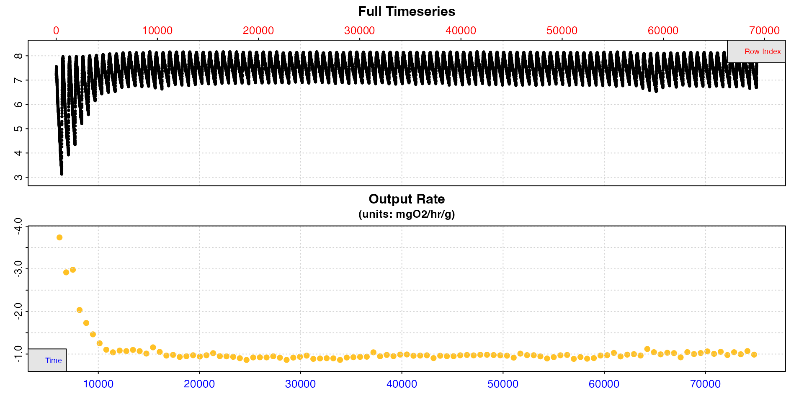

This shows how the calculated rate values vary across the dataset. We
can see from this plot they are high at the start, stabilise after
around timepoint 20000, then are a little unstable again if not slightly
elevated after timepoint 60000. Between these however they appear to be
very stable.

The
[`select_rate()`](https://januarharianto.github.io/respR/reference/select_rate.md)
function allows `convert_rate` results to be filtered or reordered in
various ways. See
[`help("select_rate")`](https://januarharianto.github.io/respR/reference/select_rate.md)
and
[`vignette("select_rate")`](https://januarharianto.github.io/respR/articles/select_rate.md)
for more details. For this analysis, lets only use rates from replicates
between timepoints 20000 and 60000. Then, simply to show an example of
how rates can be further selected, let’s only select those with
r-squared of 0.97 and above, select the lowest 20, and finally take the
mean of them.

``` r
RMR <- zeb_cr.int_conv |>
  select_rate(method = "time", n = c(20000, 60000)) |>
  select_rate(method = "rsq", n = c(0.97, 1)) |>
  select_rate(method = "lowest", n = 20) |>
  summary() |>
  mean()
#> select_rate: Selecting rates which occur only between times 20000 and 60000...
#> ----- Selection complete. 45 rate(s) removed, 60 rate(s) remaining -----
#> select_rate: Selecting rates with rsq values between 0.97 and 1...
#> ----- Selection complete. 24 rate(s) removed, 36 rate(s) remaining -----
#> select_rate: Selecting lowest 20 *absolute* rate values...
#> ----- Selection complete. 16 rate(s) removed, 20 rate(s) remaining -----
#> 
#> # summary.convert_rate # ----------------
#> Summary of all converted rates:
#> 
#>     rep rank intercept_b0 slope_b1   rsq density   row endrow  time endtime  oxy endoxy     rate adjustment rate.adjusted rate.input oxy.unit time.unit volume   mass area  S  t  P rate.abs rate.m.spec rate.a.spec output.unit rate.output
#>  1:  25    1         52.8 -0.00207 0.971      NA 16021  16320 21860   22159 7.70   7.06 -0.00207 -0.0000866      -0.00198   -0.00198     mg/L       sec   0.12 0.0009   NA NA NA NA   -0.855      -0.950          NA   mgO2/hr/g      -0.950
#>  2:  26    1         54.0 -0.00206 0.972      NA 16681  16980 22520   22819 7.68   7.06 -0.00206 -0.0000870      -0.00197   -0.00197     mg/L       sec   0.12 0.0009   NA NA NA NA   -0.851      -0.946          NA   mgO2/hr/g      -0.946
#>  3:  33    1         63.6 -0.00206 0.972      NA 21301  21600 27140   27439 7.71   7.08 -0.00206 -0.0000899      -0.00197   -0.00197     mg/L       sec   0.12 0.0009   NA NA NA NA   -0.852      -0.947          NA   mgO2/hr/g      -0.947
#>  4:  36    1         66.0 -0.00200 0.971      NA 23281  23580 29120   29419 7.66   7.08 -0.00200 -0.0000912      -0.00191   -0.00191     mg/L       sec   0.12 0.0009   NA NA NA NA   -0.826      -0.917          NA   mgO2/hr/g      -0.917
#>  5:  38    1         71.5 -0.00210 0.972      NA 24601  24900 30440   30739 7.63   7.06 -0.00210 -0.0000920      -0.00201   -0.00201     mg/L       sec   0.12 0.0009   NA NA NA NA   -0.867      -0.963          NA   mgO2/hr/g      -0.963
#>  6:  39    1         68.0 -0.00194 0.971      NA 25261  25560 31100   31399 7.71   7.05 -0.00194 -0.0000924      -0.00185   -0.00185     mg/L       sec   0.12 0.0009   NA NA NA NA   -0.799      -0.887          NA   mgO2/hr/g      -0.887
#>  7:  49    1         85.7 -0.00207 0.972      NA 31861  32160 37700   37999 7.69   7.03 -0.00207 -0.0000966      -0.00197   -0.00197     mg/L       sec   0.12 0.0009   NA NA NA NA   -0.853      -0.947          NA   mgO2/hr/g      -0.947
#>  8:  51    1         88.7 -0.00208 0.970      NA 33181  33480 39020   39319 7.66   6.98 -0.00208 -0.0000975      -0.00198   -0.00198     mg/L       sec   0.12 0.0009   NA NA NA NA   -0.856      -0.951          NA   mgO2/hr/g      -0.951
#>  9:  55    1         95.4 -0.00211 0.973      NA 35821  36120 41660   41959 7.63   7.03 -0.00211 -0.0000992      -0.00201   -0.00201     mg/L       sec   0.12 0.0009   NA NA NA NA   -0.868      -0.964          NA   mgO2/hr/g      -0.964
#> 10:  58    1         99.3 -0.00210 0.973      NA 37801  38100 43640   43939 7.70   7.04 -0.00210 -0.0001004      -0.00200   -0.00200     mg/L       sec   0.12 0.0009   NA NA NA NA   -0.864      -0.960          NA   mgO2/hr/g      -0.960
#> 11:  59    1         99.7 -0.00208 0.971      NA 38461  38760 44300   44599 7.66   6.95 -0.00208 -0.0001008      -0.00198   -0.00198     mg/L       sec   0.12 0.0009   NA NA NA NA   -0.855      -0.950          NA   mgO2/hr/g      -0.950
#> 12:  63    1        107.2 -0.00212 0.977      NA 41101  41400 46940   47239 7.63   7.00 -0.00212 -0.0001025      -0.00202   -0.00202     mg/L       sec   0.12 0.0009   NA NA NA NA   -0.872      -0.969          NA   mgO2/hr/g      -0.969
#> 13:  68    1        113.5 -0.00211 0.971      NA 44401  44700 50240   50539 7.67   7.02 -0.00211 -0.0001046      -0.00200   -0.00200     mg/L       sec   0.12 0.0009   NA NA NA NA   -0.865      -0.962          NA   mgO2/hr/g      -0.962
#> 14:  73    1        118.7 -0.00207 0.972      NA 47701  48000 53540   53839 7.67   7.01 -0.00207 -0.0001067      -0.00197   -0.00197     mg/L       sec   0.12 0.0009   NA NA NA NA   -0.850      -0.944          NA   mgO2/hr/g      -0.944
#> 15:  74    1        114.6 -0.00197 0.970      NA 48361  48660 54200   54499 7.66   7.02 -0.00197 -0.0001071      -0.00187   -0.00187     mg/L       sec   0.12 0.0009   NA NA NA NA   -0.807      -0.896          NA   mgO2/hr/g      -0.896
#> 16:  75    1        119.6 -0.00204 0.973      NA 49021  49320 54860   55159 7.67   7.04 -0.00204 -0.0001076      -0.00193   -0.00193     mg/L       sec   0.12 0.0009   NA NA NA NA   -0.835      -0.928          NA   mgO2/hr/g      -0.928
#> 17:  79    1        125.3 -0.00205 0.973      NA 51661  51960 57500   57799 7.67   7.04 -0.00205 -0.0001092      -0.00194   -0.00194     mg/L       sec   0.12 0.0009   NA NA NA NA   -0.837      -0.930          NA   mgO2/hr/g      -0.930
#> 18:  80    1        122.0 -0.00197 0.971      NA 52321  52620 58160   58459 7.60   7.01 -0.00197 -0.0001097      -0.00186   -0.00186     mg/L       sec   0.12 0.0009   NA NA NA NA   -0.803      -0.892          NA   mgO2/hr/g      -0.892
#> 19:  81    1        125.0 -0.00200 0.974      NA 52981  53280 58820   59119 7.67   7.01 -0.00200 -0.0001101      -0.00189   -0.00189     mg/L       sec   0.12 0.0009   NA NA NA NA   -0.815      -0.905          NA   mgO2/hr/g      -0.905
#> 20:  82    1        133.8 -0.00212 0.973      NA 53641  53940 59480   59779 7.68   7.03 -0.00212 -0.0001105      -0.00201   -0.00201     mg/L       sec   0.12 0.0009   NA NA NA NA   -0.869      -0.965          NA   mgO2/hr/g      -0.965
#> -----------------------------------------
#> 
#> # mean.convert_rate # -------------------
#> Mean of all rate results:
#> 
#> Mean of 20 output rates:
#> [1] -0.939
#> [1] "mgO2/hr/g"
#> -----------------------------------------
```

That’s it; this is our final routine metabolic rate (at least, as we
have chosen to define it).

## SMR

### `auto_rate.int`

To extract a rate from every replicate and determine a standard
metabolic rate (SMR) from amongst the results we will use
[`auto_rate.int()`](https://januarharianto.github.io/respR/reference/auto_rate.int.md).
To repeat the note from [above](#analysis), this is not a recommendation
that this is how you should extract an SMR from your own data; it is
simply an example of one approach and how the `respR` functions are
flexible and adaptable.

Introduced in
[`respR v2.1`](https://januarharianto.github.io/respR/articles/release_notes.html#version-2-1-2022-12-06),
[`auto_rate.int()`](https://januarharianto.github.io/respR/reference/auto_rate.int.md)
is a dedicated function for intermittent-flow respirometry data, in
which you specify a replicate structure and run
[`auto_rate()`](https://januarharianto.github.io/respR/reference/auto_rate.md)
on each replicate. This function extracts rates in a number of ways
including the most linear or most consistently maintained rates, plus
highest and lowest rates of a specified width. See
[`vignette("auto_rate")`](https://januarharianto.github.io/respR/articles/auto_rate.md)
for more details, and
[`vignette("auto_rate.int")`](https://januarharianto.github.io/respR/articles/auto_rate.int.md)
for an overview of this function.

The difference between this and the approach [above](#crint) using
[`calc_rate.int()`](https://januarharianto.github.io/respR/reference/calc_rate.int.md)
is that the specified `measure` phase is not the same as the region over
which a rate is calculated. Instead a `measure` phase is specified and
the `auto_rate` analysis is done *within* this region using the `method`
and `width` inputs. This can result in rates of different widths coming
from within this region depending on the inputs.

### Subset data

We again subset the data so that the 105 regularly-spaced replicates
start at row 1.

``` r
zeb_insp <- zeb_intermittent.rd |>
  subset_data(from = 5840, 
              to = 75139,
              by = "row") |>
  inspect() 
#> inspect: Applying column default of 'time = 1'
#> inspect: Applying column default of 'oxygen = 2'
#> inspect: No issues detected while inspecting data frame.
```

### Extract rates

To get SMR we necessarily need to define it, in particular the duration
over which rates are calculated within each replicate. These should be
chosen appropriately and with reference to best practices and previous
studies. Here, let’s say we want to extract the lowest rate across 2
minutes within each replicate, and we will define our SMR for this
specimen as the mean of the lowest 10th percentile of all 105 extracted
rates.

We run `auto_rate.int` on the inspected data and use `method = "lowest"`
and `width = 120`. This means the function calculates *every* rate of
this width within each replicate, orders them according to the input
`method`, and by default (`n = 1`) returns the top ranked result, in
this case the lowest, for each replicate.

We again specify a 660 row interval between replicates using `starts`.
Just to be different from the [above](#crint) example, this time we will
specify a 2 minute (120 row) `wait` phase, and six minute (360 row)
`measure` phase.

``` r
zeb_ar.int <- auto_rate.int(zeb_insp,
                            starts = 660,
                            wait = 120,
                            measure = 360,
                            method = "lowest",
                            width = 120,
                            by = "row") |>
  summary()
#> plot.auto_rate.int: Plotting first 20 selected rates only. To plot others modify 'pos' input.
```

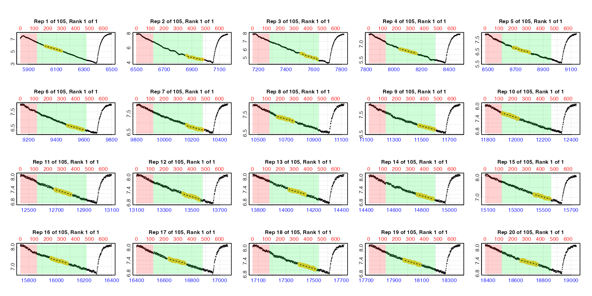

Note how the plots show the rates coming from different regions within
each replicate measure phase. The summary contains all the results, that
is the lowest 2-minute rate from each replicate. Before selecting from
amongst these to get our final SMR we first need to adjust and convert
them. This is exactly the same process we followed in the [example
above](#crintadj).

### Adjust

``` r
zeb_ar.int_adj <- adjust_rate(zeb_ar.int,
                              by = bg_pre, 
                              by2 = bg_post,
                              method = "linear")
#> adjust_rate: Rate adjustments applied using "linear" method.
```

### Convert

``` r
zeb_ar.int_conv <- convert_rate(zeb_ar.int_adj,
                                oxy.unit = "mg/L",       # oxygen units of the original raw data
                                time.unit = "secs",      # time units of the original raw data
                                output.unit = "mg/h/g",  # desired output unit
                                volume = 0.12,           # effective volume of the respirometer in L
                                mass = 0.0009)           # mass of the specimen in kg
```

``` r
summary(zeb_ar.int_conv)
#> 
#> # summary.convert_rate # ----------------
#> Summary of all converted rates:
#> 
#>      rep rank intercept_b0 slope_b1   rsq density   row endrow  time endtime  oxy endoxy     rate adjustment rate.adjusted rate.input oxy.unit time.unit volume   mass area  S  t  P rate.abs rate.m.spec rate.a.spec output.unit rate.output
#>   1:   1    1         45.5 -0.00658 0.984      NA   179    298  6018    6137 5.88   5.12 -0.00658 -0.0000764      -0.00650   -0.00650     mg/L       sec   0.12 0.0009   NA NA NA NA   -2.810      -3.122          NA   mgO2/hr/g      -3.122
#>   2:   2    1         34.0 -0.00424 0.906      NA  1021   1140  6860    6979 5.00   4.41 -0.00424 -0.0000770      -0.00416   -0.00416     mg/L       sec   0.12 0.0009   NA NA NA NA   -1.798      -1.998          NA   mgO2/hr/g      -1.998
#>   3:   3    1         47.3 -0.00557 0.932      NA  1668   1787  7507    7626 5.51   4.81 -0.00557 -0.0000774      -0.00549   -0.00549     mg/L       sec   0.12 0.0009   NA NA NA NA   -2.374      -2.638          NA   mgO2/hr/g      -2.638
#>   4:   4    1         35.5 -0.00360 0.952      NA  2203   2322  8042    8161 6.55   6.13 -0.00360 -0.0000777      -0.00352   -0.00352     mg/L       sec   0.12 0.0009   NA NA NA NA   -1.522      -1.691          NA   mgO2/hr/g      -1.691
#>   5:   5    1         36.2 -0.00338 0.928      NA  2841   2960  8680    8799 6.87   6.50 -0.00338 -0.0000781      -0.00330   -0.00330     mg/L       sec   0.12 0.0009   NA NA NA NA   -1.426      -1.584          NA   mgO2/hr/g      -1.584
#>  ---                                                                                                                                                                                                                                         
#> 101: 101    1        154.6 -0.00204 0.850      NA 66251  66370 72090   72209 7.43   7.20 -0.00204 -0.0001185      -0.00192   -0.00192     mg/L       sec   0.12 0.0009   NA NA NA NA   -0.831      -0.923          NA   mgO2/hr/g      -0.923
#> 102: 102    1        146.2 -0.00191 0.836      NA 66862  66981 72701   72820 7.54   7.32 -0.00191 -0.0001188      -0.00179   -0.00179     mg/L       sec   0.12 0.0009   NA NA NA NA   -0.773      -0.859          NA   mgO2/hr/g      -0.859
#> 103: 103    1        151.7 -0.00197 0.852      NA 67680  67799 73519   73638 7.18   6.97 -0.00197 -0.0001194      -0.00185   -0.00185     mg/L       sec   0.12 0.0009   NA NA NA NA   -0.797      -0.886          NA   mgO2/hr/g      -0.886
#> 104: 104    1        162.6 -0.00209 0.864      NA 68269  68388 74108   74227 7.35   7.10 -0.00209 -0.0001197      -0.00197   -0.00197     mg/L       sec   0.12 0.0009   NA NA NA NA   -0.853      -0.948          NA   mgO2/hr/g      -0.948
#> 105: 105    1        147.5 -0.00187 0.817      NA 68986  69105 74825   74944 7.17   6.97 -0.00187 -0.0001202      -0.00175   -0.00175     mg/L       sec   0.12 0.0009   NA NA NA NA   -0.758      -0.842          NA   mgO2/hr/g      -0.842
#> -----------------------------------------
```

### Quality control

We can plot the `convert_rate` object for a quick look at how rates vary
across the data.

``` r
plot(zeb_ar.int_conv, type = "rate")
```

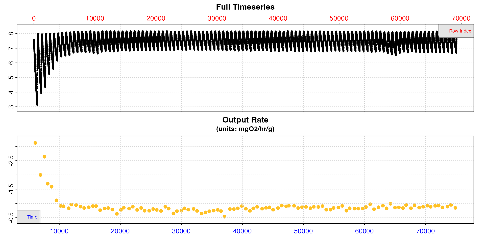

These rates seem to be a bit lower than those we extracted for RMR
[above](#crintselect), as we would expect for an SMR.

This is an opportunity to do some quality control before we select our
final rates to determine SMR. Looking at the plot above there is one
result that seems to be uncharacteristically low compared to the others
with a value just over 0.5. Looking at the summary table we can see this
is from replicate 48. We can plot a selection of rates from this region
using `pos` and the y-axis range will adapt to provide a more detailed
view of the range of rates.

``` r
plot(zeb_ar.int_conv, type = "rate", pos = 30:80)
```

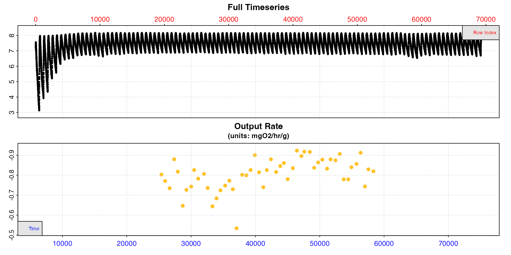

Replicate 48 does seem to be anomalously low. If we go back to the
`auto_rate.int` results object we can use `pos` to plot this replicate
for a closer look. We’ll do this in two different ways using `type`.
Firstly the rate in the context of the whole replicate, secondly the
`auto_rate` output plot for this replicate which has more diagnostic
plots, but only shows the `measure` phase.

``` r
plot(zeb_ar.int, type = "rep", pos = 48)
```

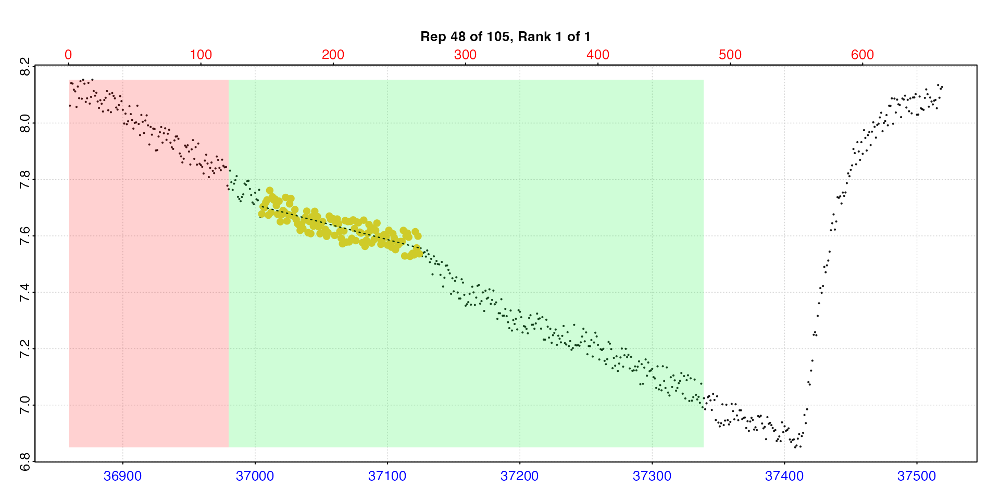

``` r
plot(zeb_ar.int, type = "ar", pos = 48)
```

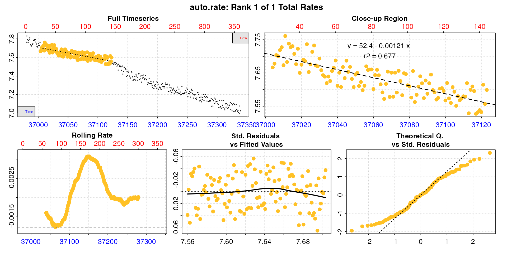

Looking at these plots this result does seem to be anomalous, and in
this replicate the rate extracted is not really representative. It also
has a lower r-squared which otherwise varies from 0.72 to 0.98. There
seems to be an anomaly in the oxygen trace, maybe a sensor glitch or
slight temperature change. Issues like this causing glitches in the
trace are very common.

Therefore, it would be perfectly acceptable and justifiable to manually
exclude this result (there are also 1 or 2 others we might want to
investigate). To apply such selection criteria objectively and
systematically would require examining multiple experiments. This is why
definitions of metrics like SMR and analysis parameters should usually
be decided upon after thoroughly exploring all your results. After this
you should be able to arrive at a set of objective and reasonable
selection criteria.

### Select

To get our final SMR we just need to use `select_rate` again with our
chosen criteria, and pipe the result to `mean`. We decided
[above](#arintextract) our definition of SMR would be the mean of the
lowest 10th percentile of the rates extracted from each replicate. We
also want to exclude the result from replicate 48.

Excluding this replicate could be achieved in a number of ways in
`select_rate`. We could use `method = "rsq"` to select only results with
r-squared above a certain value which excludes this one. We could use
the `time_omit` method to exclude this rate based on its timepoint
(found in the summary table), or use the `rep` method simply to select
all replicates *except* this one. There is a specific `rep_omit` method
however to remove particular replicates.

``` r
SMR <- zeb_ar.int_conv |>
  select_rate(method = "rep_omit", n = 48) |>
  select_rate(method = "lowest_percentile", n = 0.1) |>
  summary() |>
  mean()
#> select_rate: Selecting rates which *ARE NOT* from 'rep_omit' replicates...
#> ----- Selection complete. 1 rate(s) removed, 104 rate(s) remaining -----
#> select_rate: Selecting lowest 10th percentile of *absolute* rate values...
#> ----- Selection complete. 93 rate(s) removed, 11 rate(s) remaining -----
#> 
#> # summary.convert_rate # ----------------
#> Summary of all converted rates:
#> 
#>     rep rank intercept_b0 slope_b1   rsq density   row endrow  time endtime  oxy endoxy     rate adjustment rate.adjusted rate.input oxy.unit time.unit volume   mass area  S  t  P rate.abs rate.m.spec rate.a.spec output.unit rate.output
#>  1:  21    1         34.5 -0.00141 0.725      NA 13533  13652 19372   19491 7.24   7.12 -0.00141 -0.0000849      -0.00132   -0.00132     mg/L       sec   0.12 0.0009   NA NA NA NA   -0.571      -0.634          NA   mgO2/hr/g      -0.634
#>  2:  28    1         46.5 -0.00163 0.789      NA 18076  18195 23915   24034 7.45   7.29 -0.00163 -0.0000878      -0.00154   -0.00154     mg/L       sec   0.12 0.0009   NA NA NA NA   -0.667      -0.741          NA   mgO2/hr/g      -0.741
#>  3:  32    1         50.5 -0.00162 0.802      NA 20764  20883 26603   26722 7.38   7.16 -0.00162 -0.0000895      -0.00153   -0.00153     mg/L       sec   0.12 0.0009   NA NA NA NA   -0.661      -0.735          NA   mgO2/hr/g      -0.735
#>  4:  35    1         48.4 -0.00144 0.722      NA 22801  22920 28640   28759 7.27   7.11 -0.00144 -0.0000908      -0.00135   -0.00135     mg/L       sec   0.12 0.0009   NA NA NA NA   -0.582      -0.647          NA   mgO2/hr/g      -0.647
#>  5:  36    1         54.4 -0.00160 0.783      NA 23373  23492 29212   29331 7.50   7.31 -0.00160 -0.0000912      -0.00151   -0.00151     mg/L       sec   0.12 0.0009   NA NA NA NA   -0.654      -0.726          NA   mgO2/hr/g      -0.726
#>  6:  41    1         60.3 -0.00163 0.780      NA 26675  26794 32514   32633 7.36   7.25 -0.00163 -0.0000933      -0.00153   -0.00153     mg/L       sec   0.12 0.0009   NA NA NA NA   -0.663      -0.736          NA   mgO2/hr/g      -0.736
#>  7:  42    1         55.0 -0.00144 0.727      NA 27421  27540 33260   33379 7.26   7.11 -0.00144 -0.0000938      -0.00134   -0.00134     mg/L       sec   0.12 0.0009   NA NA NA NA   -0.580      -0.644          NA   mgO2/hr/g      -0.644
#>  8:  43    1         58.8 -0.00152 0.776      NA 28056  28175 33895   34014 7.28   7.14 -0.00152 -0.0000942      -0.00142   -0.00142     mg/L       sec   0.12 0.0009   NA NA NA NA   -0.615      -0.684          NA   mgO2/hr/g      -0.684
#>  9:  44    1         62.7 -0.00160 0.775      NA 28667  28786 34506   34625 7.37   7.20 -0.00160 -0.0000946      -0.00151   -0.00151     mg/L       sec   0.12 0.0009   NA NA NA NA   -0.652      -0.724          NA   mgO2/hr/g      -0.724
#> 10:  47    1         66.4 -0.00162 0.792      NA 30595  30714 36434   36553 7.54   7.32 -0.00162 -0.0000958      -0.00152   -0.00152     mg/L       sec   0.12 0.0009   NA NA NA NA   -0.657      -0.730          NA   mgO2/hr/g      -0.730
#> 11:  54    1         74.8 -0.00164 0.766      NA 35329  35448 41168   41287 7.21   7.02 -0.00164 -0.0000988      -0.00154   -0.00154     mg/L       sec   0.12 0.0009   NA NA NA NA   -0.666      -0.740          NA   mgO2/hr/g      -0.740
#> -----------------------------------------
#> 
#> # mean.convert_rate # -------------------
#> Mean of all rate results:
#> 
#> Mean of 11 output rates:
#> [1] -0.704
#> [1] "mgO2/hr/g"
#> -----------------------------------------
```

We can see the summary of the final 11 selected rates, and then the mean
of these. This is our final SMR.

## Summary

Now we have our final results for each metric.

``` r
MMR: -3.05 mg/h/g
RMR: -0.94 mg/h/g
SMR: -0.70 mg/h/g
```

Typically these rates would now be reported as positive values.

## Reporting

The above is a lengthy description of an analysis, so this vignette may
not give a good impression of just how succinct a `respR` analysis may
be. This code block shows the entire analysis for SMR.

### Complete analysis

``` r
# Inspect data ------------------------------------------------------------
zeb <- inspect(zeb_intermittent.rd)

# Background --------------------------------------------------------------
bg_pre <- subset_data(zeb, from = 0, to = 4999, by = "time") |>
  calc_rate.bg()
bg_post <- subset_data(zeb, from = 75140, to = 79251, by = "time") |>
  calc_rate.bg()

# SMR Analysis ------------------------------------------------------------
  # Subset ------------------------------------------------------------------
  zeb |> 
  subset_data(from = 5840, 
              to = 75139,
              by = "row") |>
  # Extract rates -----------------------------------------------------------
  auto_rate.int(starts = 660,
                wait = 120,
                measure = 360,
                method = "lowest",
                width = 120,
                by = "row")  |>
  # Adjust ------------------------------------------------------------------
  adjust_rate(by = bg_pre, 
              by2 = bg_post,
              method = "linear") |>
  # Convert -----------------------------------------------------------------
  convert_rate(oxy.unit = "mg/L",      
               time.unit = "secs",     
               output.unit = "mg/h/g", 
               volume = 0.12,        
               mass = 0.0009) |>
  # Select -----------------------------------------------------------------
  select_rate(method = "rep_omit", n = 48) |>
  select_rate(method = "lowest_percentile", n = 0.1) |>
  summary() |>
  mean()
```

### How to report analysis methods

The ultimate aim of `respR` was to enable clear reporting and
reproducible analyses. This is an example of how we might report the
above analysis in a manuscript.

*“Data was analysed using the R package `respR` (Harianto et al. 2019).
The `auto_rate.int` function was used to extract the lowest rate across
a two minute window from each replicate. Rates were adjusted for
background using pre- and post-experiment blank recordings with no
specimen, assuming a linear increase in background rate over time.
Obviously anomalous rates were excluded, and SMR was defined as the mean
of the lowest 10th percentile of remaining adjusted rates.”*

## Alternative approaches

Previous versions of this vignette demonstrated use of different
methods, such as looping and subsetting of data, to extract individual
replicates for processing through `calc_rate` or `auto_rate`. These
approaches still work and are archived
[here](https://januarharianto.github.io/respR/articles/archive/intermittent_old.html)
in case they are of use in some cases, for example if you want to
extract rates from the same oxygen range in each replicate. However for
most analyses use of `calc_rate.int` or `auto_rate.int` is the
recommended approach.
