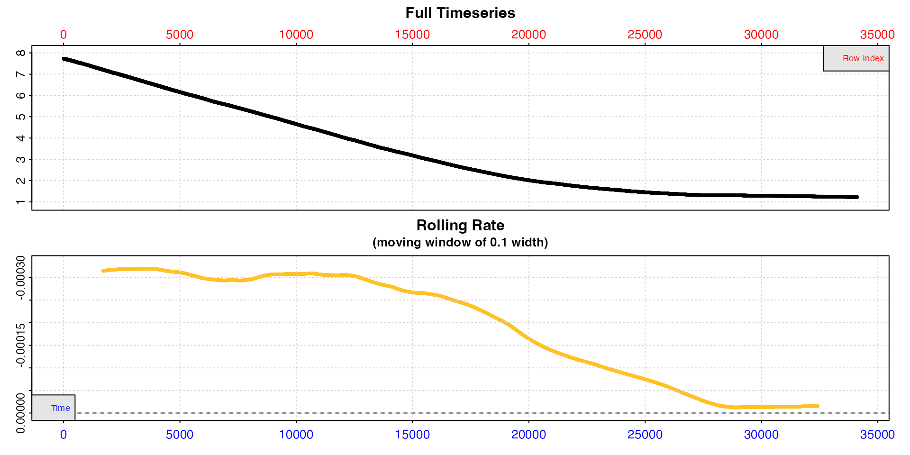
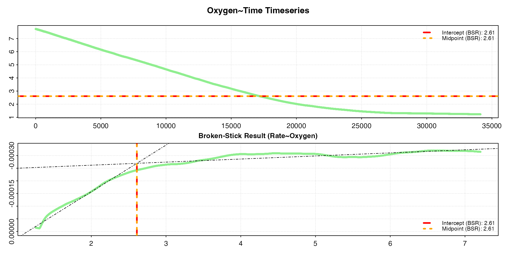
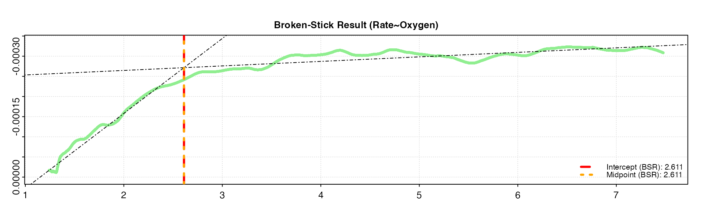
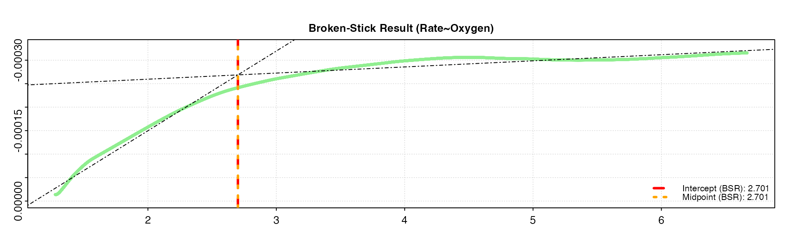
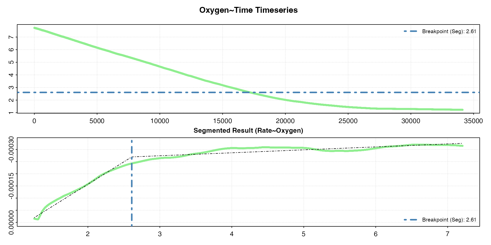
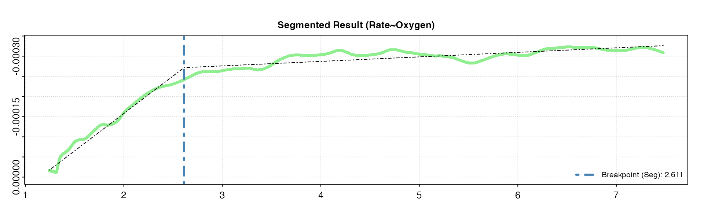
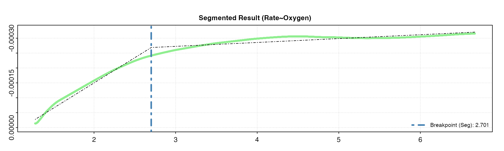
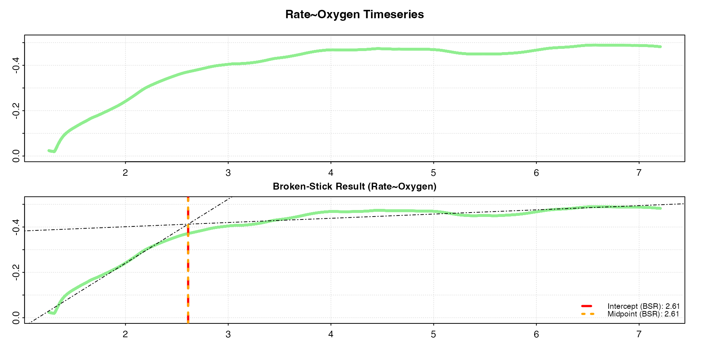

# Critical oxygen values (PCrit)

## Introduction

Some species are *oxyconformers*, with their routine oxygen uptake rate
directly proportional to the oxygen supply available from the
environment. So, for example, at 50% oxygen their uptake rate will be
half that at 100% oxygen. Many species however are *oxyregulators*, and
are able to regulate uptake and maintain routine rates as oxygen supply
declines until a value is reached below which uptake precipitously
declines. Note however that the classification of species into strict
oxyconformers and oxyregulators is somewhat simplistic; there can be a
continuum of responses between these extremes, and many intermediate
cases ([Mueller & Seymour, 2011](#ref-muellerRegulationIndexNew2011)).

The oxygen value below which routine uptake becomes unsustainable is
termed the critical oxygen value (COV) or $`P_{crit}`$. Historically,
this was expressed in units of partial pressure of oxygen (e.g. kPa),
hence $`P_{crit}`$ as in the critical *pressure* of oxygen, but it is
also commonly expressed in units of oxygen concentration. Here we will
use the term COV to describe the value regardless of units.

COV is typically determined in long duration, closed-chamber
respirometry experiments in which the specimen is allowed to deplete the
oxygen in the chamber, with the resulting oxygen trace used to identify
the breakpoint in the relationship of uptake rate to oxygen
concentration.

## `oxy_crit`

[`oxy_crit()`](https://januarharianto.github.io/respR/reference/oxy_crit.md)
is the `respR` function for determining critical oxygen values. It
accepts two forms of data input.

The first is the general structure that all other `respR` functions
accept, a `data.frame` or `inspect` object containing paired values of
time and oxygen pressure or concentration. For data frame inputs, if
time and oxygen are not the first and second columns respectively, the
columns can be specified with the `time` and `oxygen` inputs. For
`inspect` objects, these will have been specified already. These
`oxygen~time` data are used to calculate a rolling rate of the specified
`width`, the default being 0.1 or 10% of the width of the entire
dataset. This rolling rate, similar to the lower panel in the `inspect`
plot in the example [below](#inspect), is the data upon which the
critical value analysis is conducted.

The second data input option is to input a `data.frame` containing
already calculated rates, paired with relevant oxygen values. Typically
these would be the mean or central oxygen value of the range over which
the rate was determined. These columns can be specified using the `rate`
and `oxygen` inputs. In this case, the function does not calculate a
rolling rate internally, and the critical point analysis is performed on
the input data directly. The rates can be absolute (i.e. whole chamber
or whole specimen) or mass-specific rates; either will give identical
results.

### Methods

The
[`oxy_crit()`](https://januarharianto.github.io/respR/reference/oxy_crit.md)
function currently provides two methods to detect the breakpoint in the
`rate~oxygen` relationship. With high-resolution, relatively non-noisy
data these typically return similar results, but results may vary
depending on the characteristics of the data.

#### Broken-stick

`method = "bsr"`

The first method is the “broken-stick” regression (BSR) approach adapted
from Yeager & Ultsch
([1989](#ref-yeagerPhysiologicalRegulationConformation1989)), in which
two segments of the data are iteratively fitted and the intersection
with the smallest sum of the residual sum of squares between the two
linear models is the estimated critical point. Two slightly different
ways of reporting this breakpoint are detailed by Yeager & Ultsch; the
*intercept* and *midpoint*. These are usually close in value, and
`oxy_crit` returns both.

#### Segmented

`method = "segmented"`

The second method is a wrapper for the “segmented regression” approach
available as part of the
[`segmented`](https://cran.r-project.org/web/packages/segmented/index.html)
R package by Muggeo ([2008](#ref-muggeoModelingTemperatureEffects2008)).
This estimates the critical point by iteratively fitting two
intersecting models and selecting the point that minimises the “gap”
between the fitted lines.

### Additional inputs

The function has the following additional inputs:

#### `width`

For data entered as `time` and `oxygen` values, this controls the width
of the internally calculated rolling regression which provides the rates
upon which the critical point analysis is conducted. The default is
`0.1`, representing 10% of the length of the dataset and seems to
perform well with most data we have tested it with. However, the `width`
should be chosen carefully after experimenting with different values and
examining the results. Too low a value and the rolling rate will be
noisy making it more difficult to detect a critical breakpoint, too high
and it will be oversmoothed. See
[here](https://januarharianto.github.io/respR/articles/auto_rate.html#width)
for a discussion of appropriate widths and the implications of
overfitting rolling rates, and also [Prinzing et
al. 2021](https://januarharianto.github.io/respR/articles/refs.html#references)
for an excellent discussion of appropriate widths in rolling
regressions. This is an important analysis parameter with major
implications for the output values and should be reported alongside the
results.

#### `thin`

This affects the `"bsr"` method only, which is computationally
intensive, and thins large datasets which take a prohibitively long time
to process to more manageable lengths. This is entered as an integer
value, with the default being `thin = 5000`, and the data frame will be
uniformly subsampled to this number of rows before analysis. The default
value of 5000 has in testing provided a good balance between speed and
results accuracy and repeatability. However, results may vary with
different datasets, so users should experiment with varying the value.
To perform no subsampling and use the entire dataset enter
`thin = NULL`. As an example of the time difference, processing the
`squid.rd` data (around 34000 rows long) with the default `thin = 5000`
decreases the processing time from ~60s to ~6s, but outputs an identical
result. It has no effect on datasets shorter than the `thin` input, or
on the `"segmented"` method.

#### `parallel`

Default is `FALSE`. This controls the use of parallel processing in
running the analysis. If your dataset is particularly large or high
resolution and analyses are taking a prohibitively long time to process
you can try changing this to `TRUE`. Note, this option sometimes causes
errors depending on the system or platform, so should only be used if it
is really needed.

#### `plot`

Default is `TRUE`. Controls if a plot is produced.

## Determine COV from oxygen~time data

Here we will run through an example critical oxygen value analysis of a
dataset included with `respR`.

### Data

The example data, `squid.rd`, contains data from an experiment on the
market squid, *Doryteuthis opalescens*. More information about the data,
including its source and methods, can be obtained with
[`?squid.rd`](https://januarharianto.github.io/respR/reference/squid.rd.md).

``` r
squid.rd
#>         Time Oxygen
#>        <int>  <num>
#>     1:     0 7.7264
#>     2:     1 7.7264
#>     3:     2 7.7264
#>     4:     3 7.7264
#>     5:     4 7.7264
#>    ---             
#> 34116: 34115 1.2310
#> 34117: 34116 1.2310
#> 34118: 34117 1.2310
#> 34119: 34118 1.2310
#> 34120: 34119 1.2310
```

### Inspecting data

We can visualise and examine the dataset using the
[`inspect()`](https://januarharianto.github.io/respR/reference/inspect.md)
function.

``` r
squid <- inspect(squid.rd)
#> inspect: Applying column default of 'time = 1'
#> inspect: Applying column default of 'oxygen = 2'
#> inspect: No issues detected while inspecting data frame.
#> 
#> # print.inspect # -----------------------
#>                 Time Oxygen
#> numeric         pass   pass
#> Inf/-Inf        pass   pass
#> NA/NaN          pass   pass
#> sequential      pass      -
#> duplicated      pass      -
#> evenly-spaced   pass      -
#> 
#> -----------------------------------------
```



Note how the date are plotted against both time (bottom blue axis) and
row index (top red axis), which in these data, recordings of oxygen once
per second, happen to be equivalent. We can see from the bottom plot, a
rolling rate across 10% of the total data, that the uptake rate is
relatively consistent to around row 12,000, after which it declines
steadily. We cannot easily tell from these plots what oxygen
concentration this occurs at. For now, we can see the dataset is free of
errors or issues, so we can pass the saved `squid` object to the
dedicated
[`oxy_crit()`](https://januarharianto.github.io/respR/reference/oxy_crit.md)
function.

### Critical oxygen value analyses

We will process the squid data using both methods and compare the
results.

### Broken-stick method

This is the default method, so does not need to be explicitly specified
with the `method` input, and we will let the default `width = 0.1` be
applied.

``` r
squid.bsr <- oxy_crit(squid)
#> oxy_crit: Applying column defaults of 'time = 1' and 'oxygen = 2'.
#> oxy_crit: Performing Broken-Stick analysis (Yeager and Ultsch 1989)...
#> oxy_crit: Broken-Stick analysis completed in 4.1 seconds.
#> plot.oxy_crit: Plotting Oxygen ~ Time derived critical oxygen results.
```

    #> 
    #> # print.oxy_crit # ----------------------
    #> 
    #> Broken-Stick (Yeager & Ultsch 1989):
    #> 
    #> Sum RSS      6.4041e-07 
    #> Intercept    2.6101 
    #> Midpoint     2.6097 
    #> 
    #> -----------------------------------------



The output figure shows the two different BSR results, the *intercept*
and *midpoint* critical oxygen values, indicated by horizontal lines
against the original timeseries data and vertical lines on a
`rate~oxygen` plot. In this case, the lines overlay each other, and the
[`print()`](https://rdrr.io/r/base/print.html) output shows that, in
these data, both methods give virtually identical values for the COV:
2.61 mg L⁻¹. Note that for some data, depending on various
characteristics, such as noise, abruptness of the break, etc., the two
different BSR methods may provide different results.

#### Summary results

Full analysis results can be seen using
[`summary()`](https://rdrr.io/r/base/summary.html).

``` r
summary(squid.bsr)
#> 
#> # summary.oxy_crit # --------------------
#> 
#> --Broken-Stick Analysis Summary--
#> Top ranked result shown. Others available in '$results' element of output.
#> 
#>    splitpoint     sumRSS l1_coef.b0  l1_coef.b1  l2_coef.b0  l2_coef.b1 crit.intercept crit.midpoint
#> 1:     2.6089 6.4041e-07 0.00021172 -0.00018433 -0.00023767 -1.2152e-05         2.6101        2.6097
#> 
#> -----------------------------------------
```

#### Changing the width

Let’s change the `width` input to see how it affects the results. We’ll
try smaller and larger `width` values. We can also use `panel` to output
only the rolling rate plot.

``` r
oxy_crit(squid, width = 0.05, panel = 2)
```



``` r
oxy_crit(squid, width = 0.2, panel = 2)
```



Note how the rolling rate plot with the higher width is much smoother,
with a less pronounced breakpoint. Increasing the width by too much can
smooth out critical breakpoints, which is the very thing that the
function is trying to detect. We can see the smaller `width` gives a
similar result as the default value of `0.1`, while the larger `width`
estimates the breakpoints as a slightly higher value. Therefore, in this
case the default value of `0.1` seems to be appropriate and give
reliable results.

When running COV analyses, users should experiment with different
widths, choose them appropriately and objectively, and report them in
the analysis methods alongside results.

### Segmented method

Now we’ll run the analysis using the `"segmented"` method, again with
the default `width = 0.1`.

``` r
squid.seg <- oxy_crit(squid, method = "segmented")
#> oxy_crit: Applying column defaults of 'time = 1' and 'oxygen = 2'.
#> oxy_crit: Performing Segmented breakpoint analysis (Muggeo 2003)...
#> oxy_crit: Segmented analysis convergence attained in 1 iterations.
#> plot.oxy_crit: Plotting Oxygen ~ Time derived critical oxygen results.
```

    #> 
    #> # print.oxy_crit # ----------------------
    #> 
    #> Segmented (Muggeo 2003):
    #> 
    #> Std. Err.    0.0017852 
    #> Breakpoint   2.6099 
    #> 
    #> -----------------------------------------



For these particular data, we get the exact same result as the BSR
method: 2.61 mg L⁻¹. This will not be the case with every dataset.

#### Summary results

Full analysis results can be seen using
[`summary()`](https://rdrr.io/r/base/summary.html).

``` r
summary(squid.seg)
#> 
#> # summary.oxy_crit # --------------------
#> 
#> --Segmented Analysis Summary--
#>     Intercept           x       U1.x psi1.x   std.err crit.segmented
#> 1: 0.00021175 -0.00018435 0.00017219      0 0.0017852         2.6099
#> 
#> -----------------------------------------
```

#### Changing the width

Again, let’s try different `width` inputs.

``` r
oxy_crit(squid, width = 0.05, method = "segmented", panel = 2)
```



``` r
oxy_crit(squid, width = 0.2, method = "segmented", panel = 2)
```



We can see again we get the same values with these different widths as
in the BSR method above, though this won’t necessarily be the case with
every dataset. The higher width tends to oversmooth the rolling rate,
and gives a slightly higher COV.

## Determine COV from rate~oxygen data

The example above used raw `oxygen~time` data, and so the function
calculated a rolling rate internally, then performed the breakpoint
analysis on these data. However, the function can accept already
calculated `rate~oxygen` data, and the function will perform the
analysis using these data directly. These rates can be either absolute
rates (i.e. whole specimen or whole chamber), or mass-specific rates;
both will give identical critical value results. The rates can also be
unitless rates, that is the rate values output by `respR` functions such
as `calc_rate` and `auto_rate` before conversion to proper oxygen rate
units, as well as rates already converted to units. As long as all rates
are dimensionally equivalent the critical oxygen analysis will output
identical results.

Here, we’ll use the `"rolling"` method in
[`auto_rate()`](https://januarharianto.github.io/respR/reference/auto_rate.md)
to perform a rolling regression on the squid data to get a rolling rate,
and we’ll convert these to a mass-specific rate in `ml/h/g`. We’ll pair
these values in a data frame with a rolling mean of the oxygen value
from the same window using the
[`roll`](https://cran.r-project.org/web/packages/roll/index.html)
package.

This new dataset will be shorter by the input `width` setting, because
the rolling methods start at row `width/2` and run to `width/2` before
the final row (`roll` has options to output results of the same length,
but it necessarily involves using partial windows at the start and end
of the data, which can result in questionable outputs and is not really
necessary here).

``` r
## Perform rolling rate analysis 
squid_ar <- auto_rate(squid.rd, method = "rolling", width = 0.1, plot = FALSE)
## Convert rates
squid_conv <- convert_rate(squid_ar,
                           time.unit = "sec",
                           oxy.unit = "mg/L",
                           output.unit = "ml/h/g",
                           volume = 12.3,
                           mass = 0.02141,
                           t = 15,
                           S = 30,
                           P = 1.01)
#> convert_rate: Object of class 'auto_rate' detected. Converting all rates in '$rate'.
## Extract rates
rate <- squid_conv$rate.output

## Rolling mean of oxygen value
oxy <- na.omit(roll::roll_mean(squid.rd[[2]], width = 0.1 * nrow(squid.rd)))
  
## Combine to data.frame
squid_oxy_rate <- data.frame(oxy,
                             rate)
```

Now we run the `oxy_crit` analysis. We use the `oxygen` and `rate`
inputs to specify the columns.

``` r
oxy_crit(squid_oxy_rate, oxygen = 1, rate = 2)
#> oxy_crit: Performing analysis using Rate ~ Oxygen data.
#> oxy_crit: Performing Broken-Stick analysis (Yeager and Ultsch 1989)...
#> oxy_crit: Broken-Stick analysis completed in 3.9 seconds.
#> plot.oxy_crit: Plotting Rate ~ Oxygen derived critical oxygen results.
```



    #> 
    #> # print.oxy_crit # ----------------------
    #> 
    #> Broken-Stick (Yeager & Ultsch 1989):
    #> 
    #> Sum RSS      1.5021 
    #> Intercept    2.6101 
    #> Midpoint     2.6097 
    #> 
    #> -----------------------------------------

Notice that we get the same critical values as we got with the analysis
on `oxygen~time` data [above](#bsr), despite the very different rate
values (y-axis) and the fact these are *mass-specific* rates. Both
absolute and mass-specific rates will give identical results.

### Extracting results

Results of `oxy_crit` analyses can be extracted from the results object.
The critical oxygen value is in the `$crit` element. If the `"bsr"`
method has been used it will contain both results, if the `"segmented"`
method it is a single value.

``` r
## bsr results
squid.bsr$crit
#> $crit.intercept
#> [1] 2.6101
#> 
#> $crit.midpoint
#> [1] 2.6097

## segmented result
squid.seg$crit
#> [1] 2.6099
```

Summary results can also be exported to a `data.frame` by using the
[`summary()`](https://rdrr.io/r/base/summary.html) function and
`export = TRUE`.

``` r
## bsr
bsr_res <- summary(squid.bsr, export = TRUE)
```

    #>    splitpoint     sumRSS l1_coef.b0  l1_coef.b1  l2_coef.b0  l2_coef.b1 crit.intercept crit.midpoint
    #>         <num>      <num>      <num>       <num>       <num>       <num>          <num>         <num>
    #> 1:     2.6089 6.4041e-07 0.00021172 -0.00018433 -0.00023767 -1.2152e-05         2.6101        2.6097

``` r
## seg
seg_res <- summary(squid.seg, export = TRUE)
```

    #>     Intercept           x       U1.x psi1.x   std.err crit.segmented
    #>         <num>       <num>      <num>  <num>     <num>          <num>
    #> 1: 0.00021175 -0.00018435 0.00017219      0 0.0017852         2.6099

## Which method to use

With high resolution, non-noisy data the BSR and Segmented methods
identify very similar, if not identical, critical oxygen values (COVs).
This will vary with other data, and one of the methods might work better
than the other depending on the characteristics of the data. Which to
use and report should be informed after familiarisation with how they
work and testing with the data. Most importantly, results should be
reported alongside analysis parameters which affect the outputs, such as
the width of the rolling regression.

There are additional methods to identify critical breakpoints in
oxygen~time data, such as the non-linear regression method of Marshall
et al. ([2013](#ref-marshallEstimatingPhysiologicalTolerances2013)), and
the α-method of Seibel et al.
([2021](#ref-seibelOxygenSupplyCapacity2021)). It is our plans to
support these and others in updates to `oxy_crit`, as well as metrics
which describe the degree of oxyregulation of a specimen in intermediate
cases e.g. ([Mueller & Seymour,
2011](#ref-muellerRegulationIndexNew2011); [Tang,
1933](#ref-tangRateOxygenConsumption1933)).

There is a huge literature (see [below](#refs)) and healthy debate about
the use and application of $`P_{crit}`$, much of it recent. Before
running any COV analysis you should familiarise yourself with the
literature, particularly critiques of the different methods, and their
utility.

We particularly recommend the debate by Wood
([2018](#ref-woodFallacyCritAre2018)) and Regan et al.
([2019](#ref-reganDonThrowFish2019)), and also Ultsch & Regan
([2019](#ref-ultschUtilityDeterminationCrit2019)). Also be sure to check
out the latest developments by Seibel et al.
([2021](#ref-seibelOxygenSupplyCapacity2021)).

An important point to note is that $`P_{crit}`$ and COVs are most
frequently used as a *comparative* metric. Since analytical options
chosen by the investigator such as regression width inherently affect
the result, it is arguably more important that these are kept the same
amongst analyses that will be the basis of comparisons, rather than
consideration of the ultimate values *per se*. Therefore, it is
important that investigators fully report the parameters under which
these analyses have been conducted. This allows editors and reviewers to
reproduce and assess analyses, and subsequent investigators to judge if
comparisons to their own results are appropriate. `respR` has been
designed to make the process of reporting these analyses
straightforward - see
[`vignette("reproducibility")`](https://januarharianto.github.io/respR/articles/reproducibility.md).

## References

****Rodgers, EM**, **Opinion, AGR**, **Gomez Isaza, DF**, **Rašković,
B**, **Poleksić, V**, & **De Boeck, G****. **2021**. Double whammy:
Nitrate pollution heightens susceptibility to both hypoxia and heat in a
freshwater salmonid. *Science of The Total Environment*, 765, 142777.
<https://doi.org/10.1016/j.scitotenv.2020.142777>

****Seibel, BA**, **Andres, A**, **Birk, MA**, **Burns, AL**, **Shaw,
CT**, **Timpe, AW**, & **Welsh, CJ****. **2021**. Oxygen supply capacity
breathes new life into critical oxygen partial pressure (Pcrit).
*Journal of Experimental Biology*, 224(8).
<https://doi.org/10.1242/jeb.242210>

****Seibel, BA**, & **Deutsch, C****. **2020**. Oxygen supply capacity
in animals evolves to meet maximum demand at the current oxygen partial
pressure regardless of size or temperature. *Journal of Experimental
Biology*, jeb.210492. <https://doi.org/10.1242/jeb.210492>

****Ultsch, GR**, & **Regan, MD****. **2019**. The utility and
determination of *P* crit in fishes. *Journal of Experimental Biology*,
222(22), jeb203646. <https://doi.org/10.1242/jeb.203646>

****Regan, MD**, **Mandic, M**, **Dhillon, RS**, **Lau, GY**, **Farrell,
AP**, **Schulte, PM**, **Seibel, BA**, **Speers-Roesch, B**, **Ultsch,
GR**, & **Richards, JG****. **2019**. Don’t throw the fish out with the
respirometry water. *Journal of Experimental Biology*, 222(6),
jeb200253. <https://doi.org/10.1242/jeb.200253>

****Negrete, B**, & **Esbaugh, AJ****. **2019**. A methodological
evaluation of the determination of critical oxygen threshold in an
estuarine teleost. *Biology Open*, bio.045310.
<https://doi.org/10.1242/bio.045310>

****Reemeyer, JE**, & **Rees, BB****. **2019**. Standardizing the
determination and interpretation of *P* crit in fishes. *Journal of
Experimental Biology*, jeb.210633. <https://doi.org/10.1242/jeb.210633>

****Wood, CM****. **2018**. The fallacy of the *P* crit are there more
useful alternatives? *Journal of Experimental Biology*, 221(22),
jeb163717. <https://doi.org/10.1242/jeb.163717>

****Regan, MD**, & **Richards, JG****. **2017**. Rates of hypoxia
induction alter mechanisms of O ₂ uptake and the critical O ₂ tension of
goldfish. *Journal of Experimental Biology*, 220(14), 2536–2544.
<https://doi.org/10.1242/jeb.154948>

****Snyder, S**, **Nadler, LE**, **Bayley, JS**, **Svendsen, MBS**,
**Johansen, JL**, **Domenici, P**, & **Steffensen, JF****. **2016**.
Effect of closed *v* . Intermittent-flow respirometry on hypoxia
tolerance in the shiner perch *Cymatogaster* *Aggregata*: Effect of
method choice on hypoxia tolerance. *Journal of Fish Biology*, 88(1),
252–264. <https://doi.org/10.1111/jfb.12837>

****Rogers, NJ**, **Urbina, MA**, **Reardon, EE**, **McKenzie, DJ**, &
**Wilson, RW****. **2016**. A new analysis of hypoxia tolerance in
fishes using a database of critical oxygen level ( *P* _(crit) ).
*Conservation Physiology*, 4(1), cow012.
<https://doi.org/10.1093/conphys/cow012>

****Leiva, FP**, **Urbina, MA**, **Cumillaf, JP**, **Gebauer, P**, &
**Paschke, K****. **2015**. Physiological responses of the ghost shrimp
Neotrypaea uncinata (Milne Edwards 1837) (Decapoda: Thalassinidea) to
oxygen availability and recovery after severe environmental hypoxia.
*Comparative Biochemistry and Physiology Part A: Molecular & Integrative
Physiology*, 189, 30–37. <https://doi.org/10.1016/j.cbpa.2015.07.008>

****Monteiro, DA**, **Thomaz, JM**, **Rantin, FT**, & **Kalinin, AL****.
**2013**. Cardiorespiratory responses to graded hypoxia in the
neotropical fish matrinxã (Brycon amazonicus) and traíra (Hoplias
malabaricus) after waterborne or trophic exposure to inorganic mercury.
*Aquatic Toxicology*, 140-141, 346–355.
<https://doi.org/10.1016/j.aquatox.2013.06.011>

****Marshall, D**, **Bode, M**, & **White, CR****. **2013**. Estimating
physiological tolerances - a comparison of traditional approaches to
nonlinear regression techniques. *Journal of Experimental Biology*,
jeb.085712. <https://doi.org/10.1242/jeb.085712>

****Stinchcombe, JR**, & **Kirkpatrick, M****. **2012**. Genetics and
evolution of function-valued traits: Understanding environmentally
responsive phenotypes. *Trends in Ecology & Evolution*, 27(11), 637–647.
<https://doi.org/10.1016/j.tree.2012.07.002>

****Mueller, CA**, & **Seymour, RS****. **2011**. The Regulation Index:
A new method for assessing the relationship between oxygen consumption
and environmental oxygen. *Physiological and Biochemical Zoology*,
84(5), 522–532. <https://doi.org/10.1086/661953>

****Muggeo, VMR****. **2008**. Modeling temperature effects on
mortality: Multiple segmented relationships with common break points.
*Biostatistics*, 9(4), 613–620.
<https://doi.org/10.1093/biostatistics/kxm057>

****Lighton, JRB**, & **Turner, RJ****. **2004**. Thermolimit
respirometry: An objective assessment of critical thermal maxima in two
sympatric desert harvester ants, Pogonomyrmex rugosus and P.
californicus. *Journal of Experimental Biology*, 207(11), 1903–1913.
<https://doi.org/10.1242/jeb.00970>

****Nickerson, DM**, **Facey, DE**, & **Grossman, GD****. **1989**.
Estimating Physiological Thresholds with Continuous Two-Phase
Regression. *Physiological Zoology*, 62(4), 866–887.
<https://doi.org/10.1086/physzool.62.4.30157934>

****Yeager, DP**, & **Ultsch, GR****. **1989**. Physiological regulation
and conformation: A BASIC program for the determination of critical
points. *Physiological Zoology*, 62(4), 888–907.
<https://doi.org/10.1086/physzool.62.4.30157935>

****Duggleby, RG****. **1984**. Regression analysis of nonlinear
Arrhenius plots: An empirical model and a computer program. *Computers
in Biology and Medicine*, 14(4), 447–455.
<https://doi.org/10.1016/0010-4825(84)90045-3>

****van Winkle, W**, & **Mangum, C****. **1975**. Oxyconformers and
oxyregulators: A quantitative index. *Journal of Experimental Marine
Biology and Ecology*, 17(2), 103–110.
<https://doi.org/10.1016/0022-0981(75)90025-8>

****Mangum, C**, & **Winkle, WV****. **1973**. Responses of Aquatic
Invertebrates to Declining Oxygen Conditions. *American Zoologist*,
13(2), 529–541. <https://doi.org/10.1093/icb/13.2.529>

****Tang, P-S****. **1933**. On the rate of oxygen consumption by
tissues and lower organisms as a function of oxygen tension. *The
Quarterly Review of Biology*, 8(3), 260–274.
<https://doi.org/10.1086/394439>
