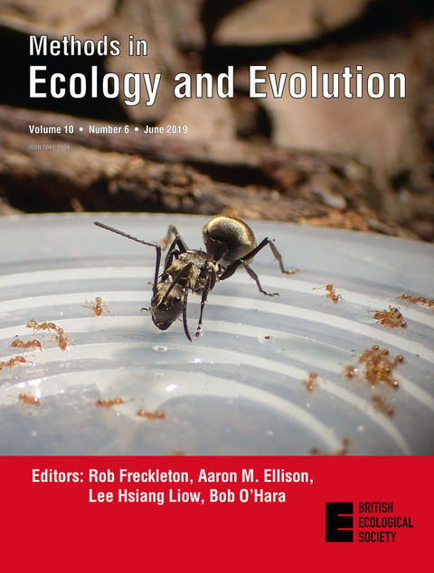

# References

## respR publication

  
`respR` has been peer reviewed and published. Please
[**cite**](https://januarharianto.github.io/respR/authors.html#citation)
this paper if you use it in your work:  
 

**Harianto, J., Carey, N., & Byrne, M.** respR - An R Package for the
Manipulation and Analysis of Respirometry Data. *Methods in Ecology and
Evolution*, 10(6), 912–920. [doi:
10.1111/2041-210X.13162](https://doi.org/10.1111/2041-210X.13162).

   
   
 

## See also

These packages may also help you analyse respirometry data:

- [FishResp](https://fishresp.org) - Sergey Morozov
- [respfun](https://github.com/nicholascarey/respfun) - Nicholas Carey
- [respirometry](https://cran.r-project.org/package=respirometry) -
  Matthew A. Birk
- [rMR](https://cran.r-project.org/package=rMR) - Tyler L. Moulton
- [segmented](https://cran.r-project.org/package=segmented) - Vito M. R.
  Muggeo

Be sure to check out the [**FishResp**](https://fishresp.org) site,
where the developers are releasing a variety of amazing free and open
source tools for conducting respirometry experiments, including
resources for building your own respirometry equipment at a fraction of
the cost of commercial systems.

## References

The following publications were instrumental in developing `respR` and
writing the vignettes on this site, or are referenced in the various
vignettes. See
[**here**](https://januarharianto.github.io/respR/articles/oxycrit.html#refs)
for references specific to critical oxygen analyses (i.e. $`P_{crit}`$).
   
   

****Killen, SS**, **Christensen, EAF**, **Cortese, D**, **Závorka, L**,
**Norin, T**, **Cotgrove, L**, **Crespel, A**, **Munson, A**, **Nati,
JJH**, **Papatheodoulou, M**, & **McKenzie, DJ****. **2021**. Guidelines
for reporting methods to estimate metabolic rates by aquatic
intermittent-flow respirometry. *Journal of Experimental Biology*,
224(18), jeb242522. <https://doi.org/10.1242/jeb.242522>

****Chabot, D**, **Zhang, Y**, & **Farrell, AP****. **2021**. Valid
oxygen uptake measurements: Using high R2 values with good intentions
can bias upward the determination of standard metabolic rate. *Journal
of Fish Biology*, 98(5), 1206–1216. <https://doi.org/10.1111/jfb.14650>

****Prinzing, TS**, **Zhang, Y**, **Wegner, NC**, & **Dulvy, NK****.
**2021**. Analytical methods matter too: Establishing a framework for
estimating maximum metabolic rate for fishes. *Ecology and Evolution*.
<https://doi.org/10.1002/ece3.7732>

****Morozov, S**, **McCairns, RJS**, & **Merilä, J****. **2019**.
FishResp: R package and GUI application for analysis of aquatic
respirometry data. *Conservation Physiology*, 7(1).
<https://doi.org/10.1093/conphys/coz003>

****Carey, N**, **Harianto, J**, & **Byrne, M****. **2016**. Sea urchins
in a high-CO ₂ world: Partitioned effects of body size, ocean warming
and acidification on metabolic rate. *The Journal of Experimental
Biology*, 219(8), 1178–1186. <https://doi.org/10.1242/jeb.136101>

****Svendsen, MBS**, **Bushnell, PG**, & **Steffensen, JF****. **2016**.
Design and setup of intermittent-flow respirometry system for aquatic
organisms: How to set up an aquatic respirometry system. *Journal of
Fish Biology*, 88(1), 26–50. <https://doi.org/10.1111/jfb.12797>

****Stoffels, RJ****. **2015**. Physiological trade-offs along a
fast-slow lifestyle continuum in fishes: What do they tell us about
resistance and resilience to hypoxia? *PLOS ONE*, 10(6), e0130303.
<https://doi.org/10.1371/journal.pone.0130303>

****Moulin, L**, **Grosjean, P**, **Leblud, J**, **Batigny, A**,
**Collard, M**, & **Dubois, P****. **2015**. Long-term mesocosms study
of the effects of ocean acidification on growth and physiology of the
sea urchin Echinometra mathaei. *Marine Environmental Research*, 103,
103–114. <https://doi.org/10.1016/j.marenvres.2014.11.009>

****Gamble, S**, **Carton, AG**, & **Pirozzi, I****. **2014**. Open-top
static respirometry is a reliable method to determine the routine
metabolic rate of barramundi, *Lates* *Calcarifer*. *Marine and
Freshwater Behaviour and Physiology*, 47(1), 19–28.
<https://doi.org/10.1080/10236244.2013.874119>

****Clark, TD**, **Sandblom, E**, & **Jutfelt, F****. **2013**. Aerobic
scope measurements of fishes in an era of climate change: Respirometry,
relevance and recommendations. *Journal of Experimental Biology*,
216(15), 2771–2782. <https://doi.org/10.1242/jeb.084251>

****Kurihara, H**, **Yin, R**, **Nishihara, G**, **Soyano, K**, &
**Ishimatsu, A****. **2013**. Effect of ocean acidification on growth,
gonad development and physiology of the sea urchin Hemicentrotus
pulcherrimus. *Aquatic Biology*, 18(3), 281–292.
<https://doi.org/10.3354/ab00510>

****Marshall, D**, **Bode, M**, & **White, CR****. **2013**. Estimating
physiological tolerances - a comparison of traditional approaches to
nonlinear regression techniques. *Journal of Experimental Biology*,
jeb.085712. <https://doi.org/10.1242/jeb.085712>

****White, CR**, & **Kearney, MR****. **2013**. Determinants of
inter-specific variation in basal metabolic rate. *Journal of
Comparative Physiology B*, 183(1), 1–26.
<https://doi.org/10.1007/s00360-012-0676-5>

****Muggeo, VMR****. **2008**. Modeling temperature effects on
mortality: Multiple segmented relationships with common break points.
*Biostatistics*, 9(4), 613–620.
<https://doi.org/10.1093/biostatistics/kxm057>

****Lighton, JRB****. **2008**. *Measuring Metabolic Rates*. Oxford
University Press.
<https://doi.org/10.1093/acprof:oso/9780195310610.001.0001>

****Zivot, E**, & **Wang, J****. **2006**. *Modeling financial time
series with S-PLUS* (Second). Springer-Verlag.

****Muggeo, VMR****. **2003**. Estimating regression models with unknown
break-points. *Statistics in Medicine*, 22(19), 3055–3071.
<https://doi.org/10.1002/sim.1545>

****Leclercq, N**, **Gattuso, J-P**, & **Jaubert, J****. **1999**.
Measurement of oxygen metabolism in open-top aquatic
mesocosms:application to a coral reef community. *Marine Ecology
Progress Series*, 177, 299–304. <https://doi.org/10.3354/meps177299>

****Jones, MC**, **Marron, JS**, & **Sheather, SJ****. **1996**. A brief
survey of bandwidth selection for density estimation. *Journal of the
American Statistical Association*, 91(433), 401–407.
<https://doi.org/10.2307/2291420>

****Sheather, SJ**, & **Jones, MC****. **1991**. A reliable data-based
bandwidth selection method for kernel density estimation. *Journal of
the Royal Statistical Society. Series B (Methodological)*, 53(3),
683–690. <https://www.jstor.org/stable/2345597>

****Steffensen, JF****. **1989**. Some errors in respirometry of aquatic
breathers: How to avoid and correct for them. *Fish Physiology and
Biochemistry*, 6(1), 49–59. <https://doi.org/10.1007/BF02995809>

****Yeager, DP**, & **Ultsch, GR****. **1989**. Physiological regulation
and conformation: A BASIC program for the determination of critical
points. *Physiological Zoology*, 62(4), 888–907.
<https://doi.org/10.1086/physzool.62.4.30157935>

****Smith Jr, KL****. **1987**. Food energy supply and demand: A
discrepancy between particulate organic carbon flux and sediment
community oxygen consumption in the deep Ocean1: Food energy supply and
demand. *Limnology and Oceanography*, 32(1), 201–220.
<https://doi.org/10.4319/lo.1987.32.1.0201>

****Silverman, BW****. **1986**. *Density Estimation for Statistics and
Data Analysis*. Routledge. <https://doi.org/10.1201/9781315140919>

****Raykar, V**, & **Duraiswami, R****. **2006**. Fast optimal bandwidth
selection for kernel density estimation. *Proceedings of the Sixth SIAM
International Conference on Data Mining*, 2006.
<https://doi.org/10.1137/1.9781611972764.53>
