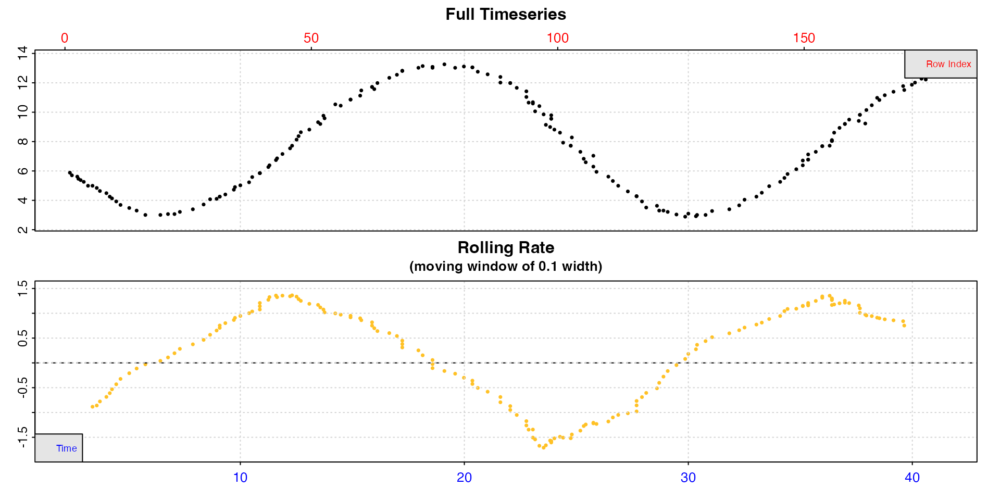
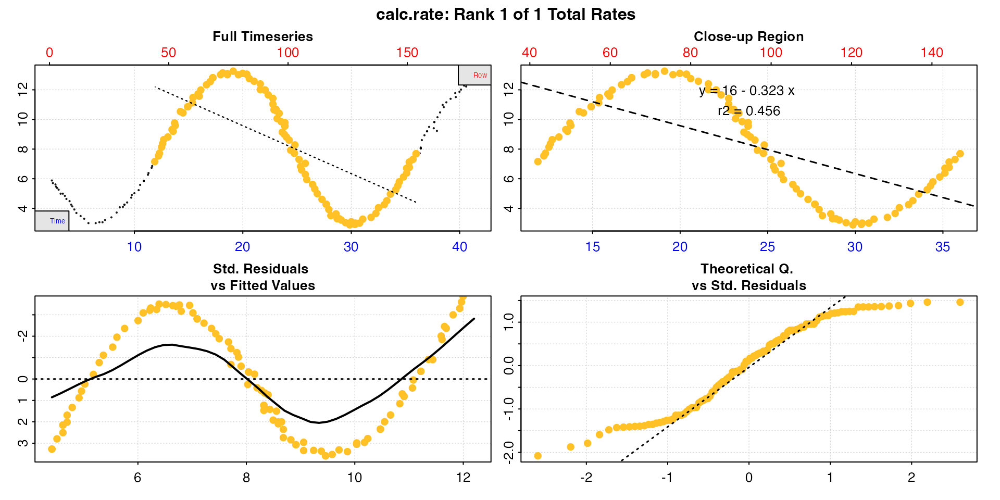

# Two-point rate calculation

## Introduction

Best practice in respirometry is usually to use linear regression on
timeseries recordings of oxygen concentrations to derive a slope and
thus rate of oxygen use.

Technically, an overall rate between any two timepoints can be
calculated using only two oxygen values as long as they are accurate
recordings, and in the past “*closed-bottle*” respirometry was common,
where only the initial and final oxygen concentrations were measured. In
the modern day there is little excuse for not using continuous data
recordings when it is relatively cheap and easy to do so. Use of only
initial and ending oxygen values gives no information about how rates of
use may have fluctuated, and such rates are highly sensitive to error
and inaccurate readings.

For some applications however, there may be valid reasons for using only
two datapoints of oxygen concentration separated by a known time period
to calculate a rate. This could be in cases of periodic and irregular
oxygen monitoring or sampling in the field, or alternatively where the
investigator is not interested in oxygen uptake or productions rates
*per se*, but rather in total oxygen flux over a time period. An example
of this is in respirometry studies of sediment communities, where oxygen
flux is correlated with transport of other chemicals or nutrients
(e.g. [Smith
Jr. 1987](https://januarharianto.github.io/respR/articles/refs.html#references)).
In such cases, even if continuous data exist, fitting a linear
regression to these data may not be appropriate, and in fact could be
grossly incorrect. This is particularly the case where oxygen or oxygen
use fluctuates significantly over the time period of the experiment,
such as with a diurnal rhythm. In such cases linear regressions may be
significantly skewed.

`respR` includes the ability to calculate two-point rates. While we
recommend it not be used for analysis of data from laboratory based
studies looking at organismal metabolic rates, we have incorporated the
functionality for the above use-cases, and for analysis of historical
closed-bottle respirometry data.

## Example

### Inspecting data

This dataset contain recordings of oxygen from an eutrophic lake over a
period of 40 hours starting at midnight.

    #>      hours oxygen
    #>      <num>  <num>
    #>   1:  2.39   5.88
    #>   2:  2.48   5.70
    #>   3:  2.72   5.61
    #>   4:  2.77   5.47
    #>   5:  2.87   5.38
    #>  ---             
    #> 174: 40.99  12.64
    #> 175: 40.99  12.87
    #> 176: 41.33  12.90
    #> 177: 41.33  12.90
    #> 178: 41.33  12.90

Time is in hours, and oxygen in `mg/L`. Let’s
[`inspect()`](https://januarharianto.github.io/respR/reference/inspect.md)
the data.

``` r
lake_insp <- inspect(lake, rate.rev = FALSE)
```



We can see the oxygen in the lake fluctuates with a diurnal rhythm,
increasing over the day and decreasing at night, and the rolling rate
similarly fluctuates. We use `rate.rev = FALSE` here to force the
rolling rate plot to plot production rates as positive values, uptake
rates as negative.

### Calculating rate

The researcher wants to know the overall rate of oxygen flux between 12
noon on the first day (hour 12) and 12 noon on the next (hour 36). We
will use `calc_rate` as we normally would to get the rate between these
two timepoints.

``` r
lake_rate <- calc_rate(lake_insp, 
                       from = 12,
                       to = 36,
                       by = "time")
```



It is immediately clear the linear regression based rate completely
misrepresents the overall oxygen flux and instead of a small net oxygen
flux, suggests there is a large net oxygen consumption.

``` r
summary(lake_rate)
#> 
#> # summary.calc_rate # -------------------
#> Summary of all rate results:
#> 
#>    rep rank intercept_b0 slope_b1   rsq row endrow time endtime  oxy endoxy rate.2pt   rate
#> 1:  NA    1           16   -0.323 0.456  42    147 11.9      36 7.16   7.69   0.0221 -0.323
#> -----------------------------------------
```

However, looking at the summary we can see the `$rate.2pt` as the second
from last column. This is simply the oxygen differential between the two
timepoints divided by the time difference, and shows us there was a
slight net oxygen production. In this case, this rate is much more
relevant towards the research question.

### Converting

This two-point rate will not be the one converted if we pass the
`calc_rate` object to `convert_rate`, however we can enter the two-point
rate as a value to convert the rate to units.

``` r
lake_rate_conv <- convert_rate(0.02213001,
                               oxy.unit = "mg/l",
                               time.unit = "hrs",
                               output.unit = "umol/h",
                               volume = 1)
```

Alternatively, extract it directly.

``` r
lake_rate_conv <- convert_rate(lake_rate$rate.2pt,
                               oxy.unit = "mg/l",
                               time.unit = "hrs",
                               output.unit = "umol/h",
                               volume = 1)
#> convert_rate: Numeric input detected. Converting all numeric rates.
# print
lake_rate_conv
#> 
#> # print.convert_rate # ------------------
#> Rank 1 of 1 rates:
#> 
#> Input:
#> [1] 0.0221
#> [1] "mg/L" "hr"  
#> Converted:
#> [1] 0.692
#> [1] "umolO2/hr"
#> 
#> To see full results use summary().
#> -----------------------------------------
```

Note here the `volume` input. This is not a respirometry experiment, so
there is no “volume” as such. In this situation this should refer to the
volume used in the oxygen concentration unit (in this case litres), so
the rate is dimensionally relative to *any* volume of this lake. This
will be the case for any units of oxygen, because internally they are
all converted to mg/L before conversion to the output units, so for use
cases like the above it should always be entered as `1`.

We can verify our hourly rate is correct using the `$oxy` and `$endoxy`
values from the summary table. If we convert these to `umol/L`, then
divide the difference by the time taken (24h) then we should get the
same result.

``` r
# start conc
convert_DO(7.16, from = "mg/l", to = "umol/L")
#> [1] 223.8

# end conc
convert_DO(7.69, from = "mg/l", to = "umol/L")
#> [1] 240.3

# Total in umol produced over this 24h period per L
240.3 - 223.8
#> [1] 16.5

# umol produced per hour per Litre of lake over 24h
16.5/24
#> [1] 0.6875
```

We can see this is very close to the same result. The difference is
simply due to the higher precision of internal values compared to what
we have entered here.
