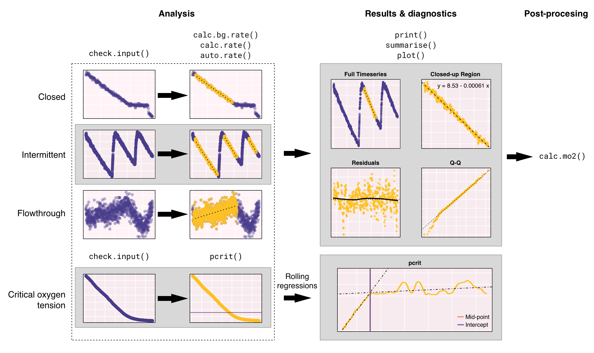
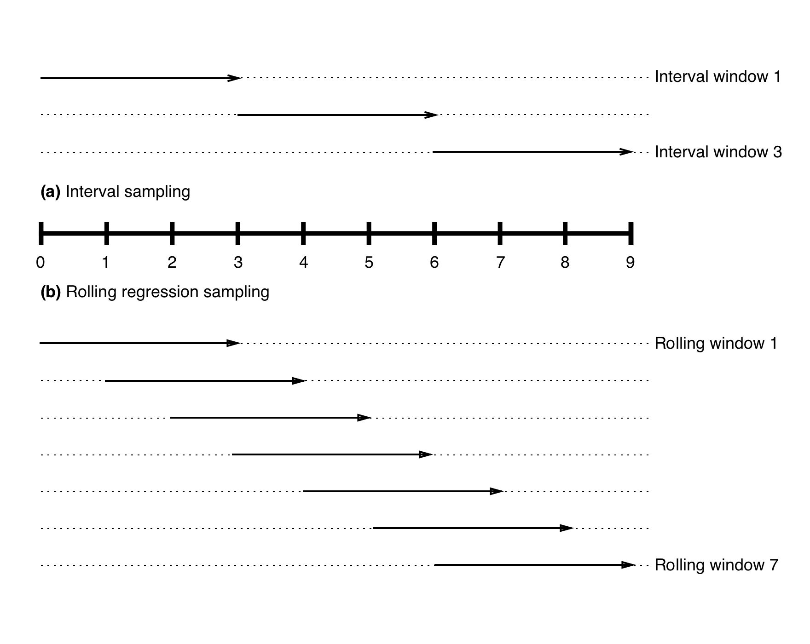
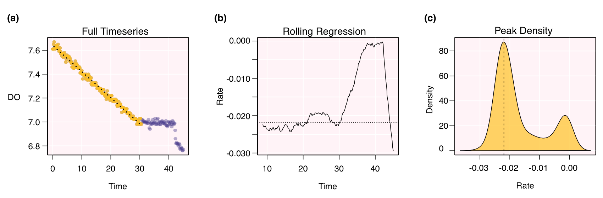

```{r, echo = F}
library(respR)
library(knitr)
library(readr)

# set pander table-layout options
library(pander)
panderOptions('table.alignment.default', function(df)
    ifelse(sapply(df, is.numeric), 'right', 'left'))
panderOptions('table.split.table', Inf)
panderOptions('big.mark', ",")
panderOptions('keep.trailing.zeros', TRUE)

opts_chunk$set(collapse = TRUE, comment = "#>", tidy = TRUE, highlight = TRUE)
```

# Introduction

Metabolic rate is a fundamental trait associated with virtually all biological functions, and is key in predicting patterns in ecology and conservation biology, from populations (Seibel and Drazen, 2007, Barneche et al., 2014) to ecosystems (Brown et al., 2004). It has been widely used to investigate the effects of external stressors on organisms, and has seen increased interest in studies of climate change where warming is expected to drive increased metabolism in ectotherms (Pörtner, 2002, McElroy et al., 2012, Carey et al., 2016, Delorme & Sewell, 2016). By far the most common metric used to assess physiological performance in animals, metabolic rates are determined from whole organisms to the level of cells and tissues (White & Kearney, 2013). They are typically quantified using respirometry, which measures oxygen uptake over time as a proxy for metabolic rate, since oxygen is rarely stored and anaerobic metabolism is typically sustained over only brief periods (Lighton, 2008).  

There are four broad methodological approaches to respirometry: closed, intermittent flow, flowthrough and open. In closed respirometry, $O_2$ decrease is measured within a hermetically sealed chamber of known volume, sometimes set within a closed loop to allow mixing of the environment within the chamber. Oxygen recordings may be continuous through use of an oxygen probe, periodic through withdrawing water or gas samples at set intervals, or a two-point measurement consisting of the initial and final concentrations. Metabolic rates are estimated from respirometry data by assuming a linear relationship between variables, and estimates of metabolic rate are straightforward in constant volume respirometry using the equation: $$VO_2 = \Delta O_2V$$ where $\Delta O_2V$ is the slope of the regression that describes the rate of change in $O_2$ concentration over time, or in the case of a two-point measurement, the difference in $O_2$ concentration divided by time elapsed, and $V$ is the volume of the container (Lighton, 2008). 
<!-- Note, we use here and in the package the term $RO_2$ to denote rate of $O_2$ depletion or uptake within an experiment. We use this term used to distinguish it from other common terms, for example $VO_2$ which is can be used to denote both volumetric O2 uptake and whole animal uptake, or $MO_2$ which typically denotes mass-specific uptake. -->


In intermittent flow respirometry, $O_2$ concentration is measured as described above, but periodically the chamber is flushed with new water or air, returning it to initial conditions, resealed, and the experiment repeated (Svendsen et al., 2016). This technique is essentially closed respirometry, but with the incorporation of repeated measures. Depending on the metabolic rate metric being investigated, final respiration rate can be calculated as the mean of the measures (e.g. Carey et al., 2016), or the lowest or highest rates recorded in any trial (e.g. Stoffels, 2015). 
<!--[nc-will try and find a better ref for that]

Stoffels, R. J. (2015). Physiological trade-offs along a fast-slow lifestyle continuum in fishes: What do they tell us about resistance and resilience to hypoxia? Plos One, 10(6), e0130303. https://doi.org/10.1371/journal.pone.0130303
-->

Flowthrough respirometry involves a closed chamber, but with a regulated flow of air or water through it at a precisely determined rate. After equilibrium has been achieved, the oxygen concentration differential between the incurrent and excurrent channels, along with the flow rate, allows calculation of the oxygen extracted from the flow volume per unit time: $$VO_2 = (C_iO_2 - C_eO_2)FR$$ where $VO_2$ is the rate of $O_2$ consumption over time, $C_iO_2$ and $C_eO_2$ are the incurrent and excurrent $O_2$ concentrations, and $FR$ is the flow rate of water through the system  (Lighton, 2008).

A final method is open respirometry, in which an open tank or semi-enclosed area is used, but the input or mixing rate of oxygen from the surroundings is known or found to be negligible relative to oxygen consumption of the specimens (Leclercq et al., 1999). It is seldom used, but for some applications it is a sufficient and practical methodology (e.g. Gamble et al., 2014). The common equation used for open respirometry is: $$VO_2 = \Delta O_2V + \phi_d$$ where $\Delta O_2V$ is the slope of the regression that relates $O_2$ concentration to time, $V$ is the volume of the container and $\phi_d$ is the oxygen flux as determined by Fick's Law (Leclercq et al., 1999).

<!--[nc - so the following needs to be spot on. Physiologists get very worked up (if not confused themselves) about the differences between these, esp. SMR v Routine v Resting v Basal! Especially those who work on ecto vs endo therms]-->

Depending on the experiment, different metabolic rate parameters may be of interest to researchers. These include maximum metabolic rates (MMR, or $MO_{2,max}$), rates under high activity or exhaustive exercise, and minimal metabolic rates ($MO_{2,min}$), which, depending on the organism, may be termed standard (SMR), basal (BMR), or resting metabolic rates, and typically represent the minimum metabolic cost of maintaining biological functioning (White and Kearney, 2014). Routine metabolic rate (RMR), is similar to $MO_{2,min}$, but takes into account that in some organisms energy is expended on small, sponateous movements to maintain posture or position (Rogers et al. 2016). Another metric of great interest is the critical oxygen tension, which represents the lowest level of oxygen at which aerobic metabolism is independent of the ambient partial pressure of oxygen ($P_{crit}$; Yeager & Ultsch, 1989, Hochachka and Somero, 2002). 

<!--White, C. R., & Kearney, M. R. (2014). Metabolic scaling in animals: methods, empirical results, and theoretical explanations. Comprehensive Physiology, 4(1), 231–256. https://doi.org/10.1002/cphy.c110049-->

Respirometry experiments are increasingly assimilating large, high-resolution datasets and are run for longer periods (e.g. 20 h, Norin & Malte, 2012). In most cases, processing the data involves an *ad hoc* selection of data points with undefined criteria, and subsequent manual processing of the data subset(s) using a spreadsheet program (e.g. Microsoft Excel) or an integrated development environment (IDE, e.g. R or Matlab). These approaches can be tedious and time consuming especially when spreadsheet programs struggle with the vast datasets that are generated, while IDEs require a degree of expertise to use and have substantial learning curves. Dedicated software are also available to perform metabolic rate analyses, but many have costly licensing requirements (e.g. AutoResp by Loligo Systems), complicating or preventing their use on multiple machines, and are proprietary and closed-source, hindering scientific reproducability and transparency.  

<!-- r.e. below para. LoLinR is not strictly for respirometry - just monotonic, something-changing-over-time data -->

Recently, a number of open-source R software packages have become available which are designed for, or are suitable to analyse respirometry data. The `respirometry` package (https://CRAN.R-project.org/package=respirometry) contains a comprehensive collection of tools to explore and evaluate experimental parameters in aquatic respirometry and is useful for the design and diagnosis of experimental setups. The `rMR` package (https://CRAN.R-project.org/package=rMR) performs interval-based metabolic rate calculations and has a method to automatically detect $P_{crit}$ using the "broken-stick" regression method (Yeager & Ultsch, 1989). `LoLinR` (Olito et al., 2017), while not strictly coded with respirometry in mind, provides a statistically robust method of detecting a "best-fit" regression that applies to the calculation of metabolic rate, and performs very well at identifying truly linear subsets of a data series. Importantly, the packages above all assume that data are monotonic with evenly-spaced sampling periods with respect to time and do not have the tools to analyse complicated datasets that require extraction of multiple respirometry parameters.

Here we describe the R package `respR`, a set of functions desgined to provide an efficient, structured, and reproduceable workflow for the analysis of respirometry-related data (Fig. 1). The package contains utilities to: (1) analyse closed, intermittent, flow-through and open respirometry data, (2) determine volume, mass, and surface area specific oxygen uptake rates, (3) automatically detect maximal and minimal rates, $P_{crit}$, or the most linear results in large datasets with the help of traditional rolling regression and kernel density estimation techniques. Other functions useful in processing respirometry data are avaliable, and are described in more detail in our online html vignette (https://januarharianto.github.io/respR/). The package has a strong focus on aquatic respirometry, however similar principals apply to aerial respirometry, so the analysis workflow should also be suitable for these data. We demonstrate the utility of the package by analysing three datasets as case studies and proof of concept. These data were collected using closed, intermittent and flow-through respirometry, and we show how `respR` might be used to determine $MO_{2,max}$, $MO_{2,min}$, and $P_{crit}$.

# Package overview

`respR` can be automatically installed from the GitHub repository using the `devtools` package:

```{r eval=F}
devtools::install_github("januarharianto/respR")
library(respR)
```

To explore `respR` and its main functions we have provided example data that can be called directly after the package is loaded. Detailed information about all example data, including their source and methods, can be obtained with the `?` command in the R console (e.g. `?urchin2013`). All analyses described in this paper use the example data provided and are fully reproducible (see supplementary information).

## Data import and exploration

Data should be formatted correctly before use in `respR`. The function `check.input()` performs error checks on a data frame of any size, and can extract a two-column data frame for data exploration and subsequent analyses. Data must be numeric, because `respR` has limited support for date/time data (e.g. `POSIXct` and `POSIXlt` classes) and performing calculations on different time formats have many caveats that are beyond the scope of the package. Time data, being a continuous variable, should be sequential, without duplicates. Ideally, time data should also be evenly-spaced, that is, the time period between samples are equal, as this will affect data-extraction methods later on if data is analysed by sample length instead of time. Error check results are summarised in the R console (see supplementary material) and plot of the data is shown for visual inspection (e.g. Fig. 1).

It should be noted that invoking `check.input` is optional -- the main functions in our package will readily accept any data frame as long as data are numeric. Running `check.input` is an exploratory step that flags potential issues about the data before it is further analysed.  

## Estimating the rate of change in $O_2$ concentration ($RO_2$)

### Calculating background $RO_2$

Background $RO_2$ is often measured to account for the influence of bacterial respiration in the chamber, and applied as a correction to the main experiment (Rodgers et al., 2016). Since background rates typically account for a small percentage of experimental rates, multiple “blank” experiments are routinely conducted and the rates are averaged across several datasets to obtain a more accurate estimate of the correction (e.g. Carey and Sigwart, 2014; Daoud et al., 2007). The function `calc.bg.rate()` uses simple linear regression to simultaneously process multiple background rate measurements and produces an output object that can be used in later functions that accept background rate arguments. Because the oxygen consumption units are non-volume and non-mass specific at the point of correction, the functions in `respR` can adjust $RO_2$ directly without bias: $$RO_{2(correction)} = RO_2 - RO_{2(bg)}$$

### Extracting data for $RO_2$

Typically, the analysis respirometry data requires the selection one or more linear sections of the raw data for more accurate calculations of $RO_2$ (e.g. Gordon et al., 1989, Dorey et al., 2014, Chu & Gal, 2017). The function `calc.rate()` can manually extract and process data segments from respiromety data. Data segments can be selected by (1) time period, (2) row numbers, (3) $O_2$ decrease or (4) proportion, which should accomodate most, if not all, data selection requirements and allow for consistent reporting of methods and results (e.g. estimating $RO_2$ over a regular 10-minute time window across multiple specimens). Rates are determined using linear regression, however a two-point analysis is also included alongside all regression results.

For more complex respirometry parameters, the function `auto.rate()` uses rolling regression and kernel density estimate algorithms to detect patterns in respirometry data. It can calculate maximum or minimum rates, extract rates at non-overlapping intervals, and has an exploratory method to detect the most linear sections of the data. When called, the function takes the data frame of length $m$, and performs a rolling regression of sample size $n$ iteratively across the length of the data (Fig. 2b). Thus, a total of $(m−n)+1$ number of overlapping regressions are fitted, and we obtain a new dataset of regressions as a function of time (rolling regression, Fig. 3b), which is then ranked by size to obtain maximum and minimum values.  There are clear advantages to using `auto.rate()` when estimating parameters for $MO_{2,max}$ or $MO_{2,min}$. Unlike manual methods, where data may be arbitrary selected, `auto.rate()` adheres to well-defined rules to obtain the rate of interest, so its methods are results are transparent and fully reproducible. To estimate the most linear sections of the data, further computations are performed after rolling regressions. Logically, linear sections of the data should reflect a consistently stable (i.e. flat) rate. The function takes advantage of this relationship and performs a Gaussian kernel density estimate of all regressions (see Silverman, 1986). New datasets around the kernel bandwidth are then resampled around peak values of the generated model, re-analysed, and then ranked by size to determine the most linear sections.

The function `calc.rate.ft()` is used to specifically analyse flowthrough respirometry data, and is similar to `calc.rate()` in functionality. However it accepts additional inputs of incurrent and excurrent oxygen concentration, and flow rate, that are not available in `calc.rate()`. Results in `calc.rate.ft()` are processed to determine the mean or modal $RO_2$.

## Estimating critical oxygen tension, $P_{crit}$

We provide two methods of estimating $P_{crit}$. The first is a "broken-stick" regression (BSR) approach, adopted from Yeager and Ultsch (1989) in which two segments of the data are iteratively fitted and the intersection with the smallest sum of the residual sum of squares between the two linear models is the estimated critical point. The second method is the segmented, or "broken-line" regression approach, presented by Muggeo (2003) which estimates the critical point by iteratively fitting two intersecting models on the data, and picking the point that minimises the "gap" between the two fitted lines. To determine $P_{crit}$, $RO_2$ (or $MO_2$) and ambient oxygen concentration ($PO_2$) must be provided. If $RO_2$ has not been calculated, `pcrit()` can automatically perform a rolling regression directly from raw respirometry data to generate the data and arrange it against $PO_2$, and then use one of the two methods to estimate the value (Fig. 4).


## Converting units of $RO_2$ to $VO_2$ and $MO_2$

For delibrate reasons, units of measurements are not used in any of the functions `calc.bg.rate()`, `calc.rate()`, `auto.rate()`, `calc.rate.ft()` and `pcrit()`. This is because
 


# Reproducibility and data accesibility

We have ensured that any computational analysis performed by `respR` are fully reproducible. All main functions produce an output object of class `list`, which contains all the data and variables needed to re-analyse the results, within R or in other software.

# Tables & Figures

**Table 1.** Main functions available in `respR`.
```{r, echo=F, message=F}
# use this later to show table
library(readr)
listfunctions <- read_csv('tables/list-of-functions.csv')
```

```{r, echo=F, results='asis'}
pander(listfunctions)
```


```{r, echo = F, out.width = "900px"}

```

**Fig. 1.** Diagram showing a typical workflow in the analysis of respirometry data using `respR`. Data is first checked for errors before the main functions are used to extract and analyse segments of the data. Summarised results and diagnostic plots provide immediate visual feedback on the outcome of the analyses. Once the rate estimates are obtained, they can be converted into volume and/or mass-specific rates.


```{r, echo = F, out.width = "650px"}

```

**Fig. 2** Simplified illustration showing the sampling windows used by `auto.rate()` during **(a)** interval regression analysis, where sample windows do not overlap and **(b)** rolling regression analysis, where sample windows overlap and move forward by one sample unit at a time.


```{r, echo = F, , out.width = "800px"}

```

**Fig. 3** Selected output plots from the function `calc.rate()` for the analysis of the data frame `urchin2013`. 
