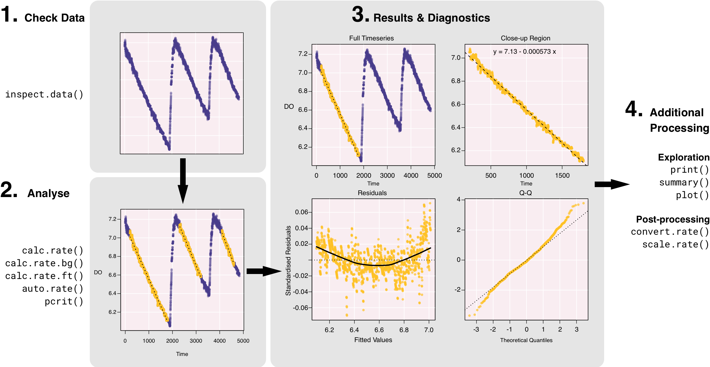
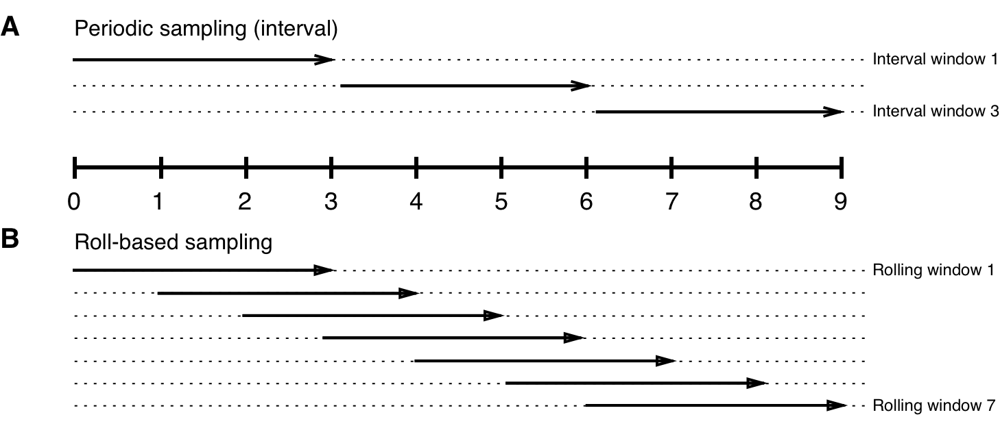

```{r, echo = F}
library(respR)
library(knitr)
library(readr)
Sys.setenv(TZ="Australia/Sydney")

# set pander table-layout options
library(pander)
panderOptions('table.alignment.default', function(df)
    ifelse(sapply(df, is.numeric), 'right', 'left'))
panderOptions('table.split.table', Inf)
panderOptions('big.mark', ",")
panderOptions('keep.trailing.zeros', TRUE)

opts_chunk$set(collapse = TRUE, comment = "#>", tidy = TRUE, highlight = TRUE)
```

# Abstract

1. Estimating metabolic rate from respirometry is a conceptually simple, but fundamentally difficult technique where researchers often arbitrarily extract one or more segments of a $O_2$ timeseries to estimate the parameter of interest. As respirometry data becomes increasingly large and analytical approaches become more complex, manipulating it remains a challenge for current tools, with important limitations that prevent objectively reproducible research.

2. Here we describe the `respR` R package, a collection of functions that implement a workflow-based approach to automate the analysis and visualisation of respirometry data. The package can be used for closed, intermittent flow, flowthrough and open respirometry and uses well-defined sets of rules to realiably and rapidly facilitate reproducible results.

3. We demonstrate how `respR` uses novel and parallelised computing methods such as rolling regressions and kernel density estimates to sample the data iteratively to realiably detect maximum, minimum & most linear sections of the data, and critical oxygen tension, $P_{crit}$.

4. Although designed specifically with aquatic respirometry in mind, the object-oriented approach of the package the "dimensionless" nature of its analytical functions mean that parts of the package could easily be used to estimate any other linear relationships in other research disciplines.


# Introduction

Metabolic rate is a fundamental trait associated with virtually all biological functions and is key in predicting patterns in ecology and conservation biology, from populations (Seibel and Drazen, 2007, Barneche et al., 2014) to ecosystems (Brown et al., 2004). It has been widely investigated in studies of the effects of external stressors on organisms, and is increasingly used to study resilience in climate change-related studies where warming is expected to drive increased metabolism in ectotherms (e.g. Pörtner, 2002, McElroy et al., 2012, Carey et al., 2016, Delorme & Sewell, 2016). By far the most common metric used to assess physiological performance in animals, metabolic rate has been determined from whole organisms, to the level of cells and tissues (White & Kearney, 2013). They are typically quantified using respirometry, which measures oxygen uptake over time as a proxy for metabolic rate, since oxygen is rarely stored and anaerobic metabolism is typically sustained over only brief periods (Lighton, 2008).  

There are four broad methodological approaches to respirometry: closed, intermittent flow, flowthrough and open. In closed respirometry, $O_2$ decrease is measured within a hermetically sealed chamber of known volume, sometimes set within a closed loop to allow mixing of the environment within the chamber. Oxygen recordings may be continuous through use of an oxygen probe, periodic through withdrawing water or gas samples at set intervals, or a two-point measurement consisting of the initial and final concentrations. Metabolic rates are estimated from respirometry data by assuming a linear relationship between variables, and estimates of metabolic rate are straightforward in constant volume respirometry using the equation: $$VO_2 = \Delta O_2V$$ where $\Delta O_2V$ is the slope of the regression that describes the rate of change in $O_2$ concentration over time, or in the case of a two-point measurement, the difference in $O_2$ concentration divided by time elapsed, and $V$ is the volume of the container (Lighton, 2008). 
<!-- Note, we use here and in the package the term $RO_2$ to denote rate of $O_2$ depletion or uptake within an experiment. We use this term used to distinguish it from other common terms, for example $VO_2$ which is can be used to denote both volumetric O2 uptake and whole animal uptake, or $MO_2$ which typically denotes mass-specific uptake. -->


In intermittent flow respirometry, $O_2$ concentration is measured as described above, but periodically the chamber is flushed with new water or air, returning it to initial conditions, resealed, and the experiment repeated (Svendsen et al., 2016). This technique is essentially closed respirometry, but with the incorporation of repeated measures. Depending on the metabolic rate metric being investigated, final respiration rate can be calculated as the mean of the measures (e.g. Carey et al., 2016), or the lowest or highest rates recorded in any trial (e.g. Stoffels, 2015). 
<!--[nc-will try and find a better ref for that]

Stoffels, R. J. (2015). Physiological trade-offs along a fast-slow lifestyle continuum in fishes: What do they tell us about resistance and resilience to hypoxia? Plos One, 10(6), e0130303. https://doi.org/10.1371/journal.pone.0130303
-->

Flowthrough respirometry involves a closed chamber, but with a regulated flow of air or water through it at a precisely determined rate. After equilibrium has been achieved, the oxygen concentration differential between the incurrent and excurrent channels, along with the flow rate, allows calculation of the oxygen extracted from the flow volume per unit time: $$VO_2 = (C_iO_2 - C_eO_2)FR$$ where $VO_2$ is the rate of $O_2$ consumption over time, $C_iO_2$ and $C_eO_2$ are the incurrent and excurrent $O_2$ concentrations, and $FR$ is the flow rate of water through the system  (Lighton, 2008).

A final method is open respirometry, in which an open tank or semi-enclosed area is used, but the input or mixing rate of oxygen from the surroundings is known or found to be negligible relative to oxygen consumption of the specimens (Leclercq et al., 1999). It is seldom used, but for some applications it is a sufficient and practical methodology (e.g. Gamble et al., 2014). The common equation used for open respirometry is: $$VO_2 = \Delta O_2V + \phi_d$$ where $\Delta O_2V$ is the slope of the regression that relates $O_2$ concentration to time, $V$ is the volume of the container and $\phi_d$ is the oxygen flux as determined by Fick's Law (Leclercq et al., 1999).

<!--[nc - so the following needs to be spot on. Physiologists get very worked up (if not confused themselves) about the differences between these, esp. SMR v Routine v Resting v Basal! Especially those who work on ecto vs endo therms]-->

Depending on the experiment, different metabolic rate parameters may be of interest to researchers. These include maximum metabolic rates (MMR, or $MO_{2,max}$), which define rates under high activity or exhaustive exercise, and minimal metabolic rates ($MO_{2,min}$), which may be termed standard (SMR), basal (BMR), or resting metabolic rates, and typically represent the minimum metabolic cost of maintaining biological functioning (White and Kearney, 2014). Routine metabolic rate (RMR), is similar to $MO_{2,min}$, but takes into account that in some organisms energy is expended on small, sponateous movements to maintain posture or position (Rogers et al. 2016). Another metric of great interest is the critical oxygen tension, which represents the lowest level of oxygen at which aerobic metabolism is independent of the ambient partial pressure of oxygen ($P_{crit}$; Yeager & Ultsch, 1989, Hochachka and Somero, 2002). 

<!--White, C. R., & Kearney, M. R. (2014). Metabolic scaling in animals: methods, empirical results, and theoretical explanations. Comprehensive Physiology, 4(1), 231–256. https://doi.org/10.1002/cphy.c110049-->

Respirometry experiments are increasingly assimilating large, high-resolution datasets and are run for longer periods (e.g. 20 h, Norin & Malte, 2012). In most cases, processing the data involves an *ad hoc* selection of data points with undefined criteria, and subsequent manual processing of the data subset(s) using a spreadsheet program (e.g. Microsoft Excel) or an integrated development environment (IDE, e.g. R or Matlab). These approaches can be tedious and time consuming especially when spreadsheet programs struggle with the vast datasets that are generated, while IDEs require a degree of expertise to use and have substantial learning curves. Dedicated software are also available to perform metabolic rate analyses, but many have costly licensing requirements (e.g. AutoResp by Loligo Systems), complicating or preventing their use on multiple machines, and are proprietary and closed-source, hindering scientific reproducability and transparency.  

<!-- r.e. below para. LoLinR is not strictly for respirometry - just monotonic, something-changing-over-time data -->

Further, a number of open-source R software packages have recently become available which are designed for, or are suitable to analyse respirometry data. The `respirometry` package (https://CRAN.R-project.org/package=respirometry) contains a comprehensive collection of tools to explore and evaluate experimental parameters in aquatic respirometry and is useful for the design and diagnosis of experimental setups. The `rMR` package (https://CRAN.R-project.org/package=rMR) performs interval-based metabolic rate calculations and has a method to automatically detect $P_{crit}$ using the "broken-stick" regression method (Yeager & Ultsch, 1989). `LoLinR` (Olito et al., 2017), while not strictly coded for respirometry, provides a statistically robust method of detecting a "best-fit" regression that applies to the calculation of metabolic rate, and performs very well at identifying truly linear subsets of a data series. Importantly, all of these packages assume that data are monotonic with evenly-spaced sampling periods with respect to time, and do not have the tools to analyse complicated datasets to automatically determine useful metric such as $MO_{2,max}$ and $MO_{2,min}$.

<!-- FIGURE 1 -->
Here we describe `respR`, an open-source R package desgined to provide an efficient and reproduceable workflow for the analysis of respirometry data. The package contains utilities to: (1) analyse closed, intermittent, flow-through and open respirometry data, (2) determine volume, mass, and surface area specific oxygen uptake rates, (3) automatically detect maximal and minimal rates, $P_{crit}$, and (4) detect the most linear sections of data using traditional rolling regression and kernel density estimation techniques. Other functions useful in processing respirometry data are avaliable and are described in more detail in our online html vignette (https://januarharianto.github.io/respR/). We demonstrate the utility of the package by analysing past data that were collected using closed, intermittent and flow-through respirometry as proof of concept, and show how `respR` might be used to determine $MO_{2,max}$, $MO_{2,min}$, and $P_{crit}$. 


# Package overview

The `respR` package streamlines the analysis of respirometry data by partitioning the data processing workflow into several independent actions: (1) initially, data is imported, checked for errors, automatically plotted for visual inspection and then exported as an object; (2) the object is then analysed to estimate the desired rate parameter; (3) diagnostic plots are automatically generated and the data can be further explored using the generic S3 `print()`, `plot()`, and `summary()` commands to verify the results; (4) adjustments to the data, either from background respiration and/or oxygen flux in open respirometry, are applied; (5) volume or mass-specific rate conversions, specific to the respiratory chamber and specimen(s), are calculated where necessary (**Fig. 1**). By design, each step of the workflow requires minimal manual manipulation of the data, and the user can pass the output object of a function to the next. The object-oriented approach makes `respR` easy to use, even for novice users of R, and allows us (or anyone interested in the open-source project) to easily extend the functionality of the package, either by adding more intermediate actions or substituting current actions with other code without breaking the rest of the package.

Installation of `respR` can be performed directly in the R console using `devtools`:

```{r eval=F}
# install.packages("devtools") 
devtools::install_github("januarharianto/respR")
library(respR)
```

To illustrate the main features of the package, 4 example datasets, `sardine.rd`, `urchin.rd`, `intermittent.rd` and `squid.rd` are distributed with `respR`. Detailed information about the example data, including their source and methods, can be obtained with the `?` command in the R console (e.g. `?sardine.rd`). 


# Data import and exploration

Data should be formatted correctly before use in `respR`. The function `inspect.data()` extracts a two-column data frame from a multi-column dataset and performs error checks on a data frame of any size, while plotting the data for quick data visualisation. Ideally all data are numeric, because `respR` has limited support for date/time data (e.g. `POSIXct` and `POSIXlt` classes), and performing calculations on different time formats have many caveats that are beyond the scope of the package. Time data, being a continuous variable, should be sequential, without duplicates. Ideally, sampling frequency should also be monotonic, but in some cases this may be difficult as machine drift and/or data dropouts can occur during regular sampling. In any case, `respR` uses time-based data extraction methods by default in most of its analytical functions (except `pcrit()`), and correctly handle irregular timeseries data by matching the input times to the closes matching values within the data, rounded down. 

<!-- ...Identifying irregularities in the sampling time is therefore important as it as variations in data intervals may cause systemic bias in the analysis, especially if data loss or machine drift during sampling is persistent through time and time-based comparisons are made between experiments. -->

It should be noted that using `inspect.data()` is optional -- the main functions in our package will readily work with data frames that were not processed by the function. Running `inspect.data()` is an exploratory step that flags potential issues about the data before they are analysed. Error check results are summarised in the R console and all tests are saved in the output for us to view the locations (i.e. row numbers) of the errors:

```{r}
inspect.data(sardine, plot = FALSE)
```

## Data analysis

### Calculating background $RO_2$

Background $RO_2$ is often measured to account for the influence of bacterial respiration in the chamber, and applied as a correction to the main experiment (Rodgers et al., 2016). Since background rates typically account for a small percentage of experimental rates, multiple “blank” experiments are routinely conducted and the rates are averaged across several datasets to obtain a more accurate estimate of the correction (e.g. Carey and Sigwart, 2014; Daoud et al., 2007). The function `calc.rate.bg()` uses simple linear regression to simultaneously process multiple background rate measurements. Data segments can be truncated before analysis, by either time period or row numbers. The results are stored as an object for later use. 

### Extracting data and calculating $RO_2$

Typically, the analysis respirometry data requires the selection one or more linear sections of the raw data for more accurate calculations of $RO_2$ (e.g. Gordon et al., 1989, Dorey et al., 2014, Chu & Gal, 2017). The function `calc.rate()` can manually extract and process data segments from respiromety data. Data segments can be selected by (1) time period, (2) row numbers, (3) $O_2$ decrease or (4) proportion, which should accomodate most, if not all, data selection requirements and allow for consistent reporting of methods and results. Rates are determined using linear regression, however a two-point analysis is also included alongside all regression results.

For more complex respirometry parameters, the function `auto.rate()` uses novel rolling regression and kernel density estimate algorithms to detect patterns in respirometry data. It can calculate maximum or minimum rates, extract rates at non-overlapping intervals, and has an exploratory method to detect the most linear sections of the data. When called, the function takes the data frame of length $m$, and performs regressions of sample size $n$ iteratively across the length of the data (i.e. rolling regressions), one sample at a time (**Fig. 2a**). Thus, a total of $(m−n)+1$ number of overlapping regressions are fitted, which are then ranked by size to obtain maximum and minimum values. If an interval-based regression is required, we selecth the `"interval"` method when running the function and it automatically selects non-overlapping sections of the data for regressions (**Fig. 2b**).


To estimate the most linear sections of the data, further computations are performed after rolling regressions. Logically, linear sections of the data should reflect a consistently stable (i.e. flat) rate. If the rate changes at some point during the sampling period, thent the rolling estimate should detect the variability. The function takes advantage of this relationship and performs a Gaussian kernel density estimate (KDE) of all regressions (see Silverman, 1986). Peaks in the density thus reflect stable rates, and new segments of the data within the kernel bandwidth of the peak values are resampled and re-analysed to determine the most linear sections. Summary diagnostics and visual plots provide supporting information on the technique and the validity of the results (**Fig. 3**).

The function `calc.rate.ft()` is used to specifically analyse flowthrough respirometry data, and is similar to `calc.rate()` in functionality. However it accepts additional inputs of incurrent and excurrent oxygen concentration, and flow rate, that are not available in `calc.rate()`.`calc.rate.ft()` can process data to determine the mean or modal $RO_2$ over a period.

### Estimating critical oxygen tension, $P_{crit}$

We provide two methods of estimating $P_{crit}$. The first is a "broken-stick" regression (BSR) approach, adopted from Yeager and Ultsch (1989) in which two segments of the data are iteratively fitted and the intersection with the smallest sum of the residual sum of squares between the two linear models is the estimated critical point. The second method is a wrapper for the segmented, or "broken-line" regression approach, presented by Muggeo (2003) and avaliable as an R package (Muggeo 2008), which estimates the critical point by iteratively fitting two intersecting models on the data and picks the point that minimises the "gap" between the two fitted lines.

To determine $P_{crit}$, $RO_2$ (or $MO_2$) and ambient oxygen concentration ($PO_2$) must be provided. If $RO_2$ is not available, but the respirometry data exists to calculate it, `pcrit()` can automatically perform a rolling regression directly on the data to generate $RO_2$ and arrange it against the rolling mean of $PO_2$ (**Fig. 4**), before calculating $P_{crit}$.

## Correcting, converting and scaling data

### Corrections for oxygen flux and background respiration

The function `adjust.rate()` can be used to correct $RO_2$ estimates to oxygen flux and/or background respirometry data. As the oxygen consumption units are not mass-specific at the point of correction, the function adjusts $RO_2$ directly without bias using the equation: $$RO_{2(correction)} = RO_2 - (\phi_d + RO_{2(bg)})$$ where $\phi_d$ is the oxygen flux and $RO_{2(bg)}$ is background respiration.

### Rate conversions

For delibrate reasons, units of measurements are not used when estimating rates in R. Instead, two functions, `convert.rate()` and `scale.rate()`, need to be called separately to convert units and to perform volumetric or mass-specific scaling. This unique approach has the advantage of allowing us to perform "dimensionless" rate calculations for data that may not be fully supported by the entire `respR` workflow. For example, measurements of respiration can be scaled to surface area (e.g. diatoms, Iversen & Ploug, 2013, Naumann et al., 2014), volume (e.g. copepod eggs, Hammervold et al., 2015), or density (e.g. sea urchin larvae, Stumpp et al., 2011). Users may also be interested in using `respR`'s analytical functions to investigate other linear relationships or perform breakpoint analyses on non-respirometry-related data.

The function `convert.rate()` is used to convert units of oxygen concentration only (e.g. $mg/L$ or %) and has support for various unit combinations (Table 2). For ease of use, we have implemented a simple fuzzy string-matching algorithm to match relevant units even when they have been provided in different formats (e.g. "$mg/L$", "$mg/l$", "$mg L^{-1}$" and "$mg l^{-1}$" are identified as the same units). The function `scale.rate()` is conceptually similar to `convert.rate()`, but it focuses volumetric and mass-specific conversions (e.g. $mg h^{-1} kg^{-1}$).

# Concluding remarks and future improvements
The package `respR` implements a number of methods not available in any other R package or software. These include the use of rolling regression techniques to estimate $MO_{2,max}$, $MO_{2,min}$, or $P_{crit}$, the use of kernel density estimation techniques to rank linear segments of the data, and the ability to extract and analyse data precicely by time, row, or $O_2$ concentration. In particular, there are clear advantages to using `respR` when estimating parameters for $MO_{2,max}$ or $MO_{2,min}$. Unlike manual methods where data may be arbitrary selected, `respR` adheres to well-defined rules to obtain rates of interest, and its methods are results are transparent and fully reproducible.

# Tables & Figures

<!-- TAB 1 ----------------------------------------------------->
**Table 1.** Main functions available in `respR`.

```{r, echo=F, message=F}
# use this later to show table
library(readr)
listfunctions <- readxl::read_excel('tables/list-of-functions.xlsx')
conversions <- readxl::read_excel("tables/conversion-units.xlsx")
```

```{r, echo=F, results='asis'}
pander(listfunctions)
```


<!-- TAB 2 ----------------------------------------------------->
**Table 2.** Units available for conversions in `calc.rate()` and `scale.rate()`. 

```{r, echo = F, results='asis'}
pander(conversions)

```

<!-- FIG 1 ----------------------------------------------------->

```{r, echo = F, out.width = "800px"}

```

**Fig. 1.** Diagram showing a typical workflow in the analysis of respirometry data using `respR`. Data is first checked for errors before the main functions are used to extract and analyse segments of the data. Summarised results and diagnostic plots provide immediate visual feedback on the outcome of the analyses. Once the rate estimates are obtained, they can be converted into volume and/or mass-specific rates.

<!-- FIG 2 ----------------------------------------------------->

```{r, echo = F, out.width = "650px"}

```

**Fig. 2** Illustration showing the sampling method used by `auto.rate()` during **(a)** interval regression analysis, where sample windows do not overlap and **(b)** rolling regression analysis, where sample windows overlap and move forward by one sample unit at a time.
<!-- FIG 3 ----------------------------------------------------->

```{r, echo = F, , out.width = "800px"}
knitr::include_graphics("figs/Figure 3.png")
```

**Fig. 3** Typical graphical outputs of the function `auto.rate()`. **(a)** Depending on the `method` input, the function is able to show: (clockwise form top left) the maximum rate detected, the minimum rate detected, calculation of rate by fixed-width intervals, and the most linear region as determined by kernel density estimates. **(b)** In addition, the outputs will also print diagnostic plots of: (clockwise from top left) the rolling regression of rate as a function of time with dotted lines indicating the region used to estimate the parameter, a kernel density plot that shows only when the `linear` method is called, a residual plot of the regression, and a normal Q-Q plot of the residuals of the regression. Analysis is performed using the example dataset `sardine`, which is included in the package. Code to reproduce the plots is available in the Supplementary Material.

<!-- FIG 44 ----------------------------------------------------->

```{r, echo = F, , out.width = "800px"}
knitr::include_graphics("figs/Figure 4.png")
```

**Fig. 4** Output plots of the function `pcrit()`, used in the calculation of critical oxygen tension, $P_{crit}$. **(a)** To determine $P_{crit}$ in a regular $O_2$ timeseries, the function performs a rolling regression againt the rolling mean of the data. This produces **(b)** data that represents the rate of $O_2$ consumption as a function of $O_2$ concentration. Regression lines are then fitted iteratively, based on the methods of Yeager and Ultsch (1989) and Muggeo (2003), until convergence is achieved. The output then highlights the critical points by colour.

# Supplementary material
```{r, eval = F}
# Measuring intermittent data
# Load data:
data("intermittent") 
int <- inspect.data(intermittent) # check for errors
# Calculate rate in 3 locations:
int.rate <- calc.rate(int$df, c(200,2300,4100), c(1800,3200,4600), by = 'time')
plot(int.rate, rep = 1)

# Estimating max, min, interval, most linear (best-fit) rates
data("sardine")
sar <- inspect.data(sardine) # check for errors
sar.max <- auto_rate(sar$df, width = 1500, method = "max") # maximum rate
sar.min <- auto_rate(sar$df, width = 1500, method = "min") # minimum rate

sdd.int <- auto_rate(sar$df, width = 1500, method = "interval") # interval sampling
print(sar.int)
summary(sar.int)
plot(sar.int, pos = 3) # view the plots for the third interval of the data

sar.lin <- auto_rate(sar$df, width = 1500, method = "linear") # most linear rate
sar.lin # same as print(sdd.max)
print(sar.lin, pos = 2) # view rank 2 results
plot(sar.lin, pos = 2) # plot rank 2 results
summary(sar.lin) # summary call

# NOTE: using using sample number as roll width is possible and exponentially faster.
# We can switch to `by = "row"` if time is evenly-spaced.
sar.max.row <- auto_rate(sar$df, width = 1500, by = "row", method = "max") # maximum rate


# Pcrit analysis
data(squid)
sqd <- inspect.data(squid, 2, 3)
# Perfomr pcrit using defaut
sqd.pcrit <- pcrit2(sqd$df)
sqd.pcrit # same as print(sqd.pcrit)

```
