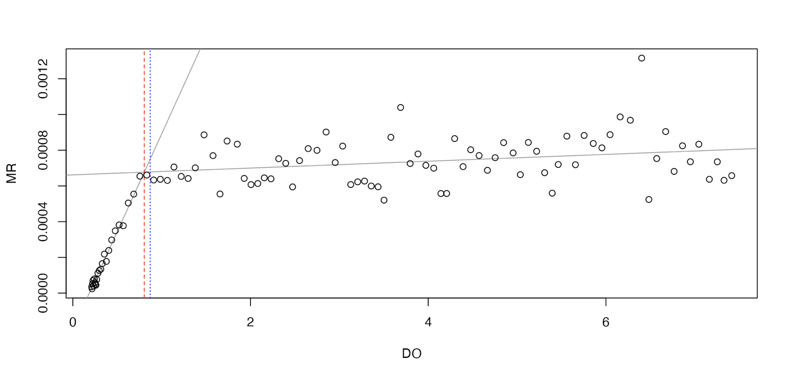
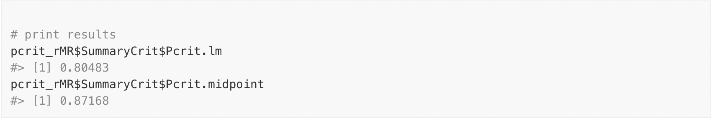
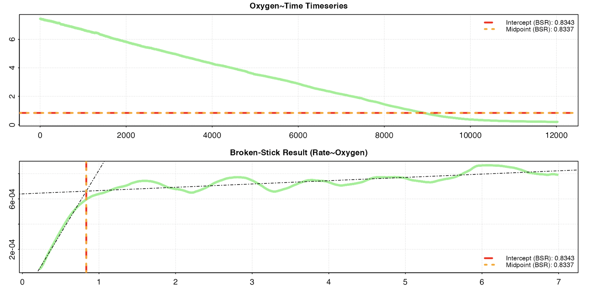
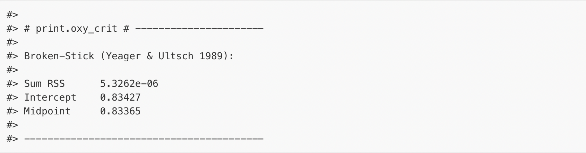

```{r, echo = F, message=FALSE}
library(knitr) # load knitr to enable options
library(respR) # load respR
library(rMR) # load respR

opts_chunk$set(collapse = TRUE, 
               comment = "#>", 
               cache = FALSE, 
               tidy = FALSE, 
               highlight = TRUE, 
               fig.width = 10, 
               fig.height = 5,
               fig.align = "center",
               R.options = list(width = 999,
                                #scipen = 999, 
                                digits = 5))
```

## **Note**

*This page has been archived and will not be updated. This is because it was submitted as part of the [publication](https://doi.org/10.1111/2041-210X.13162) of `respR` in Methods in Ecology and Evolution, and has been retained unchanged for reference. Any results and code outputs shown are from `respR v1.1` code. Subsequent updates to `respR` should produce the same or very similar results. *

## Comparisons to other implementations of PCrit analyses

The `segmented` method included in the `oxy_crit()` function in `respR` is simply a wrapper for the [`segmented`](https://cran.r-project.org/web/packages/segmented/) package by Muggeo (2008). 
Thus, comparing `respR` results to those from this package would be moot. 
See the documentation of that package, plus publications by Muggeo for discussion of this method. 

The other methods we implement at present are the two 'broken-stick regression' (BSR) metrics of Yeager and Ultsch (1989). 
To our knowledge, `rMR` is the only other R package that has this functionality. 
This is example code taken from the documentation for `rMR` calculating $P_{crit}$ for the included `fishMR` dataset, which we compare with the results from `respR` using the same data. 

```{r eval = F}
## rMR PCrit Analysis

# load data
data(fishMR)
# format time
fishMR$std.time <- as.POSIXct(fishMR$Date.time,
                              format = "%d/%m/%Y %I:%M:%S %p")
# calc pcrit
pcrit_rMR <-get.pcrit(data = fishMR, 
                   DO.var.name = "DO.mgL",
                   Pcrit.below = 2,
                   time.var = "std.time",
                   time.interval = 120,
                   start.time = "2015-07-03 04:45:00",
                   stop.time = "2015-07-03 08:05:00")

# print results
pcrit_rMR$SummaryCrit$Pcrit.lm
pcrit_rMR$SummaryCrit$Pcrit.midpoint
```

```{r, echo = F}

```

```{r, echo = F}

```


```{r eval = FALSE}
## respR PCrit Analysis

# extract time and o2 column, and format to numeric time starting at zero
fishMR_respR <- fishMR[46000:58000, c(2,6)]
fishMR_respR[,1] <- fishMR_respR[,1] - fishMR_respR[1,1]

# perform respR pcrit analysis
oxy_crit(fishMR_respR)
```

```{r, echo = F}

```

```{r, echo = F}

```


Note that the `rMR` results (0.80 and 0.87) are different to those from `respR` (0.83 and 0.83).
This is likely due to an improved implementation of the BMR method in `respR`. 
The `respR` analysis uses rolling (i.e. overlapping) regressions, while the `rMR` implementation uses interval (i.e. non-overlapping) regressions to calculate rates. 
This means that in the `rMR` implementation the width of regressions has a large effect on the ultimate result, which the user has to balance. A wide width means better estimates of rate, but fewer in total. A narrow width means less accurate estimates of rate, but a greater number of estimates upon which to perform the breakpoint analysis. 
This is much less of an issue in `respR`; because the regressions overlap, the width has much less of an effect upon the total number of estimates of rate. 

However, note that the user still needs to carefully consider the width (the default is 0.1 of the total data length); too narrow and it will increase noise amongst the rate estimates, too wide and it will cause breakpoints to be less pronounced. 

The rolling vs. interval regression methods in the `rMR` and `respR` implementations of BSR also make it difficult to directly compare their outputs using the same inputs. 
However, the fact that the two BSR `respR` results (0.84 and 0.84) are identical to each other, and also extremely close to the result from the `segmented` method (0.85) (which uses a completely different technique to identify breakpoints), suggests that the `respR` implementation is reliable. 
