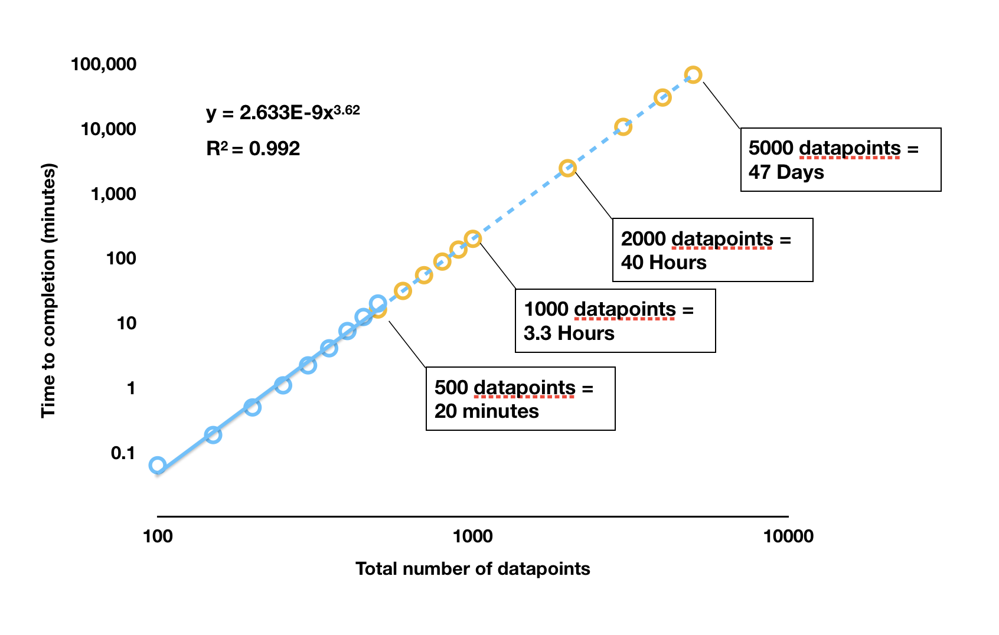

```{r setup, echo = F, warning = F, message = F}
library(knitr) # load knitr to enable options
library(respR) # load respR

opts_chunk$set(collapse = TRUE, comment = "#>", cache = FALSE,
  highlight = TRUE, fig.width = 7.1, fig.height = 6)
```

In this vignette we compare `auto_rate()` to a different method for detecting linear regions in time series data.

To our current knowledge, one other R package, [`LoLinR`](https://colin-olito.github.io/LoLinR/vignettes/LoLinR.html) (Olito et al. 2017), performs linear detection techniques on serial data. LoLinR is designed to be able to do this on any time series datasets, not just respirometry data. However, the same is true of `auto_rate()`; while `respR` has a focus as an end-to-end solution for processing and analysing respirometry experiments, `auto_rate()` can similarly be used on any data. 

The two methods use fundamentally different techniques to detect linear regions of data; we detail `auto_rate()` methods in this vignette **LINK**. `LoLinR` methods can be found in `LoLinR`'s online vignette [here](https://github.com/colin-olito/LoLinR), and Olito et al. (JEB, 2017). To summarise the main differences:

1. `auto_rate()` detects linear segments first before running linear regressions on these data regions. `LoLinR`, by contrast, performs all possible linear regressions on the data first, before implementing a ranking algorithm to classify these as linear regions. 

2. `LoLinR`'s algorithms use three different metrics to select linear data, in which at least one performs very well to detect linear segments -- even if a small amount data is provided (<100 samples). In comparison, `auto_rate()` performs less accurately at such small sample sizes, but that accuracy increases greatly with more data available.

3. `auto_rate()` is several orders of magnitude faster, even as it performs hundreds to thousands of rolling regressions at a time. It is a better option for large data, while LoLinR might be the function of choice for smaller datasets since its speed decreases *exponentially* as data gets bigger. 

### Processing times

The main function in `LoLinR` is called `rankLocReg`. The time it takes this function to process data follows an exponential relationship with its length. This is illustrated in the following plot. `rankLocReg` was run on different sized datasets (blue dots) and the time to completion recorded. These analyses were run in RStudio on the same dataset subset to the appropriate length, on a 2017 Macbook Pro with 3.1 GHz Intel Core i5 processor, 16GB RAM, and no other applications running. The orange dots are estimated completion times for larger datasets extrapolated from the results. Note the log scale. 

```{r, echo = F, out.width = "700px"}

```

As we can see, any dataset larger than around 400 to 500 in length takes a prohibitively long time to be processed by `rankLocReg`. In a test under the same conditions, `auto_rate()` processed a dataset of 5000 datapoints in size in 1.25 seconds; `rankLocReg` would take 47 days. One dataset included in `respR` (`squid.rd`) is over 34,000 datapoints in length. `auto_rate()` completed analysis of this dataset in 18.5 seconds; under the exponential relationship of `rankLocReg` this would take approximately *163 years* to be processed.  In reality, it is likely (as we have experienced) RAM limits will cause the analysis process to crash well before these durations are reached. 

Therefore, it is clear `rankLocReg` is not a practical solution for analysis of data more than a few hundred datapoints long. The developers of `LoLinR` are aware of this, and in the documentaton for the package recommend thinning (i.e. subsampling) datasets longer than 500 in length (it includes a function for this, `thinData`). However, thinning datasets of thousands to tens of thousands of datapoints to only a few hundred would inevitably cause loss of information and is not an acceptable solution. 

#### Comparison

Because of the length of time it takes `rankLocReg` to process data, our comparisons are necessarily based on small datasets. 


Having `auto_rate()` work more quickly is of no use, unless it gives equally good results as `LoLinR`. Here we compare the results of both functions on both simulated and real data, so see if they give comparable results. 

Compare the 3 different methods in LoLinR?

##### Simulated data

Side by side of `auto_rate()` v `LoLinR` on simulated data 
just use one example - default
do it for 100 - show `LoLinR` works better, but `respR` not far behind
then 500 - show `respR` is better


##### Real data

Run some real data 
Compare results - both regions, adn chekc slopes are same
then we can say slopes taken from lolinr can be processed in respR to get units.


## References

Olito, C., White, C. R., Marshall, D. J., & Barneche, D. R. (2017). Estimating monotonic rates from biological data using local linear regression. The Journal of Experimental Biology, jeb.148775-jeb.148775. doi:10.1242/jeb.148775
