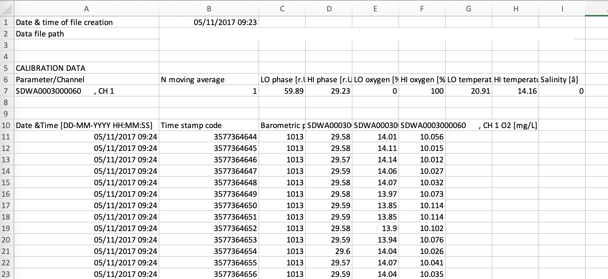

```{r, echo = F}
library(knitr) # load knitr to enable options
library(respR) # load respR

opts_chunk$set(collapse = TRUE, 
               comment = "#>", 
               cache = FALSE, 
               tidy = TRUE, 
               highlight = TRUE, 
               fig.width = 6, 
               fig.height = 5,
               fig.align = "center")
```

# Introduction

`respR` was designed to be an end-to-end solution for analysing data and reporting analyses from any and all aquatic respirometry experiments regardless of the equipment used. 
Therefore, it is system-agnostic; the data need only be put into a very simple structure - numeric time against oxygen in any common units in a `data.frame` - to allow a full analysis to be conducted. 
In fact the entire package, with the exception of the final conversion step in `convert_rate`, treats data as unitless so non-aquatic respirometry data or [any time-series data](https://januarharianto.github.io/respR/articles/citations.html#klementievdevelopmentversatilelowcost2022) can be explored and analysed. 

# Generic or common importing functions. 

To our knowledge, every oxygen probe system allows data to be exported in easily readable formats (e.g. `.csv`, `.txt`, `.xlsx`) which contain the numeric time and oxygen data `respR` requires. These files are best imported using generic functions after which the relevant columns can be specified when used in `respR` functions.

There is a wealth of information online about importing data to `R`. See 
[here](https://r4ds.hadley.nz/data-import.html), [here](https://intro2r.com/importing-data.html) and [here](https://www.statmethods.net/input/importingdata.html) for just a few examples. 

The following functions may help with importing your data:

- `read.csv()`, `read.table()`, `read.delim()` - Generic base `R` import functions. Also import `.txt` files. The `nrows` and `skip` inputs are particularly useful for specifying how many rows to import and how many to skip at the start of the file.

- [`readr`](https://readr.tidyverse.org) - A Tidyverse package for importing tabular data.

- [`fread()`](https://www.rdocumentation.org/packages/data.table/versions/1.14.8/topics/fread) - In the `data.table` package. Also imports `.txt` files. Faster and more efficient than `read.csv`. Like `read.csv`, the `nrows` and `skip` inputs are particularly useful.

- [`readxl`](https://readxl.tidyverse.org) - A Tidyverse package for importing Excel files.

- `readLines()` - A powerful but crude tool that dumps the entire text content of files. Requires a lot of processing afterwards to get any useful data. A last resort option. 

- [`janitor::clean_names()`](https://github.com/sfirke/janitor) - Handy for cleaning up column names, if you want to.


# Numeric time data

`respR` does not work with traditional date-time data (e.g. "`2023-03-12 13:46:55`"). Instead the time data must be in a numeric form in seconds (by far the most commonly used), minutes, hours or days. The good news is that most export files from oxygen probes systems contain a `timestamp` or numeric time column already. If they do not, it is relatively easy to convert date-times to a numeric format. See `vignette("format_time")`. 

# `import_file`

Note as of `respR` [v2.3.0]() this function has been DEPRECATED. The following is still fully functional, but `import_file` will not be updated and will be removed in a future release. Users should move their importing data workflows to using more generic functions such as those detailed above. This gives you much more control and the ability to troubleshoot issues if a problem occurs, rather than waiting for this function to be updated.

`import_file()` uses pattern recognition to identify the originating system of the file, imports it, formats columns and column names, and outputs a data frame that can be passed to `respR` functions.

Use of this function to prepare the data for use in `respR` is ***OPTIONAL*** and in fact ***NOT RECOMMENDED***. It is a convenience function and mainly intended for those completely new to `R`. If you are even slightly experienced in `R` you should know how to import data and structure it to a simple dataframe of time against oxygen. It is *always* better to import files yourself using generic functions. See above. 

## Example

This is a screenshot of what the file we want to import looks like in Excel.

```{r, out.width = "700px", eval = T, echo = FALSE}

```

We can see there are several rows of redundant information. There are also spaces and odd characters in the column names that often cause text encoding errors when imported into R, such as ` & ` and square brackets. 

`import_file` can bring in this file (situated in the current working directory, otherwise any external file can be specified with a filepath):

```{r eval = T}
data <- import_file("Witrox_eg.txt")
```

There are six columns, but we will print only the relevant date, numeric timestamp, and oxygen columns

```{r eval = T}
data[,c(1,2,6)]
```

As we can see, the function automatically recognises that this is a Witrox file, removes redundant rows, and renames the columns, removing spaces and problem characters while keeping unique identifiers. 

This function requires only a single input, the path to the file. Everything else is handled automatically. The function will even automatically recognise data formatted in the European style using commas for decimals.

## Supported systems

`import_file` supports several systems at present, including Firesting, Pyro, PreSens, MiniDOT, Loligo Witrox, Vernier and more. See `import_file()` for full list. 

# Checking output and next steps

If the imported data does not contain a numeric time or timestamp column, but only dates and times see `vignette("format_time")`. After your data is in a paired, numeric time~oxygen structure, it can be passed to `inspect()` to check the importing or time formatting has worked, look for common errors, and visualise the dataset. See `vignette("inspecting")`.


