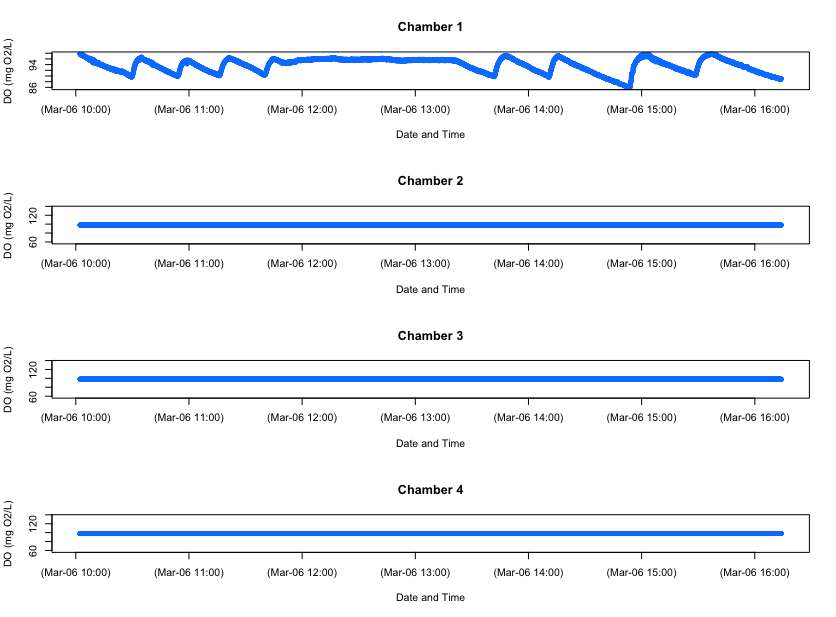

```{r, echo = F, message=FALSE}
library(knitr) # load knitr to enable options
library(respR) # load respR
library(respirometry) # load respR
library(rMR) # load respR
library(FishResp) # load respR

opts_chunk$set(collapse = TRUE, comment = "#>", cache = FALSE, tidy = TRUE, 
  highlight = TRUE, fig.width = 6, fig.height = 6)
```

We have designed `respR` to be able to explore, process and analyse any and all aquatic respirometry data, independent of the system or hardware used to collect it. In fact because of the unitless nature of the majority of functions in the package, other respirometry data, or indeed other time series data examining other variables can be analysed in `respR`. 

There are only a couple of other `R` packages that are focused towards respirometry data analysis;  [rMR](https://cran.r-project.org/web/packages/rMR/index.html), and  [FishResp](https://fishresp.org) (there is one other, [respirometry](https://cran.r-project.org/web/packages/respirometry/index.html), but it is not focussed on processing data). These packages have quite specific focuses; both `rMR` and `FishResp` are centered around processing intermittent-flow, swim tunnel respirometry data, in particular from Loligo Systems equipment. Neither has the universal focus of `respR`, and while it is sometimes possible to process other respirometry data using these packages it is far from straightforward. However, they are excellent packages within their own focuses and we would encourage users to explore them and how they work; they may contain functionality that suits your particular analyses or workflows better than `respR`. 

Neither of these packages however are particularly analytical in nature; they lack any functionality similar to the `auto_rate()` function in `respR`, which allows statistically robust, rapid, objective identification of linear segments in respirometry data. Only one package to our knowledge has a similar functionality; [LoLinR](https://github.com/colin-olito/LoLinR) also seeks to identify linear regions in time-series data, although with no particular focus on respirometry. We compare the performance of `auto_rate()` and `LoLinR` [here](https://januarharianto.github.io/respR/articles/auto_rate_comp.html). 

The `rMR` and `FishResp` packages instead rely solely on manual selection of data regions in respirometry data from which to extract oxygen uptake rates. `respR` also has this functionality as an option, and in this vignette we briefly compare the outputs of these packages with `respR`, and other overlapping functionality. 


## `respR` and `respirometry`

The [respirometry](https://cran.r-project.org/web/packages/respirometry/index.html) package by Matthew Birk has several useful utility functions for planning and conducting respirometry experiments. However, as the documentation states "Tools focus on helping the researcher setup and conduct experiments. Analysis of the resulting data is not a focus". Therefore, this package has little in common with `respR`. 

The only real functionality overlap with `respR` is the conversion function `conv_o2()`, similar to the `convert_DO()` function in `respR`. Both support the same units, and because both functions rely on the unit standards package `marelac` they give identical or very similar results. Minor differences are probably dues to the precision with which variables are handled internally:

```{r}
## respR
convert_DO(7.9, from = "mg/L", to = "umol/L", 
           t = 25,
           S = 35, 
           P = 1.01325)
## respirometry
conv_o2(o2 = 7.9, 
        from = "mg_per_l", 
        to = "umol_per_l", 
        temp = 25,
        sal = 35, 
        atm_pres = 1013.25)

## respR
convert_DO(85, from = "%", to = "mL/L", 
           t = 25,
           S = 35, 
           P = 1.01325)
## respirometry
conv_o2(o2 = 85, 
        from = "percent_a.s.", 
        to = "ml_per_l", 
        temp = 25,
        sal = 35, 
        atm_pres = 1013.25)
```

`respR` has a couple of minor advantages; the `respR` output is more informative, clearly stating the input and output units; and a "fuzzy" string matching algorithm is used to automatically recognise variations in base units, allowing natural, intuitive input, e.g.`"ml/s"`, `"mL/sec"`, `"milliliter/s"`, and `"millilitre/second"` are all equally identified as `mL/s`. 

Overall however, in this small overlap in functionality the packages essentially perform identically. 


## `respR` and `rMR`

The [rMR](https://cran.r-project.org/web/packages/rMR/index.html) package by Tyler L. Moulton focuses specifically on analysis of data from Loligo Systems hardware (i.e. Witrox probes), and generally on intermittent-flow, fish respirometry. We should note that as of writing (Sep 2018)  this package has not been updated in nearly 2 years. 

There are several areas of functionality where `rMR` and `respR` overlap:

#### Importing raw data

`rMR` allows importing of raw Witrox data files. `respR` also has this functionality in the `import_data` function, which as well as Witrox, supports several other systems. Here is typical code from each to do this. The example file and import code (slightly adapted) are taken from the `rMR` [Github](https://github.com/tyler-l-moulton/rMR) repo and README file found there. 

```{r eval = T}
## rMR Import
columns_to_import <- c("Date.time", "times", "Bar.Pressure.hpa", "Phase", "temp.C", "DO.mgL")

fish_rmr <- get.witrox.data("fishMR.txt", 
                     lines.skip = 10, 
                     delimit = "tab", 
                     choose.names = TRUE, 
                     chosen.names = columns_to_import, 
                     format = "%d/%m/%Y %I:%M:%S %p")

## respR Import
fish_respr <- import_file("fishMR.txt")
```

```{r}
head(fish_rmr)
head(fish_respr)
```
These both appear to perform well, on this file at least. The resulting data frames are similar, containing all the relevant data, although `respR` adds a numeric `time` column, which we find is easier to use in further analyses. 

However, in our testing we found that while the `rMR` import function worked with this example, and a few other files we tried, many files we were unable to import using `rMR` for reasons we were unable to diagnose. Likely, some of the inputs were not correctly set, but error messages and documentation were of little help in solving these problems. This would likely be a significant barrier to entry for novice R users, and even those more advanced. Clearly the `respR` import function is easier to use; it requires only a single input. It relies on pattern matching to recognise the system the file comes from, and other data such as the time-date format. The `get.witrox.data` function has however an advantage, in that you can specify the columns to be imported. 

While it is likely the `respR` `import_data()` function may fail on occasion, and more testing is needed, it appears to perform better for Witrox files, as well as supporting other systems. As always, we encourage users to [send us](mailto:nicholascarey@gmail.com) raw data files (from all systems) to test, particularly ones they have problems with. 

 
#### Conversion
As with `respR` and `respirometry`, `rMR` also has an O2 unit conversion function `DO.unit.convert`. Briefly, this function appears to perform correctly, though only has support for a three units (mg/L, partial pressure, or percent O2), compared to around 16 in `respR`.

#### P~Crit~
`rMR` implements a PCrit calculation based on the 'broken-stick' methods of Yeager and Ultsch (1989). See the P~Crit~ vignette ([Pcrit analysis](https://januarharianto.github.io/respR/articles/pcrit.html)) for comparison and further discussion of this. 

#### Calculating rates
`MR.loops` is the workhorse function of `rMR` that fits linear regressions to respirometry data and uses the resulting slopes to calculate oxygen uptake rates. This function relies on manually specifying one or more regions over which to fit regressions. `respR` also allows this in the `calc_rate()` function, so here we will compare the results of each on the same data. Again, we use data included in `rMR` and code adapted from the documentation. 

```{r}
## rMR
# load data
data(fishMR)
# create time variable in POSIXct format ##
fishMR$std.time <- as.POSIXct(fishMR$Date.time,
                              format = "%d/%m/%Y %I:%M:%S %p")

# set start and end of each data region to calculate rate over
starts <- c("2015-07-03 01:15:00", "2015-07-03 02:13:00",
            "2015-07-03 03:02:00", "2015-07-03 03:50:00",
            "2015-07-03 04:50:00")
stops <- c("2015-07-03 01:44:00", "2015-07-03 02:35:30",
           "2015-07-03 03:25:00", "2015-07-03 04:16:00",
           "2015-07-03 05:12:00")

# calculate and convert rates
metR <- MR.loops(data = fishMR, DO.var.name ="DO.mgL",
                 start.idx = starts, time.units = "hr",
                 stop.idx = stops, time.var.name = "std.time",
                 temp.C = "temp.C", elevation.m = 1180,
                 bar.press = NULL, in.DO.meas = "mg/L",
                 ylim=c(6, 8))

## respR
# extract time and o2 column, and format to numeric time starting at zero
fishMR_respR <- fishMR[, c(2,6)]
fishMR_respR[,1] <- fishMR_respR[,1] - fishMR_respR[1,1]

# calculate rates (same regions, expressed as row numbers)
rates_respR <- calc_rate(fishMR_respR,
                         from = c(33400, 36873, 39807, 42683, 46277),
                         to = c(35136, 38221, 41186, 44240, 47596),
                         by = "row")

# convert rates
rates_respR_conv <- convert_rate(rates_respR,
                                 time.unit = "s",
                                 o2.unit = "mg/L",
                                 volume = 1,
                                 output.unit = "mg/h")

## compare results - both in mg/h
rates_respR_conv$output
metR$MR.summary$MR

```

As we can see the results are identical (in `respR` we chose to express rates as negatives because they represent a negative slope and depletion of O2). This is exactly what we would expect with the same inputs and using the same data regions because both functions are using the same underlying R code to fit the regressions. 

Note, that as with `respR`, `rMR` also allows a constant background correction to be made to rates. In the interests of space, we have not shown this.

#### Benefits of `respR` over `rMR` 
While we are obviously somewhat biased, we see clear benefits of using `respR` over `rMR`. These include, but are not limited to - 

- **Imports multiple data types, as well as general R data structures (data frames, tibbles, data tables, etc.)**  
While use of other data types in `rMR` is possible, it is not intuitive, and time data must be in a specific, complex format. It does not allow the use of simple numeric time-elapsed values. Moreover, we entirely used the `rMR` data and examples in the above comparisons, because in our testing we had many problems importing our own data to `rMR`. We could not resolve many of these errors. We suspect the reliance on complex date-time formats and requiring the user to specify the precise structure of these was the cause of many of these problems.  
  
- **Allows statistically robust identification of linear regions (`auto_rate`), rather than solely manual selection**

- **Allows specifying data regions in several ways (by O2 range, time, or row)**

- **Insisting on use of numeric time elapsed, rather than POSIX formatted time-data (e.g. "2015-07-03 06:15:00 GMT") is a clear usability advantage and reduces error**.  
`respR` has a function for formatting POSIX data to numeric time-elapsed, after which the user need not concern themselves with date-time formats. Date-time and POSIX data are notoriously difficult to work with and error prone, and we have designed `respR` to avoid these when at all possible.  

- **Functions have minimal and intuitive inputs while maintaining full functionality, again reducing potential for error**

- **Better visualisations of the data regions in full context of the dataset**


## `respR` and `FishResp`

`FishResp` is still under development and there is sparse documentation and no detailed guide yet available to detail how the functions in the package interrelate, or example workflows provided (although we understand from contact with the developers these are under preparation). Therefore, our comparisons are somewhat limited to the functionality we could get to work.  

As with `rMR`, `FishResp` is focussed on processing data from intermittent-flow, swim tunnel experiments with many equally-spaced replicates, particularly from Loligo Systems equipment (although others are supported). As well as an `R` package, it has a [GUI version](https://fishresp.org) for Mac, Windows and Linux. It is fully-featured, though highly specific towards this branch of respirometry.

It has some functions for exploring and pre-processing data, though as we said, we are unsure how these functions are intended to inter-relate, and they only accept input from some data sources. We provide here some comparison with overlaps with `respR` functionality where we have been able to. 

#### Importing raw data
`FishResp` allows importing of raw data files from ’AutoResp’ (LoligoSystems), ’OxyView’ (PreSens), ’Pyro Oxygen Logger’ (PyroScience) and ’Qbox-Aqua’ (QubitSystems). However, as with `rMR` (see above) we struggled to import our own data files. We did import an AutoResp file, but this involved quite a lot of trial and error in setting the inputs (code below). However, we were not able to import a PreSens file. These additional formats apparently require additional files to be imported alongside them, and processing through multiple functions, and these requirements and workflow are not well documented at present. The AutoResp file (from a 1-channel, intermittent-flow, swim tunnel experiment on an anchovy) did however import successfully and plot the data:

```{r message=FALSE, results="hide"}
## create experimental metadata
info <- input.info(ID = c("spec1", NA, NA, NA, NA, NA, NA, NA),
                   Mass = c(3, NA, NA, NA,  NA, NA, NA, NA),
                   Volume = c(1, NA, NA, NA,  NA, NA, NA, NA),
                   DO.unit = c("mg/L"))

## import raw data file
SMR.raw <- import.meas(file = "anch01_raw.txt",
                       info.data = info,
                       logger = "AutoResp",
                       n.chamber = 8,
                       date.format = "DMY",
                       start.measure = "10:10:00",
                       stop.measure = "16:00:00",
                       plot.temperature = F,
                       plot.oxygen = F)
```

```{r, echo = F, out.width = "700px"}

```

We can't compare the importing functionality of `FishResp` with `respR`, as we do not yet support direct importing of AutoResp files (this is planned, and currently they can easily be imported using other methods such as `read.csv()` and analysed in `respR`). 

It should be noted the importing of raw data files in `FishResp` is apparently **obligatory**: there is no easy way to use other data structures or files in the package. Importing is an compulsory step to format the data to a structure that the functions will understand. `respR` does not have this restriction and allows a range of data structures to be used in *all* functions, allowing all variations in experimental type or data to be analysed. 

#### Calculating rates
We cannot analyse the above experimental data in `FishResp` because a major limitation of `FishResp` is that it apparently assumes replicates occur at regular intervals. This is true in some intermittent-flow respirometry experiments, but certainly not all. Experimental measurement periods and flushes are often triggered manually or done at irregular intervals. There is no clear way that we can see to accommodate these data in `FishResp`. 

Therefore, we use here data included in `FishResp` that has already been imported and prepared in various ways, and the code is mostly taken from the documentation. We will use these data to compare the outputs of `FishResp` to `respR`. 

```{r}
## FishResp Analysis

## load data
data(SMR.raw) # raw data
data(info) # experiment metadata
data(pre) # background rate - already processed and calculated

## apply background
SMR.clean <- correct.meas(info.data = info,
                          pre.data = pre,
                          meas.data = SMR.raw,
                          method = "pre.test")

## calculate slopes
SMR.slope <- extract.slope(SMR.clean,
                           method = "all",
                           n.slope = 3,
                           r2=0.95,
                           length = 1200)

## convert
SMR <- calculate.MR(SMR.slope,
                    density = 1000,
                    plot.BR = F,
                    plot.MR.abs = F,
                    plot.MR.mass = F)

## reorder - for comparison with respR results
smr_all <- dplyr::arrange(SMR, Ind, Phase)
```

Now the `respR` analysis of the same data (though only a single channel), using the same inputs. We use regular R data selection syntax to extract rates from multiple even-spaced data regions (here spaced at every 1200 rows). 
```{r}
## respR Analysis

## rearrange background data
bg <- data.frame(pre[0001:1200,3],
                 pre[0001:1200,6])

## calculate bg rate
bg_r <- calc_rate.bg(bg, xcol = 1, ycol = 2, plot = F)

## Extract specimen 1 data
spec1 <- SMR.raw[,c(13,4)]

## calculate rates for each replicate
spec1_r <- calc_rate(spec1,
                        from = seq(1, 18001, 1200),
                        to = seq(1200, 19200, 1200),
                        by = "row")

## adjust for background
spec1_r_adj <- adjust_rate(spec1_r, bg_r)

## convert. 
# NB - we use effective volume, that is volume of respirometer minus volume of specimen.
# FishResp calculates this internally
spec1_rates <- convert_rate(spec1_r_adj,
                      time.unit = "s",
                      o2.unit = "mg/L",
                      output.unit = "mg/h/kg",
                      mass = 0.00186,
                      volume = 0.24814) 

```


```{r}
## Compare results - both in mg/h/kg

# FishResp
round(smr_all$MR.mass[1:16], 1)

# respR
round(-1*spec1_rates$output, 1)

```

As we can see the rates calculated by both packages are identical. As with `rMR`, this is exactly what we would expect as we are manually selecting the same data regions and user underlying R code to fit the linear regressions. 

#### Options in FishResp

`FishResp` (as far as we can tell from the current documentation) generally only allows fitting regressions across the entire width of what is defined an experimental measurement period, or replicate. There is little flexibility in modifying this. This may or may not be appropriate depending on the data and experiment. The `extract.slope` function does have a `length` operator, but this only curtails the latter end of the regression; there appears to be no way of modifying the start location. This is a curious decision and less than ideal practice; if a user wanted to only use data from part of an experimental replicate, typically it is the initial stages they want to remove, as these are just after the flush when the animal might have been disturbed, or probe lag means the system has not reached a steady state. Moreover, this `length` operator applies to all replicates; there is no easy way of fitting regressions of different length over different replicates. `respR` has functionality to easily modify the starts and ends of data locations by time, O2 amount or row number; `FishResp`'s ability to do this is very limited. 

The `extract.slope` function is able to sort and select the rates from each replicate according to some basic criteria, for example outputting a selection of rates ordered by minimum or maximum, or based on R2 values or a percentile. `respR` does not have this option specifically, but it is straightforward from the results object via typical R selection syntax. 
 
It is also not entirely clear how `FishResp` would work on continuous data where the O2 is also recorded through flushes, or when each replicate is separated from another by a waiting period (these sample data has each directly after the next). And as we said, processing of data that does not adhere to a rigid structure or cycle of measurement periods is difficult, if not impossible. 

#### Benefits of respR over FishResp 

Overall `FishResp` is a fine package (and GUI application) if you are conducting very a specific type of respirometry experiment. Its focus is on processing large numbers of experimental replicates from a specific respirometry experiment type, using specific equipment. We have no doubt it works very well if you are conducting these types of experiment, but there is little to no flexibility to process other types of experiment or data sources. 

`FishResp` can process many experiments at once, both from different individuals and many replicates on individuals. Whether this is an advantage or disadvantage is debatable. Although it can be automated by anyone with basic R skills, `respR` was specifically designed to process single experiments at a time because we feel (and that this is general good practice in data analysis) that respirometry data should be thoroughly explored and visualised prior to any analyses. This may increase the time taken to conduct analyses, but we feel is safer and less likely to result in mistakes (and we would argue other time-saving advantages of `respR` ultimately outweigh this). `FishResp` has some data visualisation and exploration functions, but its focus seems to be the ability to process large numbers of experiments and replicates at once. 

It does however have a couple of advantages over `respR` which may influence user choice on which to use:

- **A GUI (Graphical User Interface) Verison.**  
If you are not comfortable with code or prefer a user interface, `FishResp` has an application available that runs on Mac, Windows and Linux computers. We have no specific plans to create a GUI version of `respR`.
 
- **Support for dynamic background correction.**  
Pre- and post-experiment background rates can be applied as average, linear or exponential interpolations. Dynamic background correction is not specifically supported in `respR` as yet, but this is planned. However, see [Intermittent-flow respirometry: Complex example](https://januarharianto.github.io/respR/articles/intermittent2.html) for how it can be achieved at present. 

- **Support for raw data files from multiple systems at once.** Again, we plan to support importing files from as many systems as we can get sample files for in `respR` in the near future. We are unsure of the benefits of supporting other data inputs that `FishResp` supports (e.g. hardware interfaces such as AquaResp), but are looking into it. Again though, `respR` is system agnostic; we know of no respirometry system that does not output data in a form that is easily imported into `R`, and thus able to be analysed in `respR`, using generic functions. 

However, we feel `FishResp` has substantial drawbacks in comparison to `respR`: 

- It is designed for intermittent-flow respirometry with set width of cycled replicates. There is no easy way to analyse closed, flowthrough or irregularly timed intermittent-flow respirometry data.  
- It supports importing data from some specific systems, but limited or no support for regular R data structures. 
- Complex inputs: as with `rMR`, complex date-time inputs are a particular source of frustration and potential error.  
- Length and location of data regions over which to fit regressions cannot be easily adjusted.   
- Manual selection of data regions only; there is no equivalent to the `respR::auto_rate` function in `FishResp`  
- Complicated, not well documented. We expect this to change soon, but at present the package has a substantial barrier to entry, even for advanced R users, in that it is difficult to use and has limited documentation. 

We will update this vignette with more detail and comparisons of the functionality of `FishResp` and `respR` once the developers release the guides that we understand are in preparation. 
  
## Summary

The packages we examine here are the only other ones we know of that focus on processing respirometry data in R (but see [Comparative performance of auto_rate and LoLinR](https://januarharianto.github.io/respR/articles/auto_rate_comp.html)). 
However, they have only a small subset of the functionality contained in `respR`. 
Where they overlap in functionality, we feel `respR` is clearly easier to use and less prone to input errors or difficult to diagnose problems. 
`respR` has been designed to be as flexible as possible, accepting any and all respirometry data and experiment types. 

The `rMR` and `FishResp` packages are, by contrast, focused entirely on intermittent-flow respirometry, with multiple, regularly-spaced experimental replicates. 
Both analyse these data adequately via manual specification of data regions over which to determine rates, but we would argue `respR` is equally capable of doing so (see [Intermittent-flow respirometry: Complex example](https://januarharianto.github.io/respR/articles/intermittent2.html)). 

However, the `respR` workflow for these experiments allows for use of `auto_rate()`, which identifies linear regions of data in a statistically robust manner, as opposed to relying on user selected regions. 

To highlight a particular usability aspect, the packages we compare here rely on complex date-time formats for the time metric, which in our experiences often leads to substantial problems. 
There is no real reason why this should be the case; `respR` avoids this through use of numeric, time-elapsed data, and providing two functions to easily prepare data to this form ([Importing your data](https://januarharianto.github.io/respR/articles/importing.html)). Overall, a major barrier to use of both these packages is getting data into them in a recognisable format.
We had trouble importing data into both. `respR` is clearly ahead here, in that as well as allowing import of raw data files (though this is still in development and there are still systems not yet supported), it accepts almost any form of typical R data structure.

Investigators working with respirometry data are very much encouraged to explore `rMR` and `FishResp`. 
They may, because of their specific focuses, contain functionality that suits your particular analyses or workflows better than `respR`. 
However, `respR` has been designed to be highly flexible, adaptable, and universal. Even with only basic `R` skills it can be used for analysis of any aquatic respirometry data or experiment type we are aware of.
It also has statistically robust, linear-detection functionality which is not present in these packages.
We compare the performance of this functionality to the only other `R` package which has a similar purpose [here](https://januarharianto.github.io/respR/articles/auto_rate_comp.html). 

