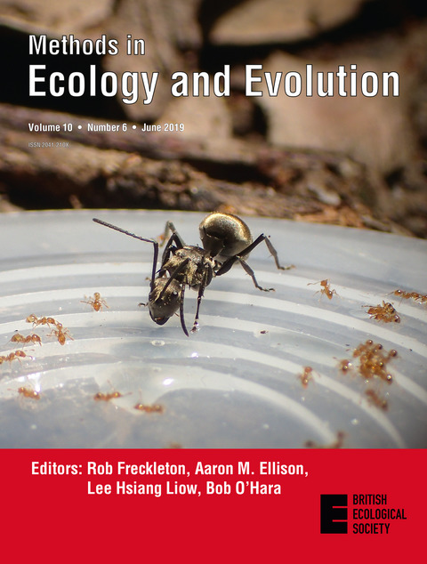

```{r setup, include = FALSE}
knitr::opts_chunk$set(echo = TRUE)
```

## respR publication

```{r, echo = F, out.width = "200px", fig.align = "center", out.width= "20%", out.extra='style="float:right; padding:10px"'}

```
`respR` has been peer reviewed and published. Please cite this paper if you use it in your work:  
&nbsp;  


Harianto, J., Carey, N., & Byrne, M. respR - An R Package for the Manipulation and Analysis of Respirometry Data. *Methods in Ecology and Evolution*, 10(6), 912–920. [doi: 10.1111/2041-210X.13162](https://doi.org/10.1111/2041-210X.13162).


&nbsp;  
&nbsp;  
&nbsp;  
&nbsp;  

## Other publications

The following publications were instrumental in developing `respR`.  
&nbsp;  

Clark, T. D., Sandblom, E., & Jutfelt, F. (2013). Aerobic scope measurements of fishes in an era of climate change: respirometry, relevance and recommendations. *Journal of Experimental Biology*, 216(15), 2771–2782. [doi: 10.1242/Jeb.084251](https://doi.org/10.1242/Jeb.084251)

Gamble, S., Carton, A. G., & Pirozzi, I. (2014). Open-top static respirometry is a reliable method to determine the routine metabolic rate of barramundi, Lates calcarifer. *Marine and Freshwater Behaviour and Physiology*, 47(1), 19–28. [doi: 10.1080/10236244.2013.874119](https://doi.org/10.1080/10236244.2013.874119)

Leclercq, N., Gattuso, J.-P. & Jaubert, J. (1999). Measurement of oxygen metabolism in open-top aquatic mesocosms: Application to a coral reef community. *Marine Ecology Progress Series*, 177, 299–304. [doi: 10.3354/meps177299](https://doi.org/10.3354/meps177299)

Lighton, J.R.B. (2008). Measuring Metabolic Rates: A Manual for Scientists. Oxford University Press, USA.

Morozov S., McCairns R.J.S., Merilä J. (2019) FishResp: R package and GUI application for analysis of aquatic respirometry data. *Conservation Physiology* 7(1). [doi:10.1093/conphys/coz003](https://doi.org/10.1093/conphys/coz003)

Muggeo, V.M.R. (2003). Estimating regression models with unknown break-points. *Statistics in Medicine*, 22, 3055–3071. [doi: 10.1002/sim.1545](https://doi.org/10.1002/sim.1545)

Muggeo, V. (2008). Segmented: An R package to fit regression models with broken-line relationships. R News, 8, 20–25.

Silverman, B.W. (1986). Density Estimation for Statistics and Data Analysis. Chapman; Hall/CRC Press.

Steffensen, J. F. (1989). Some errors in respirometry of aquatic breathers: How to avoid and correct for them. *Fish Physiology and Biochemistry*, 6(1), 49–59. [doi: 10.1007/BF02995809](https://doi.org/10.1007/BF02995809)

Svendsen, M.B.S., Bushnell, P.G. & Steffensen, J.F. (2016). Design and setup of intermittent-flow respirometry system for aquatic organisms. *Journal of Fish Biology*, 88, 26–50. [doi: 10.1111/jfb.12797](https://doi.org/10.1111/jfb.12797)

White, C.R. & Kearney, M.R. (2013). Determinants of inter-specific variation in basal metabolic rate. *Journal of Comparative Physiology B: Biochemical, Systemic, and Environmental Physiology*, 183, 1–26. [doi: 10.1007/s00360-012-0676-5](https://doi.org/10.1007/s00360-012-0676-5)

Yeager, D.P. & Ultsch, G.R. (1989). Physiological regulation and conformation: A BASIC program for the determination of critical points. *Physiological Zoology*, 62, 888–907. [doi: 10.1086/physzool.62.4.30157935](https://doi.org/10.1086/physzool.62.4.30157935)
